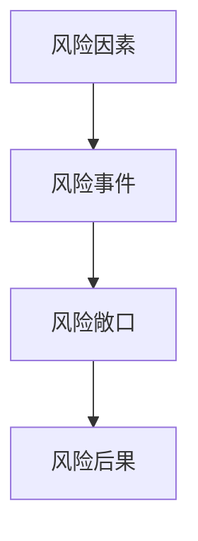
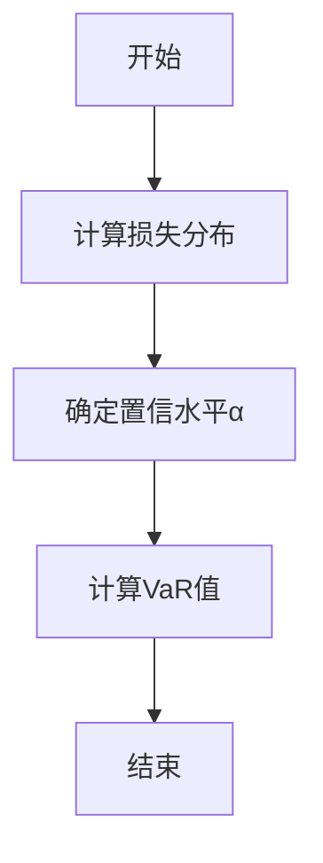
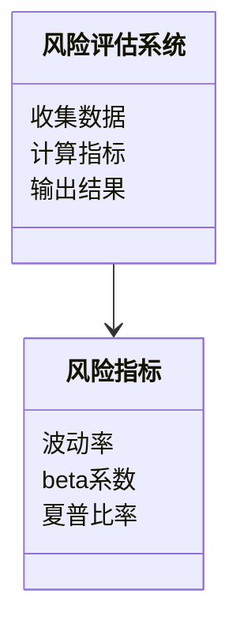

                 


# 价值投资中的风险评估：超越波动性

**关键词：** 价值投资、风险评估、波动性、VaR、CVaR、投资组合

**摘要：**  
在价值投资中，风险评估是确保投资安全性和实现长期收益的关键因素。传统的波动性分析无法全面捕捉投资风险，而现代的风险评估方法，如VaR和CVaR，提供了更全面的视角。本文通过详细讲解风险评估的核心概念、现代方法、系统架构和实战案例，帮助投资者超越波动性，实现稳健投资。

---

## 第1章: 价值投资与风险评估概述

### 1.1 价值投资的核心理念

#### 1.1.1 价值投资的定义与历史演变
价值投资是由本杰明·格雷厄姆和戴维·多德提出的一种投资策略，强调购买被市场低估的股票并长期持有。其核心理念是寻找市场的非效率性，通过基本面分析找到内在价值高于当前市场价格的股票。

#### 1.1.2 价值投资与风险评估的关系
风险评估是价值投资中的重要环节，帮助投资者识别潜在风险，避免重大损失，从而实现长期的收益目标。有效的风险评估确保投资组合的稳定性，为价值投资提供坚实基础。

#### 1.1.3 风险评估在价值投资中的重要性
风险评估帮助投资者识别高风险投资，优化投资组合，提高抗风险能力。通过量化风险，投资者可以在波动性中找到安全边际，实现稳健收益。

### 1.2 风险评估的核心概念

#### 1.2.1 风险的定义与分类
风险是指投资可能出现的损失或收益低于预期的可能性。主要分类包括市场风险、流动性风险、信用风险和操作风险。

#### 1.2.2 风险评估的边界与外延
风险评估的边界包括确定的时间范围和置信水平，而外延则涉及不同市场条件下的多种风险情景。

#### 1.2.3 风险评估的核心要素与组成
核心要素包括风险因素、风险事件、风险敞口和风险后果。这些要素共同构成了风险评估的基本框架。

---

## 第2章: 风险评估的核心方法论

### 2.1 风险评估的核心原理

#### 2.1.1 风险的量化方法
通过统计分析和数学模型量化风险，包括波动率、VaR和CVaR等指标。

#### 2.1.2 风险的度量指标
常用的指标有波动率、标准差、VaR和夏普比率，这些指标帮助投资者全面评估风险。

#### 2.1.3 风险的相互关系
市场风险、流动性风险和信用风险相互关联，共同影响投资组合的整体风险敞口。

### 2.2 风险评估的核心概念对比

#### 2.2.1 不同风险评估方法的对比
VaR和CVaR在风险度量上的区别，以及适用于不同投资策略的场景。

#### 2.2.2 风险评估指标的属性特征对比（表格形式）

| 指标 | 特性               | 适用场景               |
|------|--------------------|------------------------|
| VaR  | 置信水平下的损失   | 评估市场风险           |
| CVaR | 平均超过VaR的损失  | 评估尾部风险           |
| 波动率 | 衡量资产价格波动   | 评估短期市场风险       |

#### 2.2.3 风险评估的ER实体关系图（Mermaid流程图）


---

## 第3章: 现代风险评估方法与数学模型

### 3.1 现代风险评估方法概述

#### 3.1.1 VaR（Value at Risk）方法
VaR在给定置信水平下，计算投资组合的最大可能损失。例如，95%置信水平下，VaR为$100，意味着在95%的情况下，损失不会超过$100。

#### 3.1.2 CVaR（Conditional Value at Risk）方法
CVaR是VaR的扩展，计算超过VaR的平均损失，用于衡量尾部风险。

#### 3.1.3 风险中性的概率分布模型
假设损失分布服从某种概率分布，如正态分布，计算不同情景下的风险敞口。

### 3.2 风险评估的数学模型

#### 3.2.1 VaR的数学公式与计算方法
$$ VaR_{\alpha} = \inf \{ x | P(L \leq x) \geq \alpha \} $$
其中，\( \alpha \)是置信水平，\( L \)是损失变量。

#### 3.2.2 CVaR的数学公式与计算方法
$$ CVaR_{\alpha} = \frac{1}{\alpha} \int_{\alpha}^{1} VaR_{p} dp $$
计算超过VaR的平均损失。

#### 3.2.3 风险中性的概率分布模型
$$ P(L \leq x) = \frac{x}{\mu} $$
其中，\( \mu \)是期望损失。

### 3.3 风险评估的算法实现

#### 3.3.1 VaR算法的Mermaid流程图


#### 3.3.2 VaR算法的Python实现
```python
import numpy as np

def calculate VaR(returns, confidence_level=0.95):
    sorted_returns = np.sort(returns)
    index = int(len(sorted_returns) * confidence_level)
    VaR = -sorted_returns[index]
    return VaR

# 示例
returns = np.random.normal(0, 1, 1000)
VaR = calculate VaR(returns, 0.95)
print(f"VaR at 95% confidence level: {VaR}")
```

---

## 第4章: 系统性的风险分析与架构设计

### 4.1 风险指标体系的构建

#### 4.1.1 构建风险指标体系的重要性
包括波动率、beta系数、夏普比率等指标，帮助投资者全面评估风险。

#### 4.1.2 风险指标体系的功能设计
展示每个指标的作用及其在风险评估中的应用。

#### 4.1.3 风险指标体系的系统架构图（Mermaid类图）


### 4.2 风险评估的系统架构设计

#### 4.2.1 系统功能设计
包括数据收集、指标计算、结果输出等功能。

#### 4.2.2 系统架构设计（Mermaid架构图）
```mermaid
container 风险评估系统 {
    组件 数据处理模块
    组件 指标计算模块
    组件 结果展示模块
}
```

---

## 第5章: 实战案例与风险评估的实现

### 5.1 价值投资中的风险评估实战

#### 5.1.1 数据收集与处理
收集某公司的历史股价数据，计算收益和损失。

#### 5.1.2 风险评估的实现步骤
1. 计算波动率
2. 计算VaR和CVaR
3. 构建风险指标体系

#### 5.1.3 风险评估结果分析
通过具体案例分析，展示风险评估的结果及其对投资决策的影响。

### 5.2 投资组合风险评估的实现

#### 5.2.1 投资组合构建
选择多只股票构建投资组合，计算其整体风险敞口。

#### 5.2.2 投资组合风险评估的Python实现
```python
import numpy as np

def portfolio_VaR(returns_matrix, weights, confidence_level=0.95):
    portfolio_returns = np.dot(returns_matrix, weights)
    sorted_returns = np.sort(portfolio_returns)
    index = int(len(sorted_returns) * confidence_level)
    VaR = -sorted_returns[index]
    return VaR

# 示例
returns_matrix = np.random.normal(0, 1, (1000, 5))
weights = np.array([0.2, 0.2, 0.2, 0.2, 0.2])
VaR = portfolio_VaR(returns_matrix, weights, 0.95)
print(f"Portfolio VaR at 95% confidence level: {VaR}")
```

---

## 第6章: 总结与展望

### 6.1 全文总结
价值投资中的风险评估需要超越波动性，采用现代方法如VaR和CVaR，构建全面的风险指标体系。

### 6.2 未来研究方向
探索机器学习在风险评估中的应用，结合大数据分析，提升风险预测的准确性。

### 6.3 投资组合管理中的注意事项
定期重新评估风险，根据市场变化动态调整投资策略，保持投资组合的稳健性。

### 6.4 拓展阅读
推荐相关书籍和论文，帮助读者深入理解风险评估的理论与实践。

---

**作者：AI天才研究院/AI Genius Institute & 禅与计算机程序设计艺术 /Zen And The Art of Computer Programming**

