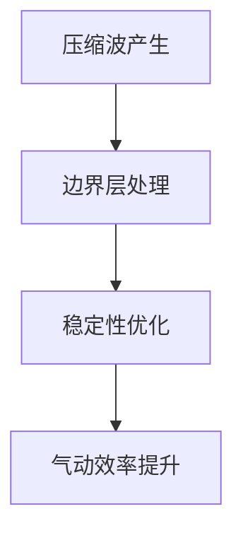
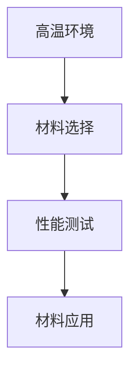

                 

# 价值投资中的高超音速飞行技术分析

## 关键词：高超音速飞行技术，价值投资，气动设计，推进系统，材料科学

## 摘要：本文深入分析高超音速飞行技术的原理及其在价值投资中的应用。通过探讨气动设计、推进系统、材料科学等核心要素，结合实际案例，揭示如何通过技术分析评估投资价值，为投资者提供科学决策依据。

---

## 第1章：高超音速飞行技术的背景与价值投资的结合

### 1.1 高超音速飞行技术的基本概念

高超音速飞行技术是指飞行速度超过5倍音速的技术，涉及复杂的气动设计、推进系统和材料科学。其核心要素包括：

1. **气动设计**：确保高速飞行的稳定性，涉及压缩波和边界层的处理。
2. **推进系统**：采用scramjet（冲压发动机），在高温高压环境下工作，强调燃料效率和推力。
3. **材料科学**：使用高温合金和碳纤维复合材料，解决耐高温和轻量化问题。

### 1.2 价值投资的基本原理

价值投资强调通过基本面分析寻找被低估的公司，注重安全边际和长期价值。其核心原则包括：

1. **基本面分析**：评估公司的财务状况、盈利能力、市场地位。
2. **安全边际**：买入价格低于内在价值，确保投资的安全性。
3. **长期价值**：关注公司长期增长潜力，而非短期波动。

### 1.3 高超音速飞行技术在价值投资中的应用前景

高超音速技术可能带来新的交通方式，改变航空航天产业格局。价值投资者可从中识别技术领先公司的潜力，但需考虑高研发成本和政策风险。

---

## 第2章：高超音速飞行技术的原理与分析

### 2.1 高超音速飞行技术的气动设计

气动设计是高超音速飞行器的关键，涉及压缩波和边界层的处理。使用Mermaid流程图展示气动设计步骤：

### 2.2 高超音速飞行技术的推进系统

推进系统采用scramjet技术，解决高温高压下的推力问题。其性能分析涉及燃料效率和工作温度。

### 2.3 高超音速飞行技术的材料科学

高温材料的选择对飞行器寿命至关重要。Mermaid流程图展示材料选择过程：

---

## 第3章：高超音速飞行技术与价值投资的联系

### 3.1 高超音速飞行技术的经济价值

技术创新带来经济价值，例如降低运营成本和提高效率。市场竞争力分析显示，技术垄断带来竞争优势。

### 3.2 高超音速飞行技术的行业趋势

行业发展受技术进步、政策支持和市场需求驱动。技术创新周期从研发到商业化，价值投资者需关注技术成熟度和市场接受度。

---

## 结论

高超音速飞行技术的复杂性和潜力使其成为价值投资的重要领域。通过深入分析气动设计、推进系统和材料科学，投资者可以识别具有长期增长潜力的公司。然而，需谨慎评估技术和市场风险，确保投资决策的科学性和安全性。

---

## 作者

作者：AI天才研究院 & 禅与计算机程序设计艺术

--- 

这篇文章系统地探讨了高超音速飞行技术在价值投资中的应用，结合技术分析和投资策略，为投资者提供了全面的视角和实用的指导。

