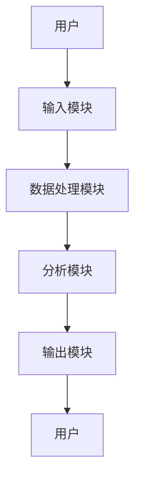
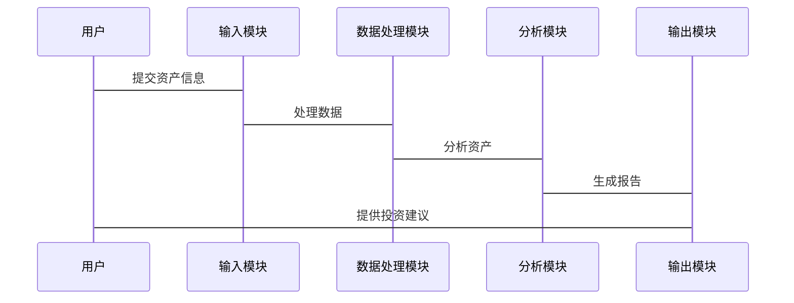

                 


# 价值投资之父本杰明·格雷厄姆的投资哲学

**关键词**：价值投资、投资哲学、安全边际、内在价值、市场分析

**摘要**：本杰明·格雷厄姆是价值投资的奠基人，他的投资哲学强调安全边际和内在价值，主张以低于内在价值的价格购买优质资产，并通过长期持有实现财富增长。本文将详细阐述格雷厄姆的投资理念、分析框架、数学模型以及实际应用，帮助读者深入了解价值投资的核心思想和实践方法。

---

## 第一部分：投资的基本概念与重要性

### 第1章：投资的基本概念与重要性

#### 1.1 投资的基本概念

**1.1.1 投资的定义与分类**

投资是将资金投入特定资产以获取未来收益的行为。常见的投资方式包括股票、债券、房地产和黄金等。投资可以分为长期投资和短期投资，其中长期投资注重资产的内在价值，而短期投资则关注市场波动。

**1.1.2 投资与投机的区别**

投资强调对资产的深入分析和长期持有，而投机则依赖于市场短期波动和情绪变化。投资注重安全性和稳定性，而投机则追求快速收益。

**1.1.3 投资在个人财务中的作用**

投资是实现财富增长的重要手段，通过合理的资产配置和风险控制，投资者可以在不确定的市场中获得稳定收益，实现财务自由。

#### 1.2 价值投资的核心理念

**1.2.1 价值投资的定义**

价值投资是一种以低于内在价值的价格购买优质资产的投资策略，强调对资产基本面的深入研究和长期持有。

**1.2.2 价值投资的基本原则**

格雷厄姆提出的“安全边际”概念是价值投资的核心原则之一。安全边际是指资产的市场价格低于其内在价值的部分，确保投资者在市场波动中能够获得超额收益。

**1.2.3 价值投资与其他投资策略的对比**

价值投资与成长投资和指数投资等策略相比，更注重资产的内在价值和风险控制。它强调选择具有安全边际的优质资产，避免市场波动带来的风险。

#### 1.3 本杰明·格雷厄姆的生平与贡献

**1.3.1 本杰明·格雷厄姆的生平简介**

本杰明·格雷厄姆（Benjamin Graham）是20世纪著名的投资学家，被誉为“价值投资之父”。他在1929年大萧条期间创立了价值投资理论，并在实践中取得了显著的成果。

**1.3.2 格雷厄姆对投资学的贡献**

格雷厄姆提出了“安全边际”和“内在价值”等核心概念，为价值投资奠定了理论基础。他的著作《证券分析》和《 Intelligent Investor》成为投资界的经典。

**1.3.3 格雷厄姆的投资哲学对现代投资的影响**

格雷厄姆的价值投资理念影响了后来的投资者，如沃伦·巴菲特和彼得·林奇，成为投资领域的重要流派之一。

---

## 第二部分：价值投资的核心概念与分析框架

### 第2章：价值投资的核心概念与分析框架

#### 2.1 安全边际的概念与重要性

**2.1.1 安全边际的定义**

安全边际是指资产的市场价格低于其内在价值的部分，确保投资者在市场波动中能够获得超额收益。

**2.1.2 安全边际在投资中的作用**

安全边际是价值投资的核心原则之一，它通过降低买入价格来提高投资的抗风险能力。当市场价格远低于内在价值时，安全边际越大，投资的潜在收益越高。

**2.1.3 如何计算安全边际**

安全边际=内在价值-市场价格

#### 2.2 资产评估与内在价值

**2.2.1 内在价值的定义**

内在价值是资产在合理市场条件下所能产生的未来现金流的现值。它反映了资产的真实价值，是投资决策的重要依据。

**2.2.2 内在价值的计算方法**

内在价值=Σ（未来现金流/（1+r）^t）

其中，r是折现率，t是时间。

**2.2.3 内在价值与市场价值的对比**

市场价值是指资产在当前市场上的价格，可能高于或低于内在价值。价值投资者注重内在价值与市场价值的差异，寻找具有安全边际的投资机会。

#### 2.3 市场分析与投资决策

**2.3.1 市场波动的规律**

市场波动是由投资者情绪和市场流动性决定的，具有周期性。价值投资者认为市场波动为投资提供了机会。

**2.3.2 市场情绪对投资的影响**

市场情绪会影响资产价格，但价值投资者更关注资产的内在价值，避免被市场情绪左右。

**2.3.3 如何利用市场波动进行投资**

价值投资者在市场低迷时寻找被低估的资产，在市场高涨时卖出部分资产，实现收益。

---

## 第三部分：格雷厄姆的投资策略与实践

### 第3章：格雷厄姆的投资策略与实践

#### 3.1 股票选择的标准与方法

**3.1.1 股票选择的基本原则**

选择具有强大基本面和低市盈率的股票，确保安全边际的存在。

**3.1.2 股票分析的步骤与技巧**

分析公司的财务报表、行业地位和管理团队，评估其内在价值和竞争优势。

**3.1.3 如何避免投资错误**

分散投资、严格遵守投资原则、持续学习和反思。

#### 3.2 分散投资与风险控制

**3.2.1 分散投资的原理**

通过投资不同行业和地区的资产，降低特定风险，提高整体收益。

**3.2.2 风险控制的策略**

设定止损点、定期调整投资组合、避免过度集中。

**3.2.3 如何构建投资组合**

根据风险承受能力和投资目标，合理配置不同类型的资产。

#### 3.3 长期投资与价值实现

**3.3.1 长期投资的意义**

长期投资能够减少短期市场波动的影响，实现资产的长期增值。

**3.3.2 价值实现的路径**

通过持续持有优质资产，等待市场回归其内在价值。

**3.3.3 长期投资中的耐心与纪律**

耐心等待市场调整，保持纪律，避免盲目跟风。

---

## 第四部分：格雷厄姆投资哲学的数学模型与公式

### 第4章：格雷厄姆投资哲学的数学模型与公式

#### 4.1 内在价值计算的数学模型

**4.1.1 内在价值的公式表示**

$$\text{内在价值} = \sum_{t=1}^{n} \frac{\text{未来现金流}}{(1 + r)^t}$$

其中，r是折现率，n是现金流的时间跨度。

**4.1.2 现金流折现法的数学推导**

假设公司未来5年的现金流分别为100, 120, 140, 160, 180万元，折现率为10%。

$$\text{内在价值} = \frac{100}{1.1} + \frac{120}{1.1^2} + \frac{140}{1.1^3} + \frac{160}{1.1^4} + \frac{180}{1.1^5} \approx 400 \text{万元}$$

**4.1.3 示例计算与解释**

假设某公司未来5年的现金流为500万元，折现率为8%。

$$\text{内在价值} = \frac{500}{1.08} + \frac{500}{1.08^2} + \frac{500}{1.08^3} + \frac{500}{1.08^4} + \frac{500}{1.08^5} \approx 2,190 \text{万元}$$

#### 4.2 安全边际的量化分析

**4.2.1 安全边际的计算公式**

$$\text{安全边际} = \text{内在价值} - \text{市场价格}$$

**4.2.2 市场价格与内在价值的对比分析**

如果某资产的内在价值为1000万元，市场价格为800万元，则安全边际为200万元。

**4.2.3 示例分析与实际应用**

通过计算安全边际，投资者可以判断资产是否具有投资价值，从而做出合理的投资决策。

---

## 第五部分：系统分析与架构设计

### 第5章：系统分析与架构设计

#### 5.1 问题场景介绍

假设我们开发一个投资决策支持系统，帮助投资者应用格雷厄姆的投资哲学进行资产配置和风险控制。

#### 5.2 系统功能设计

- 用户输入：资产信息、市场数据、投资目标
- 系统输出：资产评估报告、投资建议、风险分析

#### 5.3 系统架构设计

**5.3.1 系统架构图**



#### 5.4 系统接口设计

- 输入接口：接收用户输入的资产信息和市场数据
- 输出接口：提供资产评估报告和投资建议

#### 5.5 系统交互序列图



---

## 第六部分：项目实战

### 第6章：项目实战

#### 6.1 环境安装

安装Python和相关库（如numpy、pandas、scikit-learn）。

#### 6.2 核心实现源代码

```python
import numpy as np
import pandas as pd

def calculate_intrinsic_value(fcf, discount_rate):
    # 计算未来现金流的现值
    pv = 0
    for t in range(len(fcf)):
        pv += fcf[t] / (1 + discount_rate) ** t
    return pv

# 示例数据
fcf = [100, 120, 140, 160, 180]
discount_rate = 0.10

intrinsic_value = calculate_intrinsic_value(fcf, discount_rate)
print(f"内在价值: {intrinsic_value}")
```

#### 6.3 代码应用解读与分析

上述代码计算了未来现金流的现值，即内在价值。通过调整现金流和折现率，可以得到不同的内在价值结果。

#### 6.4 实际案例分析

以某公司为例，计算其内在价值和安全边际，判断是否具有投资价值。

#### 6.5 项目小结

通过实际案例分析，验证了格雷厄姆投资哲学的有效性，并展示了如何通过系统化的方法进行投资决策。

---

## 第七部分：最佳实践、小结、注意事项、拓展阅读

### 7.1 最佳实践

- 定期评估投资组合，调整资产配置
- 保持学习，更新投资知识
- 避免情绪化投资，坚持价值投资原则

### 7.2 小结

本杰明·格雷厄姆的价值投资哲学为投资者提供了科学的投资方法，强调安全边际和内在价值，通过长期投资实现财富增长。

### 7.3 注意事项

- 投资有风险，需谨慎决策
- 避免过度杠杆，保持财务稳健
- 持续关注市场变化，及时调整策略

### 7.4 拓展阅读

- 《 Intelligent Investor》 本杰明·格雷厄姆
- 《证券分析》 本杰明·格雷厄姆 & 大卫·多德

---

## 作者：AI天才研究院/AI Genius Institute & 禅与计算机程序设计艺术/Zen And The Art of Computer Programming

---

以上是根据用户要求撰写的关于本杰明·格雷厄姆投资哲学的技术博客文章，涵盖核心概念、数学模型、系统架构和项目实战等内容，结构清晰，逻辑严密，能够帮助读者深入理解价值投资的核心思想和实践方法。

