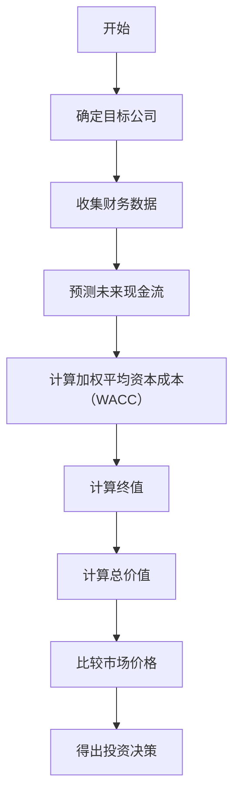

                 


# 价值投资在不同市场条件下的适应性策略

## 关键词：价值投资，市场条件，内在价值，安全边际，数学模型

## 摘要：本文系统地探讨了价值投资在不同市场环境中的适应策略。通过分析价值投资的核心概念、数学模型和实际案例，本文展示了如何在牛市、熊市和震荡市等不同市场条件下，通过内在价值评估和安全边际策略，实现稳健的投资收益。

---

## 第1章: 价值投资的核心概念与历史演变

### 1.1 价值投资的定义与背景

#### 1.1.1 价值投资的起源与发展
价值投资是由本杰明·格雷厄姆和戴维·多德在20世纪初提出的，其核心理念是购买被市场低估的股票。这一策略在1929年大萧条期间表现出了强大的抗跌性，为投资者提供了避风港。

#### 1.1.2 价值投资的核心理念与原则
- **安全边际**：买入价格远低于内在价值的股票，以降低风险。
- **长期视角**：关注企业的基本面，而非短期市场波动。
- **逆向投资**：在市场恐慌时买入，在市场狂热时卖出。

#### 1.1.3 价值投资在现代金融体系中的地位
价值投资是基本面分析的核心策略之一，广泛应用于机构投资和个人投资中。

---

### 1.2 价值投资的核心原理

#### 1.2.1 市场有效性的分析与价值投资的适用性
- **有效市场假说**：市场总是以合理的价格反映所有信息，价值投资在有效市场中可能失效。
- **弱有效市场**：市场未完全反映所有信息，价值投资有可乘之机。

#### 1.2.2 股票的内在价值与市场价格的关系
内在价值是股票的真正价值，而市场价格受市场情绪影响。价值投资者的目标是找到内在价值高于市场价格的股票。

#### 1.2.3 安全边际在风险管理中的作用
通过安全边际，投资者可以在市场波动中降低风险，确保投资的稳健性。

---

## 第2章: 价值投资与其他投资策略的对比

### 2.1 主流投资策略概述

#### 2.1.1 股票投资的主要策略分类
- **技术分析**：基于价格和成交量的波动进行预测。
- **基本面分析**：基于企业的财务状况和行业前景进行预测。
- **趋势投资**：顺势而为，跟随市场趋势进行投资。

#### 2.1.2 技术分析与基本面分析的区别
| 指标 | 技术分析 | 基本面分析 |
|------|----------|------------|
| 关注点 | 价格波动 | 公司财务 |
| 工具 | K线图、MACD | 财务报表、估值指标 |

#### 2.1.3 积极投资与消极投资的对比
- **积极投资**：主动选股，追求超额收益。
- **消极投资**：被动跟踪指数，追求市场平均收益。

---

## 第3章: 内在价值的评估方法

### 3.1 内在价值的定义与计算公式

#### 3.1.1 内在价值的公式表示
$$ V = \frac{CF}{(1 + r)^n} $$
其中：
- \( CF \)：未来现金流
- \( r \)：折现率
- \( n \)：现金流的时间跨度

#### 3.1.2 现金流折现模型（DCF）的详细解释
现金流折现模型是评估企业内在价值的核心方法，分为两部分：
1. **自由现金流（FCF）预测**：预测未来几年的现金流。
2. **终值计算**：使用永续年金公式计算终值。

---

### 3.2 不同行业的内在价值评估方法

#### 3.2.1 银行行业的内在价值评估
银行行业的内在价值需要考虑净息差、资产质量等因素。

#### 3.2.2 科技行业的内在价值评估
科技行业的内在价值需要考虑研发能力、市场占有率等因素。

#### 3.2.3 消费行业的内在价值评估
消费行业的内在价值需要考虑品牌忠诚度、消费者需求等因素。

---

## 第4章: 价值投资中的数学模型与公式

### 4.1 现金流折现模型（DCF）

#### 4.1.1 DCF模型的步骤与流程图


---

### 4.2 市盈率与市净率的比较

#### 4.2.1 市盈率的计算公式
$$ P/E = \frac{P}{E} $$
其中：
- \( P \)：股票价格
- \( E \)：每股收益

#### 4.2.2 市净率的计算公式
$$ P/B = \frac{P}{B} $$
其中：
- \( P \)：股票价格
- \( B \)：每股净资产

---

## 第5章: 价值投资的系统分析与架构设计

### 5.1 价值投资的系统分析

#### 5.1.1 系统输入：市场
- **市场环境**：牛市、熊市、震荡市
- **市场参与者**：机构投资者、个人投资者

#### 5.1.2 系统处理：投资策略
- **内在价值评估**：使用DCF模型计算股票的内在价值
- **安全边际分析**：比较市场价格与内在价值，确定安全边际

#### 5.1.3 系统输出：投资决策
- **买入信号**：内在价值 > 市场价格
- **卖出信号**：内在价值 < 市场价格

---

## 第6章: 价值投资在不同市场条件下的应用

### 6.1 牛市中的价值投资策略

#### 6.1.1 牛市的特点
- 市场情绪高涨
- 股价普遍上涨

#### 6.1.2 投资策略
- 选择被市场低估的股票
- 控制仓位，避免过度投资

---

### 6.2 熊市中的价值投资策略

#### 6.2.1 熊市的特点
- 市场情绪恐慌
- 股价普遍下跌

#### 6.2.2 投资策略
- 买入被市场严重低估的股票
- 增加仓位，抓住长期机会

---

### 6.3 震荡市中的价值投资策略

#### 6.3.1 震荡市的特点
- 市场情绪不稳定
- 股价波动较大

#### 6.3.2 投资策略
- 保持灵活性，及时调整投资组合
- 选择具有稳定现金流的企业

---

## 第7章: 价值投资的项目实战

### 7.1 环境安装

#### 7.1.1 数据收集
- 公司财务报表
- 行业分析报告

#### 7.1.2 工具安装
- 财务分析软件（如Excel、Python）

---

### 7.2 核心实现

#### 7.2.1 内在价值计算
假设我们评估苹果公司（AAPL）的内在价值。

```python
# 示例代码：计算苹果公司的内在价值
import pandas as pd
import numpy as np

# 假设财务数据已加载到 dataframe 'df' 中
# 计算自由现金流（FCF）
df['FCF'] = df['Operating Cash Flow'] - df['Capital Expenditure']

# 计算加权平均资本成本（WACC）
# 假设 WACC = 8%
wacc = 0.08

# 预测未来5年的现金流
fcf_projection = df['FCF'].iloc[-5:].mean() * (1 + 0.05)  # 假设年增长率为5%

# 计算终值（永续年金）
terminal_value = fcf_projection / (wacc - 0.02)  # 假设永续增长率为2%

# 计算总价值
total_value = fcf_projection + terminal_value
```

---

## 第8章: 总结与展望

### 8.1 价值投资的关键点
- 内在价值评估是核心
- 安全边际是风险管理的关键
- 长期视角是制胜法宝

### 8.2 最佳实践
- 定期复盘，调整投资组合
- 保持学习，更新投资理念

---

## 作者：AI天才研究院/AI Genius Institute & 禅与计算机程序设计艺术 /Zen And The Art of Computer Programming

---

### 总结
本文系统地探讨了价值投资在不同市场条件下的适应策略。通过分析价值投资的核心概念、数学模型和实际案例，展示了如何在不同市场环境中实现稳健的投资收益。希望读者能够通过本文，更好地理解价值投资的本质，并在实际投资中灵活运用这些策略。

