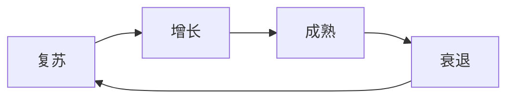

                 


# 《价值投资在不同市场环境下的应用》

> **关键词**：价值投资，市场环境，投资策略，内在价值，风险管理
>
> **摘要**：本文深入探讨了价值投资在不同市场环境下的应用策略。通过分析牛市、熊市和震荡市的市场特征，结合安全边际和内在价值等核心概念，为投资者提供了一套系统化的投资框架。文章还通过实际案例分析和数学模型，详细阐述了如何在复杂多变的市场环境中制定有效的投资策略，并通过风险管理确保投资组合的稳健性。

---

## 第1章: 价值投资的核心概念

### 1.1 价值投资的定义与背景

价值投资是一种以基本面分析为基础的投资策略，强调购买那些市场价格低于其内在价值的资产。这种方法起源于20世纪20年代，由本杰明·格雷厄姆和戴维·多德提出，后来被沃伦·巴菲特发扬光大。价值投资的核心理念是寻找市场先生（Mr. Market）情绪波动中的投资机会，即在市场恐慌时买入低估资产，在市场狂热时卖出高估资产。

### 1.2 价值投资的核心要素

#### 1.2.1 安全边际

**安全边际**是价值投资中最重要的概念之一。它是指市场价格与内在价值之间的差距。通过计算安全边际，投资者可以确保在市场价格下跌时仍能获得正的回报。

**公式**：
$$ \text{安全边际} = \text{内在价值} - \text{市场价格} $$

#### 1.2.2 内在价值

内在价值是资产在未来现金流的现值。对于股票而言，内在价值可以通过股利折现模型（DDM）或自由现金流折现模型（DCF）进行计算。

**公式**：
$$ V = \sum_{t=1}^{n} \frac{C_t}{(1 + r)^t} + \frac{FV}{(1 + r)^n} $$

其中，\( V \) 是内在价值，\( C_t \) 是第 \( t \) 年的现金流，\( r \) 是折现率，\( FV \) 是终值。

#### 1.2.3 市场先生

市场先生是价值投资者用来描述市场情绪波动的隐喻。市场先生每天都会报出一个价格，投资者可以选择以当前价格买入或卖出资产。价值投资者认为市场先生经常过于乐观或悲观，从而导致市场价格偏离内在价值。

### 1.3 价值投资的适用场景

价值投资适用于各种市场环境，但在不同市场中需要采取不同的策略。以下是三种主要的市场环境及其对应的策略：

1. **牛市**：市场情绪高涨，资产价格被高估。此时，价值投资者应寻找那些基本面良好但市场价格尚未被充分炒作的资产。
2. **熊市**：市场情绪低落，资产价格被低估。此时，价值投资者可以积极买入优质资产。
3. **震荡市**：市场波动较大，投资者需要更加注重风险控制，选择那些具有强大基本面和良好流动性管理能力的资产。

---

## 第2章: 市场环境的周期性分析

### 2.1 市场周期的定义与特征

市场周期通常分为四个阶段：复苏、增长、成熟和衰退。每个阶段的市场表现和投资策略都有所不同。

**图2-1：市场周期的四个阶段**



### 2.2 不同市场环境下的投资策略

#### 2.2.1 牛市环境下的投资策略

在牛市中，市场情绪高涨，投资者倾向于高估资产价值。价值投资者需要更加谨慎，寻找那些基本面良好但市场价格还未被过度炒作的资产。

**图2-2：牛市环境下的投资策略**


#### 2.2.2 熊市环境下的投资策略

在熊市中，市场情绪低落，许多优质资产被低估。此时，价值投资者可以积极买入优质资产。

**图2-3：熊市环境下的投资策略**


#### 2.2.3 震荡市环境下的投资策略

在震荡市中，市场波动大，投资者需要更加注重风险控制，选择那些具有强大基本面和良好流动性管理能力的资产。

**图2-4：震荡市环境下的投资策略**


### 2.3 市场环境变化的应对策略

#### 2.3.1 如何识别市场环境的变化

投资者可以通过分析市场指数、成交量、市场情绪指标等来判断市场环境的变化。

**公式**：
$$ \text{市场情绪指标} = \frac{\text{市场成交量}}{\text{市场指数}} $$

#### 2.3.2 如何调整投资组合

当市场环境发生变化时，投资者需要根据新的市场环境调整投资组合。例如，在牛市中增加高增长资产的权重，在熊市中增加防御性资产的权重。

**图2-5：投资组合调整流程**


#### 2.3.3 如何应对市场波动

投资者可以通过分散投资、设置止损点等方法来应对市场波动。

**公式**：
$$ \text{止损点} = \text{买入价格} \times (1 - \text{止损比例}) $$

---

## 第3章: 价值投资的系统分析与架构设计

### 3.1 投资决策框架

#### 3.1.1 确定投资目标与风险偏好

投资者需要明确自己的投资目标和风险偏好。例如，有些投资者可能更注重长期资本增值，而另一些投资者可能更注重稳定的收益。

**图3-1：投资目标与风险偏好**


#### 3.1.2 选择投资标的

投资者需要根据市场环境和自身目标选择合适的投资标的。例如，在牛市中选择成长型股票，在熊市中选择防御性股票。

**图3-2：选择投资标的流程**


#### 3.1.3 制定投资计划

投资者需要制定详细的投资计划，包括买入价格、投资金额、持有期限等。

**公式**：
$$ \text{买入价格} = \text{内在价值} \times (1 - \text{安全边际比例}) $$

### 3.2 投资组合管理

#### 3.2.1 投资组合的构建原则

投资者需要根据市场环境和自身目标构建投资组合。例如，在牛市中增加成长型资产的权重，在熊市中增加防御性资产的权重。

**图3-3：投资组合构建原则**


#### 3.2.2 投资组合的风险管理

投资者需要通过分散投资、设置止损点等方法来管理投资组合的风险。

**公式**：
$$ \text{风险分散化} = \frac{\text{投资组合的波动率}}{\text{单一资产的波动率}} $$

#### 3.2.3 投资组合的动态调整

投资者需要根据市场环境的变化动态调整投资组合。例如，在市场环境恶化时减少高风险资产的权重。

**图3-4：投资组合动态调整流程**


### 3.3 投资风险管理

#### 3.3.1 风险识别与评估

投资者需要识别和评估投资组合中的各种风险，例如市场风险、流动性风险、信用风险等。

**公式**：
$$ \text{风险识别} = \sum_{i=1}^{n} \text{风险因素}_i $$

#### 3.3.2 风险控制策略

投资者可以通过分散投资、设置止损点、选择低相关性资产等方法来控制风险。

**公式**：
$$ \text{止损点} = \text{买入价格} \times (1 - \text{止损比例}) $$

#### 3.3.3 风险分散化原理

通过将资金分配到不同资产类别和不同市场中，投资者可以降低投资组合的整体风险。

**公式**：
$$ \text{风险分散化} = \frac{\text{投资组合的波动率}}{\text{单一资产的波动率}} $$

---

## 第4章: 价值投资的项目实战

### 4.1 牛市环境下的实战案例

#### 4.1.1 案例背景与市场分析

2020年新冠疫情爆发后，全球市场经历了剧烈震荡，许多资产价格被低估。作为价值投资者，我们需要寻找那些基本面良好但市场价格尚未被充分炒作的资产。

#### 4.1.2 投资策略的制定与实施

在2020年市场震荡期间，我们选择了一些具有强大基本面和良好竞争优势的公司进行投资，例如苹果公司（AAPL）和亚马逊（AMZN）。

**代码示例**：
```python
import pandas as pd
import yfinance as yf

# 下载苹果公司（AAPL）和亚马逊（AMZN）的历史数据
data = yf.download(['AAPL', 'AMZN'], start='2020-01-01', end='2023-12-31')

# 计算内在价值（简化版）
def calculate_intrinsic_value(stock_data, growth_rate, discount_rate):
    cash_flow = stock_data['Adj Close'].iloc[-1]
    return cash_flow / (1 + discount_rate) + cash_flow * (1 + growth_rate) / (1 + discount_rate)**2

# 计算安全边际
def calculate_margin_of_safety(intrinsic_value, market_price):
    return intrinsic_value - market_price

# 计算内在价值和安全边际
intrinsic_value_AAPL = calculate_intrinsic_value(data['AAPL'], 0.05, 0.08)
margin_of_safety_AAPL = calculate_margin_of_safety(intrinsic_value_AAPL, data['AAPL']['Adj Close'].iloc[-1])

intrinsic_value_AMZN = calculate_intrinsic_value(data['AMZN'], 0.05, 0.08)
margin_of_safety_AMZN = calculate_margin_of_safety(intrinsic_value_AMZN, data['AMZN']['Adj Close'].iloc[-1])

print(f"苹果的内在价值: {intrinsic_value_AAPL:.2f}")
print(f"苹果的安全边际: {margin_of_safety_AAPL:.2f}")
print(f"亚马逊的内在价值: {intrinsic_value_AMZN:.2f}")
print(f"亚马逊的安全边际: {margin_of_safety_AMZN:.2f}")
```

#### 4.1.3 投资结果与经验总结

通过以上策略，我们在2020年市场震荡期间成功投资了苹果和亚马逊，并在市场复苏后获得了可观的收益。

---

## 第5章: 最佳实践与小结

### 5.1 最佳实践 tips

1. **长期投资**：价值投资是一种长期投资策略，投资者需要耐心等待市场先生的报价。
2. **基本面分析**：投资者需要深入分析公司的财务报表、管理层、竞争优势等因素。
3. **风险管理**：投资者需要通过分散投资、设置止损点等方法来管理投资组合的风险。
4. **持续学习**：投资者需要不断学习市场知识，关注市场变化，调整投资策略。

### 5.2 小结

价值投资是一种有效的投资策略，尤其在不同市场环境中具有独特的优势。通过深入分析市场周期、制定科学的投资计划、合理管理投资风险，投资者可以在复杂多变的市场中实现稳健的收益。

### 5.3 注意事项

1. **市场环境的不确定性**：市场环境的变化可能影响价值投资的策略，投资者需要灵活调整。
2. **数据的准确性**：基本面分析需要依赖准确的财务数据，投资者需要注意数据来源的可靠性。
3. **心理因素的影响**：投资者的心理因素可能影响投资决策，需要保持冷静和理性。

### 5.4 拓展阅读

1. **《The Intelligent Investor》** - 本杰明·格雷厄姆
2. **《The Port

