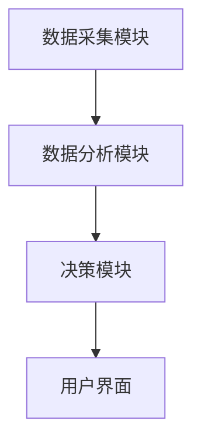
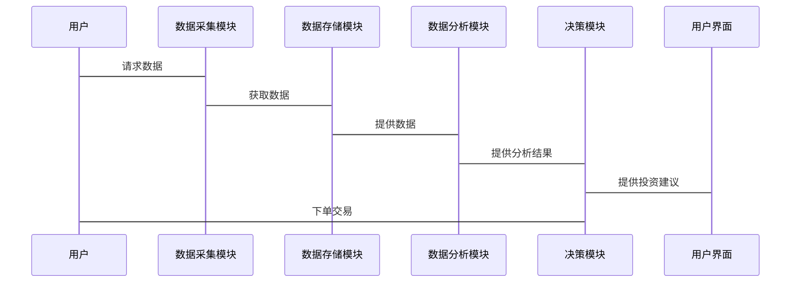

                 


# 价值投资在加密货币市场的应用

## 关键词：价值投资，加密货币，市场分析，投资策略，风险管理

## 摘要：本文探讨了价值投资在加密货币市场的应用，分析了加密货币市场的特点与挑战，提出了价值投资的核心原则与策略，包括长期投资、逆向投资和风险管理等。结合实际案例和系统架构设计，本文为投资者提供了在加密货币市场中实现稳健投资的深度分析与实用建议。

---

# 第一部分: 价值投资在加密货币市场的背景与基础

## 第1章: 价值投资的核心概念与背景介绍

### 1.1 价值投资的定义与核心要素

#### 1.1.1 价值投资的起源与发展

价值投资是一种以基本面分析为基础的投资策略，起源于20世纪初，由本杰明·格雷厄姆和戴维·多德提出。其核心理念是寻找市场价格低于其内在价值的资产进行长期投资。随着市场的演变，价值投资逐渐从传统股票市场扩展到其他资产类别，包括加密货币。

#### 1.1.2 价值投资的核心原则

- **安全边际**：购买价格低于内在价值，确保投资的安全性。
- **长期视角**：关注企业的长期价值，而非短期价格波动。
- **基本面分析**：通过分析企业的财务状况、行业地位等因素来评估其内在价值。

#### 1.1.3 价值投资与加密货币市场的结合

加密货币市场的高波动性和去中心化特性为价值投资提出了新的挑战和机遇。价值投资者需要结合技术分析和基本面分析，寻找具有长期增长潜力的项目。

---

### 1.2 加密货币市场的特点与挑战

#### 1.2.1 加密货币市场的基本概念

加密货币是一种基于区块链技术的数字货币，具有去中心化、匿名性和不可篡改等特点。与传统货币不同，加密货币的价值主要由市场供需和技术发展驱动。

#### 1.2.2 加密货币市场的波动性分析

加密货币市场具有高度的波动性，价格在短时间内可能大幅波动。这种波动性使得价值投资需要更加谨慎，注重长期价值而非短期价格波动。

#### 1.2.3 加密货币市场的参与者与生态

加密货币市场参与者包括个人投资者、机构投资者、交易所、矿工等。市场的生态复杂，涉及多种角色和技术。

---

### 1.3 价值投资在加密货币市场的可行性

#### 1.3.1 价值投资在传统市场的成功案例

在传统股票市场中，价值投资取得了显著的成功，如巴菲特的长期投资策略。这些成功案例为价值投资在加密货币市场的应用提供了借鉴。

#### 1.3.2 加密货币市场的独特性与挑战

加密货币市场的高波动性和技术复杂性使得价值投资需要进行调整，注重项目的长期潜力和团队实力。

#### 1.3.3 价值投资在加密货币市场的适用性

尽管存在挑战，但价值投资的核心原则仍然适用于加密货币市场。通过长期持有优质资产，投资者可以在市场波动中获得稳健收益。

---

## 第2章: 加密货币的价值评估标准

### 2.1 价值评估的核心指标

#### 2.1.1 技术分析指标

- **价格走势**：分析加密货币的价格走势，寻找趋势和形态。
- **交易量**：通过交易量判断市场的活跃度和趋势强度。
- **技术指标**：如MACD、RSI等，用于判断超买超卖和趋势强度。

#### 2.1.2 基本面分析指标

- **项目背景**：团队实力、项目历史和发展阶段。
- **技术创新**：区块链技术的创新性和实用性。
- **市场需求**：项目的应用场景和市场接受度。

#### 2.1.3 市场情绪与投资者心理

- **市场情绪**：通过新闻、社交媒体等判断市场情绪。
- **投资者心理**：分析投资者的行为模式和决策逻辑。

---

### 2.2 加密货币项目的评估维度

#### 2.2.1 项目背景与团队实力

- **团队背景**：创始团队的经验和声誉。
- **项目历史**：项目的发展历程和关键里程碑。

#### 2.2.2 项目的技术实现

- **技术创新**：项目的独特性和技术创新性。
- **技术实现**：技术的可行性、可靠性和扩展性。

#### 2.2.3 项目的市场定位与应用场景

- **市场定位**：项目在市场中的定位和目标用户。
- **应用场景**：项目的实际应用场景和市场潜力。

---

### 2.3 价值评估的综合模型

#### 2.3.1 指标权重的确定

- **指标权重**：根据项目的实际情况确定各指标的权重。
- **权重分配**：例如，技术指标占40%，基本面指标占30%，市场情绪占30%。

#### 2.3.2 综合评分模型的设计

通过加权平均的方式，综合评估各个指标，得出项目的综合评分。

#### 2.3.3 模型的验证与优化

- **验证**：通过历史数据验证模型的准确性。
- **优化**：根据验证结果调整指标权重和模型结构。

---

## 第3章: 价值投资策略在加密货币市场的应用

### 3.1 长期投资策略

#### 3.1.1 长期投资的核心理念

- **长期持有**：相信项目的长期价值，不因短期波动而改变投资决策。
- **价值发现**：寻找具有长期增长潜力的项目，等待其价值回归。

#### 3.1.2 长期投资的适用场景

- **市场低迷期**：在市场低迷时买入优质资产，长期持有。
- **市场波动期**：在市场波动中保持冷静，避免短期决策。

#### 3.1.3 长期投资的风险控制

- **分散投资**：通过分散投资降低风险。
- **定期评估**：定期评估投资组合，调整持仓。

---

### 3.2 逆向投资策略

#### 3.2.1 逆向投资的定义与特点

- **逆向投资**：在市场恐慌时买入，在市场狂热时卖出。
- **逆向思维**：与市场情绪相反的决策，寻找市场的错配机会。

#### 3.2.2 逆向投资的适用条件

- **市场恐慌**：市场出现恐慌性抛售时，寻找被低估的资产。
- **市场狂热**：市场出现非理性上涨时，寻找被高估的资产。

#### 3.2.3 逆向投资的实际案例

- **比特币的长期牛市**：在比特币价格暴跌时买入，长期持有，获得高回报。

---

### 3.3 安全边际的概念与应用

#### 3.3.1 安全边际的定义

- **安全边际**：购买价格低于内在价值的差额，确保投资的安全性。

#### 3.3.2 安全边际的计算方法

- **内在价值评估**：通过基本面分析确定资产的内在价值。
- **市场价格比较**：比较市场价格与内在价值，确定安全边际。

#### 3.3.3 安全边际在加密货币投资中的应用

- **选择优质资产**：选择具有较大安全边际的项目进行投资。
- **动态调整**：根据市场变化动态调整投资组合的安全边际。

---

## 第4章: 风险管理与投资组合优化

### 4.1 风险管理的核心原则

#### 4.1.1 风险的定义与分类

- **系统性风险**：市场整体波动带来的风险。
- **非系统性风险**：特定资产或项目带来的风险。

#### 4.1.2 风险管理的目标与方法

- **目标**：降低投资组合的整体风险，提高收益的稳定性。
- **方法**：分散投资、止损机制、定期评估。

#### 4.1.3 风险管理在加密货币投资中的重要性

- **高波动性**：加密货币市场的高波动性使得风险管理尤为重要。
- **市场周期**：通过风险管理应对市场的周期性波动。

---

### 4.2 投资组合优化策略

#### 4.2.1 投资组合的基本概念

- **投资组合**：投资者持有的多种资产的集合。
- **分散投资**：通过持有不同类型的资产降低风险。

#### 4.2.2 投资组合优化的数学模型

- **现代投资组合理论**：通过优化资产配置，使投资组合的风险最小化，收益最大化。

#### 4.2.3 投资组合优化的实际应用

- **资产分配**：根据风险偏好和市场状况分配不同资产的比例。
- **定期调整**：根据市场变化和投资目标调整投资组合。

---

### 4.3 风险控制的具体措施

#### 4.3.1 分散投资策略

- **资产多样化**：持有多种不同类型的加密货币和传统资产。
- **市场分散**：投资于不同市场的项目，降低区域风险。

#### 4.3.2 止损机制的应用

- **止损点设置**：设定止损点，当价格下跌到一定程度时自动卖出。
- **止损策略**：根据市场情况动态调整止损点。

#### 4.3.3 定期评估与调整

- **定期审查**：定期审查投资组合，评估风险和收益。
- **动态调整**：根据市场变化和投资目标调整投资组合。

---

# 第四部分: 系统分析与架构设计

## 第5章: 加密货币市场的系统分析与架构设计

### 5.1 问题场景介绍

- **问题背景**：加密货币市场的高波动性和复杂性使得传统的价值投资策略需要进行调整。
- **项目介绍**：设计一个加密货币的价值评估系统，帮助投资者进行科学决策。

### 5.2 系统功能设计

#### 5.2.1 数据采集模块

- **功能**：采集加密货币市场的实时数据，包括价格、交易量、市场情绪等。
- **数据源**：交易所API、新闻网站、社交媒体等。

#### 5.2.2 数据分析模块

- **功能**：对采集的数据进行分析，包括技术分析和基本面分析。
- **分析方法**：技术指标分析、财务指标分析、市场情绪分析等。

#### 5.2.3 决策模块

- **功能**：根据分析结果生成投资建议，指导投资者进行决策。
- **决策规则**：基于安全边际、风险控制等原则，制定具体的买卖策略。

### 5.3 系统架构设计

#### 5.3.1 系统架构图



#### 5.3.2 系统接口设计

- **数据接口**：与其他系统的数据接口进行对接，如交易所API。
- **用户接口**：提供用户友好的界面，方便用户查看分析结果和进行交易。

#### 5.3.3 系统交互序列图



---

## 第6章: 项目实战

### 6.1 环境安装

- **安装Python**：安装Python编程环境，用于数据处理和分析。
- **安装数据分析库**：如Pandas、NumPy、Matplotlib等。

### 6.2 系统核心实现源代码

```python
import pandas as pd
import numpy as np
import matplotlib.pyplot as plt

# 数据采集模块
def collect_data(symbol):
    # 示例：从交易所API获取数据
    pass

# 数据分析模块
def analyze_data(data):
    # 示例：计算技术指标
    pass

# 决策模块
def make_decision(data):
    # 示例：根据分析结果生成投资建议
    pass

# 用户界面模块
def display_results(advice):
    # 示例：显示投资建议
    pass

# 主程序
def main():
    symbol = input("请输入你要分析的加密货币符号：")
    data = collect_data(symbol)
    advice = analyze_data(data)
    make_decision(advice)
    display_results(advice)

if __name__ == "__main__":
    main()
```

### 6.3 代码应用解读与分析

- **数据采集模块**：通过交易所API获取加密货币的实时数据。
- **数据分析模块**：计算技术指标如MACD、RSI，分析基本面指标如市盈率、市净率。
- **决策模块**：根据分析结果生成买入、卖出或持有建议。
- **用户界面模块**：将分析结果以图形化的方式展示给用户。

### 6.4 实际案例分析和详细讲解剖析

- **案例分析**：分析比特币的长期投资机会，评估其内在价值和市场潜力。
- **详细讲解**：通过具体的数据和分析，展示如何应用价值投资策略进行决策。

### 6.5 项目小结

- **项目总结**：通过系统化的分析和决策过程，帮助投资者在加密货币市场中实现稳健的投资回报。
- **经验分享**：分享在项目实施过程中遇到的挑战和解决方法。

---

# 第五部分: 总结与展望

## 第7章: 总结与展望

### 7.1 总结

- **核心内容回顾**：价值投资在加密货币市场的应用，包括长期投资、逆向投资、风险管理等策略。
- **系统架构总结**：加密货币价值评估系统的构建与实现。

### 7.2 展望

- **未来发展趋势**：随着加密货币市场的成熟，价值投资将更加重要。
- **技术创新**：人工智能和大数据技术将推动价值投资策略的进一步发展。
- **投资机会**：未来，随着区块链技术的不断发展，更多具有实际应用场景的加密货币项目将出现，为价值投资提供更多的机会。

---

## 结语

价值投资在加密货币市场的应用是一个复杂而充满挑战的过程。通过系统的分析和科学的决策，投资者可以在高波动性的市场中实现稳健的投资回报。未来，随着技术的进步和市场的成熟，价值投资将继续在加密货币市场中发挥重要作用。

---

## 作者：AI天才研究院/AI Genius Institute & 禅与计算机程序设计艺术 /Zen And The Art of Computer Programming

