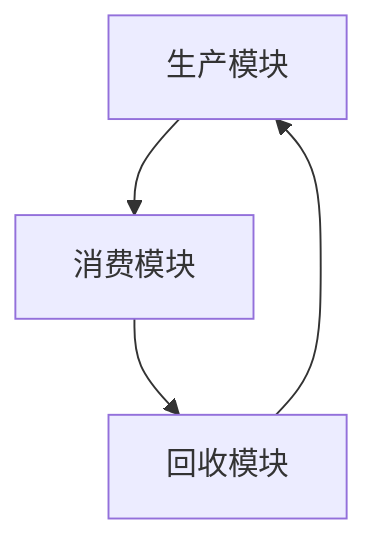
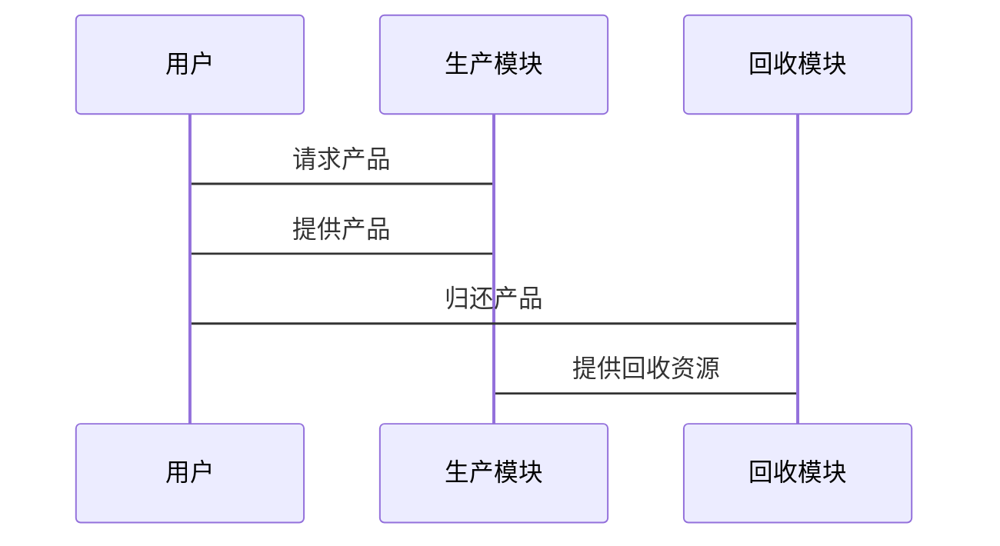

                 

# 价值投资在循环经济中的应用：可持续商业模式的机遇

---

## 关键词：
- 价值投资、循环经济、可持续商业模式、资源效率、投资回报率、系统架构、共享经济

---

## 摘要：
本文探讨了价值投资在循环经济中的应用，分析了循环经济的商业模式、系统架构和数学模型，通过实际案例展示了价值投资在循环经济中的机遇。文章详细阐述了如何通过可持续商业模式实现资源效率最大化，并为投资者提供了最佳实践和投资策略。

---

## 第一章：循环经济的基本概念

### 1.1 循环经济的定义与特点

循环经济是一种以资源高效利用和闭环管理为核心经济模式。与传统线性经济（资源→产品→废弃物）不同，循环经济强调“从摇篮到摇篮”的理念，通过设计、生产、消费和回收等环节的优化，实现资源的循环利用。

- **特点**：
  - 资源效率高
  - 环境影响小
  - 经济效益可持续
  - 企业与社会双赢

### 1.2 价值投资的基本概念

价值投资是一种以内在价值为核心的投资策略，强调以低于内在价值的价格买入优质资产。其核心理念是寻找被市场低估的企业，通过长期持有实现超额收益。

- **核心理念**：
  - 以合理价格买入优质企业
  - 长期持有，分享企业成长
  - 风险控制，追求安全边际

### 1.3 循环经济与价值投资的结合

循环经济与价值投资的结合为投资者提供了新的机遇。循环经济企业通常具有高资源效率和可持续发展的潜力，这使其成为价值投资者的理想标的。同时，价值投资的长期视角与循环经济的可持续性目标高度契合。

---

## 第二章：循环经济中的商业模式

### 2.1 循环经济的商业模式

循环经济催生了多种商业模式，包括：

- **共享经济**：通过共享资源降低使用成本，如共享办公空间、共享交通工具。
- **产品服务系统**：企业提供产品使用权而非所有权，如租赁办公设备、按需打印服务。
- **闭环供应链**：企业将废弃物转化为新原料，实现资源的循环利用。

### 2.2 价值投资在循环经济中的应用

价值投资者可以通过以下方式在循环经济中寻找投资机会：

- **投资高资源效率企业**：选择那些能够通过循环利用降低成本、提高效率的企业。
- **关注可持续创新**：投资那些在循环经济领域具有技术创新能力的企业。
- **评估环境风险**：分析企业对环境资源的依赖程度和应对环境政策的能力。

---

## 第三章：循环经济的理论框架与数学模型

### 3.1 循环经济的系统分析

循环经济系统的构成要素包括：

- **输入**：原材料、能源、劳动力
- **输出**：产品、服务、废弃物
- **内部循环**：生产、消费、回收

### 3.2 循环经济的数学模型

循环经济学的数学模型通常包括资源流动分析和生命周期评估（LCA）。以下是资源流动模型的简化表示：

$$
\text{资源流动总量} = \sum_{i=1}^{n} \text{输入}_i - \sum_{j=1}^{m} \text{输出}_j
$$

其中，输入和输出的单位可以是质量（kg）、能量（J）或货币（$）。

---

## 第四章：价值投资的数学模型与公式

### 4.1 价值投资的财务分析

价值投资者通常使用市盈率（P/E）、市净率（P/B）等指标来评估企业的内在价值。以下是市盈率的计算公式：

$$
\text{市盈率} = \frac{\text{股价}}{\text{每股收益}}
$$

### 4.2 循环经济企业的投资评估

循环经济企业的投资评估需要考虑环境成本和资源效率。以下是资源效率的计算公式：

$$
\text{资源效率} = \frac{\text{产品价值}}{\text{资源消耗}}
$$

---

## 第五章：循环经济的系统架构与接口设计

### 5.1 系统架构设计

循环经济系统的架构通常包括以下几个模块：

- **生产模块**：负责产品的制造和资源的初始输入。
- **消费模块**：提供产品或服务给最终用户。
- **回收模块**：将废弃物转化为可再利用的资源。

以下是系统的mermaid架构图：

### 5.2 接口设计与交互

循环经济系统中的接口设计需要确保各模块之间的高效协同。以下是系统的交互序列图：

---

## 第六章：价值投资在循环经济中的实际案例分析

### 6.1 案例分析：Patagonia的可持续商业模式

Patagonia是一家以环保为核心的户外服装公司，通过以下方式实现循环经济：

- **产品设计**：使用可回收材料生产产品。
- **维修服务**：提供产品维修服务，延长产品生命周期。
- **旧衣回收**：通过旧衣回收计划，将废弃物转化为新原料。

### 6.2 投资分析

Patagonia的商业模式不仅环保，还创造了显著的经济价值。以下是关键指标的分析：

- **市盈率**：低于行业平均水平，表明投资价值较高。
- **资源效率**：高于竞争对手，降低成本并提高竞争力。

---

## 第七章：结论与展望

### 7.1 结论

价值投资在循环经济中的应用为投资者提供了新的机遇。循环经济企业的可持续商业模式和高资源效率使其成为价值投资者的理想标的。通过系统架构和数学模型的分析，投资者可以更好地评估循环经济企业的投资价值。

### 7.2 展望

随着环保意识的增强和政策的支持，循环经济将成为未来经济的重要组成部分。价值投资者应继续关注循环经济领域的创新和可持续发展，抓住投资机遇。

---

## 作者：AI天才研究院/AI Genius Institute  
邮箱：contact@ai-genius-institute.com  
网址：https://www.ai-genius-institute.com

---

**[完]**

