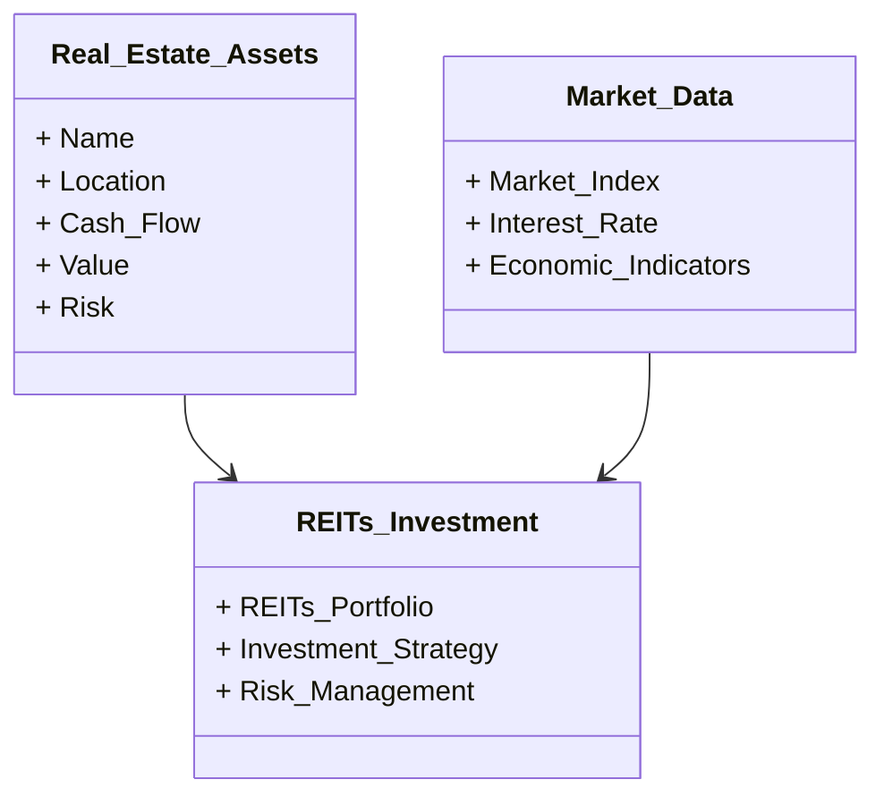

                 


# 价值投资在房地产市场的应用：REITs的机遇与风险

---

## 关键词：价值投资，REITs，房地产市场，风险管理，投资策略

---

## 摘要：  
本文深入探讨了价值投资在房地产市场的应用，特别是房地产投资信托基金（REITs）的机遇与风险。文章从REITs的基本概念、价值投资的核心理论出发，分析了REITs的投资策略、风险管理方法，以及系统架构设计。通过实际案例分析和数学模型的应用，本文为投资者提供了如何在房地产市场中运用价值投资理念进行REITs投资的详细指导。文章最后总结了未来趋势和最佳实践，为读者提供了切实可行的投资建议。

---

## 第一部分：引言

### 第1章：价值投资与REITs概述

#### 1.1 REITs的基本概念  
REITs（Real Estate Investment Trusts）是房地产投资信托基金的缩写，是一种通过汇集资金投资房地产及相关资产的金融工具。REITs的核心在于将房地产投资的专业化和规模化，使投资者可以通过购买REITs的份额间接参与房地产市场，而无需直接持有房地产资产。REITs的特点包括高流动性、低门槛和透明度高等。

#### 1.2 价值投资的核心理念  
价值投资是一种以基本面分析为基础的投资策略，强调以低于内在价值的价格买入优质资产，并长期持有。其核心在于寻找市场低估的资产，通过长期持有实现收益。价值投资的关键在于对资产的深入研究和对市场的独立思考。

#### 1.3 本书的核心内容与结构  
本书将从REITs的基本概念、价值投资的理论基础出发，分析REITs的投资策略与风险管理，探讨系统架构设计，并通过实际案例展示如何将价值投资应用于REITs投资中。文章结构清晰，内容详实，旨在为读者提供系统化的投资指导。

---

## 第二部分：REITs的背景与发展

### 第2章：REITs的背景与发展

#### 2.1 REITs的历史发展  
REITs起源于20世纪60年代，最初是为了满足投资者对房地产投资的需求。随着金融市场的不断发展，REITs逐渐成为一种重要的金融工具，并在全球范围内得到广泛应用。REITs的演变经历了从简单资产池到复杂金融产品的过程。

#### 2.2 REITs的分类与特点  
REITs可以根据投资类型分为住宅REITs、商业REITs、零售REITs等。不同类型REITs的特点包括资产类型、风险收益特征等。REITs的投资优势在于其高流动性、低门槛和透明度。

#### 2.3 REITs与房地产市场的关系  
REITs是房地产市场的晴雨表，其表现与房地产市场的周期密切相关。REITs通过将资金注入房地产市场，促进了房地产资产的流动性，同时为投资者提供了间接参与房地产市场的渠道。

---

## 第三部分：价值投资理论与房地产市场

### 第3章：价值投资理论与房地产市场

#### 3.1 价值投资的核心理论  
价值投资的核心在于寻找被市场低估的资产，通过深入的基本面分析来确定其内在价值。其哲学基础强调独立思考、安全边际和长期持有的理念。

#### 3.2 房地产市场的价值评估  
房地产市场的价值评估需要考虑多种因素，包括地理位置、资产状况、现金流等。常见的评估方法包括现金流折现法、资产重估法等。

#### 3.3 价值投资在房地产市场的应用  
价值投资在房地产市场的应用需要结合资产的具体情况，选择被低估的房地产资产进行长期持有。同时，投资者需要关注市场的周期性变化，合理分散投资风险。

---

## 第四部分：REITs的投资策略与风险管理

### 第4章：REITs的投资策略与风险管理

#### 4.1 REITs的投资策略  
REITs的投资策略包括选择优质REITs、分散投资和定期再平衡等。优质REITs通常具有稳定的现金流和较高的分红收益。

#### 4.2 REITs的风险管理  
REITs投资中的风险管理包括市场风险、流动性风险和信用风险等。投资者需要通过多元化投资和风险分散来降低整体风险。

#### 4.3 REITs的数学模型与算法  
通过数学模型评估REITs的内在价值，例如使用现金流折现法（DCF）进行估值。公式如下：

$$ V = \frac{CF}{(r - g)} $$

其中，$V$ 是资产的内在价值，$CF$ 是未来现金流，$r$ 是折现率，$g$ 是增长率。

---

## 第五部分：系统分析与架构设计

### 第5章：系统分析与架构设计

#### 5.1 领域模型  
系统功能设计包括数据收集、分析、决策支持等模块。通过领域模型（Mermaid类图）展示系统各部分的关系。



#### 5.2 系统架构设计  
通过系统架构图（Mermaid架构图）展示系统的整体架构，包括数据层、业务逻辑层和用户界面层。


---

## 第六部分：项目实战

### 第6章：项目实战

#### 6.1 环境安装  
安装必要的数据分析工具，如Python、Pandas、Matplotlib等。

#### 6.2 核心代码实现  
通过Python代码实现REITs的内在价值评估：

```python
import pandas as pd
import numpy as np

def calculate_intrinsic_value(cash_flows, discount_rate, growth_rate):
    return cash_flows / (discount_rate - growth_rate)

# 示例数据
cash_flows = [100, 120, 140]
discount_rate = 0.08
growth_rate = 0.02

# 计算内在价值
intrinsic_value = calculate_intrinsic_value(cash_flows[-1], discount_rate, growth_rate)
print(f"内在价值为：{intrinsic_value:.2f}")
```

#### 6.3 案例分析  
通过具体案例分析如何应用价值投资策略进行REITs投资，包括数据收集、分析和决策支持。

---

## 第七部分：未来展望与最佳实践

### 第7章：未来展望与最佳实践

#### 7.1 未来趋势  
随着科技的发展，REITs的投资将更加依赖数据和技术驱动。投资者需要关注科技对房地产市场的深远影响。

#### 7.2 最佳实践 tips  
- 长期持有优质REITs
- 分散投资以降低风险
- 定期审视投资组合
- 注意市场波动和经济周期

#### 7.3 小结  
本文从理论到实践，系统地探讨了价值投资在REITs中的应用，为投资者提供了全面的指导。

---

## 作者：AI天才研究院/AI Genius Institute & 禅与计算机程序设计艺术 /Zen And The Art of Computer Programming

---

以上是本书的详细目录和内容概述，每章内容均按照逻辑顺序展开，结合理论与实践，为读者提供系统的投资指导。

