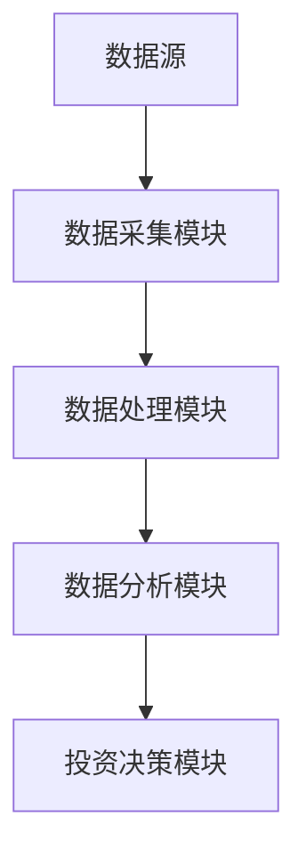
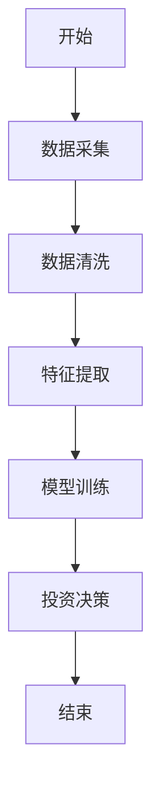

                 


# 价值投资在数字时代的应用与挑战

> 关键词：价值投资，数字时代，数据分析，投资策略，风险管理，技术赋能

> 摘要：  
在数字时代，价值投资的理论与实践面临着新的机遇与挑战。本文从价值投资的核心理念出发，结合数字技术的快速发展，探讨其在投资决策中的应用与转变。通过分析数据驱动的投资策略、算法优化以及风险管理等关键问题，本文旨在为投资者提供在数字时代如何有效应用价值投资的深度洞察。

---

## 引言

价值投资作为一种经典的长期投资策略，强调通过深入分析企业的基本面，寻找具有长期增长潜力的公司进行投资。在数字时代，随着技术的进步和数据的爆炸式增长，价值投资的实践方式也在不断演变。本文将从数字技术对投资决策的影响入手，探讨价值投资在数字时代的应用与挑战。

---

## 第一部分：价值投资的数字时代背景

### 1.1 价值投资的起源与核心理念

价值投资的理论基础可以追溯到本杰明·格雷厄姆和戴维·多德的“安全边际”理论。其核心理念是寻找市场价格低于其内在价值的公司进行投资，强调长期持有和对公司基本面的深入分析。在数字时代，这一理论与现代技术的结合，为投资决策提供了新的可能性。

**核心概念与联系：**  
价值投资的核心要素包括企业的财务状况、竞争优势、管理层能力和行业前景。在数字时代，这些要素可以通过大数据分析和人工智能技术进行更高效、更精准的评估。

---

### 1.2 数字时代的投资变革

数字技术的快速发展，尤其是在人工智能、大数据和区块链领域的突破，为投资领域带来了根本性的变革。投资者可以通过实时数据分析、预测模型和自动化交易系统，实现更高效的投资决策。

**背景介绍：**  
传统的价值投资依赖于人工分析和经验判断，而数字技术的引入使得投资决策更加依赖于数据和算法。这种转变不仅提高了投资效率，也带来了新的挑战，例如数据质量、算法优化和风险管理等问题。

---

## 第二部分：价值投资的核心概念与数字时代的关系

### 2.1 价值投资的核心概念

价值投资的核心概念包括对企业内在价值的评估、财务指标分析、竞争优势识别以及长期投资策略。这些要素在数字时代依然重要，但其评估方式和实施手段正在发生变化。

**数学模型：**  
价值投资的内在价值可以通过以下公式进行估算：

$$
\text{内在价值} = \sum_{t=1}^{n} \frac{CF_t}{(1 + r)^t}
$$

其中，\(CF_t\) 是第 \(t\) 年的现金流，\(r\) 是折现率。

---

### 2.2 数字时代的价值投资挑战

数字时代带来了数据量的爆炸式增长和算法交易的普及，但也带来了新的挑战。例如，高频交易可能导致市场波动加剧，数据质量的不确定性可能影响投资决策的准确性。

**系统分析与架构设计：**  
为了应对这些挑战，投资者需要构建一个高效的数据分析系统，包括数据采集、处理、建模和决策模块。以下是系统架构的简要设计：



---

## 第三部分：价值投资的算法原理与数学模型

### 3.1 价值投资的算法原理

价值投资的算法化主要体现在以下几个方面：

1. **数据驱动的公司筛选：** 通过机器学习模型对企业的财务数据和市场数据进行分析，筛选出具有长期增长潜力的公司。
2. **风险评估与优化：** 使用统计学方法对投资组合进行风险评估，并通过优化算法降低风险。

**算法流程图：**  
以下是价值投资算法的简要流程图：



---

### 3.2 数学模型与公式

在价值投资中，数学模型主要用于评估企业的内在价值和风险。例如，使用CAPM（资本资产定价模型）来评估资产的预期收益：

$$
E(r_i) = r_f + \beta_i (E(r_m) - r_f)
$$

其中，\(E(r_i)\) 是资产的预期收益，\(r_f\) 是无风险利率，\(\beta_i\) 是资产的贝塔系数，\(E(r_m)\) 是市场预期收益。

---

## 第四部分：数字时代的价值投资应用

### 4.1 数据驱动的投资策略

在数字时代，投资者可以通过大数据分析技术，对企业的财务数据、市场表现和行业趋势进行深入分析。例如，使用Python对企业的财务数据进行清洗和建模：

```python
import pandas as pd
import numpy as np

# 数据清洗
data = pd.read_csv('financial_data.csv')
data = data.dropna()
data['Revenue_Growth'] = data['Revenue'].pct_change()

# 模型训练
from sklearn.linear_model import LinearRegression
model = LinearRegression()
model.fit(data[['Revenue_Growth', 'Profit Margin']], data['Stock Price'])
```

---

### 4.2 投资组合管理与风险管理

在数字时代，投资组合管理更加依赖于算法和实时数据。例如，使用Python对投资组合进行风险评估和优化：

```python
import numpy as np
from scipy.stats import norm

def value_at-risk(returns, confidence_level=0.95):
    return np.percentile(returns, (1 - confidence_level) * 100)

returns = np.array([...])
VaR = value_at-risk(returns)
```

---

## 结论

价值投资在数字时代的应用与挑战是一个复杂而深刻的话题。随着技术的进步，投资者可以通过大数据分析和人工智能技术，提升投资决策的效率和准确性。然而，这也带来了数据质量、算法优化和风险管理等新的挑战。未来，价值投资将更加依赖于技术赋能，同时也需要投资者具备更强的数据分析能力和风险管理能力。

---

## 作者：AI天才研究院/AI Genius Institute & 禅与计算机程序设计艺术/Zen And The Art of Computer Programming

