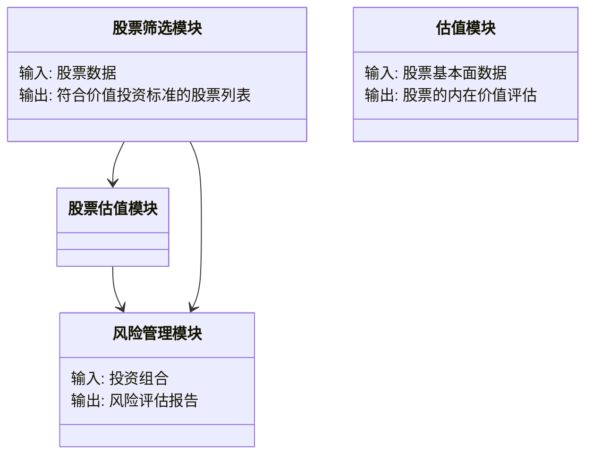
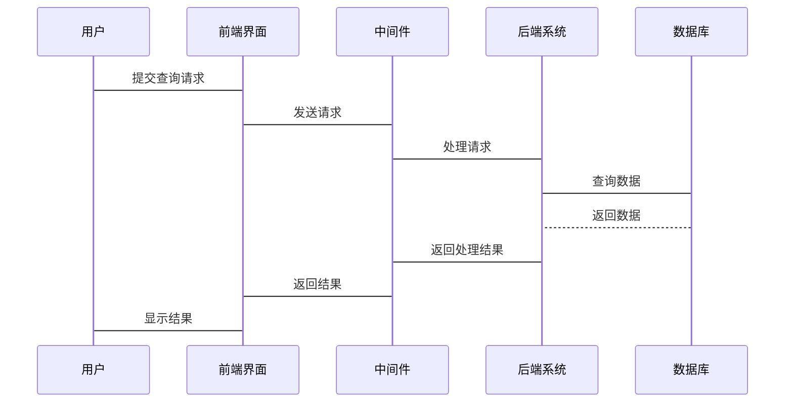

                 


# 《价值投资在新兴市场的应用》

---

## 文章关键词：
价值投资、新兴市场、股票估值、风险管理、投资策略、数学模型

---

## 摘要：
本文系统性地探讨了价值投资在新兴市场的应用，从理论基础、数学模型、系统架构到项目实战，全面分析了价值投资在新兴市场中的独特优势和挑战。文章通过实际案例和数学模型，展示了如何在新兴市场中运用价值投资策略，同时结合风险管理工具，确保投资的稳健性。最终，本文为读者提供了一套在新兴市场中应用价值投资的完整方法论。

---

# 第5章: 新兴市场价值投资的系统分析

## 5.1 系统分析框架

### 5.1.1 新兴市场的特点与问题场景
新兴市场通常具有以下特点：
- 市场波动较大：新兴市场的股票价格波动性较高，受政策、经济和外部环境的影响较大。
- 市场流动性较低：新兴市场的交易量和流动性相对成熟市场较低。
- 信息不对称严重：新兴市场中公司信息披露不完善，投资者获取信息的难度较大。
- 市场参与者多样性：新兴市场中既有散户投资者，也有机构投资者。

问题场景包括：
- 如何在信息不透明的情况下筛选出具有投资价值的公司？
- 如何应对市场波动带来的风险？
- 如何利用数学模型量化投资价值？

### 5.1.2 投资目标与项目介绍
投资目标：通过价值投资策略，在新兴市场中寻找被低估的股票，实现长期稳定的收益。

项目介绍：本项目旨在通过分析新兴市场的股票数据，结合价值投资的核心理念，构建一个自动化、智能化的价值投资模型，帮助投资者在新兴市场中找到具有投资价值的股票。

### 5.1.3 系统功能设计（领域模型Mermaid类图）



---

## 5.2 系统架构设计

### 5.2.1 系统架构图（Mermaid架构图）

```mermaid
context Diagram
    participant 用户
    participant 前端界面
    participant 中间件
    participant 后端系统
    participant 数据库
    用户 --> 前端界面: 用户输入
    前端界面 --> 中间件: 请求处理
    中间件 --> 后端系统: 业务逻辑处理
    后端系统 --> 数据库: 数据存取
    后端系统 --> 中间件: 返回结果
    中间件 --> 前端界面: 返回结果
    前端界面 --> 用户: 显示结果
```

### 5.2.2 系统接口设计
- 输入接口：股票数据接口、市场数据接口、用户输入接口
- 输出接口：股票筛选结果、估值报告、风险评估报告

### 5.2.3 系统交互图（Mermaid序列图）



---

# 第6章: 项目实战

## 6.1 项目环境安装与配置

### 6.1.1 安装Python环境
- 安装Python 3.8 或更高版本
- 安装Jupyter Notebook 或 VS Code

### 6.1.2 安装必要的库
```bash
pip install pandas numpy matplotlib seaborn scikit-learn
```

---

## 6.2 系统核心实现源代码

### 6.2.1 股票筛选模块
```python
import pandas as pd

def filter_stocks(dataframe, threshold):
    # 计算市盈率
    dataframe['PE'] = dataframe['Price'] / dataframe['Earnings']
    # 筛选市盈率低于阈值的股票
    filtered = dataframe[dataframe['PE'] < threshold]
    return filtered
```

### 6.2.2 估值模块
```python
from sklearn.linear_model import LinearRegression

def estimate_intrinsic_value(features, target):
    # 训练线性回归模型
    model = LinearRegression()
    model.fit(features, target)
    # 预测内在价值
    predictions = model.predict(features)
    return predictions
```

### 6.2.3 风险管理模块
```python
import numpy as np

def calculate_risk_value(portfolio):
    # 计算投资组合的波动率
    portfolio_returns = np.log(portfolio['Price'].pct_change().dropna())
    volatility = portfolio_returns.std()
    return volatility
```

---

## 6.3 代码应用解读与分析

### 6.3.1 股票筛选模块
- 输入：股票价格、每股收益
- 输出：市盈率低于设定阈值的股票列表
- 作用：帮助投资者筛选出估值较低的股票

### 6.3.2 估值模块
- 输入：股票的基本面数据（如收入、利润、资产等）
- 输出：股票的内在价值预测
- 作用：通过模型预测股票的内在价值，为投资者提供参考

### 6.3.3 风险管理模块
- 输入：投资组合
- 输出：投资组合的波动率
- 作用：帮助投资者评估投资组合的风险

---

## 6.4 实际案例分析

### 6.4.1 案例介绍
以某新兴市场的股票数据为例，筛选出市盈率低于20的股票，并对其进行内在价值评估。

### 6.4.2 数据分析与解读
- 筛选出市盈率低于20的股票列表
- 计算每只股票的内在价值
- 评估投资组合的风险

### 6.4.3 案例小结
通过案例分析，验证了价值投资策略在新兴市场中的有效性，同时也揭示了风险管理的重要性。

---

# 第7章: 最佳实践与小结

## 7.1 价值投资在新兴市场的应用总结
- 价值投资的核心在于寻找被低估的股票
- 新兴市场的波动性和信息不对称增加了投资难度
- 通过数学模型和系统架构设计，可以提高投资的科学性和效率

## 7.2 最佳实践 tips
1. **数据收集**：确保数据的准确性和完整性
2. **模型优化**：根据市场变化不断优化数学模型
3. **风险管理**：定期评估和调整投资组合
4. **长期视角**：价值投资需要耐心和长期持有

## 7.3 注意事项
- 新兴市场的政策风险较高，需密切关注
- 数据分析时需注意信息不对称的问题
- 投资前需进行充分的市场调研和风险评估

## 7.4 拓展阅读
- 《投资学》（作者：某权威金融学家）
- 《价值投资实战技巧》（作者：某资深投资者）

---

# 结语

价值投资在新兴市场的应用是一门艺术与科学的结合。通过科学的数学模型和系统的架构设计，投资者可以在新兴市场中找到具有投资价值的股票，实现长期稳定的收益。然而，投资过程中仍需注意风险管理和市场变化，保持谨慎和耐心。

---

# 作者信息

作者：AI天才研究院/AI Genius Institute & 禅与计算机程序设计艺术/Zen And The Art of Computer Programming

