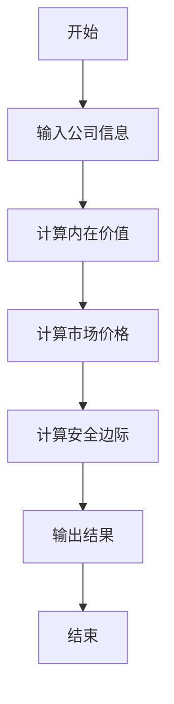

                 


# 价值投资的核心原则：安全边际

> 关键词：价值投资、安全边际、投资策略、风险管理、市场分析、投资决策

> 摘要：本书深入探讨了价值投资的核心原则，特别是安全边际的概念。通过详细分析安全边际的定义、计算方法及其在投资决策中的应用，本书帮助投资者理解如何在不确定的市场中做出明智的投资决策。结合数学模型、算法原理和实际案例，本书为投资者提供了一套系统的方法论，以确保投资的安全性和收益性。

---

## 第一部分: 价值投资的核心概念与安全边际

### 第1章: 价值投资的起源与发展

#### 1.1 价值投资的定义与核心理念
- 价值投资的定义
- 价值投资的核心理念：寻找被市场低估的资产
- 价值投资与其它投资策略的区别

#### 1.2 安全边际的定义与作用
- 安全边际的定义
- 安全边际在价值投资中的重要性
- 安全边际与投资风险的关系

### 第2章: 安全边际的核心原理

#### 2.1 内在价值的计算方法
- 内在价值的定义
- 内在价值的计算公式
- 内在价值与市场价值的对比

#### 2.2 安全边际的宽度
- 安全边际的计算方法
- 安全边际与投资回报的关系
- 安全边际的动态调整

## 第二部分: 安全边际的数学模型与算法

### 第3章: 内在价值的数学模型

#### 3.1 内在价值的现值公式
$$ V = \sum_{t=1}^{n} \frac{CF_t}{(1 + r)^t} $$
其中，$V$ 是内在价值，$CF_t$ 是第 $t$ 年的现金流，$r$ 是折现率。

#### 3.2 内在价值与市场价值的对比
- 内在价值的计算步骤
- 市场价值的影响因素
- 安全边际的计算公式
$$ \text{安全边际} = \text{内在价值} - \text{市场价格} $$

### 第4章: 安全边际的算法实现

#### 4.1 安全边际算法的流程图


#### 4.2 Python实现的安全边际算法
```python
def calculate_intrinsic_value(company_info):
    # 计算现金流
    cash_flows = company_info['cash_flows']
    discount_rate = company_info['discount_rate']
    # 现值计算
    intrinsic_value = sum(cash_flow / (1 + discount_rate)**t for t, cash_flow in enumerate(cash_flows))
    return intrinsic_value

def calculate_margin_of_safety(company_info):
    intrinsic_value = calculate_intrinsic_value(company_info)
    market_price = company_info['market_price']
    margin_of_safety = intrinsic_value - market_price
    return margin_of_safety

# 示例用法
company_info = {
    'cash_flows': [100, 120, 150],
    'discount_rate': 0.1,
    'market_price': 80
}
margin_of_safety = calculate_margin_of_safety(company_info)
print(f"安全边际为：{margin_of_safety}")
```

## 第三部分: 安全边际在投资策略中的应用

### 第5章: 安全边际与投资决策

#### 5.1 安全边际在股票投资中的应用
- 股票估值的三要素
- 安全边际与股票买入点的确定
- 安全边际与股票卖出点的确定

#### 5.2 安全边际与风险控制
- 风险控制的基本原则
- 安全边际与止损策略
- 安全边际与投资组合管理

### 第6章: 安全边际与市场周期

#### 6.1 市场周期的基本特征
- 市场周期的定义
- 市场周期与投资决策的关系
- 不同市场周期中的安全边际策略

#### 6.2 安全边际与市场波动
- 市场波动对安全边际的影响
- 安全边际与市场恐慌的关系
- 安全边际与市场复苏的关系

## 第四部分: 系统分析与架构设计

### 第7章: 投资决策系统的构建

#### 7.1 系统功能设计
- 数据收集模块
- 数据分析模块
- 投资决策模块

#### 7.2 系统架构设计


#### 7.3 系统接口设计
- 数据接口：获取公司财务数据
- 分析接口：计算内在价值和安全边际
- 决策接口：生成投资建议

## 第五部分: 项目实战与案例分析

### 第8章: 安全边际的实战应用

#### 8.1 项目环境安装
- 安装必要的Python库：pandas、numpy、scipy

#### 8.2 核心代码实现
```python
import pandas as pd
import numpy as np

def calculate_intrinsic_value(finance_data, discount_rate):
    cash_flows = finance_data['现金流']
    return np.npv(discount_rate, cash_flows)

def calculate_margin_of_safety(intrinsic_value, market_price):
    return intrinsic_value - market_price

# 示例数据
finance_data = {
    '现金流': [100, 120, 150],
    '市场价': 80
}
discount_rate = 0.1

intrinsic_value = calculate_intrinsic_value(finance_data, discount_rate)
margin_of_safety = calculate_margin_of_safety(intrinsic_value, finance_data['市场价'])
print(f"内在价值：{intrinsic_value:.2f}")
print(f"安全边际：{margin_of_safety:.2f}")
```

#### 8.3 实际案例分析
- 以苹果公司为例，分析其内在价值和安全边际
- 讨论市场波动对安全边际的影响
- 制定基于安全边际的投资策略

## 第六部分: 最佳实践与小结

### 第9章: 安全边际的最佳实践

#### 9.1 投资策略的制定
- 长期投资与价值投资的关系
- 安全边际的动态调整
- 不同市场环境下的策略调整

#### 9.2 小结与注意事项
- 安全边际的重要性
- 投资中的常见误区
- 风险管理的核心地位

## 附录

### 附录A: 术语表
- 术语解释

### 附录B: 进一步阅读的推荐书目
- 价值投资经典书籍推荐

---

# 作者：AI天才研究院/AI Genius Institute & 禅与计算机程序设计艺术 /Zen And The Art of Computer Programming

