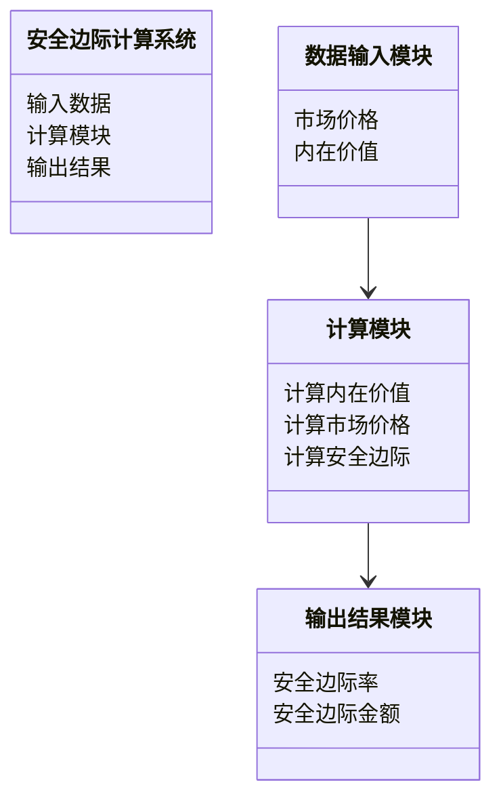
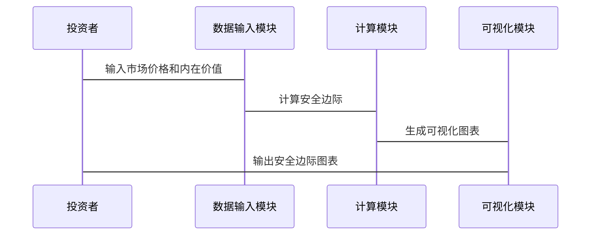

                 


# 价值投资的核心原则：安全边际理论解析

> 关键词：价值投资，安全边际，资产定价，投资风险，内在价值

> 摘要：本文深入解析了价值投资中的核心原则——安全边际理论，从理论基础、数学模型、系统分析到实际应用，全面探讨了安全边际在投资决策中的重要性及其具体应用方法。

---

## 第1章: 价值投资与安全边际概述

### 1.1 价值投资的基本概念

#### 1.1.1 投资的定义与分类
- 投资是通过购买资产以期获得未来收益的行为。
- 资产分类：实物资产（房地产、设备等）、金融资产（股票、债券、基金等）、无形资产（专利、品牌等）。

#### 1.1.2 价值投资的起源与发展
- 价值投资起源于20世纪初，由本杰明·格雷厄姆和戴维·多德提出。
- 核心思想：寻找市场价格低于内在价值的资产进行投资。

#### 1.1.3 安全边际在价值投资中的地位
- 安全边际是价值投资的核心原则之一，用于衡量市场价格与内在价值之间的差异。
- 通过安全边际，投资者可以降低投资风险，确保在市场波动中获得超额收益。

### 1.2 安全边际的定义与特征

#### 1.2.1 安全边际的定义
- 安全边际 = 内在价值 - 市场价格。
- 安全边际越大，投资的潜在收益越高，风险越小。

#### 1.2.2 安全边际的核心属性对比表格
| 属性         | 安全边际 |
|--------------|----------|
| 定义         | 内在价值 - 市场价格 |
| 作用         | 降低投资风险 |
| 计算公式     | 安全边际 = 内在价值 - 市场价格 |
| 应用领域     | 价值投资、资产定价 |

#### 1.2.3 安全边际的可视化ER实体关系图
```mermaid
erDiagram
    安全边际 <--- 内在价值
    安全边际 <--- 市场价格
```

### 1.3 安全边际的数学模型与公式

#### 1.3.1 安全边际率的计算公式
$$ \text{安全边际率} = \frac{\text{市场价格}}{\text{内在价值}} $$

#### 1.3.2 安全边际金额的计算公式
$$ \text{安全边际金额} = \text{内在价值} - \text{市场价格} $$

### 1.4 安全边际的经济意义

#### 1.4.1 安全边际作为风险控制工具
- 通过安全边际，投资者可以量化投资风险，确保投资决策的稳健性。

#### 1.4.2 安全边际在资产定价中的作用
- 安全边际反映了市场价格与内在价值之间的差异，是资产定价的重要参考指标。

#### 1.4.3 安全边际与投资回报的关系
- 安全边际越大，投资回报的潜在空间越大，投资风险越低。

### 1.5 本章小结
- 价值投资的核心原则是寻找市场价格低于内在价值的资产。
- 安全边际是衡量投资风险和潜在回报的重要指标。
- 通过安全边际，投资者可以在市场波动中保持稳健的投资策略。

---

## 第2章: 安全边际的理论基础

### 2.1 资本资产定价模型（CAPM）

#### 2.1.1 CAPM的基本原理
- CAPM用于计算资产的预期收益，公式为：
$$ \text{预期收益} = r_f + \beta (r_m - r_f) $$

#### 2.1.2 CAPM与安全边际的关系
- 安全边际可以通过比较市场价格与内在价值来衡量资产的预期收益。

#### 2.1.3 CAPM的公式与应用
- 通过CAPM计算预期收益，结合安全边际进行投资决策。

### 2.2 时间价值与资金的时间价值

#### 2.2.1 资金的时间价值公式
$$ FV = PV \times (1 + r)^n $$

#### 2.2.2 时间价值对安全边际的影响
- 时间价值影响内在价值的计算，进而影响安全边际的大小。

### 2.3 风险与收益的平衡

#### 2.3.1 风险的定义与分类
- 风险是投资收益的不确定性，分为系统性风险和非系统性风险。

#### 2.3.2 风险与收益的权衡
- 高风险资产通常具有较高的预期收益，但需要通过安全边际进行风险控制。

#### 2.3.3 安全边际在风险控制中的应用
- 通过安全边际，投资者可以在高风险资产中寻找低风险高回报的投资机会。

### 2.4 本章小结
- CAPM和时间价值是安全边际理论的重要基础。
- 风险与收益的平衡是价值投资的核心原则之一。
- 通过安全边际，投资者可以在风险可控的前提下追求超额收益。

---

## 第3章: 安全边际的计算方法与应用

### 3.1 安全边际的计算步骤

#### 3.1.1 确定内在价值
- 内在价值是资产的未来现金流的现值，可以通过 discounted cash flow (DCF) 模型计算。

#### 3.1.2 计算市场价格
- 市场价格是资产当前的市场价格。

#### 3.1.3 计算安全边际率与金额
- 安全边际率 = 市场价格 / 内在价值
- 安全边际金额 = 内在价值 - 市场价格

### 3.2 安全边际的可视化分析

#### 3.2.1 安全边际的折线图分析
- 折线图展示不同资产的安全边际变化趋势。

#### 3.2.2 安全边际的柱状图对比
- 柱状图比较不同资产的安全边际大小。

#### 3.2.3 安全边际的散点图分布
- 散点图展示安全边际与资产回报率之间的关系。

### 3.3 安全边际在投资决策中的应用

#### 3.3.1 安全边际作为买入信号
- 当市场价格远低于内在价值时，安全边际较大，适合买入。

#### 3.3.2 安全边际作为卖出信号
- 当市场价格接近或超过内在价值时，安全边际较小，适合卖出。

#### 3.3.3 安全边际在资产配置中的作用
- 通过安全边际进行资产配置，优化投资组合的风险与收益。

### 3.4 本章小结
- 安全边际的计算步骤清晰，可以帮助投资者做出科学的投资决策。
- 可视化分析是理解安全边际的重要工具。
- 安全边际在投资决策中的应用广泛，是价值投资的核心原则之一。

---

## 第4章: 安全边际的系统分析与架构设计

### 4.1 系统分析框架

#### 4.1.1 投资决策场景介绍
- 系统用于帮助投资者计算安全边际，进行投资决策。

#### 4.1.2 系统功能需求分析
- 计算内在价值和市场价格。
- 计算安全边际率和金额。
- 可视化分析安全边际。

#### 4.1.3 系统功能的领域模型类图（Mermaid）



### 4.2 系统架构设计

#### 4.2.1 系统架构设计（Mermaid）

```mermaid
container 投资者 {
    投资者
}
container 价格数据 {
    市场价格
    内在价值
}
container 计算模块 {
    计算内在价值
    计算市场价格
    计算安全边际
}
container 可视化模块 {
    折线图
    柱状图
    散点图
}
```

### 4.3 系统接口设计

#### 4.3.1 输入接口
- 输入市场价格和内在价值。

#### 4.3.2 输出接口
- 输出安全边际率和金额。

### 4.4 系统交互设计（Mermaid序列图）



### 4.5 本章小结
- 系统架构清晰，功能模块明确。
- 可视化分析是系统的重要组成部分。
- 系统设计为投资者提供了科学的投资决策工具。

---

## 第5章: 项目实战——安全边际计算与分析

### 5.1 环境安装与配置

#### 5.1.1 安装Python环境
- 使用Anaconda安装Python 3.9及以上版本。

#### 5.1.2 安装依赖库
```bash
pip install numpy pandas matplotlib
```

### 5.2 核心代码实现

#### 5.2.1 计算内在价值
```python
import numpy as np
import pandas as pd
import matplotlib.pyplot as plt

def calculate_intrinsic_value(cash_flows, discount_rate):
    return np.sum(cash_flows / (1 + discount_rate) ** np.arange(len(cash_flows)))

# 示例数据
cash_flows = [100, 200, 300]
discount_rate = 0.1
intrinsic_value = calculate_intrinsic_value(cash_flows, discount_rate)
print(f"内在价值: {intrinsic_value}")
```

#### 5.2.2 计算安全边际
```python
def calculate_margin_of_safety(intrinsic_value, market_price):
    return intrinsic_value - market_price

market_price = 80
margin_of_safety = calculate_margin_of_safety(intrinsic_value, market_price)
print(f"安全边际金额: {margin_of_safety}")
```

#### 5.2.3 可视化分析
```python
plt.figure(figsize=(10, 6))
plt.plot(range(len(cash_flows)), cash_flows, label='现金流')
plt.xlabel('时间（年）')
plt.ylabel('现金流（万元）')
plt.title('现金流可视化')
plt.legend()
plt.show()
```

### 5.3 项目小结
- 通过Python代码实现安全边际的计算与可视化分析。
- 示例数据展示了安全边际在实际投资中的应用。
- 代码实现为投资者提供了便捷的投资决策工具。

---

## 第6章: 安全边际的最佳实践与注意事项

### 6.1 安全边际的计算注意事项
- 确保内在价值的计算准确，考虑所有未来现金流。
- 选择合理的折现率，避免高估或低估内在价值。

### 6.2 安全边际的可视化建议
- 使用折线图和柱状图展示安全边际的变化趋势。
- 通过散点图分析安全边际与资产回报率的关系。

### 6.3 投资策略的动态调整
- 定期重新计算安全边际，根据市场变化调整投资策略。
- 结合市场环境和经济周期，灵活运用安全边际理论。

### 6.4 风险管理与心理因素
- 保持风险意识，避免过度集中投资。
- 考虑投资者心理因素，避免情绪化决策。

### 6.5 本章小结
- 安全边际的计算和应用需要结合实际市场环境。
- 投资者应根据市场变化动态调整投资策略。
- 风险管理是价值投资的重要组成部分。

---

## 第7章: 总结与展望

### 7.1 总结
- 安全边际是价值投资的核心原则之一。
- 通过安全边际，投资者可以在市场波动中保持稳健的投资策略。
- 本文通过理论分析和实际案例，全面探讨了安全边际的应用方法。

### 7.2 展望
- 安全边际理论在金融科技领域的应用前景广阔。
- 随着人工智能技术的发展，安全边际的计算和分析将更加智能化和自动化。

---

## 作者：AI天才研究院/AI Genius Institute & 禅与计算机程序设计艺术/Zen And The Art of Computer Programming

---

### 内容总结：
- 本文深入解析了价值投资中的安全边际理论，从理论基础、数学模型、系统分析到实际应用，全面探讨了安全边际在投资决策中的重要性及其具体应用方法。
- 通过详细的技术博客文章，读者可以系统地了解安全边际的计算方法、可视化分析和实际应用案例。
- 本文为投资者提供了科学的投资决策工具，帮助他们在复杂多变的市场环境中实现稳健投资。

