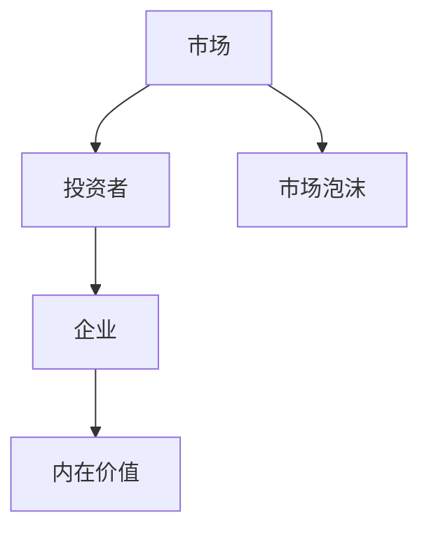

                 

# 《价值投资者如何应对市场泡沫》

---

**关键词**：价值投资、市场泡沫、风险管理、投资策略、内在价值、安全边际、投资心态

---

**摘要**：  
在市场泡沫的背景下，价值投资者如何通过基本面分析和长期策略实现稳健投资？本文从市场泡沫的定义、价值投资的核心理念出发，分析如何识别市场泡沫，并提供应对策略，帮助投资者在市场波动中保持理性，实现长期稳健的投资回报。

---

# 1. 引言

市场泡沫是金融市场中的常见现象，往往伴随着资产价格的剧烈波动。对于价值投资者而言，市场泡沫既是挑战也是机遇。本文旨在探讨价值投资者如何在市场泡沫中保持冷静，通过基本面分析和长期策略实现稳健投资。

---

# 2. 第一章：市场泡沫的定义与特征

## 2.1 市场泡沫的定义与成因

### 2.1.1 市场泡沫的定义

市场泡沫是指资产价格远高于其内在价值的现象，通常由市场情绪过热、资金过度流入等因素引发。

### 2.1.2 市场泡沫的形成机制

1. **资金推动**：大量资金流入市场，推高资产价格。
2. **市场情绪**：投资者乐观预期导致价格非理性上涨。
3. **羊群效应**：投资者盲目跟风，进一步放大泡沫。

### 2.1.3 历史案例分析

- **互联网泡沫（2000年）**：科技股价格虚高，最终泡沫破裂导致市场崩盘。
- **房地产泡沫（2008年）**：次贷危机引发全球金融危机。

---

## 2.2 价值投资的核心理念

### 2.2.1 价值投资的起源与发展

价值投资由本杰明·格雷厄姆提出，强调以低于内在价值的价格买入优质资产。

### 2.2.2 价值投资的核心原则

1. **安全边际**：买入价格低于内在价值。
2. **长期持有**：关注企业的长期价值，而非短期价格波动。
3. **基本面分析**：通过财务指标评估企业的盈利能力。

### 2.2.3 价值投资与市场周期的关系

价值投资者在市场低谷时买入，在市场高点时卖出，从而在周期中实现稳健收益。

---

## 2.3 价值投资者在市场泡沫中的角色

### 2.3.1 价值投资者的市场定位

价值投资者通常被视为市场的逆向投资者，能够在市场泡沫中找到低估资产。

### 2.3.2 价值投资者在市场泡沫中的优势

1. **理性判断**：能够识别泡沫，避免盲目跟风。
2. **长期视角**：注重企业的长期价值，不被短期波动影响。

### 2.3.3 价值投资者面临的挑战

1. **市场压力**：在泡沫期间，优质资产价格被高估，难以找到合适的买入机会。
2. **情绪干扰**：市场情绪过热时，投资者可能因压力而做出非理性决策。

---

## 2.4 本章小结

本章介绍了市场泡沫的定义、成因及历史案例，并探讨了价值投资的核心理念及其在市场泡沫中的角色。价值投资者通过长期持有优质资产，在市场波动中实现稳健收益。

---

# 3. 第二章：价值投资与市场泡沫的核心概念

## 3.1 价值投资的核心要素

### 3.1.1 企业内在价值的定义

企业内在价值是企业在正常市场条件下所能创造的最大价值，通常通过 discounted cash flow（DCF）模型计算。

### 3.1.2 企业竞争优势的分析

竞争优势包括成本优势、品牌优势、技术优势等，是企业长期盈利能力的保障。

### 3.1.3 安全边际的计算方法

安全边际 = 内在价值 - 市场价格。

---

## 3.2 市场泡沫的识别与度量

### 3.2.1 市场估值的指标分析

1. **市盈率（P/E）**：股价与每股收益的比值。
2. **市净率（P/B）**：股价与每股净资产的比值。

### 3.2.2 市场情绪的度量方法

通过投资者情绪指数（如AAII）和媒体情绪分析，判断市场情绪是否过热。

### 3.2.3 市场泡沫的量化模型

使用历史估值指标和市场情绪指标构建多因子模型，判断市场是否处于泡沫状态。

---

## 3.3 价值投资与市场周期的关系

### 3.3.1 经济周期对投资的影响

经济周期分为衰退、复苏、过热和滞胀四个阶段，不同阶段适合的投资策略不同。

### 3.3.2 市场周期中的投资策略

1. **牛市**：增加风险资产配置。
2. **熊市**：增加防御性资产配置。

### 3.3.3 价值投资者如何应对周期波动

通过分散投资、长期持有和定期再平衡，降低周期波动对投资组合的影响。

---

## 3.4 核心概念对比表格

**表2-1: 价值投资与市场泡沫的核心要素对比**

| 概念                | 价值投资                   | 市场泡沫                 |
|---------------------|---------------------------|--------------------------|
| 核心目标            | 寻找低估资产                | 资产价格远高于内在价值   |
| 分析方法            | 基本面分析                  | 市场情绪与估值指标分析    |
| 投资策略            | 长期持有，安全边际          | 风险管理，分散投资        |
| 适用场景            | 市场低估阶段                | 市场高估阶段              |

---

## 3.5 ER实体关系图

---

## 3.6 本章小结

本章通过对比分析，明确了价值投资与市场泡沫的核心概念及其关系。价值投资者通过基本面分析和长期持有策略，在市场泡沫中实现稳健投资。

---

# 4. 第三章：价值投资的数学模型与公式

## 4.1 内在价值的计算模型

### 4.1.1 股权自由现金流模型

$$ \text{内在价值} = \sum_{t=1}^{n} \frac{\text{自由现金流}}{(1 + r)^t} + \frac{\text{终值}}{(1 + r)^n} $$

其中，r为折现率，n为预测期数。

### 4.1.2 股息贴现模型

$$ \text{内在价值} = \sum_{t=1}^{\infty} \frac{\text{股息}}{(1 + r)^t} $$

---

## 4.2 安全边际的计算公式

$$ \text{安全边际} = \text{内在价值} - \text{市场价格} $$

---

## 4.3 市场估值的指标分析

### 4.3.1 市盈率（P/E）公式

$$ P/E = \frac{\text{股价}}{\text{每股收益}} $$

### 4.3.2 市净率（P/B）公式

$$ P/B = \frac{\text{股价}}{\text{每股净资产}} $$

---

## 4.4 价值投资的数学案例分析

### 4.4.1 案例一：企业内在价值计算

假设某企业未来5年的自由现金流分别为100、120、140、160、180万元，折现率为10%。计算其内在价值：

$$ \text{内在价值} = \frac{100}{1.1} + \frac{120}{1.1^2} + \frac{140}{1.1^3} + \frac{160}{1.1^4} + \frac{180}{1.1^5} $$

计算结果为约489.47万元。

### 4.4.2 案例二：安全边际的应用

假设某股票的市场价格为50元，其内在价值为60元，则安全边际为10元。这意味着该股票具有10元的安全空间，值得买入。

---

## 4.5 本章小结

本章通过数学模型和案例分析，展示了如何通过基本面分析计算内在价值，并利用安全边际判断投资机会。

---

# 5. 第四章：市场泡沫的识别与应对策略

## 5.1 市场泡沫的识别

### 5.1.1 识别市场泡沫的关键指标

1. **市盈率与历史均值的偏离**：当市盈率远高于历史均值时，市场可能处于泡沫状态。
2. **市场情绪指标**：投资者情绪过于乐观时，市场可能被高估。

### 5.1.2 市场泡沫的阶段划分

1. **初期阶段**：资产价格上涨，市场情绪乐观。
2. **膨胀阶段**：价格持续上涨，市场参与者增多。
3. **顶峰阶段**：价格远高于内在价值，市场参与者蜂拥而入。
4. **破裂阶段**：价格突然下跌，市场情绪转向悲观。

---

## 5.2 应对市场泡沫的策略

### 5.2.1 短期策略

1. **减少风险资产配置**：降低股票等高风险资产的比例。
2. **增加现金持有**：在市场泡沫期间，持有现金可以避免损失。

### 5.2.2 长期策略

1. **长期持有优质资产**：选择具有强大竞争优势的企业，长期持有。
2. **定期再平衡**：根据市场变化，定期调整投资组合。

---

## 5.3 案例分析：互联网泡沫

### 5.3.1 互联网泡沫的背景

2000年互联网泡沫破裂前，科技股价格被高估，市场情绪过于乐观。

### 5.3.2 价值投资者的应对策略

价值投资者在泡沫期间选择持有优质科技企业，避免被高估的股票，最终在市场回归理性后实现收益。

---

## 5.4 本章小结

本章通过分析市场泡沫的识别方法和应对策略，强调了在市场泡沫中保持冷静、理性决策的重要性。

---

# 6. 第五章：价值投资中的风险管理与投资心态

## 6.1 风险管理的重要性

### 6.1.1 风险管理的定义

风险管理是指识别、评估和控制投资中的风险，以降低潜在损失。

### 6.1.2 风险管理的核心策略

1. **分散投资**：通过投资不同资产和行业降低风险。
2. **止损策略**：设定止损点，避免亏损过大。

---

## 6.2 投资心态的培养

### 6.2.1 投资心态的定义

投资心态是指投资者在市场波动中的心理状态和决策方式。

### 6.2.2 长期投资心态的培养

1. **保持耐心**：避免频繁交易，专注于长期价值。
2. **控制情绪**：在市场波动中保持冷静，避免情绪化决策。

---

## 6.3 案例分析：房地产泡沫

### 6.3.1 房地产泡沫的背景

2008年全球金融危机前，房地产市场价格被高估，市场情绪过于乐观。

### 6.3.2 价值投资者的应对策略

价值投资者选择持有优质房地产企业的股票，避免被高估的房地产资产，最终在市场回归理性后实现收益。

---

## 6.4 本章小结

本章强调了风险管理与投资心态在价值投资中的重要性，帮助投资者在市场泡沫中保持冷静，实现长期稳健投资。

---

# 7. 第六章：价值投资的未来展望与应对策略

## 7.1 未来市场环境的挑战

### 7.1.1 技术进步对投资的影响

人工智能和大数据技术将改变投资方式，提供更多投资机会。

### 7.1.2 全球化与地缘政治风险

全球化进程中的地缘政治风险可能影响市场稳定性。

---

## 7.2 未来价值投资的应对策略

### 7.2.1 技术驱动的投资机会

利用人工智能和大数据技术，提高投资决策的效率和准确性。

### 7.2.2 应对地缘政治风险的策略

通过分散投资和风险对冲，降低地缘政治风险对投资组合的影响。

---

## 7.3 本章小结

本章展望了未来市场环境的挑战，并提出了应对策略，帮助投资者在复杂市场中实现稳健投资。

---

# 8. 结论

价值投资者在市场泡沫中通过基本面分析和长期持有策略，能够在市场波动中实现稳健投资。面对未来市场的不确定性，投资者需要保持冷静，注重风险管理，抓住技术驱动的投资机会，实现长期稳健的收益。

---

# 9. 附录

## 9.1 估值工具推荐

1. **Excel估值模型**：用于计算内在价值。
2. **金融数据分析平台**：如 Bloomberg 和 Morningstar。

## 9.2 相关书籍推荐

1. 《The Intelligent Investor》 - 本杰明·格雷厄姆
2. 《The Art of Value Investing》 - 著名投资经理Guy Spier的著作。

## 9.3 在线课程推荐

1. Coursera上的“投资学基础”课程。
2. edX上的“价值投资入门”课程。

---

# 作者：AI天才研究院/AI Genius Institute & 禅与计算机程序设计艺术 /Zen And The Art of Computer Programming

---

**致谢**：感谢读者的耐心阅读，希望本文能为价值投资者在应对市场泡沫中提供有益的见解和策略。

