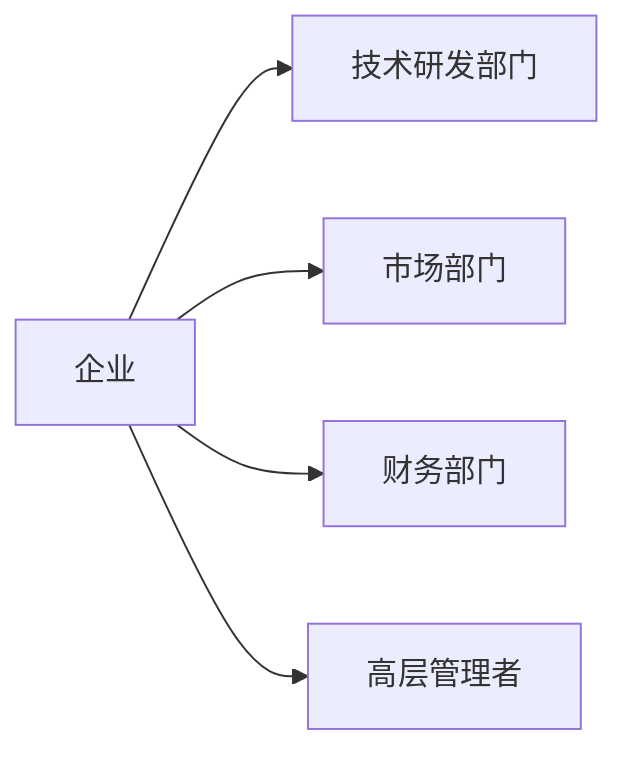
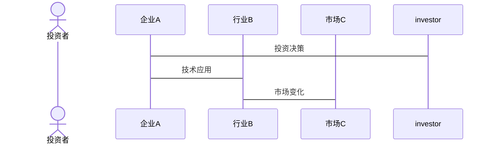
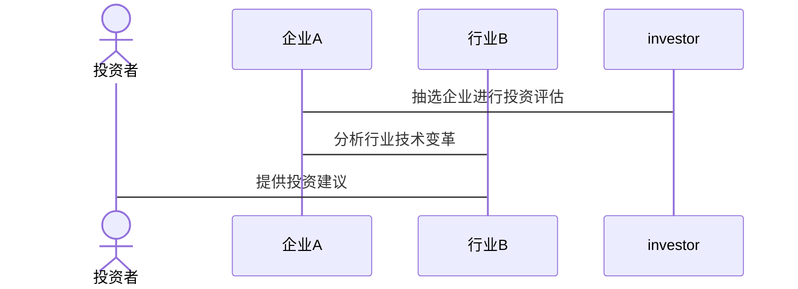

                 


```markdown
# 价值投资者如何应对技术颠覆和行业变革

> 关键词：价值投资、技术颠覆、行业变革、投资策略、系统架构、经济学模型、案例分析

> 摘要：  
本文探讨了在技术快速变革的时代，价值投资者如何识别和应对行业变革中的机遇与挑战。通过分析技术颠覆的核心机制、构建经济学模型、设计投资策略框架、案例分析和系统架构设计，本文为价值投资者提供了在技术变革中保持竞争优势的系统性方法。

---

## 第1章 技术颠覆与行业变革的背景

### 1.1 技术颠覆的定义与特征

#### 1.1.1 技术颠覆的定义
技术颠覆是指新技术的出现和应用，导致原有行业模式、商业模式或竞争优势发生根本性改变。技术颠覆不仅影响企业的运营方式，还可能重构整个行业的生态。

#### 1.1.2 技术颠覆的核心特征
- **破坏性**：新技术可能淘汰旧技术，导致原有企业失去竞争优势。
- **非线性发展**：技术颠覆往往以指数级速度扩散，影响范围广。
- **跨界性**：技术颠覆通常来自跨行业的创新，具有跨领域特征。

#### 1.1.3 技术颠覆与行业变革的关系
技术颠覆是行业变革的核心驱动力。行业变革是指行业内发生的结构性变化，而技术颠覆则是这些变化的主要来源。

### 1.2 技术颠覆对企业的影响

#### 1.2.1 技术颠覆对企业竞争优势的影响
- 技术颠覆可能导致企业原有竞争优势丧失，例如传统制造业被智能化生产颠覆。
- 新技术的应用可能为企业创造新的竞争优势，例如大数据分析能力。

#### 1.2.2 技术颠覆对企业商业模式的冲击
- 技术颠覆可能改变企业的收入来源，例如从产品销售转向订阅服务。
- 技术颠覆可能导致企业成本结构发生变化，例如从固定成本转向可变成本。

#### 1.2.3 技术颠覆对企业价值评估的挑战
- 技术颠覆使得传统估值方法失效，需要引入新的评估模型。
- 新技术的应用可能增加企业的未来收益，但也伴随着更大的不确定性。

### 1.3 价值投资的核心理念

#### 1.3.1 价值投资的定义
价值投资是一种投资策略，强调以低于公平价值的价格买入具有长期竞争优势的企业。

#### 1.3.2 价值投资的基本原则
- 买入低估的企业。
- 长期持有优质资产。
- 以安全边际为导向。

#### 1.3.3 价值投资与技术变革的关系
- 技术变革为价值投资提供了新的机会，但也带来了更大的挑战。
- 价值投资者需要识别技术变革中的结构性机会，同时避免短期波动带来的风险。

### 1.4 本章小结
本章从技术颠覆的定义、特征以及对企业的影响入手，探讨了技术变革对价值投资的挑战和机遇。价值投资者需要在技术变革中保持敏锐的洞察力，识别真正具有长期竞争优势的企业。

---

## 第2章 技术颠覆的经济学分析

### 2.1 技术颠覆的经济学原理

#### 2.1.1 技术创新与市场结构的关系
- 技术创新可能导致市场结构的变化，例如从寡头垄断转向完全竞争。
- 技术创新可能降低市场的进入壁垒，促进竞争。

#### 2.1.2 技术颠覆的成本-收益分析
- 技术颠覆的成本包括研发成本、转型成本等。
- 技术颠覆的收益包括效率提升、市场份额扩大等。

#### 2.1.3 技术颠覆的市场渗透曲线
- 技术颠覆的市场渗透曲线描述了新技术在市场中的扩散过程。
- 曲线分为五个阶段：引入期、增长期、成熟期、衰退期。

### 2.2 技术颠覆的经济学模型构建

#### 2.2.1 技术颠覆的经济学模型框架
- 假设：新技术的出现将导致市场需求的变化。
- 变量：市场需求量、企业成本、市场价格。
- 模型：基于供需关系的动态模型。

#### 2.2.2 技术颠覆的市场渗透曲线


#### 2.2.3 技术颠覆的经济影响评估
- 技术颠覆可能导致部分企业倒闭，但也可能促进整体经济效率的提升。

### 2.3 技术颠覆的经济学案例分析

#### 2.3.1 数字技术对传统行业的颠覆
- 电子商务对传统零售业的颠覆。
- 数字支付对传统银行业的影响。

#### 2.3.2 新兴技术对企业价值的影响
- 人工智能技术对企业效率的提升。
- 区块链技术对信任机制的重塑。

#### 2.3.3 技术颠覆的经济学启示
- 技术变革是不可逆转的趋势。
- 价值投资者需要具备技术敏感性和经济洞察力。

### 2.4 本章小结
本章从经济学的角度分析了技术颠覆的内在机制和市场影响。通过构建经济学模型和案例分析，本文揭示了技术变革对企业价值的深远影响。

---

## 第3章 行业变革中的价值投资策略

### 3.1 行业变革中的价值投资框架

#### 3.1.1 行业变革的识别与分析
- 识别行业变革的关键指标：市场增长率、技术渗透率、竞争格局变化。
- 分析行业变革的驱动因素：技术进步、政策变化、市场需求变化。

#### 3.1.2 行业变革中的投资机会
- 识别具有长期竞争优势的企业。
- 投资于技术变革中的结构性机会。

#### 3.1.3 行业变革中的投资风险
- 技术变革可能导致企业竞争优势丧失。
- 技术变革具有不确定性，可能引发市场波动。

### 3.2 行业变革中的企业竞争优势分析

#### 3.2.1 企业核心竞争力的评估
- 核心竞争力的定义：企业在市场中能够持续提供价值的能力。
- 核心竞争力的评估维度：技术创新能力、成本控制能力、品牌影响力。

#### 3.2.2 行业变革中竞争优势的变化
- 技术变革可能导致企业竞争优势的转移。
- 技术变革可能增强企业的竞争优势。

#### 3.2.3 企业应对行业变革的策略
- 加大研发投入，保持技术领先。
- 提升组织灵活性，适应市场变化。
- 建立合作伙伴关系，形成生态系统。

### 3.3 行业变革中的投资组合管理

#### 3.3.1 投资组合的构建与优化
- 根据市场变化调整投资组合。
- 保持投资组合的分散化，降低风险。

#### 3.3.2 行业变革中的风险分散策略
- 分散投资于不同行业，降低行业风险。
- 投资于具有防御性的行业，规避周期性波动。

#### 3.3.3 行业变革中的投资时机选择
- 选择技术变革初期进入市场，获取超额收益。
- 避免在技术变革的后期投资，防止泡沫破裂。

### 3.4 本章小结
本章从投资策略的角度，探讨了行业变革中价值投资者应该如何构建投资组合，识别投资机会，并管理投资风险。

---

## 第4章 技术颠覆与行业变革的系统分析与架构设计

### 4.1 技术颠覆与行业变革的系统分析

#### 4.1.1 技术颠覆的系统模型构建
- 问题场景：新技术的出现对企业、行业和市场的系统性影响。
- 系统功能设计：企业如何适应技术变革，行业的生态系统如何重构。
- 系统架构设计：企业内部的技术变革管理架构。

#### 4.1.2 技术颠覆的系统架构设计


#### 4.1.3 技术颠覆的系统接口设计
- 技术研发部门与市场部门的接口：技术应用需求传递。
- 市场部门与财务部门的接口：成本收益分析。
- 高层管理者与各部门的接口：战略决策。

#### 4.1.4 技术颠覆的系统交互流程


### 4.2 技术颠覆的系统架构设计

#### 4.2.1 系统功能设计
- 技术研发模块：企业内部技术研发能力。
- 市场分析模块：市场变化的实时监控。
- 投资评估模块：技术变革对投资的影响。

#### 4.2.2 系统架构设计


#### 4.2.3 系统接口设计
- 技术研发模块与市场分析模块的接口：技术应用数据传递。
- 市场分析模块与投资评估模块的接口：市场变化数据传递。

#### 4.2.4 系统交互流程


### 4.3 本章小结
本章从系统架构设计的角度，探讨了技术颠覆对企业、行业和市场的系统性影响。通过构建系统模型和交互流程，本文为价值投资者提供了分析技术变革的系统性方法。

---

## 第5章 项目实战：技术颠覆与行业变革的案例分析

### 5.1 项目介绍

#### 5.1.1 项目背景
- 技术背景：人工智能技术的发展及其对传统行业的颠覆。
- 行业背景：传统制造业的智能化转型。

#### 5.1.2 项目目标
- 分析人工智能技术对传统制造业的影响。
- 探讨传统制造企业的应对策略。
- 提供价值投资者的投资建议。

### 5.2 系统核心实现源代码

#### 5.2.1 技术分析模块
```python
def analyze_technology(technology, industry):
    # 分析技术对行业的影响
    impact = assess_impact(technology, industry)
    return impact
```

#### 5.2.2 投资评估模块
```python
def evaluate_investment(enterprise, impact):
    # 评估投资价值
    value = calculate_value(enterprise, impact)
    return value
```

### 5.3 代码应用解读与分析

#### 5.3.1 技术分析模块解读
- 输入：技术名称和行业名称。
- 输出：技术对行业的具体影响，例如效率提升、成本降低等。

#### 5.3.2 投资评估模块解读
- 输入：企业信息和技术创新的影响。
- 输出：企业的投资价值评估结果。

### 5.4 实际案例分析

#### 5.4.1 技术颠覆的案例分析
- 案例：人工智能技术在制造业的应用。
- 分析：人工智能技术如何改变制造业的生产流程和管理模式。

#### 5.4.2 投资策略的案例分析
- 案例：某传统制造企业投资人工智能技术。
- 分析：该企业如何通过技术投资提升竞争力，创造投资价值。

### 5.5 本章小结
本章通过项目实战，具体分析了技术颠覆对行业的影响，并提供了价值投资者的投资策略建议。

---

## 第6章 最佳实践与总结

### 6.1 技术颠覆与行业变革的应对策略

#### 6.1.1 保持技术敏感性
- 关注新兴技术的发展，识别技术变革的趋势。

#### 6.1.2 加强竞争优势分析
- 定期评估企业的竞争优势，及时调整投资策略。

#### 6.1.3 优化投资组合管理
- 根据技术变革调整投资组合，分散投资风险。

### 6.2 投资者注意事项

#### 6.2.1 注意技术变革的不确定性
- 技术变革具有不确定性，需要谨慎评估投资风险。

#### 6.2.2 保持长期投资视角
- 技术变革可能导致短期市场波动，但长期投资仍需关注企业的核心竞争力。

#### 6.2.3 关注政策与市场环境
- 技术变革往往与政策变化相关，需要关注政策环境的变化。

### 6.3 未来展望

#### 6.3.1 技术变革的趋势
- 新兴技术的持续发展，如人工智能、区块链等。

#### 6.3.2 价值投资的未来
- 技术变革为价值投资提供了新的机遇，但同时也带来了更大的挑战。

### 6.4 本章小结
本章总结了技术颠覆与行业变革的应对策略，提出了投资者需要注意的事项，并对未来的技术变革和价值投资趋势进行了展望。

---

## 作者：AI天才研究院/AI Genius Institute & 禅与计算机程序设计艺术/Zen And The Art of Computer Programming

---

**注意：以上内容为示例，实际撰写时需要根据具体情况进行补充和调整。**
```

