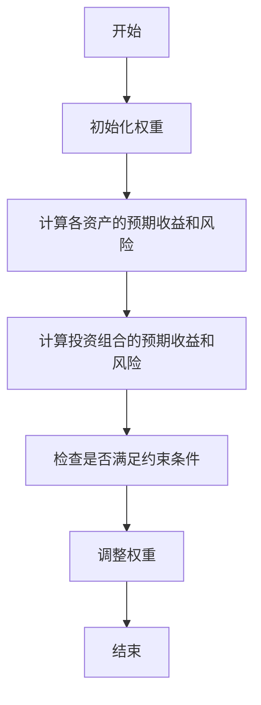
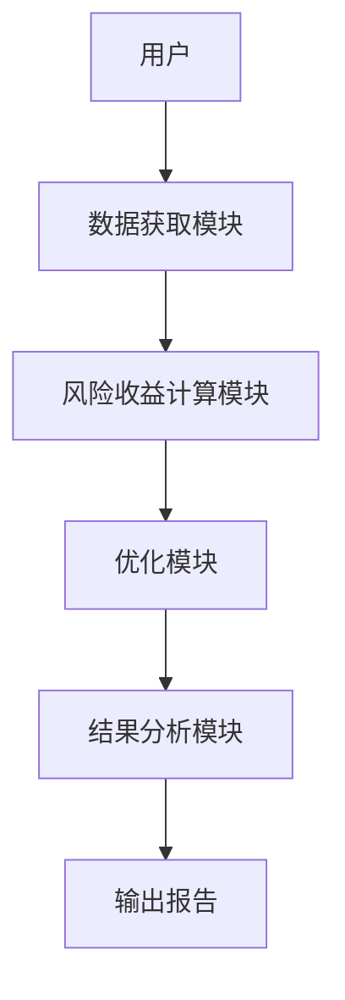

                 


# 《价值投资者如何构建多元化投资组合》

---

## 关键词：价值投资，多元化投资，资产配置，风险分散，投资组合优化，现代投资组合理论

---

## 摘要：  
本文从价值投资的核心理念出发，系统地探讨了如何通过资产配置和风险分散来构建一个高效的多元化投资组合。通过结合现代投资组合理论（MPT）和实际案例分析，本文详细阐述了投资组合优化的数学模型、算法实现以及系统架构设计，为读者提供了从理论到实践的完整指南。文章还结合Python代码示例，深入分析了投资组合优化的实现细节，并通过实际案例展示了如何在复杂的投资环境中实现风险与收益的最优平衡。

---

# 第一部分: 价值投资与多元化投资组合基础

---

## 第1章: 价值投资的核心理念

### 1.1 价值投资的基本概念

#### 1.1.1 投资的本质与目标  
投资的本质是通过配置资源（如资金）以获得未来收益的过程。其核心目标是实现资产的保值与增值，同时在可控的风险范围内获取最大化的收益。

#### 1.1.2 价值投资的定义与特点  
价值投资是一种以基本面分析为基础的投资策略，强调以低于内在价值的价格购买优质资产。其特点包括：长期导向、注重安全边际、精选优质资产。

#### 1.1.3 价值投资与其它投资理念的区别  
与短期投机、技术分析等投资理念不同，价值投资更注重企业的内在价值和长期潜力，强调深度研究和长期持有。

---

### 1.2 多元化投资组合的重要性

#### 1.2.1 多元化投资的定义  
多元化投资是指通过将资金分配到不同的资产类别、行业或地理区域，以降低投资组合的整体风险。

#### 1.2.2 多元化投资的优势与劣势  
优势：分散风险、平滑波动、捕捉不同资产的收益机会。劣势：复杂性增加、管理成本上升。

#### 1.2.3 多元化投资与风险控制的关系  
多元化投资是降低非系统性风险（特定资产或行业的风险）的有效手段，但无法完全消除系统性风险（如经济衰退）。

---

### 1.3 当前投资环境与挑战

#### 1.3.1 经济周期对投资的影响  
经济周期波动会影响企业盈利能力和资产价格，投资者需根据周期阶段调整资产配置。

#### 1.3.2 市场波动与投资风险  
市场波动性增加投资组合的风险，需要通过多元化和动态调整来应对。

#### 1.3.3 全球化背景下的投资机会  
全球化提供了更多资产类别和地理区域的投资选择，但也增加了复杂性。

---

### 1.4 构建多元化投资组合的框架

#### 1.4.1 投资目标的设定  
明确投资目标是构建投资组合的第一步，包括收益目标、风险承受能力和投资期限。

#### 1.4.2 资产配置的原则  
根据投资目标和风险偏好，确定股票、债券、现金等各类资产的配置比例。

#### 1.4.3 投资组合的再平衡策略  
定期对投资组合进行再平衡，确保配置比例与初始目标一致，适应市场变化。

---

# 第二部分: 多元化投资组合的核心概念与联系

---

## 第2章: 资产配置与风险分散

### 2.1 资产配置的原理

#### 2.1.1 资产配置的定义  
资产配置是指将资金分配到不同资产类别（如股票、债券、房地产等）的过程。

#### 2.1.2 不同资产类别之间的关系  
资产类别之间的相关性影响投资组合的风险和收益。低相关性资产可以有效分散风险。

#### 2.1.3 资产配置对投资组合风险的影响  
合理的资产配置可以降低投资组合的整体风险，同时平衡收益。

---

### 2.2 风险分散的策略

#### 2.2.1 风险分散的定义  
风险分散是指通过投资不同资产或资产类别来降低特定风险。

#### 2.2.2 不同资产类别在风险分散中的作用  
股票、债券、现金等不同资产类别在不同经济环境下表现不同，从而分散风险。

#### 2.2.3 风险分散与投资组合收益的关系  
分散化投资可以在一定范围内提高收益与风险的比率。

---

### 2.3 资产类别与风险收益特征对比

| 资产类别 | 风险 | 收益 |
|----------|------|------|
| 股票     | 高   | 高   |
| 债券     | 中   | 中   |
| 现金     | 低   | 低   |
| 房地产   | 中高 | 中高 |

---

### 2.4 投资组合优化的数学模型

$$ \text{目标函数：} \quad \min \sigma^2 \quad \text{在约束条件下} $$

其中，$\sigma^2$ 表示投资组合的方差，即风险。

---

### 2.5 投资组合优化的算法流程图



---

## 第3章: 现代投资组合理论（MPT）与投资组合优化

### 3.1 现代投资组合理论的核心思想

#### 3.1.1 投资组合理论的起源  
由Harry Markowitz于1952年提出，MPT通过数学模型优化投资组合的风险与收益。

#### 3.1.2 MPT的核心假设  
投资者是理性的，市场有效，资产收益服从正态分布。

---

### 3.2 投资组合优化的数学模型

$$ \text{优化目标：} \quad \min_w \, w^T \Sigma w \quad \text{在约束条件下} $$

其中，$w$ 是权重向量，$\Sigma$ 是协方差矩阵。

---

### 3.3 风险平价投资策略

#### 3.3.1 风险平价的定义  
风险平价是指在投资组合中，每种资产承担的风险相等。

#### 3.3.2 风险平价与传统资产配置的区别  
风险平价更注重风险的分散，而传统资产配置更注重资产类别比例。

---

### 3.4 投资组合优化的实现步骤

#### 3.4.1 数据收集  
收集各资产的历史收益率和风险数据。

#### 3.4.2 建立数学模型  
构建优化目标函数和约束条件。

#### 3.4.3 解决优化问题  
使用优化算法求解最优权重。

---

## 第4章: 多元化投资组合的系统架构设计

### 4.1 投资组合优化系统的功能设计

#### 4.1.1 数据获取模块  
从金融数据源获取资产价格和收益率数据。

#### 4.1.2 风险收益计算模块  
计算各资产的风险和收益指标。

#### 4.1.3 优化模块  
根据优化算法计算最优资产配置。

#### 4.1.4 结果分析模块  
分析优化结果并生成报告。

---

### 4.2 系统架构设计



---

## 第5章: 投资组合优化的Python实现

### 5.1 环境安装与配置

#### 5.1.1 安装必要的库  
安装`numpy`、`pandas`、`scipy`等库。

#### 5.1.2 数据获取与处理  
使用`pandas`读取数据并进行清洗。

---

### 5.2 核心实现代码

#### 5.2.1 数据预处理

```python
import numpy as np
import pandas as pd

# 示例数据：假设我们有三只股票的收益率
data = pd.DataFrame({
    '股票A': [0.05, 0.02, -0.01, 0.03],
    '股票B': [0.03, 0.04, -0.02, 0.01],
    '股票C': [0.02, 0.01, -0.03, 0.02]
})
```

#### 5.2.2 计算协方差矩阵

```python
cov_matrix = data.cov()
```

#### 5.2.3 优化模型实现

```python
from scipy.optimize import minimize

def portfolio_variance(weights, covariance_matrix):
    return (weights.T @ covariance_matrix @ weights).item()

# 初始权重（相等权重）
initial_weights = np.array([1/3, 1/3, 1/3])

# 约束条件：权重之和为1
cons = ({'type': 'eq', 'fun': lambda w: sum(w) - 1})

# 优化问题定义
result = minimize(portfolio_variance, initial_weights, args=cov_matrix, constraints=cons)

# 最优权重
optimal_weights = result.x
```

---

## 第6章: 实际案例分析与项目小结

### 6.1 案例分析：构建一个简单的投资组合

#### 6.1.1 数据准备  
假设我们有三只股票，目标是构建一个最低风险的投资组合。

#### 6.1.2 优化过程  
使用上述Python代码进行优化，得到最优权重。

#### 6.1.3 结果分析  
计算投资组合的预期收益和风险，与初始权重进行对比。

---

### 6.2 项目小结

#### 6.2.1 优化算法的有效性  
通过案例验证优化算法的有效性。

#### 6.2.2 系统设计的合理性  
分析系统架构设计的优缺点。

#### 6.2.3 实际投资中的注意事项  
提醒读者在实际投资中需考虑更多复杂因素，如交易成本、税收等。

---

# 第三部分: 最佳实践与拓展阅读

---

## 第7章: 投资组合管理的最佳实践

### 7.1 定期再平衡的重要性  
定期调整投资组合以维持目标配置比例。

### 7.2 风险管理的技巧  
使用止损、分散投资等方法控制风险。

### 7.3 税务优化的策略  
合理利用税收优惠政策降低投资成本。

---

## 第8章: 拓展阅读与学习资源

### 8.1 经典书籍推荐  
- 《投资学》（投资学教材）
- 《有效组合投资》（MPT相关书籍）

### 8.2 在线课程与工具  
推荐一些在线课程和金融分析工具，帮助读者进一步学习。

---

## 作者：AI天才研究院/AI Genius Institute & 禅与计算机程序设计艺术 /Zen And The Art of Computer Programming

