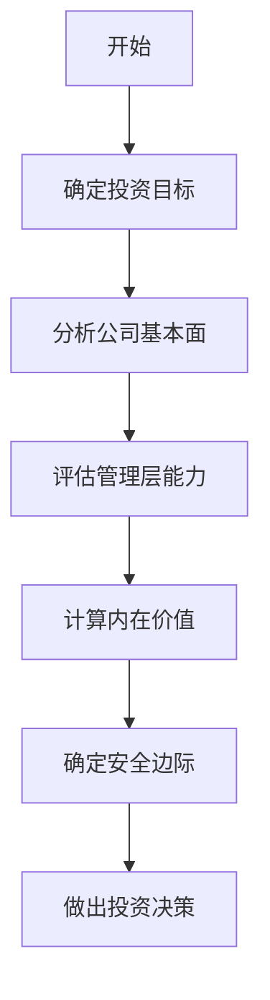
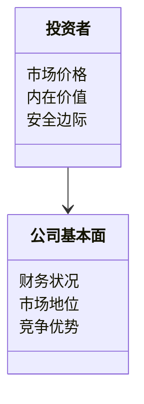

                 

# 价值投资者的耐心：巴菲特的可口可乐投资案例

## 关键词：
价值投资、巴菲特、可口可乐、投资策略、内在价值、安全边际

## 摘要：
本文深入分析了巴菲特对可口可乐的投资案例，揭示了价值投资的核心理念和策略。通过详细解析巴菲特的投资决策过程，包括公司的基本面分析、财务状况评估以及长期投资的数学模型，本文展示了如何通过耐心和系统的方法实现稳健的投资回报。文章还探讨了投资决策的系统架构，并结合实际案例提供实战指导，帮助读者理解价值投资的精髓。

---

# 第一部分: 价值投资者的耐心与巴菲特的投资理念

## 第1章: 价值投资的定义与核心理念

### 1.1 价值投资的起源与核心概念

#### 1.1.1 价值投资的定义
价值投资是一种投资策略，强调以低于内在价值的价格购买优质的公司。其核心在于寻找市场低估的公司，并长期持有，依靠复利效应实现财富增长。

#### 1.1.2 巴菲特的价值投资理念
巴菲特是价值投资的代表人物，他强调：
1. **购买优秀的公司**：选择具有强大竞争优势、良好财务状况和优秀管理层的企业。
2. **长期持有**：避免频繁交易，依靠复利效应实现收益。
3. **安全边际**：以低于内在价值的价格买入，降低投资风险。

#### 1.1.3 可口可乐作为价值投资的典型案例
可口可乐是巴菲特长期持有的经典案例，其强大的品牌、稳定的现金流和持续的盈利能力使其成为价值投资的理想标的。

---

## 第2章: 巴菲特的投资策略与可口可乐案例

### 2.1 巴菲特的选股标准

#### 2.1.1 公司的财务健康状况
巴菲特注重企业的盈利能力、现金流和资产负债表的健康。他通过分析财务报表识别企业的可持续竞争优势。

#### 2.1.2 行业地位与竞争优势
巴菲特偏好具有强大市场地位和竞争优势的公司。可口可乐作为全球饮料行业的领导者，拥有广泛的分销网络和品牌影响力。

#### 2.1.3 管理层的诚信与能力
巴菲特认为，优秀的管理层是企业成功的关键。可口可乐的管理层展现了卓越的经营能力和长期的股东价值创造。

### 2.2 可口可乐的投资分析

#### 2.2.1 可口可乐的市场地位与品牌价值
可口可乐是全球知名的饮料品牌，市场占有率高，品牌价值巨大。其品牌影响力为其提供了强大的竞争优势。

#### 2.2.2 公司的财务表现与盈利能力
可口可乐的财务报表显示稳定的收益和现金流，具备持续的盈利能力。巴菲特通过分析这些数据，确认其投资价值。

#### 2.2.3 投资决策的背景与过程
巴菲特在1988年首次投资可口可乐，当时公司股价被市场低估。通过深入分析公司基本面，巴菲特认为可口可乐具备长期增长潜力，决定进行长期投资。

---

## 第3章: 价值投资的数学模型与决策框架

### 3.1 内在价值的计算方法

#### 3.1.1 内在价值公式
$$ \text{内在价值} = \frac{\text{现金流}}{\text{折现率}} $$
巴菲特通过计算企业的未来现金流，折现到当前价值，评估其内在价值。

#### 3.1.2 可口可乐的现金流分析
通过对可口可乐未来现金流的预测和折现，巴菲特确认其内在价值高于市场价格，具备投资价值。

### 3.2 安全边际的计算与应用

#### 3.2.1 安全边际公式
$$ \text{安全边际} = \text{市场价格} \times (1 - \text{内在价值}) $$
安全边际反映了市场价格与内在价值的差距，为投资提供了风险缓冲。

#### 3.2.2 安全边际在可口可乐投资中的应用
巴菲特通过计算可口可乐的安全边际，确认其投资风险可控，具备长期持有的可行性。

---

## 第4章: 巴菲特投资决策的系统架构

### 4.1 投资决策的流程图

### 4.2 可口可乐投资的系统架构

---

## 第5章: 价值投资的实战与案例分析

### 5.1 可口可乐投资的实战步骤

#### 5.1.1 确定投资目标
选择具备长期竞争优势、财务健康、管理层优秀的公司。

#### 5.1.2 分析公司基本面
通过财务报表和行业分析，评估公司的盈利能力、市场地位和竞争优势。

#### 5.1.3 计算内在价值
使用现金流折现法计算企业的内在价值，确认其是否低于市场价格。

#### 5.1.4 确定安全边际
评估市场价格与内在价值的差距，确保投资风险可控。

### 5.2 实战案例分析

#### 5.2.1 投资决策流程
1. **目标确定**：选择可口可乐作为投资标的。
2. **基本面分析**：评估其财务状况、市场地位和管理层能力。
3. **内在价值计算**：使用现金流折现法确认其内在价值。
4. **安全边际评估**：确认投资风险可控。
5. **长期持有**：坚持价值投资理念，避免短期波动干扰。

---

## 第6章: 总结与展望

### 6.1 总结
巴菲特的可口可乐投资案例展示了价值投资的核心理念和策略。通过耐心和系统的方法，投资者可以在市场中实现稳健的投资回报。

### 6.2 展望
价值投资是一种长期策略，需要投资者具备耐心和纪律性。未来，随着市场的变化，价值投资的理念将继续指导投资者做出明智的投资决策。

---

## 作者：AI天才研究院/AI Genius Institute & 禅与计算机程序设计艺术 /Zen And The Art of Computer Programming

---

以上内容为《价值投资者的耐心：巴菲特的可口可乐投资案例》的完整目录和文章内容。文章详细分析了价值投资的核心理念、巴菲特的投资策略以及可口可乐的具体案例，结合数学模型和系统架构，为读者提供了全面的视角来理解价值投资的精髓。

