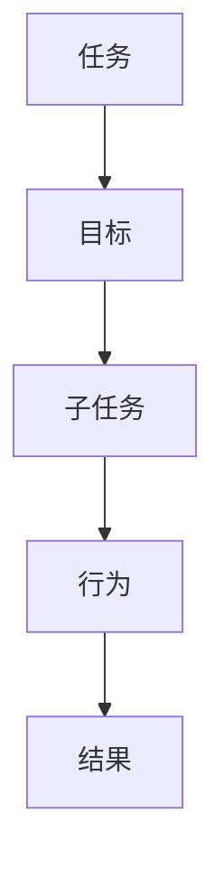
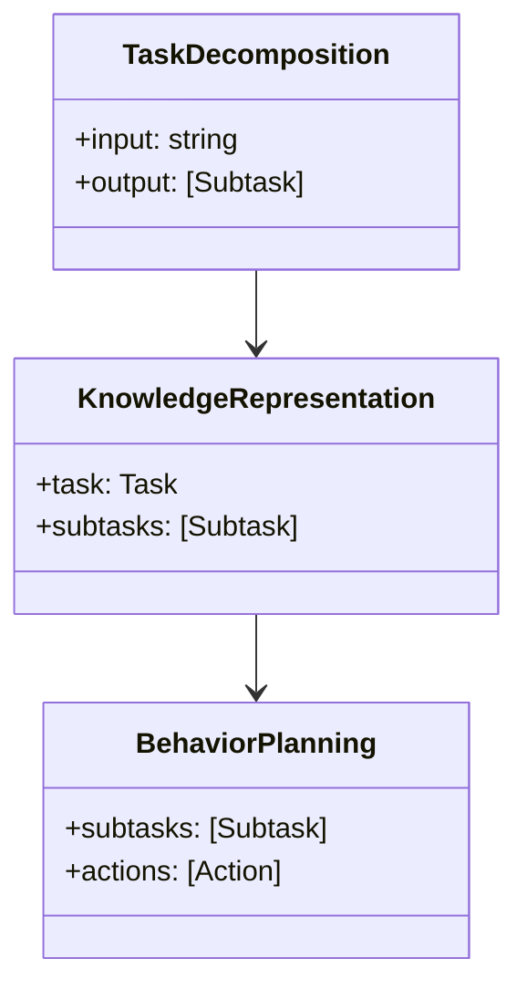
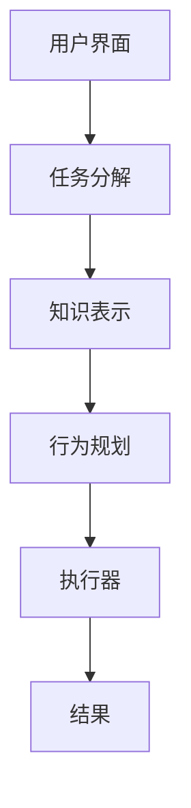

                 


# 任务导向型 AI Agent：基于 LLM 的目标完成系统

**关键词**：任务导向型AI Agent、大语言模型（LLM）、目标完成系统、AI系统设计、任务分解、强化学习、系统架构

**摘要**：  
任务导向型 AI Agent 是一种基于大语言模型（LLM）的智能系统，旨在通过明确的目标导向和任务分解，实现特定问题的高效解决。本文从背景介绍、核心概念、算法原理、系统架构、项目实战到最佳实践，全面解析任务导向型 AI Agent 的设计与实现。通过结合监督学习与强化学习，LLM 在任务完成中的应用将被深入探讨，同时提供实际案例和代码示例，帮助读者掌握这一前沿技术。

---

## 正文部分

### 第一部分：任务导向型 AI Agent 的背景与概念

#### 第1章：任务导向型 AI Agent 的概述

##### 1.1 问题背景与描述
在传统AI系统中，许多系统缺乏明确的目标导向性，难以高效完成特定任务。例如，聊天机器人虽然能够回答问题，但缺乏任务分解能力，无法根据目标调整行为。任务导向型 AI Agent 的出现，弥补了这一不足。

##### 1.2 任务导向型 AI Agent 的核心目标
任务导向型 AI Agent 的核心目标是通过分解任务、设定子目标，并利用大语言模型（LLM）的能力，高效完成特定任务。例如，在电商场景中，AI Agent 可以帮助用户完成产品推荐、订单跟踪等任务。

##### 1.3 与传统AI系统的区别
- **输入输出边界明确**：任务导向型 AI Agent 通常需要明确的输入（任务描述）和输出（任务结果）。
- **目标导向性**：系统行为围绕目标展开，而非随机生成内容。
- **任务分解能力**：能够将复杂任务分解为子任务，并逐步完成。

---

### 第二部分：任务导向型 AI Agent 的核心概念与联系

#### 第2章：核心概念原理

##### 2.1 AI Agent 的核心原理
任务导向型 AI Agent 的实现结合了监督学习和强化学习：
- **监督微调**：通过监督学习对LLM进行微调，使其适应特定任务。
- **强化学习**：通过奖励机制优化行为策略，提高任务完成效率。

##### 2.2 核心概念对比表
| 比较维度 | 传统AI系统 | 任务导向型 AI Agent |
|----------|------------|----------------------|
| 输入输出 | 非结构化 | 结构化（明确任务）    |
| 目标导向性 | 无明确目标 | 明确目标导向         |
| 可解释性 | 低 | 高（任务分解）         |

##### 2.3 实体关系图


---

### 第三部分：算法原理与数学模型

#### 第3章：算法原理讲解

##### 3.1 监督微调与强化学习
- **监督微调**：通过标注数据对LLM进行微调，使其适应特定任务。
  - 例如：对LLM进行任务分解相关的监督微调，使其能够将复杂任务分解为子任务。
- **强化学习**：通过奖励机制优化LLM的行为策略。
  - 例如：在任务执行过程中，根据结果给予奖励或惩罚，调整LLM的输出策略。

##### 3.2 数学模型与公式
- **损失函数**：用于监督微调的损失函数：
  $$L = \frac{1}{n}\sum_{i=1}^{n}(y_i - \hat{y}_i)^2$$
  其中，$y_i$ 是真实值，$\hat{y}_i$ 是模型预测值。
- **奖励函数**：用于强化学习的奖励机制：
  $$R(s, a) = r_1 + r_2 + ... + r_k$$
  其中，$r_i$ 是各个奖励项的权重。

##### 3.3 示例说明
- **任务分解示例**：将“完成产品推荐”分解为“收集用户偏好”和“生成推荐列表”两个子任务。
- **奖励机制应用**：在推荐任务中，如果推荐结果与用户偏好高度匹配，则给予高奖励；否则，降低奖励。

---

### 第四部分：系统分析与架构设计

#### 第4章：系统分析与架构设计

##### 4.1 问题场景介绍
假设我们正在开发一个电商推荐系统，任务导向型 AI Agent 的目标是根据用户输入的需求，推荐合适的产品。

##### 4.2 系统功能设计
- **任务分解模块**：将用户需求分解为子任务。
- **知识表示模块**：将任务分解结果表示为结构化数据。
- **行为规划模块**：根据子任务生成行为序列。

##### 4.3 领域模型类图


##### 4.4 系统架构图


---

### 第五部分：项目实战

#### 第5章：项目实战

##### 5.1 环境安装
- **Python环境**：Python 3.8+
- **依赖库**：Hugging Face Transformers库
  ```bash
  pip install transformers
  ```

##### 5.2 核心代码实现
```python
from transformers import AutoModelForCausalLM, AutoTokenizer

# 初始化模型和tokenizer
model_name = "gpt2"
model = AutoModelForCausalLM.from_pretrained(model_name)
tokenizer = AutoTokenizer.from_pretrained(model_name)

# 任务分解函数
def decompose_task(task):
    input_ids = tokenizer.encode(task, return_tensors='np')
    outputs = model.generate(input_ids, max_length=100)
    return tokenizer.decode(outputs[0].tolist())

# 示例：分解任务
task = "完成产品推荐"
subtasks = decompose_task(task)
print(subtasks)
```

##### 5.3 实际案例分析
- **案例**：用户输入“推荐我适合的运动鞋”，AI Agent 将分解任务为“收集用户偏好”和“生成推荐列表”，并根据奖励机制优化推荐结果。

---

### 第六部分：最佳实践

#### 第6章：最佳实践

##### 6.1 小结
任务导向型 AI Agent 的实现结合了监督学习和强化学习，通过任务分解和目标导向，提高了系统的效率和可解释性。

##### 6.2 注意事项
- **任务分解的颗粒度**：任务分解应根据实际需求调整颗粒度。
- **奖励机制的设计**：奖励函数的设计直接影响系统的优化效果。

##### 6.3 拓展阅读
- 推荐阅读《Large Language Models in AI》和《Reinforcement Learning: Theory and Algorithms》。

---

**作者**：AI天才研究院 & 禅与计算机程序设计艺术

