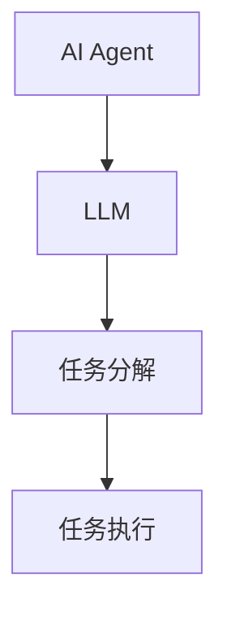
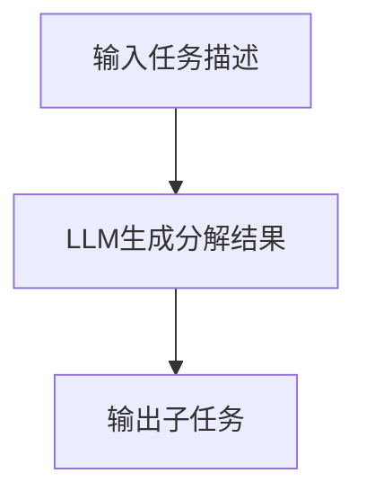
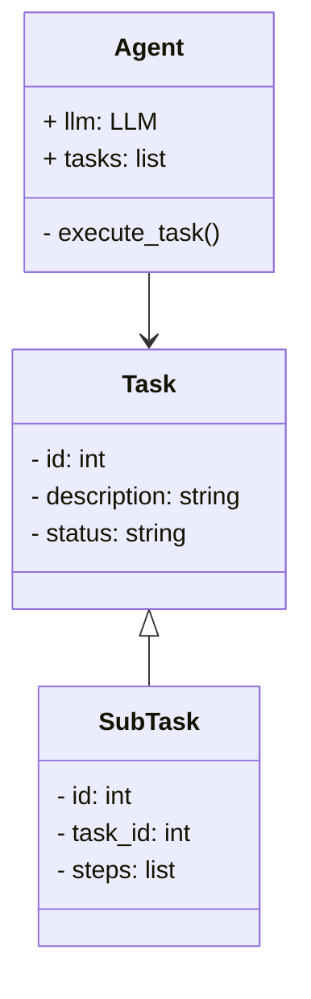
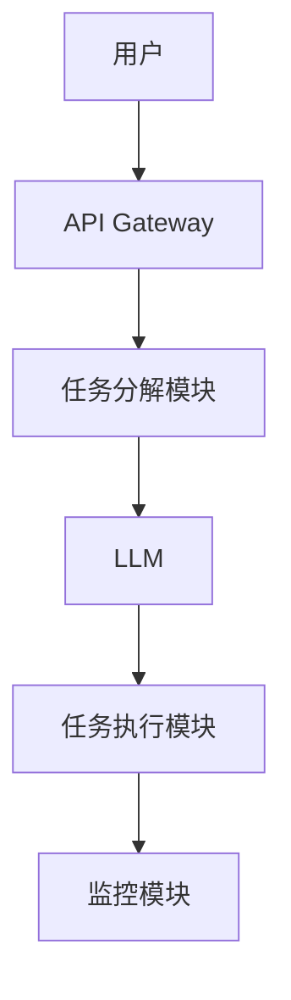
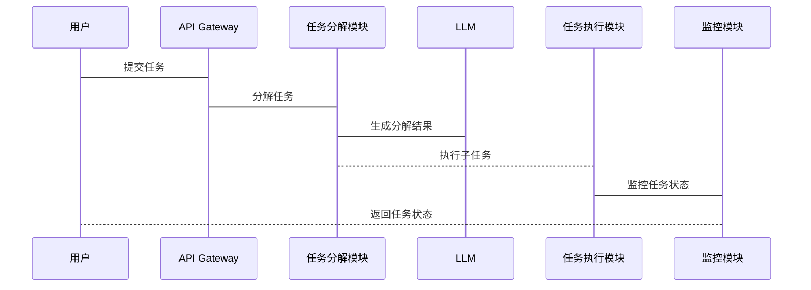

                 


# 任务规划AI Agent：利用LLM进行复杂任务分解

> 关键词：任务规划AI Agent, LLM, 复杂任务分解, 自然语言处理, 人工智能算法, 系统架构设计

> 摘要：本文深入探讨了任务规划AI Agent利用大语言模型（LLM）进行复杂任务分解的方法。从背景介绍到核心概念，从算法原理到系统架构设计，再到项目实战和最佳实践，全面解析了任务规划AI Agent的实现过程和应用价值。

---

## 第一部分: 任务规划AI Agent概述

### 第1章: 问题背景与核心概念

#### 1.1 问题背景
##### 1.1.1 传统任务规划的挑战
在传统的任务规划中，复杂任务的分解往往依赖于人工经验和规则引擎，这种方式存在效率低、灵活性差的问题。例如，在企业流程管理中，复杂的业务流程需要手动分解成多个子任务，这不仅耗时，还容易出错。

##### 1.1.2 AI Agent在任务规划中的作用
AI Agent（智能体）通过自动化和智能化的方式，能够帮助我们更高效地分解和执行任务。AI Agent可以实时感知环境、理解任务需求，并动态调整执行策略。

##### 1.1.3 LLM在任务分解中的优势
大语言模型（LLM）具有强大的自然语言理解和生成能力，可以将复杂的任务描述转化为具体的执行步骤。LLM能够处理非结构化的任务描述，生成结构化的任务分解结果。

#### 1.2 问题描述
##### 1.2.1 复杂任务的特点
复杂任务通常具有多阶段性、依赖性和不确定性。例如，项目管理中的任务分解需要考虑时间、资源和团队协作等多个因素。

##### 1.2.2 任务分解的必要性
任务分解是任务规划的基础，通过将复杂任务分解为可执行的子任务，可以提高任务执行的效率和成功率。

##### 1.2.3 LLM在任务分解中的应用范围
LLM可以应用于各种领域，如项目管理、软件开发、供应链优化等。它能够处理复杂的任务描述，生成详细的执行计划。

#### 1.3 问题解决
##### 1.3.1 AI Agent的基本原理
AI Agent通过感知环境、理解任务需求、制定执行计划并动态调整策略来完成任务。AI Agent可以基于LLM进行任务分解，生成执行步骤。

##### 1.3.2 LLM在任务分解中的具体实现
LLM通过自然语言理解任务描述，生成任务分解的结构化结果。例如，将“完成季度报告”分解为收集数据、分析数据、撰写报告等步骤。

##### 1.3.3 任务分解的流程与方法
任务分解的流程包括：任务理解、目标设定、步骤分解、资源分配和时间规划。基于LLM的任务分解方法能够自动化完成这些步骤。

#### 1.4 边界与外延
##### 1.4.1 任务分解的边界条件
任务分解的边界条件包括任务的范围、资源限制和时间限制。例如，任务分解需要考虑团队成员的技能和可用时间。

##### 1.4.2 任务分解的外延范围
任务分解的外延范围包括任务执行后的监控和调整。例如，任务执行过程中可能会遇到突发情况，需要动态调整分解结果。

##### 1.4.3 相关领域的区别与联系
任务分解与任务调度、任务分配等其他任务管理方法有区别，但它们共同的目标是提高任务执行效率。

#### 1.5 概念结构与核心要素
##### 1.5.1 任务规划AI Agent的组成
任务规划AI Agent通常包括感知模块、任务分解模块、执行模块和监控模块。感知模块负责理解任务描述，任务分解模块将任务分解为子任务，执行模块负责执行子任务，监控模块负责动态调整执行计划。

##### 1.5.2 LLM在任务分解中的角色
LLM作为任务分解模块的核心组件，负责将自然语言的任务描述转化为结构化的任务分解结果。

##### 1.5.3 核心要素的相互关系
任务规划AI Agent的各部分协同工作，感知模块提供输入，任务分解模块生成执行计划，执行模块负责实际操作，监控模块动态调整。

### 第2章: 核心概念与联系

#### 2.1 AI Agent与LLM的关系
##### 2.1.1 AI Agent的基本概念
AI Agent是一种智能系统，能够感知环境、理解任务需求、制定执行计划并动态调整策略。

##### 2.1.2 LLM在AI Agent中的应用
LLM作为AI Agent的核心组件，负责任务理解、任务分解和自然语言生成。

##### 2.1.3 两者结合的优势
通过结合AI Agent和LLM，任务规划可以更加智能化和自动化，能够处理复杂多变的任务环境。

#### 2.2 任务分解的原理
##### 2.2.1 任务分解的基本原理
任务分解是将复杂任务分解为多个可执行的子任务。子任务之间具有依赖性和顺序性。

##### 2.2.2 基于LLM的任务分解方法
基于LLM的任务分解方法通过自然语言理解任务描述，生成结构化的任务分解结果。

##### 2.2.3 任务分解的数学模型
任务分解的数学模型可以表示为：
$$
f(x) = \sum_{i=1}^{n} x_i
$$
其中，$x_i$表示子任务的执行情况，$f(x)$表示任务的完成状态。

#### 2.3 核心概念对比表
以下表格对比了AI Agent与传统任务规划的核心概念：

| 对比维度 | AI Agent | 传统任务规划 |
|----------|-----------|--------------|
| 任务分解 | 基于LLM自动化分解 | 手动规则分解 |
| 灵活性   | 高，能够动态调整 | 低，固定规则 |
| 处理能力 | 强大，支持复杂任务 | 较弱，依赖规则 |

#### 2.4 ER实体关系图


---

## 第二部分: 算法原理与数学模型

### 第3章: 算法原理与数学模型

#### 3.1 算法原理
##### 3.1.1 基于LLM的任务分解算法
基于LLM的任务分解算法包括以下步骤：
1. 输入任务描述。
2. LLM生成任务分解结果。
3. 生成的子任务传递给执行模块。

##### 3.1.2 算法的步骤与流程
任务分解算法的流程图如下：


##### 3.1.3 算法的优化与改进
为了提高任务分解的准确性，可以在LLM生成的结果基础上进行验证和调整。

#### 3.2 数学模型与公式
##### 3.2.1 任务分解的数学模型
任务分解的数学模型可以表示为：
$$
f(x) = \sum_{i=1}^{n} x_i
$$
其中，$x_i$表示子任务的执行情况，$f(x)$表示任务的完成状态。

##### 3.2.2 算法实现的数学公式
以下是一个简单的任务分解算法示例：
$$
x_i = \begin{cases}
1 & \text{如果子任务 } i \text{ 完成} \\
0 & \text{否则}
\end{cases}
$$

---

## 第三部分: 系统分析与架构设计

### 第4章: 系统分析与架构设计

#### 4.1 项目背景
任务规划AI Agent系统用于帮助企业自动化分解和执行复杂任务，提高任务执行效率。

#### 4.2 系统功能设计
##### 4.2.1 领域模型类图
以下是一个简单的领域模型类图：


#### 4.3 系统架构设计
##### 4.3.1 系统架构图
任务规划AI Agent的系统架构图如下：


#### 4.4 系统接口设计
##### 4.4.1 接口设计
系统主要接口包括：
1. 提交任务接口。
2. 获取任务分解结果接口。
3. 执行子任务接口。
4. 监控任务执行状态接口。

##### 4.4.2 交互序列图
任务提交和执行的交互序列图如下：


---

## 第四部分: 项目实战

### 第5章: 项目实战

#### 5.1 环境安装
项目实战需要以下环境：
- Python 3.8+
- LLM模型（如GPT-3）
- 基于Flask或Django的Web框架

#### 5.2 核心代码实现
##### 5.2.1 任务分解模块代码
```python
class TaskDecomposer:
    def __init__(self, llm):
        self.llm = llm

    def decompose_task(self, task_description):
        # 调用LLM生成任务分解结果
        return self.llm.decompose(task_description)
```

##### 5.2.2 执行模块代码
```python
class TaskExecutor:
    def __init__(self, task_decomposer):
        self.task_decomposer = task_decomposer

    def execute_task(self, task_description):
        subtasks = self.task_decomposer.decompose_task(task_description)
        for subtask in subtasks:
            self._execute_subtask(subtask)

    def _execute_subtask(self, subtask):
        # 执行具体的子任务
        pass
```

##### 5.2.3 监控模块代码
```python
class Monitor:
    def __init__(self, task_executor):
        self.task_executor = task_executor

    def monitor_task(self, task_id):
        while True:
            status = self.task_executor.get_status(task_id)
            if status == 'completed':
                break
```

#### 5.3 代码应用解读与分析
任务分解模块通过调用LLM生成任务分解结果，执行模块负责执行子任务，监控模块动态调整任务执行状态。

#### 5.4 实际案例分析
以项目管理为例，任务“完成季度报告”可以分解为收集数据、分析数据、撰写报告等步骤。

#### 5.5 项目小结
通过项目实战，我们可以看到任务规划AI Agent的强大功能和实际应用价值。

---

## 第五部分: 最佳实践与总结

### 第6章: 最佳实践与总结

#### 6.1 最佳实践
1. 确保任务描述的清晰性和准确性。
2. 定期更新和优化任务分解算法。
3. 结合具体场景进行任务分解。

#### 6.2 小结
任务规划AI Agent通过利用LLM进行复杂任务分解，能够显著提高任务执行效率。

#### 6.3 注意事项
1. 任务分解的粒度要适中。
2. 确保系统的健壮性。
3. 定期监控和调整任务执行状态。

#### 6.4 拓展阅读
1. 《Large Language Models: A Survey》
2. 《人工智能系统设计与实现》

---

## 作者信息

作者：AI天才研究院/AI Genius Institute & 禅与计算机程序设计艺术 /Zen And The Art of Computer Programming

---

通过以上详细的内容，您可以按照这个大纲逐步撰写完整的文章，确保每个部分都详细且符合要求。

