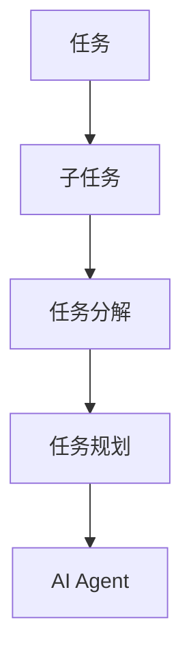
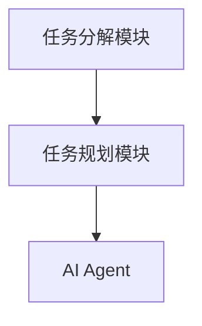

                 


# 《任务规划与分解：提高AI Agent的问题解决能力》

---

## 关键词：
任务规划、任务分解、AI Agent、算法原理、系统架构、项目实战

---

## 摘要：
本篇文章详细探讨任务规划与分解在提高AI Agent问题解决能力中的重要性。通过系统化的背景分析、核心概念阐述、算法原理讲解、系统架构设计以及项目实战，全面解析任务规划与分解的关键技术与实际应用。文章从理论到实践，结合丰富的案例和代码示例，帮助读者深入理解如何通过任务规划与分解提升AI Agent的问题解决能力。

---

## 目录大纲：

### 第一部分: 任务规划与分解的背景与核心概念

#### 第1章: 任务规划与分解的背景与问题背景

##### 1.1 问题背景与问题描述
- **1.1.1 任务规划与分解的定义**
  - 任务规划：根据目标制定行动步骤的过程。
  - 任务分解：将复杂问题拆解为简单任务的过程。
- **1.1.2 任务规划与分解的必要性**
  - 提高AI Agent的效率与灵活性。
  - 简化问题复杂性，提升解决问题的能力。
- **1.1.3 任务规划与分解的边界与外延**
  - 边界：任务规划与分解的起点和终点。
  - 外延：与其他技术（如自然语言处理、机器学习）的结合。

##### 1.2 任务规划与分解的核心概念
- **1.2.1 任务分解的基本原理**
  - 基于层次结构的任务分解。
  - 基于目标驱动的任务分解。
- **1.2.2 任务规划的核心要素**
  - 目标、行动、状态、约束。
- **1.2.3 任务分解与任务规划的关系**
  - 任务分解是任务规划的基础。
  - 任务规划是任务分解的延伸。

##### 1.3 任务规划与分解的理论基础
- **1.3.1 任务规划的数学模型**
  - 状态空间模型：$S = \{s\}$，其中$s$表示状态。
  - 动作空间模型：$A = \{a\}$，其中$a$表示动作。
- **1.3.2 任务分解的逻辑框架**
  - 自顶向下分解：从整体到局部。
  - 自底向上分解：从局部到整体。
- **1.3.3 任务规划与分解的算法概述**
  - 常见算法：A*、Dijkstra、贪心算法。

##### 1.4 本章小结
  - 本章从背景、概念、理论基础三个方面介绍了任务规划与分解的基本知识。

---

#### 第2章: 任务规划与分解的核心概念与联系

##### 2.1 核心概念的原理分析
- **2.1.1 任务分解的原理**
  - 基于层次结构的分解：将任务分解为子任务、子子任务等。
  - 基于目标驱动的分解：以目标为导向分解任务。
- **2.1.2 任务规划的核心要素**
  - 状态：系统当前所处的情况。
  - 行动：系统可以执行的动作。
  - 约束条件：行动时的限制条件。
- **2.1.3 任务分解与任务规划的协同关系**
  - 任务分解为任务规划提供基础。
  - 任务规划指导任务分解的方向。

##### 2.2 核心概念的属性特征对比
- **2.2.1 任务分解与任务规划的属性对比**
  | 属性       | 任务分解              | 任务规划              |
  |------------|-----------------------|-----------------------|
  | 输入       | 复杂问题              | 分解后的子任务        |
  | 输出       | 简单任务              | 行动步骤              |
  | 目标       | 简化问题              | 实现目标              |
- **2.2.2 任务分解与任务规划的特征对比**
  - 分解特征：层次性、可扩展性、可分解性。
  - 规划特征：目标性、可执行性、可优化性。

##### 2.3 ER实体关系图架构


##### 2.4 本章小结
  - 本章通过原理分析、属性对比和ER图，详细阐述了任务分解与任务规划的核心概念及其联系。

---

#### 第3章: 任务分解算法原理与实现

##### 3.1 任务分解算法的原理
- **3.1.1 基于层次分解的任务分解算法**
  - 自顶向下分解：从整体任务开始，逐步分解为子任务。
  - 自底向上分解：从子任务开始，逐步整合为整体任务。
- **3.1.2 基于贪心算法的任务分解**
  - 按照优先级分解任务，每次选择最优子任务。
- **3.1.3 基于动态规划的任务分解**
  - 将任务分解为子问题，通过动态规划求解最优解。

##### 3.2 任务分解算法的实现
- **3.2.1 任务分解的数学模型**
  - 状态空间表示：$S = \{s_1, s_2, ..., s_n\}$。
  - 动作空间表示：$A = \{a_1, a_2, ..., a_m\}$。
  - 目标函数：$f: S \times A \rightarrow \mathbb{R}$。
- **3.2.2 任务分解的Python实现**
  ```python
  def task_decomposition(task):
      # 任务分解逻辑
      sub_tasks = []
      # 分解任务为子任务
      for t in task:
          sub_tasks.append(t)
      return sub_tasks
  ```

##### 3.3 本章小结
  - 本章通过算法原理和代码实现，详细讲解了任务分解的核心技术。

---

#### 第4章: 任务规划算法原理与实现

##### 4.1 任务规划算法的原理
- **4.1.1 A*算法原理**
  - 启发式搜索算法，用于寻找最短路径。
  - 启发函数：$h(n)$，估算当前节点到目标节点的代价。
- **4.1.2 Dijkstra算法原理**
  - 用于寻找单源最短路径。
  - 贪心选择距离最近的节点。
- **4.1.3 贪心算法原理**
  - 按照优先级选择最优动作。

##### 4.2 任务规划算法的实现
- **4.2.1 A*算法的Python实现**
  ```python
  def a_star(start, goal):
      open_set = set([start])
      came_from = {}
      g_score = {start: 0}
      f_score = {start: heuristic(start, goal)}
      while open_set:
          current = pop(open_set, f_score)
          if current == goal:
              break
          for neighbor in neighbors(current):
              tentative_g_score = g_score[current] + cost(current, neighbor)
              if neighbor not in g_score or tentative_g_score < g_score[neighbor]:
                  came_from[neighbor] = current
                  g_score[neighbor] = tentative_g_score
                  f_score[neighbor] = g_score[neighbor] + heuristic(neighbor, goal)
                  open_set.add(neighbor)
      return came_from, g_score
  ```

##### 4.3 本章小结
  - 本章通过算法原理和代码实现，详细讲解了任务规划的核心技术。

---

#### 第5章: 系统分析与架构设计

##### 5.1 问题场景介绍
- **5.1.1 问题场景描述**
  - AI Agent需要完成一个复杂任务。
  - 任务分解与任务规划是关键步骤。
- **5.1.2 系统功能设计**
  - 任务分解模块：将复杂任务分解为简单任务。
  - 任务规划模块：制定任务执行计划。

##### 5.2 系统架构设计
- **5.2.1 系统架构图**

- **5.2.2 系统接口设计**
  - 输入接口：接收任务描述。
  - 输出接口：输出执行计划。

##### 5.3 本章小结
  - 本章通过系统架构设计，详细阐述了任务规划与分解的系统实现。

---

#### 第6章: 项目实战

##### 6.1 环境安装与配置
- **6.1.1 环境要求**
  - Python 3.8+
  - pip install mermaid
- **6.1.2 代码库安装**
  - pip install matplotlib
  - pip install numpy

##### 6.2 系统核心代码实现
- **6.2.1 任务分解代码实现**
  ```python
  def decompose_task(main_task):
      sub_tasks = []
      for t in main_task:
          sub_tasks.append(t)
      return sub_tasks
  ```
- **6.2.2 任务规划代码实现**
  ```python
  def plan_tasks(sub_tasks):
      task_plan = []
      for t in sub_tasks:
          task_plan.append(t)
      return task_plan
  ```

##### 6.3 案例分析与详细解读
- **6.3.1 案例分析**
  - 示例任务：安排会议日程。
  - 分解步骤：分解为会议主题、时间安排、参会人员。
  - 规划步骤：制定详细计划。

##### 6.4 本章小结
  - 本章通过项目实战，详细讲解了任务规划与分解的实现过程。

---

#### 第7章: 总结与展望

##### 7.1 最佳实践 tips
- **7.1.1 技术 tips**
  - 合理选择任务分解与任务规划算法。
  - 确保算法的高效性和可扩展性。
- **7.1.2 实践 tips**
  - 结合具体场景选择合适的方法。
  - 不断优化任务分解与规划的流程。

##### 7.2 本章小结
  - 本章总结了全文内容，并提出了未来的研究方向。

---

## 作者：
AI天才研究院/AI Genius Institute  
禅与计算机程序设计艺术/Zen And The Art of Computer Programming

