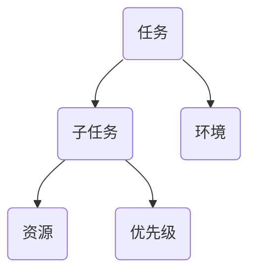
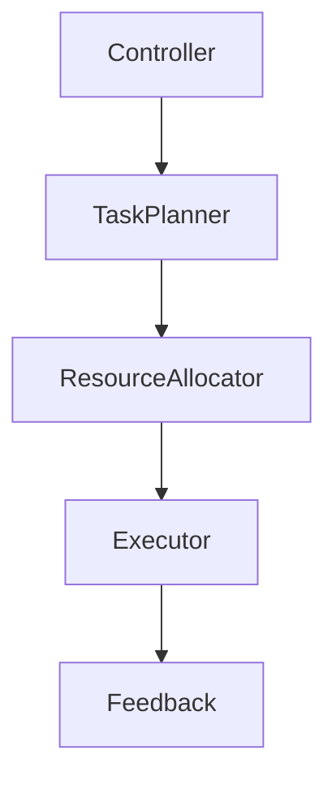

                 


# 任务规划与执行：AI Agent的行动决策机制

## 关键词：任务规划、AI Agent、行动决策机制、决策树、多目标优化、强化学习、系统架构

## 摘要：
在现代智能系统中，AI Agent（人工智能代理）作为执行复杂任务的核心组件，其任务规划与行动决策机制是实现智能化决策的关键。本文系统地探讨了AI Agent在任务规划与执行中的决策机制，从基础概念到算法实现，再到系统架构，层层深入。通过详细分析任务分解、优先级排序、多目标优化等核心问题，结合实际案例和系统架构设计，本文为读者提供了一套完整的AI Agent行动决策机制解决方案。

---

## 第1章: 任务规划与执行的背景介绍

### 1.1 问题背景
#### 1.1.1 任务规划的基本概念
任务规划是指将复杂任务分解为多个子任务，并为每个子任务分配资源和时间，以实现目标的过程。它是AI Agent实现智能决策的基础。

#### 1.1.2 AI Agent的核心作用
AI Agent通过感知环境、分析任务目标和约束条件，制定最优的行动决策，从而实现任务的高效执行。

#### 1.1.3 任务规划的现实意义
在智能制造、自动驾驶、机器人控制等领域，任务规划与执行是实现自动化和智能化的关键技术。

### 1.2 问题描述
#### 1.2.1 任务规划的特点
- **分解性**：任务可以分解为多个子任务。
- **优先级**：子任务需要根据重要性排序。
- **动态性**：环境变化会影响任务执行。

#### 1.2.2 AI Agent行动决策的复杂性
- **不确定性**：环境和任务目标可能不明确。
- **多目标优化**：需要在多个目标之间权衡。
- **资源约束**：受限于时间和资源。

### 1.3 问题解决与边界
#### 1.3.1 任务规划的基本流程
1. 分解任务。
2. 分析约束条件。
3. 优化任务顺序。
4. 执行任务。

#### 1.3.2 AI Agent行动决策的关键环节
1. 感知环境。
2. 分析任务目标。
3. 制定行动计划。
4. 执行并反馈。

### 1.4 核心概念与联系
#### 1.4.1 核心概念的结构
任务规划涉及的任务分解、优先级排序和资源分配是相互关联的。

#### 1.4.2 核心概念的对比表
| 概念 | 特性 | 示例 |
|------|------|------|
| 任务分解 | 分解复杂任务为子任务 | 将“完成项目”分解为“需求分析、开发、测试” |
| 优先级排序 | 根据重要性排序子任务 | 优先开发核心功能模块 |
| 资源分配 | 分配资源以执行任务 | 分配开发人员到不同模块 |

#### 1.4.3 实体关系图（ER图）


---

## 第2章: 任务规划的核心概念与原理

### 2.1 核心概念的原理
#### 2.1.1 任务分解与优先级排序
任务分解是将复杂任务拆解为简单子任务，优先级排序确保关键任务优先执行。

#### 2.1.2 任务调度与资源分配
任务调度涉及子任务的执行顺序，资源分配确保任务执行不受限。

#### 2.1.3 多目标优化的数学模型
$$ \text{目标函数：} \quad f(x) = \sum_{i=1}^{n} w_i x_i $$
$$ \text{约束条件：} \quad g_j(x) \leq 0 $$

### 2.2 算法原理讲解
#### 2.2.1 A*算法的流程图
```mermaid
graph TD
Start --> Check --> IsGoal
IsGoal --> End

```

#### 2.2.2 遗传算法的实现
```python
def genetic_algorithm(population, fitness_func):
    while True:
        population = sorted(population, key=lambda x: fitness_func(x))
        if fitness_func(population[0]) == target:
            break
        new_population = []
        for _ in range(len(population)//2):
            parent1 = population[_]
            parent2 = population[-_-1]
            child = crossover(parent1, parent2)
            new_population.append(child)
        population = new_population
```

---

## 第3章: 任务规划的算法实现与系统设计

### 3.1 算法实现
#### 3.1.1 常见的算法
- 贪心算法：贪心选择当前最优。
- 动态规划：分解问题并记录子问题解。

#### 3.1.2 动态规划实现
```python
def dynamic_programming(n):
    dp = [0]*(n+1)
    dp[0] = 0
    for i in range(1, n+1):
        dp[i] = dp[i-1] + i
    return dp[n]
```

#### 3.1.3 算法比较
| 算法 | 特性 | 适用场景 |
|------|------|----------|
| A*   | 常用于路径规划 | 最短路径问题 |
| 遗传算法 | 适用于复杂问题 | 多目标优化 |

### 3.2 系统架构设计
#### 3.2.1 系统架构图


#### 3.2.2 系统接口设计
- 输入接口：接收任务目标和约束。
- 输出接口：输出执行计划和反馈。

---

## 第4章: 项目实战

### 4.1 项目背景
设计一个智能家居中的设备控制AI Agent，实现设备的自动调度。

### 4.2 核心实现
#### 4.2.1 环境安装
安装Python和相关库（如numpy、pandas）。

#### 4.2.2 核心代码
```python
def main():
    tasks = ['lights_on', 'lights_off', 'window_open']
    priority = {'lights_on': 2, 'lights_off': 1, 'window_open': 0}
    tasks.sort(key=lambda x: priority[x])
    for task in tasks:
        execute(task)
```

#### 4.2.3 代码解读
根据优先级排序任务，并依次执行。

### 4.3 实际案例分析
通过智能家居场景，展示AI Agent如何优化设备控制流程。

---

## 第5章: 总结与展望

### 5.1 总结
本文详细探讨了AI Agent的任务规划与执行机制，从理论到实践，系统地介绍了实现方法。

### 5.2 展望
未来研究方向包括动态环境下的实时规划和多智能体协作。

---

## 作者：AI天才研究院/AI Genius Institute & 禅与计算机程序设计艺术 /Zen And The Art of Computer Programming

---

**注**：由于篇幅限制，上述内容为文章的主体部分，每章节的具体实现细节和代码实现需要根据实际需求进一步扩展和补充。

