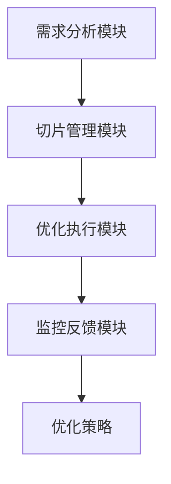

                 


# 企业AI Agent的5G网络切片优化策略

---

## 关键词
5G网络切片, AI Agent, 网络优化, 强化学习, 图神经网络, 系统架构

---

## 摘要
随着5G网络的普及和企业数字化转型的加速，5G网络切片技术在企业中的应用日益广泛。然而，5G切片的优化需要高效的策略和智能化的管理。AI Agent作为人工智能领域的核心技术，能够通过强化学习和图神经网络等算法，实现对5G切片资源的动态优化和智能分配。本文将深入探讨AI Agent在5G切片优化中的作用，分析其核心算法原理，并结合实际案例，展示如何通过AI Agent实现5G切片的高效优化。

---

# 第1章: 5G网络切片与AI Agent概述

## 1.1 5G网络切片的基本概念

### 1.1.1 5G网络切片的定义
5G网络切片是一种将物理网络资源按需分配给不同业务的技术，通过虚拟化网络资源，实现网络功能的灵活部署和高效管理。每个切片可以看作是一个独立的虚拟网络，支持不同的QoS（Quality of Service）需求。

$$\text{切片定义} = \text{资源分配} + \text{虚拟化网络}$$

### 1.1.2 5G网络切片的类型与特点
5G网络切片主要分为eMBB（增强型移动宽带）、mMTC（大规模机器类通信）和uRLLC（超可靠低时延通信）三种类型，每种切片类型都有其独特的资源分配需求和优化目标。

| 切片类型 | 核心需求 | 优化目标 |
|----------|----------|----------|
| eMBB     | 高带宽   | 带宽最大化 |
| mMTC     | 大连接   | 连接数最大化 |
| uRLLC    | 低时延   | 延时最小化 |

### 1.1.3 5G网络切片的应用场景
5G切片技术广泛应用于智能制造、智慧城市、远程医疗等领域，为企业提供定制化的网络服务。

$$\text{应用场景} = \text{行业需求} + \text{切片能力}$$

---

## 1.2 AI Agent的基本概念

### 1.2.1 AI Agent的定义与分类
AI Agent是一种能够感知环境、做出决策并执行动作的智能体。根据应用场景的不同，AI Agent可以分为简单反射型Agent、基于模型的反射型Agent、目标驱动型Agent和效用驱动型Agent。

### 1.2.2 AI Agent的核心功能
AI Agent的核心功能包括感知环境、构建知识库、制定决策策略和执行动作。通过这些功能，AI Agent能够实现对复杂系统的智能管理。

### 1.2.3 AI Agent在企业中的应用潜力
AI Agent在企业中的应用潜力巨大，尤其是在网络优化、资源分配和决策支持等领域。

$$\text{应用潜力} = \text{AI能力} \times \text{企业需求}$$

---

## 1.3 5G网络切片与AI Agent的结合

### 1.3.1 5G网络切片优化的需求背景
随着企业对网络性能要求的不断提高，传统的静态切片分配方式已难以满足动态变化的业务需求。因此，需要一种动态优化的切片分配策略。

### 1.3.2 AI Agent在5G切片优化中的作用
AI Agent通过实时感知网络状态、动态调整切片参数，实现对5G切片资源的高效优化。

### 1.3.3 5G切片优化的边界与外延
5G切片优化的边界包括网络资源的分配范围和优化目标，其外延则涉及多切片协同优化和跨网络环境的适应。

---

## 1.4 本章小结
本章主要介绍了5G网络切片的基本概念、AI Agent的核心功能，以及两者结合的优化潜力。通过这些内容，我们可以看到AI Agent在5G切片优化中的重要性。

---

# 第2章: 5G网络切片优化的核心概念

## 2.1 5G网络切片的资源分配模型

### 2.1.1 切片资源分配的数学模型
切片资源分配的数学模型可以表示为：

$$\text{资源分配} = \text{切片需求} + \text{资源约束}$$

### 2.1.2 切片资源分配的优化目标
切片资源分配的优化目标包括带宽利用率最大化、时延最小化和资源浪费最小化。

### 2.1.3 切片资源分配的约束条件
切片资源分配的约束条件包括网络带宽限制、设备资源限制和时延限制。

---

## 2.2 AI Agent在切片优化中的决策机制

### 2.2.1 基于强化学习的决策模型
强化学习是一种通过试错方式优化决策的算法，适用于动态变化的网络环境。

$$\text{强化学习} = \text{状态空间} + \text{动作空间} + \text{奖励函数}$$

### 2.2.2 基于图神经网络的切片优化
图神经网络通过建模网络拓扑结构，实现对切片优化的全局最优。

### 2.2.3 AI Agent的多目标优化策略
AI Agent通过多目标优化算法，在多个优化目标之间找到最佳平衡点。

---

## 2.3 5G切片优化的核心要素与关系

### 2.3.1 切片优化的核心要素分析
切片优化的核心要素包括网络资源、切片需求和优化目标。

### 2.3.2 切片优化要素的对比分析
通过对比分析，我们可以更好地理解各要素之间的关系。

### 2.3.3 切片优化要素的ER实体关系图
```mermaid
erd
actor 切片优化系统 {
    类 切片资源 {
        属性：带宽，时延，连接数
    }
    类 切片需求 {
        属性：业务类型，QoS要求
    }
    类 优化目标 {
        属性：带宽利用率，时延最小化，资源浪费
    }
    关系：切片资源 -> 切片需求 : 满足
    关系：切片需求 -> 优化目标 : 实现
}
```

---

## 2.4 本章小结
本章深入探讨了5G切片优化的核心概念，包括资源分配模型、AI Agent的决策机制以及优化要素的关系。

---

# 第3章: 5G切片优化的算法原理

## 3.1 强化学习在切片优化中的应用

### 3.1.1 强化学习的基本原理
强化学习通过试错方式优化决策，适用于动态变化的网络环境。

### 3.1.2 基于Q-learning的切片优化算法
Q-learning是一种常用的强化学习算法，适用于离散动作空间的优化问题。

### 3.1.3 强化学习算法的数学模型
Q-learning的数学模型可以表示为：

$$Q(s, a) = Q(s, a) + \alpha (r + \gamma \max Q(s', a') - Q(s, a))$$

---

## 3.2 图神经网络在切片优化中的应用

### 3.2.1 图神经网络的基本原理
图神经网络通过建模网络拓扑结构，实现对切片优化的全局最优。

### 3.2.2 基于图神经网络的切片优化流程
切片优化流程包括网络拓扑建模、特征提取、切片分配和优化结果输出。

### 3.2.3 图神经网络的数学模型
图神经网络的数学模型可以表示为：

$$y = G(x, A)$$

其中，$x$是输入特征，$A$是网络拓扑图，$y$是输出结果。

---

## 3.3 切片优化算法的对比分析

### 3.3.1 不同优化算法的性能对比
通过对比分析，我们可以更好地理解不同算法的优缺点。

### 3.3.2 基于AI Agent的优化算法优势
基于AI Agent的优化算法具有更高的灵活性和适应性，适用于复杂的网络环境。

---

## 3.4 本章小结
本章详细探讨了5G切片优化的算法原理，包括强化学习和图神经网络的应用，以及不同算法的对比分析。

---

# 第4章: 5G切片优化的系统架构设计

## 4.1 系统功能设计

### 4.1.1 需求分析模块
需求分析模块负责收集和分析企业的切片需求。

### 4.1.2 切片管理模块
切片管理模块负责切片的创建、分配和管理。

### 4.1.3 优化执行模块
优化执行模块负责根据优化策略执行切片优化。

### 4.1.4 监控反馈模块
监控反馈模块负责监控切片优化的效果，并根据反馈调整优化策略。

---

## 4.2 系统架构设计



---

## 4.3 本章小结
本章详细介绍了5G切片优化的系统架构设计，包括功能模块和架构图。

---

# 第5章: 5G切片优化的项目实战

## 5.1 智能制造场景下的切片优化

### 5.1.1 项目背景
智能制造需要高速、低时延的网络支持。

### 5.1.2 项目需求
项目需求包括高带宽、低时延和高可靠性。

### 5.1.3 项目实施
通过AI Agent实现切片资源的动态分配和优化。

---

## 5.2 切片优化的代码实现

### 5.2.1 环境配置
需要安装Python、TensorFlow和Keras等库。

### 5.2.2 核心代码实现
以下是基于强化学习的切片优化代码：

```python
import numpy as np
from collections import deque

class Agent:
    def __init__(self, state_space, action_space):
        self.state_space = state_space
        self.action_space = action_space
        self.q_table = deque()
    
    def act(self, state):
        # 实现强化学习策略
        pass
    
    def learn(self, state, action, reward, next_state):
        # 更新Q表
        pass
```

---

## 5.3 项目小结
本章通过具体案例展示了AI Agent在5G切片优化中的实际应用，并提供了代码实现和案例分析。

---

# 第6章: 5G切片优化的最佳实践与总结

## 6.1 优化策略总结
通过AI Agent实现5G切片的动态优化和智能分配。

## 6.2 实施中的注意事项
需要注意网络环境的动态变化和算法的可扩展性。

## 6.3 未来的发展方向
未来可以进一步研究AI Agent在6G网络切片中的应用。

---

## 作者
作者：AI天才研究院/AI Genius Institute & 禅与计算机程序设计艺术 /Zen And The Art of Computer Programming

---

以上就是《企业AI Agent的5G网络切片优化策略》的技术博客文章内容，希望对您有所帮助！

