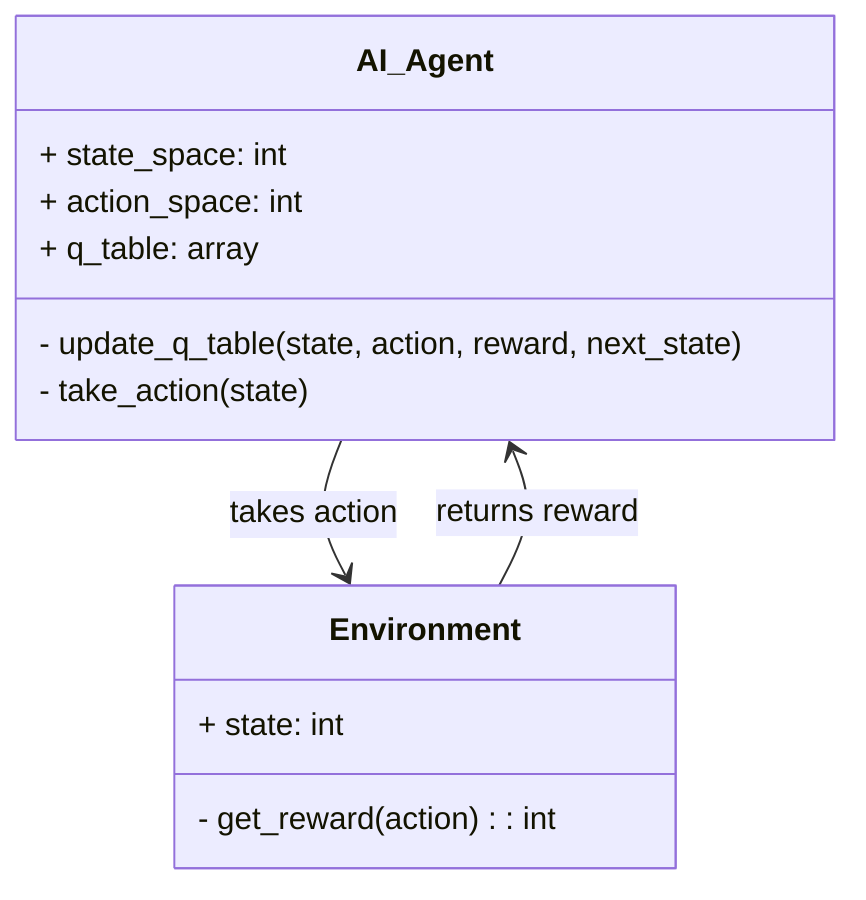
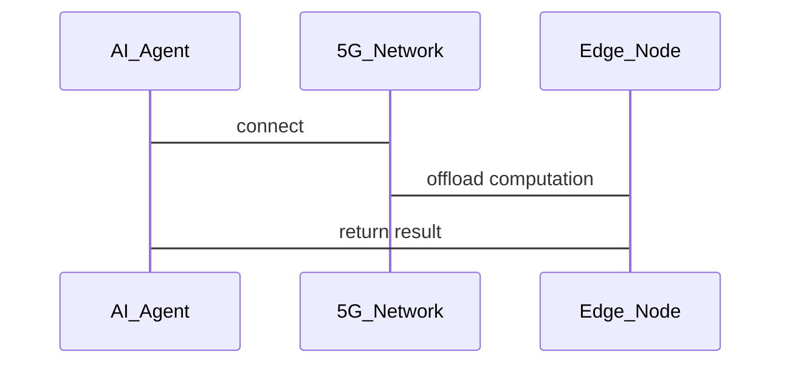

                 


# 企业AI Agent的5G网络应用策略

> 关键词：AI Agent, 5G网络, 企业应用, 算法实现, 系统架构, 数字化转型

> 摘要：本文探讨了AI Agent在5G网络环境中的企业应用策略，从概念、技术、系统架构到算法实现，结合实际案例分析，为企业在数字化转型中提供AI Agent的5G网络应用指导。通过详细的技术分析和实践案例，本文为读者提供了从理论到实践的全面指南。

---

# 第一部分: 企业AI Agent的5G网络应用背景与概念

## 第1章: AI Agent与5G网络概述

### 1.1 AI Agent的基本概念

#### 1.1.1 AI Agent的定义与特点
AI Agent（人工智能代理）是一种智能体，能够感知环境、执行任务并做出决策。其特点包括：
- **自主性**：无需外部干预，自主完成任务。
- **反应性**：能够实时感知环境并做出反应。
- **目标导向**：基于目标驱动行为。

#### 1.1.2 AI Agent的核心功能与应用场景
AI Agent的核心功能包括：
- 数据收集与处理
- 任务执行与决策
- 状态监控与反馈
应用场景：智能制造、物流、金融等领域。

#### 1.1.3 AI Agent与传统自动化系统的区别
| 属性 | AI Agent | 传统自动化系统 |
|------|----------|----------------|
| 决策能力 | 自主决策 | 固定规则执行 |

### 1.2 5G网络的基本概念与特性

#### 1.2.1 5G网络的定义与关键特性
5G网络是第五代移动通信技术，具有高带宽、低延迟、大规模连接等特点。

#### 1.2.2 5G网络的架构与组成部分
5G网络架构包括：
- 用户设备（UE）
- 基站（gNB）
- 网络核心（NGC）
- 边缘计算节点（MEC）

#### 1.2.3 5G网络的性能优势
- 高带宽：支持10+ Gbps的数据传输。
- 低延迟：<1ms的端到端延迟。
- 高密度连接：支持百万级设备连接。

### 1.3 AI Agent与5G网络的结合

#### 1.3.1 AI Agent在5G网络中的角色
AI Agent作为智能决策层，优化网络资源分配。

#### 1.3.2 5G网络为AI Agent提供的技术支撑
- 高速数据传输：支持实时数据处理。
- 边缘计算：降低延迟，提升响应速度。

#### 1.3.3 AI Agent在5G网络中的应用场景
- 智能设备管理：优化网络设备配置。
- 自动化业务流程：实现端到端自动化服务。

---

## 第2章: 企业AI Agent的5G网络应用背景

### 2.1 企业数字化转型的背景

#### 2.1.1 数字化转型的定义与目标
数字化转型是指企业利用数字技术优化业务流程，提升竞争力。

#### 2.1.2 企业数字化转型中的技术挑战
- 数据孤岛问题
- 系统集成复杂性
- 数据安全风险

#### 2.1.3 AI技术在企业数字化转型中的作用
AI Agent通过自动化和智能化，提升业务效率。

### 2.2 5G网络对企业的影响

#### 2.2.1 5G网络对企业业务模式的改变
推动企业向服务化、智能化转型。

#### 2.2.2 5G网络对企业运营效率的提升
通过实时数据处理，优化资源利用率。

#### 2.2.3 5G网络对企业创新的推动
支持创新应用场景，如远程医疗、智能制造。

### 2.3 AI Agent在企业中的应用现状

#### 2.3.1 AI Agent在企业中的典型应用
- 设备监控与维护
- 供应链优化
- 客户服务自动化

#### 2.3.2 5G网络在企业AI Agent应用中的作用
- 提供高速连接，支持实时数据传输。
- 支持边缘计算，降低延迟。

#### 2.3.3 当前应用中的问题与挑战
- 网络延迟问题
- 数据安全风险
- 系统集成复杂性

---

## 第3章: 企业AI Agent的5G网络应用策略

### 3.1 AI Agent的5G网络应用策略概述

#### 3.1.1 策略的定义与目标
通过优化AI Agent与5G网络的结合，提升企业效率。

#### 3.1.2 策略的核心要素与组成部分
- 网络架构优化
- AI Agent功能设计
- 应用场景选择

#### 3.1.3 策略的实施步骤与方法
1. 确定应用场景
2. 设计系统架构
3. 实施算法优化
4. 测试与优化

### 3.2 5G网络支持的AI Agent功能设计

#### 3.2.1 AI Agent的功能模块划分
- 数据采集模块
- 决策模块
- 执行模块

#### 3.2.2 5G网络对AI Agent功能的支持
- 高速数据传输支持实时决策
- 边缘计算降低延迟

#### 3.2.3 功能设计中的关键问题
- 数据隐私保护
- 网络稳定性保障

### 3.3 企业AI Agent的5G网络应用规划

#### 3.3.1 应用场景的分析与选择
- 制造业：设备监控
- 物流：路径优化
- 金融：风险控制

#### 3.3.2 技术路线的选择与优化
- 确定使用强化学习或监督学习算法
- 选择合适的数据传输协议

#### 3.3.3 项目实施的步骤与计划
1. 需求分析
2. 系统设计
3. 开发与测试
4. 部署与优化

---

# 第二部分: 企业AI Agent的5G网络应用技术

## 第4章: AI Agent的核心算法与实现

### 4.1 AI Agent的核心算法

#### 4.1.1 状态空间与动作空间的定义
- 状态空间：环境中的所有可能状态。
- 动作空间：AI Agent可执行的所有动作。

#### 4.1.2 基于强化学习的AI Agent算法
强化学习算法，如Q-learning，通过奖励机制优化决策。

#### 4.1.3 基于监督学习的AI Agent算法
监督学习算法，如随机森林，用于分类和预测。

### 4.2 AI Agent的算法实现

#### 4.2.1 算法实现的步骤与流程
1. 状态观测
2. 动作选择
3. 奖励机制
4. 策略更新

#### 4.2.2 算法实现的关键技术点
- 状态表示
- 动作选择策略
- 奖励函数设计

#### 4.2.3 强化学习算法实现的Python代码示例
```python
import numpy as np

class AI_Agent:
    def __init__(self, state_space, action_space):
        self.state_space = state_space
        self.action_space = action_space
        self.q_table = np.zeros((state_space, action_space))
    
    def take_action(self, state):
        # 探索与利用策略
        if np.random.random() < 0.1:
            return np.random.randint(self.action_space)
        else:
            return np.argmax(self.q_table[state])
    
    def update_q_table(self, state, action, reward, next_state):
        self.q_table[state, action] = reward + np.max(self.q_table[next_state])
```

#### 4.2.4 算法原理的数学模型
强化学习算法的数学模型：
$$ Q(s, a) = Q(s, a) + \alpha (r + \gamma \max_a Q(s', a) - Q(s, a)) $$

### 4.3 算法优化与调优策略

#### 4.3.1 算法优化的核心思想
- 参数调整：学习率、折扣因子
- 探索与利用平衡

#### 4.3.2 算法调优的具体步骤
1. 参数初始化
2. 环境仿真
3. 数据收集
4. 模型训练

---

## 第5章: AI Agent的系统分析与架构设计

### 5.1 问题场景介绍

#### 5.1.1 问题背景
- 设备监控与维护
- 供应链优化

#### 5.1.2 项目介绍
开发一个基于5G网络的AI Agent系统，用于智能制造中的设备监控。

### 5.2 系统功能设计

#### 5.2.1 领域模型设计
- 设备状态监控
- 故障预测
- 维护建议

#### 5.2.2 系统功能模块
- 数据采集模块
- 决策模块
- 执行模块

#### 5.2.3 系统功能模块的Mermaid类图


### 5.3 系统架构设计

#### 5.3.1 系统架构设计的Mermaid架构图


#### 5.3.2 系统接口设计
- AI Agent与5G网络接口：数据传输
- 边缘计算节点接口：计算任务分配

#### 5.3.3 系统交互的Mermaid序列图


---

## 第6章: AI Agent的项目实战

### 6.1 项目环境与工具安装

#### 6.1.1 环境要求
- Python 3.8+
- 5G网络环境
- 边缘计算节点

#### 6.1.2 工具安装
- 安装Python库：numpy, gym

### 6.2 系统核心实现

#### 6.2.1 核心代码实现
```python
import gym
import numpy as np

env = gym.make('CartPole-v1')
agent = AI_Agent(env.observation_space.shape[0], env.action_space.n)

for episode in range(1000):
    state = env.reset()
    total_reward = 0
    while True:
        action = agent.take_action(state)
        next_state, reward, done, _ = env.step(action)
        agent.update_q_table(state, action, reward, next_state)
        total_reward += reward
        state = next_state
        if done:
            break
    print(f"Episode {episode}, Total Reward: {total_reward}")
```

#### 6.2.2 代码功能解读
- 初始化环境和AI Agent
- 循环训练 episodes
- 执行动作并更新Q表

### 6.3 项目测试与优化

#### 6.3.1 测试结果分析
- 收敛速度
- 最终奖励值

#### 6.3.2 系统性能优化
- 参数调整
- 并行计算

---

## 第7章: 企业AI Agent的5G网络应用总结与展望

### 7.1 总结

#### 7.1.1 核心观点回顾
AI Agent结合5G网络，提升企业效率。

#### 7.1.2 项目成果与经验
- 成功实现设备监控
- 验证算法有效性

### 7.2 展望

#### 7.2.1 未来发展方向
- 多智能体协同
- 边缘计算与AI Agent结合

#### 7.2.2 挑战与机遇
- 技术挑战：算法优化
- 机遇：行业应用拓展

---

# 作者：AI天才研究院/AI Genius Institute & 禅与计算机程序设计艺术 /Zen And The Art of Computer Programming

