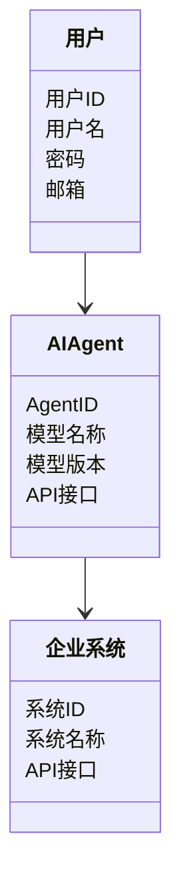
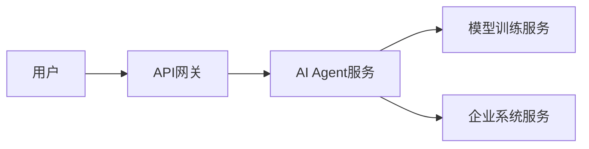
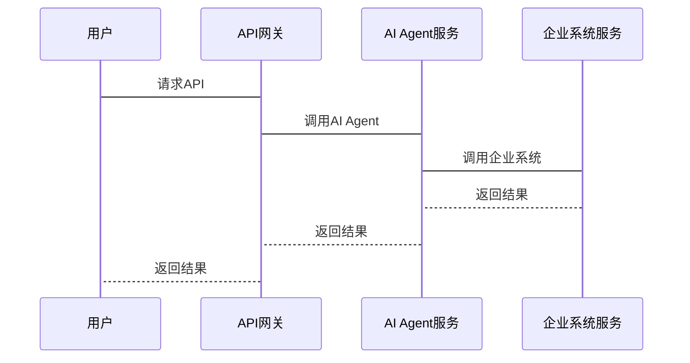
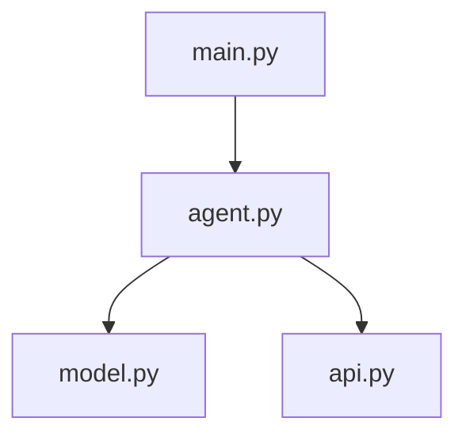

                 


# 《企业AI Agent的API设计与管理》

> 关键词：企业AI Agent, API设计, API管理, AI算法, 系统架构

> 摘要：本文深入探讨了企业AI Agent的API设计与管理的关键问题，从背景与概念、核心原理、设计与管理流程、系统架构设计、项目实战到最佳实践，系统性地分析了企业级AI Agent在API设计与管理中的挑战与解决方案。文章通过详细的技术分析、案例解析和代码实现，为读者提供了从理论到实践的全面指导。

---

# 第四部分: 企业AI Agent的系统分析与架构设计

# 第4章: 企业AI Agent的系统分析与架构设计

## 4.1 问题场景介绍
### 4.1.1 企业级AI Agent的应用场景
### 4.1.2 系统目标与功能需求
### 4.1.3 系统边界与外部实体

## 4.2 项目介绍
### 4.2.1 项目背景
### 4.2.2 项目目标
### 4.2.3 项目范围与约束条件

## 4.3 系统功能设计
### 4.3.1 领域模型设计


### 4.3.2 功能模块划分
#### 4.3.2.1 用户模块
#### 4.3.2.2 AI Agent模块
#### 4.3.2.3 企业系统模块

## 4.4 系统架构设计
### 4.4.1 架构风格选择
#### 4.4.1.1 分层架构
#### 4.4.1.2 微服务架构
#### 4.4.1.3 基于事件驱动的架构

### 4.4.2 系统架构图


### 4.4.3 关键组件设计
#### 4.4.3.1 API网关
#### 4.4.3.2 AI Agent服务
#### 4.4.3.3 模型训练服务
#### 4.4.3.4 企业系统服务

## 4.5 系统接口设计
### 4.5.1 API接口定义
#### 4.5.1.1 RESTful API设计
#### 4.5.1.2 GraphQL接口设计
#### 4.5.1.3 gRPC接口设计

### 4.5.2 接口交互流程图


## 4.6 本章小结

---

# 第五部分: 企业AI Agent的项目实战

# 第5章: 企业AI Agent的项目实战

## 5.1 环境安装与配置
### 5.1.1 系统环境要求
### 5.1.2 开发工具安装
### 5.1.3 依赖库安装
#### 5.1.3.1 Python库安装
#### 5.1.3.2 Docker环境搭建
#### 5.1.3.3 API框架选择

## 5.2 系统核心实现
### 5.2.1 AI Agent核心功能实现
#### 5.2.1.1 感知模块实现
#### 5.2.1.2 决策模块实现
#### 5.2.1.3 执行模块实现

### 5.2.2 API接口实现
#### 5.2.2.1 RESTful API实现
#### 5.2.2.2 GraphQL API实现
#### 5.2.2.3 gRPC API实现

## 5.3 代码实现与解读
### 5.3.1 代码结构


### 5.3.2 核心代码实现
#### 5.3.2.1 感知模块代码
```python
def感知模块():
    # 代码实现
    pass
```

#### 5.3.2.2 决策模块代码
```python
def决策模块():
    # 代码实现
    pass
```

#### 5.3.2.3 执行模块代码
```python
def执行模块():
    # 代码实现
    pass
```

### 5.3.3 代码解读与分析
#### 5.3.3.1 感知模块代码解读
#### 5.3.3.2 决策模块代码解读
#### 5.3.3.3 执行模块代码解读

## 5.4 实际案例分析
### 5.4.1 案例背景
### 5.4.2 案例分析
### 5.4.3 案例总结

## 5.5 本章小结

---

# 第六部分: 企业AI Agent的最佳实践与注意事项

# 第6章: 企业AI Agent的最佳实践

## 6.1 最佳实践
### 6.1.1 API设计的最佳实践
### 6.1.2 系统架构的最佳实践
### 6.1.3 AI模型管理的最佳实践

## 6.2 注意事项
### 6.2.1 数据安全与隐私保护
### 6.2.2 系统性能优化
### 6.2.3 API版本管理

## 6.3 拓展阅读
### 6.3.1 相关技术文档
### 6.3.2 行业最佳实践
### 6.3.3 进一步学习资源

## 6.4 本章小结

---

# 作者

作者：AI天才研究院/AI Genius Institute & 禅与计算机程序设计艺术 /Zen And The Art of Computer Programming

