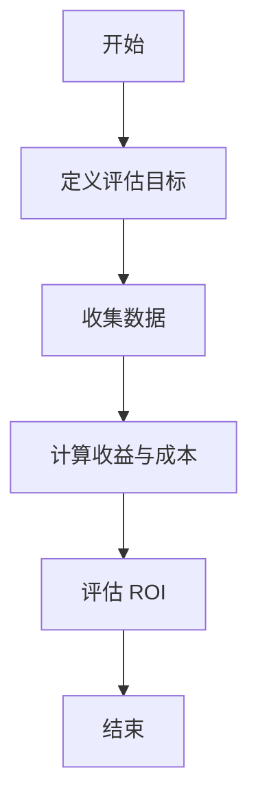
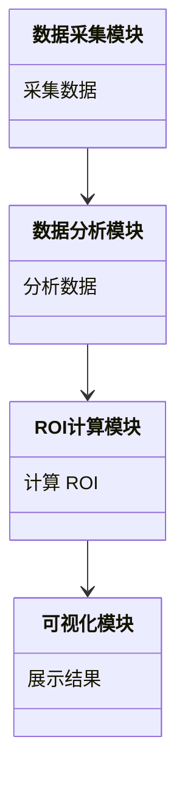

                 


# 企业AI Agent的ROI评估方法

> 关键词：企业AI Agent、ROI评估、投资回报率、AI技术、经济效益、系统架构、项目实战

> 摘要：企业AI Agent作为一种新兴的技术应用，正在改变企业的运营模式。本文将深入探讨企业AI Agent的 ROI（投资回报率）评估方法，从背景介绍、核心概念、算法原理、系统架构到项目实战，全面解析如何有效评估AI Agent的投资回报，为企业决策者提供实用的指导。

---

## 第一部分：企业AI Agent的背景与概念

### 第1章：企业AI Agent的背景与概述

#### 1.1 什么是企业AI Agent

企业AI Agent（Artificial Intelligence Agent）是一种能够感知环境、自主决策并执行任务的智能体。它结合了自然语言处理、机器学习和自动化技术，能够在企业场景中执行复杂任务，例如客户支持、流程自动化和数据分析。

**核心特征**：
- **自主性**：无需人工干预，自主执行任务。
- **反应性**：能够实时感知环境并做出响应。
- **目标导向**：基于目标驱动行为，优化决策。

**应用场景**：
- 客户服务：24/7的客户支持。
- 业务流程自动化：自动处理订单、审批流程。
- 数据分析：实时数据分析和预测。

#### 1.2 企业AI Agent的发展背景

随着AI技术的快速发展，企业AI Agent的应用越来越广泛。企业希望通过AI Agent提升效率、降低成本，并增强客户体验。然而，企业在投入大量资源开发和部署AI Agent的同时，也需要评估其投资回报率，以确保投资的合理性。

**AI技术的演进历程**：
- 从早期的规则引擎到现在的深度学习模型。
- 自然语言处理技术的进步使得AI Agent能够更自然地与人类交互。
- 云计算和大数据技术为企业AI Agent提供了强大的计算支持。

#### 1.3 企业AI Agent的 ROI 评估的重要性

评估企业AI Agent的 ROI 是确保投资收益的关键步骤。通过 ROI 评估，企业可以：

- 确定 AI Agent 的实际价值。
- 优化资源配置，最大化收益。
- 为未来的投资决策提供数据支持。

**ROI评估的常见挑战**：
- 数据获取的困难性。
- 评估指标的多样性。
- 长期收益与短期成本的平衡。

---

## 第二部分：企业AI Agent的 ROI 评估核心概念

### 第2章：企业AI Agent的核心概念与联系

#### 2.1 企业AI Agent的定义与特点

**定义**：企业AI Agent是为企业提供智能化服务的智能体，能够执行复杂的任务并优化企业运营。

**特点对比表**：

| 特性       | 传统IT系统 | 企业AI Agent |
|------------|------------|--------------|
| 自主性     | 低         | 高           |
| 反应性     | 低         | 高           |
| 学习能力   | 无         | 有           |
| 适应性     | 低         | 高           |

#### 2.2 ROI 评估的核心概念

**ROI公式**：
$$ ROI = \frac{净收益}{投资成本} \times 100\% $$

**评估维度**：
- **收益**：节省的成本、增加的收入。
- **成本**：开发、部署和维护成本。
- **时间**：投资回收期。

**关键指标**：
- 投资回收期（Payback Period）。
- 净现值（Net Present Value，NPV）。
- 内部收益率（Internal Rate of Return，IRR）。

#### 2.3 企业AI Agent与 ROI 评估的关系

企业AI Agent通过优化业务流程和提高效率，直接影响 ROI。 ROI 评估帮助企业量化 AI Agent 的价值，确保投资的合理性。

**流程图**：


---

## 第三部分：企业AI Agent的 ROI 评估方法

### 第3章：企业AI Agent的 ROI 评估框架

#### 3.1 评估框架的构建

**原则**：
- **目标导向**：确保评估目标与企业战略一致。
- **数据驱动**：基于实际数据进行评估。
- **动态调整**：根据实时数据优化评估框架。

**框架组成**：
- 数据采集模块。
- 数据分析模块。
- 评估计算模块。

#### 3.2 评估指标的选择

**收益指标**：
- 节省的人力成本。
- 提升的客户满意度。
- 增加的业务收入。

**成本指标**：
- 开发成本。
- 维护成本。
- 运行成本。

**时间因素**：
- 投资回收期。
- 项目周期。

#### 3.3 数据收集与处理

**数据来源**：
- 企业内部数据（如CRM系统）。
- 外部数据（如市场分析报告）。
- 人工收集数据（如客户反馈）。

**数据清洗**：
- 去除无效数据。
- 处理异常值。
- 数据标准化。

---

## 第四部分：企业AI Agent的 ROI 评估算法与模型

### 第4章：企业AI Agent的 ROI 

#### 4.1 ROI 计算公式

$$ ROI = \frac{净收益}{投资成本} \times 100\% $$

**净收益计算**：
$$ 净收益 = 收益 - 成本 $$

**案例分析**：
假设企业投资10万元开发AI Agent，一年后节省成本20万元，净收益为10万元，ROI为100%。

#### 4.2 投资回收期计算

$$ 投资回收期 = \frac{初始投资}{年均净收益} $$

**案例分析**：
初始投资为50万元，年均净收益为25万元，投资回收期为2年。

---

## 第五部分：系统分析与架构设计

### 第5章：系统功能设计

#### 5.1 系统功能模块

**功能模块**：
- 数据采集模块。
- 数据分析模块。
- ROI计算模块。
- 可视化模块。

**类图**：


---

## 第六部分：项目实战

### 第6章：项目实战与案例分析

#### 6.1 项目背景

某企业希望部署一个客服AI Agent，提升客户支持效率，减少人工成本。

#### 6.2 环境安装

```bash
# 安装Python和相关库
pip install numpy pandas scikit-learn matplotlib
```

#### 6.3 核心实现代码

```python
import numpy as np
import pandas as pd

# 模拟数据
data = {
    '投资成本': [100000],
    '收益': [200000],
    '净收益': [100000]
}

df = pd.DataFrame(data)

# ROI计算
roi = (df['净收益'] / df['投资成本']) * 100
print(f"ROI: {roi.values[0]}%")
```

#### 6.4 结果分析

$$ ROI = 100\% $$

---

## 第七部分：总结与展望

### 第7章：总结与最佳实践

#### 7.1 总结

企业AI Agent的 ROI 评估是确保投资收益的关键。通过科学的评估框架和方法，企业可以量化 AI Agent 的价值，优化资源配置。

#### 7.2 最佳实践

- 确保数据的准确性和完整性。
- 定期评估和调整 ROI 计算模型。
- 与企业战略目标保持一致。

---

## 作者

作者：AI天才研究院/AI Genius Institute & 禅与计算机程序设计艺术 /Zen And The Art of Computer Programming

