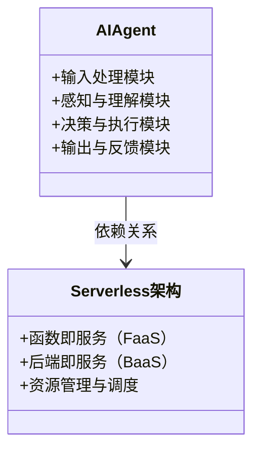
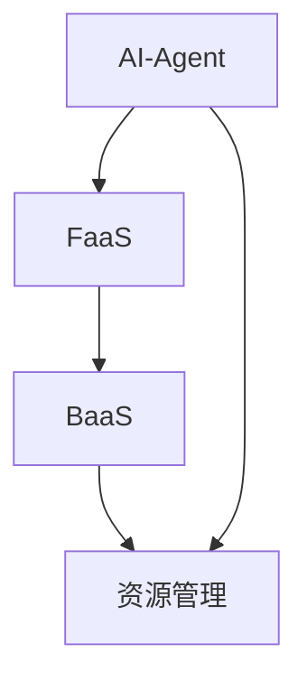
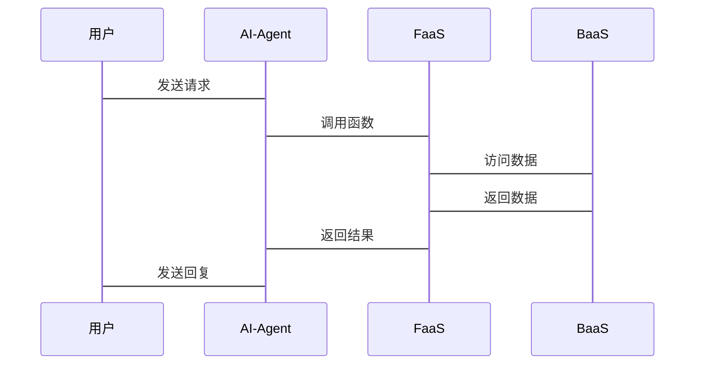

                 


# 企业AI Agent的Serverless架构设计

> 关键词：企业AI Agent、Serverless架构、无服务器计算、云函数、AI服务设计

> 摘要：本文详细探讨了企业AI Agent在Serverless架构下的设计与实现。通过分析AI Agent的核心功能与Serverless架构的特点，提出了结合两者优势的架构设计方案，并通过实际案例展示了如何在企业中高效部署和优化AI Agent服务。

---

## 第一章: 企业AI Agent与Serverless概述

### 1.1 企业AI Agent的定义与背景

#### 1.1.1 什么是企业AI Agent
企业AI Agent（Artificial Intelligence Agent）是一种能够感知环境、自主决策并执行任务的智能体。它结合了自然语言处理（NLP）、机器学习（ML）和规则引擎，能够理解用户需求并提供智能化服务。

#### 1.1.2 AI Agent的核心功能与特点
- **感知与理解**：通过NLP技术解析用户输入，识别意图和实体。
- **决策与推理**：基于预设规则和机器学习模型做出决策。
- **执行与反馈**：通过调用后端服务执行任务，并根据反馈优化行为。

#### 1.1.3 企业AI Agent的应用场景
- 客户服务：智能客服、自动回复。
- 业务自动化：自动化审批、流程管理。
- 数据分析：智能报告生成、数据洞察。

### 1.2 Serverless架构的基本概念

#### 1.2.1 什么是Serverless架构
Serverless架构是一种云计算模型，通过将后端服务以函数的形式托管在云平台上，开发者无需管理服务器，只需关注业务逻辑。

#### 1.2.2 Serverless架构的优势与劣势
- **优势**：
  - 资源按需分配，成本低。
  - 开发效率高，无需运维。
  - 弹性扩展能力强。
- **劣势**：
  - 依赖第三方平台，灵活性差。
  - 高频调用可能产生额外成本。

#### 1.2.3 Serverless架构的发展趋势
随着云计算的普及，Serverless架构因其灵活性和成本优势，正在被越来越多的企业采用，尤其是在AI服务领域。

### 1.3 企业AI Agent与Serverless架构的结合

#### 1.3.1 为什么选择Serverless架构
- Serverless架构能够快速部署AI Agent服务，无需管理底层服务器。
- 支持弹性扩展，应对高并发请求。

#### 1.3.2 Serverless架构如何支持AI Agent
- 提供函数即服务（FaaS），支持AI模型的调用。
- 提供后端即服务（BaaS），简化数据存储和接口管理。

#### 1.3.3 企业AI Agent的Serverless架构特点
- **按需扩展**：根据请求量自动扩展资源。
- **快速部署**：通过云平台快速发布AI服务。
- **成本优化**：按使用量付费，避免资源浪费。

## 第二章: 企业AI Agent的核心概念

### 2.1 AI Agent的结构与功能模块

#### 2.1.1 输入处理模块
- **功能**：解析用户输入，提取意图和实体。
- **实现**：使用NLP技术（如分词、实体识别）处理用户请求。

#### 2.1.2 感知与理解模块
- **功能**：通过上下文理解用户需求。
- **实现**：基于预训练模型（如BERT）进行语义理解。

#### 2.1.3 决策与执行模块
- **功能**：根据理解的结果，调用后端服务执行任务。
- **实现**：通过规则引擎或机器学习模型做出决策。

#### 2.1.4 输出与反馈模块
- **功能**：生成自然语言回复，并收集用户反馈优化模型。

### 2.2 Serverless架构的核心要素

#### 2.2.1 函数即服务（FaaS）
- **功能**：提供函数执行环境，支持AI模型的调用。
- **实现**：通过云平台（如AWS Lambda）部署函数。

#### 2.2.2 后端即服务（BaaS）
- **功能**：提供数据库、消息队列等服务。
- **实现**：通过云数据库（如AWS DynamoDB）存储数据。

#### 2.2.3 资源管理与调度
- **功能**：动态分配计算资源，优化性能。
- **实现**：通过容器编排工具（如Kubernetes）管理资源。

### 2.3 企业AI Agent与Serverless架构的交互关系

#### 2.3.1 AI Agent的请求流程
1. 用户发送请求到AI Agent。
2. AI Agent解析请求，生成响应。
3. 响应通过Serverless函数返回给用户。

#### 2.3.2 Serverless架构的资源分配
- 根据请求量动态分配计算资源。
- 使用弹性伸缩功能优化资源使用。

#### 2.3.3 两者结合的优化策略
- 使用缓存技术减少重复计算。
- 通过负载均衡优化请求分发。

## 第三章: 企业AI Agent的Serverless架构设计原理

### 3.1 企业AI Agent的Serverless架构模型

#### 3.1.1 模型输入与处理
- **输入**：用户请求（文本或语音）。
- **处理**：通过NLP技术解析请求，提取意图和实体。

#### 3.1.2 模型推理与计算
- **推理**：基于预训练模型生成回复。
- **计算**：通过Serverless函数调用后端服务。

#### 3.1.3 结果输出与反馈
- **输出**：生成自然语言回复。
- **反馈**：收集用户反馈优化AI模型。

### 3.2 Serverless架构下的资源分配与调度

#### 3.2.1 资源动态分配
- 根据请求量动态分配计算资源。
- 使用弹性伸缩优化资源使用。

#### 3.2.2 负载均衡与弹性伸缩
- **负载均衡**：均匀分发请求，避免单点过载。
- **弹性伸缩**：根据请求量自动扩展或收缩资源。

#### 3.2.3 资源使用优化
- 使用缓存技术减少重复计算。
- 通过容器化技术优化资源利用率。

### 3.3 企业AI Agent的Serverless架构优化策略

#### 3.3.1 并行计算优化
- 使用分布式计算技术提高处理效率。
- 通过消息队列优化任务分发。

#### 3.3.2 资源复用优化
- 复用计算资源，减少资源浪费。
- 通过共享存储优化数据访问。

#### 3.3.3 成本控制优化
- 优化资源分配策略，降低运营成本。
- 使用定价模型优化成本结构。

## 第四章: 企业AI Agent的Serverless架构实现

### 4.1 企业AI Agent的Serverless架构实现

#### 4.1.1 环境安装
- 安装云开发环境（如AWS Cloud9）。
- 配置Serverless函数运行环境。

#### 4.1.2 系统功能设计

##### 4.1.2.1 领域模型设计
- 使用Mermaid类图展示系统功能模块之间的关系。


##### 4.1.2.2 系统架构设计
- 使用Mermaid架构图展示系统整体架构。


##### 4.1.2.3 系统接口设计
- 使用Mermaid序列图展示系统交互流程。


#### 4.1.3 核心代码实现

##### 4.1.3.1 Python代码示例
```python
def handle_request(event, context):
    # 解析用户请求
    request = event['request']
    # 调用NLP模型
    response = model.predict(request)
    # 返回结果
    return {
        'response': response
    }
```

##### 4.1.3.2 算法原理
- 使用预训练的BERT模型进行文本解析。
- 通过注意力机制（Attention）生成回复。

##### 4.1.3.3 数学模型
- **注意力机制公式**：
  $$ \text{Attention}(Q, K, V) = \text{softmax}\left(\frac{QK^T}{\sqrt{d_k}}\right)V $$
- **损失函数**：
  $$ \text{Loss} = -\frac{1}{N}\sum_{i=1}^{N}\text{log}p(x_i) $$

#### 4.1.4 案例分析
- **案例背景**：企业客服系统。
- **实现步骤**：
  1. 部署AI Agent处理客户请求。
  2. 使用Serverless函数调用后端服务。
  3. 收集用户反馈优化模型。

#### 4.1.5 项目总结
- 通过Serverless架构实现了高效的AI Agent服务。
- 使用了NLP技术和机器学习模型优化了服务性能。

## 第五章: 最佳实践与小结

### 5.1 最佳实践

#### 5.1.1 注意事项
- 选择合适的云平台和服务。
- 定期监控系统性能。
- 优化资源使用策略。

#### 5.1.2 实施建议
- 从小规模试点开始，逐步扩大。
- 使用自动化工具简化部署和运维。

### 5.2 小结

企业AI Agent的Serverless架构设计通过结合AI技术与云计算的优势，为企业提供了高效、灵活的智能化服务。本文详细探讨了AI Agent的核心功能、Serverless架构的特点，以及两者结合的优化策略。通过实际案例展示了如何在企业中高效部署和优化AI Agent服务。

---

## 作者

作者：AI天才研究院 & 禅与计算机程序设计艺术

通过以上思考过程，可以系统地撰写一篇详细的技术博客文章，涵盖企业AI Agent的Serverless架构设计的各个方面，从背景介绍到项目实战，确保内容完整且逻辑清晰。

