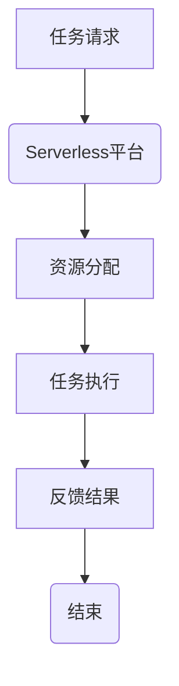
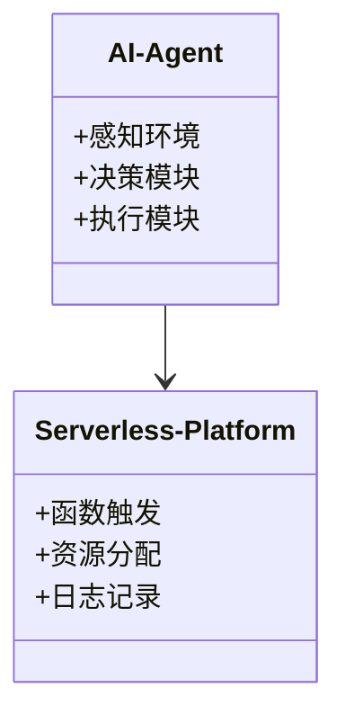
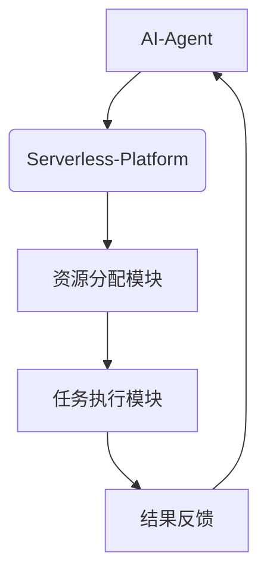
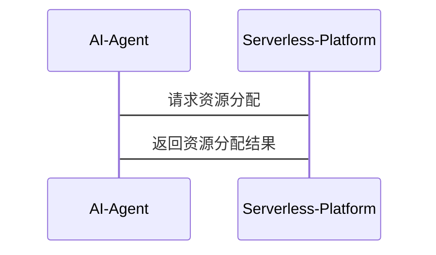

                 


# 《企业AI Agent的serverless计算资源调度》

> **关键词**：企业AI Agent，serverless，计算资源调度，资源分配算法，系统架构设计

> **摘要**：本文深入探讨了企业AI Agent在Serverless计算环境下的资源调度问题。首先，我们从问题背景出发，分析了AI Agent与Serverless计算的结合需求。接着，详细阐述了核心概念、原理及对比分析，提出了基于动态资源分配的算法。通过系统架构设计和项目实战，展示了如何在实际场景中实现高效的资源调度。最后，总结了最佳实践和未来的研究方向。

---

## 第一章：企业AI Agent的Serverless计算资源调度概述

### 1.1 问题背景与描述
#### 1.1.1 企业AI Agent的发展现状
随着人工智能技术的快速发展，企业AI Agent（智能代理）的应用场景越来越广泛。AI Agent能够通过感知环境、自主决策并执行任务，为企业提供智能化的解决方案。然而，AI Agent的运行依赖于高效的计算资源调度，传统的计算架构难以满足其动态扩展和资源弹性需求。

#### 1.1.2 Serverless计算的兴起与特点
Serverless计算是一种新兴的计算模式，它通过将计算资源的管理外包给云服务提供商，使得开发者无需关注服务器的运维。Serverless计算的特点包括：
- 按需扩展：资源自动分配，按需使用。
- 无服务器管理：开发者只需关注业务逻辑。
- 高度可扩展性：适用于高并发场景。

#### 1.1.3 AI Agent与Serverless计算的结合需求
AI Agent的智能化和动态性要求其能够快速响应任务请求，并根据负载动态调整资源。Serverless计算的按需扩展和无服务器管理特点，正好能够满足这一需求。因此，研究AI Agent在Serverless环境下的资源调度问题具有重要意义。

---

### 1.2 问题解决与边界
#### 1.2.1 AI Agent在企业中的应用场景
- **订单处理与优化**：AI Agent可以根据实时数据优化订单处理流程。
- **库存管理**：通过预测库存需求，AI Agent可以自动调整库存策略。
- **客户交互**：AI Agent可以处理客户咨询、推荐产品等任务。

#### 1.2.2 Serverless计算在资源调度中的优势
- **弹性扩展**：Serverless可以根据负载自动调整资源分配。
- **按需付费**：仅支付实际使用的资源，降低运营成本。
- **高可用性**：Serverless平台通常提供高可用性的保证。

#### 1.2.3 问题的边界与外延
- **边界**：资源调度仅针对计算资源（CPU、内存），不涉及存储或其他资源。
- **外延**：未来可以扩展到其他资源类型，如存储和网络资源。

---

### 1.3 核心概念与组成
#### 1.3.1 AI Agent的基本定义
AI Agent是一种能够感知环境、自主决策并执行任务的智能实体。它通常包括感知模块、决策模块和执行模块。

#### 1.3.2 Serverless计算的核心要素
Serverless计算的核心要素包括函数即服务（FaaS）、事件驱动触发、自动扩缩容等。

#### 1.3.3 两者的结合与协同
AI Agent与Serverless计算的结合主要体现在资源调度、任务执行和动态扩展方面。AI Agent通过Serverless平台实现资源的动态分配和任务的高效执行。

---

## 第二章：AI Agent与Serverless计算的关系

### 2.1 AI Agent的功能特性
#### 2.1.1 智能决策能力
AI Agent能够基于环境数据做出最优决策。

#### 2.1.2 自动执行能力
AI Agent可以自主执行任务，无需人工干预。

#### 2.1.3 可扩展性
AI Agent可以根据负载动态扩展资源。

### 2.2 Serverless计算的特点
#### 2.2.1 资源按需分配
Serverless计算可以根据任务需求自动分配资源。

#### 2.2.2 无服务器管理
开发者无需管理服务器，只需关注业务逻辑。

#### 2.2.3 高度可扩展性
Serverless计算能够处理高并发任务，且自动扩缩容。

### 2.3 两者结合的必要性
#### 2.3.1 提高资源利用率
通过Serverless计算，AI Agent可以按需使用资源，避免资源浪费。

#### 2.3.2 降低运营成本
Serverless计算按需付费，降低了企业的运营成本。

#### 2.3.3 提升系统灵活性
AI Agent可以通过Serverless计算快速响应需求变化，提升系统的灵活性。

---

## 第三章：核心概念原理与对比分析

### 3.1 核心概念原理
#### 3.1.1 AI Agent的决策机制
AI Agent通过感知环境数据，利用算法（如强化学习、遗传算法）做出决策。

#### 3.1.2 Serverless计算的资源调度机制
Serverless平台通过函数触发机制和资源分配算法动态分配计算资源。

#### 3.1.3 两者的协同工作
AI Agent通过Serverless平台触发函数，执行任务并反馈结果，形成闭环。

### 3.2 概念属性特征对比分析

| **特性**       | **AI Agent**             | **Serverless计算**        |
|-----------------|--------------------------|---------------------------|
| 资源管理         | 自动化，依赖平台           | 自动化，按需分配           |
| 扩展性           | 高度可扩展               | 高度可扩展               |
| 响应时间         | 快速响应                 | 快速响应                 |
| 成本             | 按任务付费               | 按资源使用付费           |

### 3.3 ER实体关系图

```mermaid
erd
    title AI Agent与Serverless计算的关系
    Hospital(hospital_id, name, location)
    Doctor(doctor_id, name, specialty)
    belongsTo(Hospital, Doctor, doctor_id, hospital_id)
```

---

## 第四章：算法原理讲解

### 4.1 调度算法流程图



### 4.2 Python代码实现

```python
def resource_allocator(request_type):
    # 根据请求类型分配资源
    if request_type == 'high_priority':
        return 'Allocate更多资源'
    else:
        return '按需分配资源'

# 示例调用
print(resource_allocator('high_priority'))  # 输出：Allocate更多资源
```

### 4.3 数学模型与公式
调度算法的数学模型如下：

$$
\text{资源分配量} = \text{函数}(请求类型, 当前负载)
$$

其中，函数可以根据具体需求进行调整，例如使用线性回归模型或强化学习模型。

---

## 第五章：系统分析与架构设计

### 5.1 问题场景介绍
假设我们有一个在线零售系统，AI Agent需要处理大量的订单请求。Serverless计算需要动态分配资源以满足高并发需求。

### 5.2 系统功能设计
#### 5.2.1 领域模型类图



### 5.3 系统架构设计



### 5.4 系统接口设计
主要接口包括：
- `allocate_resource(type)`：根据任务类型分配资源。
- `trigger_function(event)`：根据事件触发函数。

### 5.5 系统交互序列图



---

## 第六章：项目实战

### 6.1 环境安装
需要安装以下工具：
- Python 3.8+
- AWS Lambda（或其他Serverless平台）
- 依赖管理工具（如pip）

### 6.2 核心实现代码

```python
import boto3

def allocate_resource(event, context):
    # 获取请求类型
    request_type = event['request_type']
    
    # 根据请求类型分配资源
    if request_type == 'high_priority':
        return {'status': 'success', 'message': '资源分配成功'}
    else:
        return {'status': 'success', 'message': '按需分配资源'}
```

### 6.3 代码应用解读
上述代码是一个简单的资源分配函数，可以根据请求类型动态分配资源。AI Agent调用该函数，根据返回结果执行任务。

### 6.4 案例分析
假设我们有一个订单处理系统，AI Agent需要处理大量的订单请求。通过Serverless计算，我们可以根据请求类型（如紧急订单、普通订单）动态分配资源，提高处理效率。

### 6.5 项目小结
通过实际案例，我们可以看到Serverless计算在资源调度中的巨大优势，尤其是在处理高并发任务时，能够快速响应并动态调整资源。

---

## 第七章：总结与展望

### 7.1 最佳实践
- **合理选择Serverless平台**：根据具体需求选择合适的平台。
- **优化资源分配算法**：通过机器学习优化资源分配策略。
- **监控与日志管理**：实时监控系统运行状态，及时发现和解决问题。

### 7.2 小结
本文深入探讨了企业AI Agent在Serverless计算环境下的资源调度问题，提出了基于动态资源分配的算法，并通过系统架构设计和项目实战展示了其可行性。

### 7.3 注意事项
- **资源分配的公平性**：需要避免某些任务占用过多资源，影响其他任务的执行。
- **安全性问题**：确保Serverless平台的安全性，防止数据泄露。

### 7.4 拓展阅读
- 《Serverless Computing: From Research to Practice》
- 《AI Agent: Theory and Practice》

---

## 作者信息
作者：AI天才研究院 & 禅与计算机程序设计艺术

