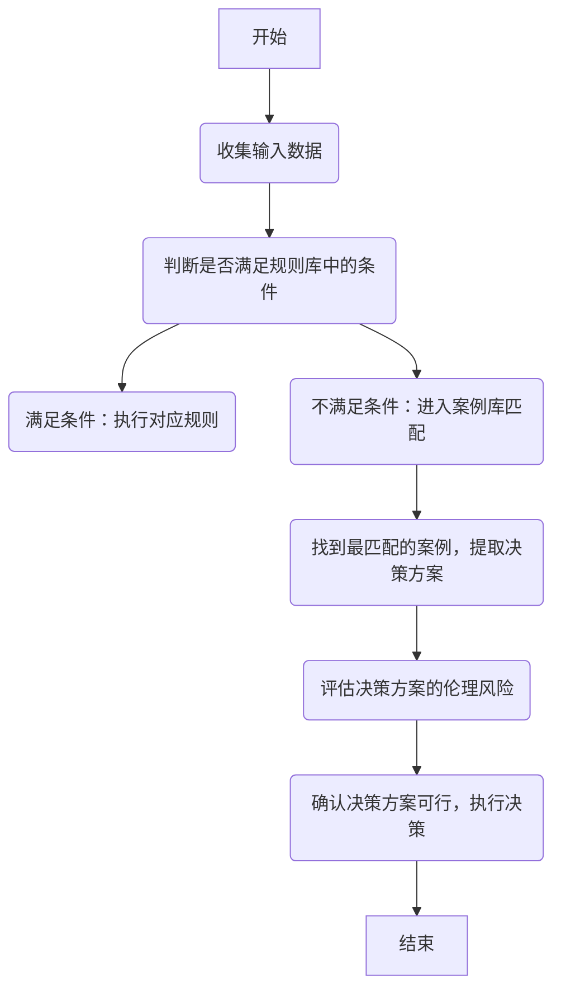
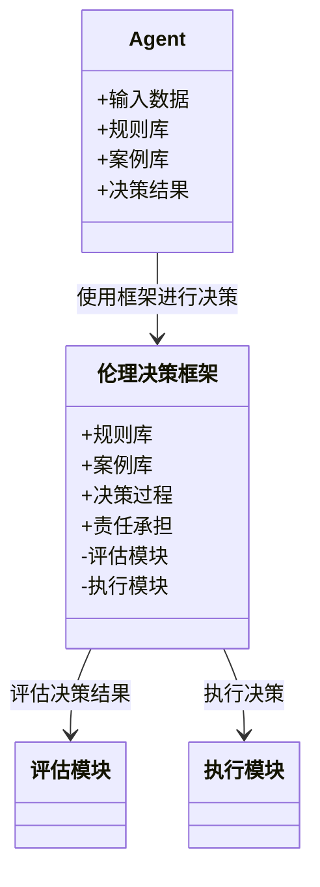

                 


# 《企业AI Agent的伦理决策框架》

---

## 关键词  
企业AI Agent、伦理决策框架、伦理原则、利益相关者、决策模型、系统设计、数学建模

---

## 摘要  
随着人工智能技术的快速发展，企业AI Agent在决策过程中面临的伦理问题日益凸显。本文旨在构建一个系统化的伦理决策框架，通过分析伦理原则、利益相关者和决策过程的核心要素，结合算法原理和数学模型，提出一种适用于企业AI Agent的伦理决策方案。本文还提供了实际案例分析和系统架构设计，以帮助企业在AI Agent的决策过程中实现伦理与效率的平衡。

---

## 正文

---

### 第一部分: 企业AI Agent的伦理决策框架概述

#### 第1章: 企业AI Agent的背景与现状

##### 1.1 AI Agent的定义与特点  
AI Agent（人工智能代理）是指能够感知环境、自主决策并执行任务的智能体。它具备以下特点：  
1. **自主性**：能够在没有外部干预的情况下独立运作。  
2. **反应性**：能够实时感知环境变化并做出响应。  
3. **目标导向**：具备明确的目标，并通过决策和行动来实现目标。  
4. **学习能力**：能够通过数据和经验不断优化自身行为。  

##### 1.2 企业AI Agent的应用场景  
企业AI Agent的应用场景广泛，主要包括：  
1. **智能客服**：通过自然语言处理技术为用户提供个性化的服务。  
2. **供应链管理**：优化库存、物流和订单处理流程。  
3. **风险管理**：实时监控并预测潜在的市场和运营风险。  
4. **决策支持**：辅助企业高管制定战略决策。  

##### 1.3 伦理决策的重要性  
在企业AI Agent的决策过程中，伦理问题尤为重要。例如：  
1. **自动驾驶汽车**：在紧急情况下，如何在保护乘客和减少伤害之间做出选择？  
2. **金融交易**：AI Agent在高频交易中如何避免操纵市场？  
3. **隐私保护**：如何在数据使用和隐私保护之间找到平衡？  

伦理决策的缺失可能导致法律风险、公众信任下降甚至企业声誉受损。因此，构建一个系统的伦理决策框架是必要的。

---

#### 第2章: 伦理决策框架的核心概念

##### 2.1 伦理决策框架的定义  
伦理决策框架是一种用于指导AI Agent在决策过程中考虑伦理因素的系统化方法。它包括以下核心要素：  
1. **伦理原则**：如诚实、公正、不伤害他人等。  
2. **利益相关者**：包括用户、企业、社会等。  
3. **决策过程**：从数据收集到最终决策的全过程。  
4. **责任承担**：明确各方在决策中的责任。  

##### 2.2 伦理决策框架的属性特征对比  
以下是不同伦理决策框架的对比：  

| 框架名称       | 基于规则 | 基于案例 | 基于后果 |  
|----------------|----------|----------|----------|  
| 适用场景       | 简单明了的决策 | 复杂场景下的类比推理 | 动态环境下的权衡 |  
| 优势           | 易实现，规则清晰 | 灵活性高，适合复杂问题 | 结果导向，适合紧急情况 |  
| 动态适应性     | 较低 | 较高 | 较高 |  

##### 2.3 伦理决策框架的ER实体关系图  
以下是伦理决策框架的ER实体关系图：  

```mermaid
er
    actor(Agent, 决策者, 利益相关者)
    concept(伦理原则, 决策过程, 责任承担)
    rule(规则库, 案例库, 后果评估)
    relationship(Agent -- 决策者, 决策者 -- 利益相关者, 伦理原则 -- 决策过程)
```

---

### 第二部分: 伦理决策框架的算法原理

#### 第3章: 伦理决策框架的算法原理

##### 3.1 伦理决策框架的基本算法  
伦理决策框架的算法主要分为两类：  
1. **基于规则的伦理决策算法**  
2. **基于案例的伦理决策算法**  

##### 3.2 伦理决策算法的实现  
以下是基于规则的伦理决策算法的流程图：  



以下是基于规则的伦理决策算法的Python代码示例：  

```python
def ethical_decision_agent(inputs):
    # 收集输入数据
    data = inputs
    
    # 判断是否满足规则库中的条件
    for rule in rule库:
        if rule.apply(data):
            # 执行对应规则
            return rule.execute(data)
    
    # 进入案例库匹配
    for case in 案例库:
        if case.match(data):
            # 提取决策方案
            decision = case.get_decision(data)
            # 评估决策方案的伦理风险
            if decision.伦理风险 <= 阈值:
                return decision
    
    # 默认决策方案
    return 默认方案
```

##### 3.3 伦理决策算法的数学模型  
以下是伦理决策算法的数学模型：  

$$ \text{伦理风险} = \sum_{i=1}^{n} (\text{权重}_i \times \text{风险因素}_i) $$  

其中，权重是根据伦理原则和利益相关者的权重分配，风险因素是具体决策的伦理影响因素。

---

### 第三部分: 系统分析与架构设计方案

#### 第4章: 问题场景与系统功能设计

##### 4.1 问题场景介绍  
企业AI Agent在决策过程中可能面临的伦理困境包括：  
1. **数据隐私**：如何在数据分析中保护用户隐私？  
2. **责任归属**：当AI Agent的决策导致损失时，责任如何划分？  
3. **利益冲突**：如何在不同利益相关者之间平衡利益？  

##### 4.2 系统功能设计  
以下是系统功能设计的领域模型：  



##### 4.3 系统架构设计  
以下是系统架构设计的mermaid图：  


---

### 第四部分: 项目实战

#### 第5章: 项目实战与案例分析

##### 5.1 环境安装与配置  
1. 安装Python和相关库（如numpy、pandas、scikit-learn）。  
2. 安装mermaid工具和latex编译器。  

##### 5.2 核心代码实现  
以下是伦理决策框架的核心代码：  

```python
import numpy as np
from sklearn.linear_model import LogisticRegression

class EthicalDecisionFramework:
    def __init__(self):
        self.rule_base = []
        self.case_base = []
        self.assessment_module = LogisticRegression()
    
    def add_rule(self, rule):
        self.rule_base.append(rule)
    
    def add_case(self, case):
        self.case_base.append(case)
    
    def assess_risk(self, decision):
        # 训练伦理风险评估模型
        self.assessment_module.fit(X, y)
        # 预测伦理风险
        risk = self.assessment_module.predict_proba(decision)
        return risk
```

##### 5.3 案例分析与解读  
以自动驾驶汽车为例，假设在紧急情况下，AI Agent需要在以下两种决策中选择：  
1. 碰撞行人以避免严重伤亡。  
2. 车内乘客受伤，但行人无伤亡。  

通过伦理决策框架，AI Agent可以根据伦理原则（如最小化伤害）和利益相关者（如乘客、行人）进行权衡，选择最优决策。

##### 5.4 项目小结  
通过项目实战，我们可以看到伦理决策框架在实际应用中的可行性和有效性。然而，实际应用中仍需考虑数据的动态变化和模型的可解释性。

---

### 第五部分: 最佳实践与总结

#### 第6章: 最佳实践与注意事项

##### 6.1 最佳实践  
1. **明确伦理原则**：确保AI Agent的决策符合企业的核心价值观。  
2. **动态更新模型**：根据实际情况不断优化伦理决策框架。  
3. **透明化决策过程**：确保利益相关者能够理解AI Agent的决策逻辑。  

##### 6.2 注意事项  
1. **数据隐私**：在数据收集和分析过程中，必须严格遵守隐私保护法规。  
2. **模型可解释性**：确保伦理决策框架的决策过程清晰透明。  
3. **法律合规**：确保AI Agent的决策符合相关法律法规。  

#### 第7章: 小结与未来展望  
本文构建了一个系统化的伦理决策框架，通过算法原理、系统设计和项目实战，展示了如何在企业AI Agent的决策过程中实现伦理与效率的平衡。未来，随着AI技术的不断发展，伦理决策框架也将变得更加复杂和精细。

---

## 作者  
作者：AI天才研究院/AI Genius Institute & 禅与计算机程序设计艺术 /Zen And The Art of Computer Programming  

---

以上是《企业AI Agent的伦理决策框架》的完整目录大纲及文章内容，希望对您有所帮助！

