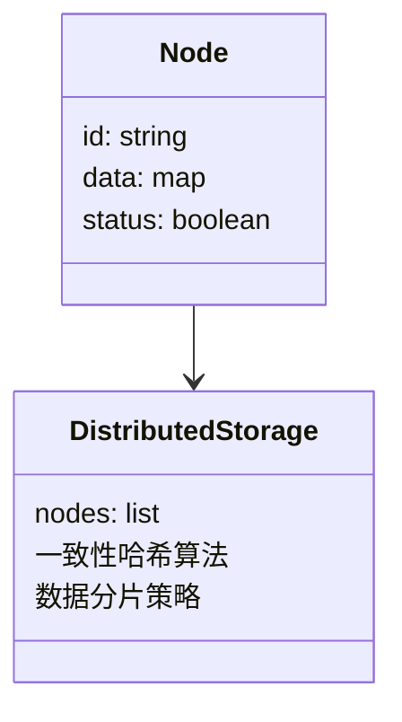
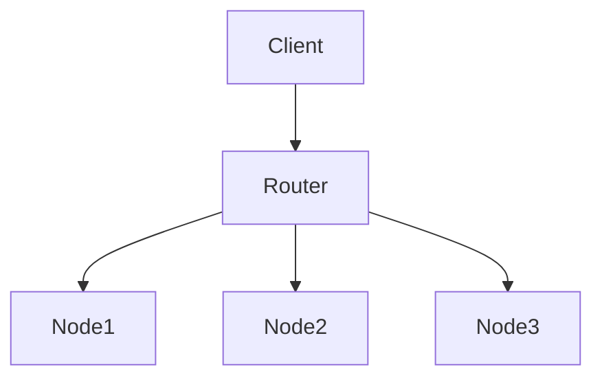
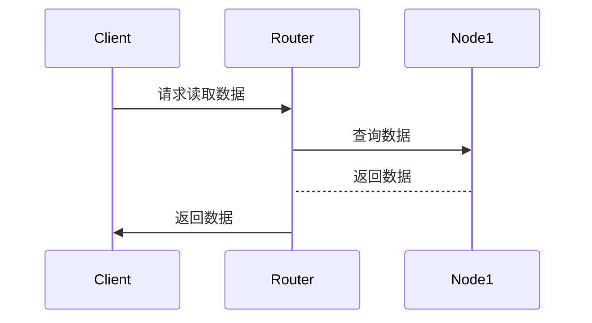

                 


# 企业AI Agent的分布式存储系统设计

> 关键词：企业AI Agent，分布式存储系统，一致性哈希，数据分片，高可用性

> 摘要：本文详细探讨了企业AI Agent在分布式存储系统中的设计与实现，从核心概念、算法原理到系统架构，结合实际案例，为企业AI Agent的分布式存储系统设计提供全面的指导和参考。

---

# 第一部分: 企业AI Agent的分布式存储系统背景与基础

## 第1章: 企业AI Agent与分布式存储系统概述

### 1.1 企业AI Agent的定义与特点

#### 1.1.1 什么是企业AI Agent
企业AI Agent是一种智能代理系统，能够理解并执行企业级的任务，具备自主决策、学习和优化能力。企业AI Agent通过与企业内部系统和外部环境交互，实现自动化操作和智能决策。

#### 1.1.2 企业AI Agent的核心特点
- **自主性**：能够自主决策和执行任务。
- **反应性**：能够实时感知环境变化并做出反应。
- **学习性**：能够通过数据学习和优化自身行为。
- **协作性**：能够与其他系统或AI Agent协作完成复杂任务。

#### 1.1.3 企业AI Agent与传统AI的区别
企业AI Agent不仅具备传统AI的数据处理能力，还能够通过自主决策和协作完成复杂的业务任务，具有更强的适应性和灵活性。

### 1.2 分布式存储系统的定义与特点

#### 1.2.1 分布式存储的定义
分布式存储是一种将数据分散存储在多个独立节点上的存储方式，每个节点负责一部分数据的存储和管理。

#### 1.2.2 分布式存储的核心特点
- **高扩展性**：能够轻松扩展存储容量和处理能力。
- **高可用性**：即使部分节点故障，系统仍能正常运行。
- **数据一致性**：确保所有节点的数据保持一致。

#### 1.2.3 分布式存储与集中式存储的对比
| 特性          | 分布式存储          | 集中式存储          |
|---------------|--------------------|---------------------|
| 扩展性        | 强                | 弱                  |
| 可用性        | 高                | 低                  |
| 数据一致性    | 易管理            | 难管理              |
| 故障恢复      | 快                | 慢                  |

### 1.3 企业AI Agent与分布式存储的关系

#### 1.3.1 企业AI Agent对存储系统的需求
企业AI Agent需要处理大量的数据，包括任务日志、用户数据、模型参数等，对存储系统的容量、性能和可靠性提出更高要求。

#### 1.3.2 分布式存储在企业AI Agent中的作用
- 提供高扩展性和可用性的存储解决方案。
- 支持大规模数据存储和快速数据访问。
- 保证数据一致性，避免数据冲突和不一致问题。

#### 1.3.3 企业AI Agent与分布式存储的结合场景
- 数据采集与存储：企业AI Agent从多个数据源采集数据，并通过分布式存储系统进行存储。
- 模型训练与推理：企业AI Agent利用分布式存储中的数据进行模型训练，并通过分布式计算进行推理。
- 任务调度与管理：企业AI Agent通过分布式存储系统进行任务调度和状态管理。

### 1.4 本章小结
本章介绍了企业AI Agent和分布式存储系统的定义、特点以及它们之间的关系，为后续章节的分析奠定了基础。

---

## 第2章: 分布式存储系统的核心概念

### 2.1 分布式存储系统的组成与结构

#### 2.1.1 分布式存储系统的组成要素
- **存储节点**：负责存储和管理数据的物理设备。
- **网络通信**：节点之间的数据传输和通信通道。
- **数据分片**：将数据分割成多个部分，存储在不同的节点上。
- **一致性协议**：确保所有节点的数据一致性的协议。

#### 2.1.2 分布式存储系统的层次结构
- **数据层**：存储实际数据。
- **网络层**：处理节点之间的通信。
- **协议层**：定义数据分片、一致性等规则。
- **应用层**：提供API或接口供企业AI Agent调用。

#### 2.1.3 分布式存储系统的核心组件
- **数据分片器**：将数据分割成多个片。
- **一致性哈希**：确保数据分片的均匀分布。
- **节点管理器**：管理分布式存储系统的节点。
- **数据访问接口**：提供读写数据的API。

### 2.2 分布式存储系统的关键特性

#### 2.2.1 分布式存储的可扩展性
通过增加节点数量，分布式存储系统可以轻松扩展存储容量和处理能力。

#### 2.2.2 分布式存储的高可用性
即使部分节点发生故障，系统仍能正常运行，确保数据的可用性。

#### 2.2.3 分布式存储的数据一致性
通过一致性协议，确保所有节点的数据保持一致。

### 2.3 分布式存储系统的设计原则

#### 2.3.1 分布式系统的设计目标
- **可扩展性**：支持数据量的增长。
- **高可用性**：确保系统稳定运行。
- **数据一致性**：保证数据的正确性。

#### 2.3.2 分布式系统的设计挑战
- **数据一致性**：如何保证所有节点的数据一致。
- **节点故障恢复**：如何处理节点故障和数据重建。
- **性能优化**：如何提高数据访问效率。

#### 2.3.3 分布式系统的设计优化
- **数据分片**：通过数据分片减少单节点的负载。
- **负载均衡**：通过负载均衡算法分配数据访问压力。
- **一致性协议**：选择合适的一致性协议确保数据一致性。

---

## 第3章: 分布式存储系统的算法原理

### 3.1 分布式存储系统中的数据分片算法

#### 3.1.1 数据分片的基本概念
数据分片是将数据分割成多个部分，存储在不同的节点上，以提高存储效率和数据访问速度。

#### 3.1.2 常见的数据分片算法
- **随机分片**：随机分配数据到不同的节点。
- **哈希分片**：通过哈希函数将数据映射到特定的节点。
- **范围分片**：将数据按范围分配到不同的节点。

#### 3.1.3 数据分片算法的优缺点对比
| 算法类型   | 优点               | 缺点               |
|------------|--------------------|--------------------|
| 随机分片   | 实现简单           | 数据分布不均       |
| 哈希分片   | 数据分布均匀       | 实现复杂           |
| 范围分片   | 数据访问速度快     | 数据分布不灵活     |

#### 3.1.4 数据分片的实现步骤
1. 将数据分割成多个片。
2. 使用哈希函数将每个片分配到不同的节点。
3. 确保数据片的均匀分布。

### 3.2 分布式存储系统中的一致性哈希算法

#### 3.2.1 一致性哈希的定义与作用
一致性哈希是一种分布式哈希技术，用于将数据均匀地分布到多个节点上，同时保证节点故障时数据的重新分布。

#### 3.2.2 一致性哈希的实现原理
一致性哈希通过将节点和数据映射到一个虚拟环上，确保数据的均匀分布。

#### 3.2.3 一致性哈希在分布式存储中的应用
- **负载均衡**：通过一致性哈希实现数据的均匀分布。
- **节点故障恢复**：通过一致性哈希实现数据的重新分布。

#### 3.2.4 一致性哈希的优缺点
| 优点               | 缺点               |
|--------------------|--------------------|
| 数据分布均匀       | 实现复杂           |
| 节点故障时数据重新分布 | 维护数据一致性需要额外的开销 |

---

## 第4章: 分布式存储系统的实现与优化

### 4.1 分布式存储系统的实现步骤

#### 4.1.1 确定分布式存储的需求
- 确定数据量和访问频率。
- 确定系统的可用性和一致性要求。

#### 4.1.2 设计数据分片策略
- 选择合适的数据分片算法。
- 配置分片参数，如哈希函数和分片大小。

#### 4.1.3 实现一致性哈希
- 配置一致性哈希参数。
- 确保数据的一致性和均匀分布。

#### 4.1.4 测试和优化
- 测试系统的可用性和性能。
- 根据测试结果优化分片策略和一致性哈希参数。

### 4.2 分布式存储系统的优化策略

#### 4.2.1 数据分片优化
- 选择合适的分片粒度，避免过细或过粗的分片。
- 根据数据访问模式优化分片策略。

#### 4.2.2 一致性哈希优化
- 配置合适的一致性哈希算法参数。
- 通过动态调整节点权重优化数据分布。

#### 4.2.3 系统性能优化
- 通过负载均衡优化数据访问压力。
- 使用缓存技术提高数据访问速度。

---

## 第5章: 企业AI Agent的分布式存储系统设计案例

### 5.1 项目背景介绍

#### 5.1.1 项目目标
设计一个支持企业AI Agent的分布式存储系统，满足高扩展性和高可用性的需求。

#### 5.1.2 项目需求
- 支持大规模数据存储。
- 提供高可用性的数据访问。
- 确保数据一致性。

### 5.2 系统功能设计

#### 5.2.1 领域模型类图


#### 5.2.2 系统架构设计


#### 5.2.3 接口设计
- **写入接口**：`write(key, value)`。
- **读取接口**：`read(key)`。
- **删除接口**：`delete(key)`。

#### 5.2.4 交互设计


### 5.3 项目实战

#### 5.3.1 环境安装
- 安装Python和相关库。
- 配置分布式存储环境。

#### 5.3.2 核心实现
```python
import hashlib

def consistent_hash(key, nodes):
    return hashlib.md5(key).hexdigest() % len(nodes)

nodes = ['node1', 'node2', 'node3']
key = 'test_key'
print(consistent_hash(key, nodes))  # 输出节点分配结果
```

#### 5.3.3 实际案例分析
通过实际案例分析，验证系统设计的可行性和优化效果。

### 5.4 项目小结
总结项目设计和实现过程中的经验和教训，为后续优化提供参考。

---

## 第6章: 分布式存储系统设计的最佳实践

### 6.1 小结

#### 6.1.1 核心概念回顾
- 数据分片。
- 一致性哈希。
- 高可用性和扩展性。

### 6.2 注意事项

#### 6.2.1 数据一致性
确保所有节点的数据一致性，避免数据冲突。

#### 6.2.2 节点故障处理
通过冗余和备份机制，确保节点故障时数据的可用性。

#### 6.2.3 性能优化
通过负载均衡和缓存技术优化系统性能。

### 6.3 拓展阅读

#### 6.3.1 分布式存储的最新技术
介绍分布式存储领域的最新技术和趋势。

#### 6.3.2 一致性哈希的优化方法
探讨一致性哈希的优化策略和实现技巧。

#### 6.3.3 分布式系统的设计模式
分享分布式系统设计中的常见模式和最佳实践。

---

## 作者

作者：AI天才研究院/AI Genius Institute & 禅与计算机程序设计艺术 /Zen And The Art of Computer Programming

---

以上是一个详细的《企业AI Agent的分布式存储系统设计》的文章大纲，包含从背景介绍、核心概念、算法原理到系统设计和项目实战的完整内容。

