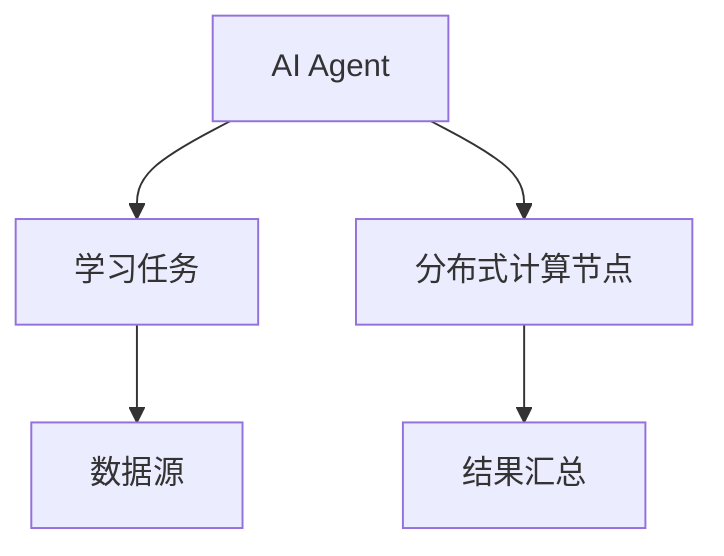
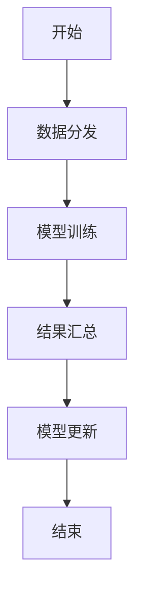
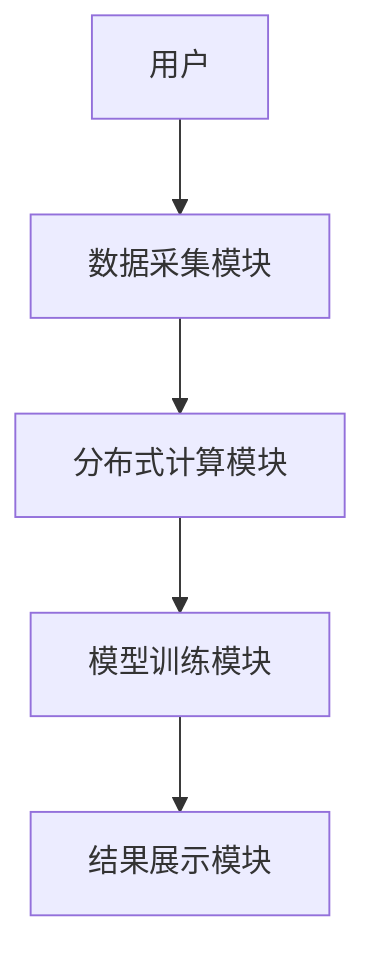

                 


# 企业AI Agent的分布式学习平台设计

> 关键词：企业AI Agent，分布式学习平台，多智能体协作，分布式计算，系统架构设计

> 摘要：本文详细探讨了企业AI Agent的分布式学习平台设计，从背景、核心概念、算法原理、系统架构到项目实战和最佳实践，全面分析了该平台的设计与实现。文章结合实际案例，通过丰富的图示和代码示例，深入浅出地阐述了企业AI Agent在分布式学习平台中的应用及其技术实现。

---

# 第一部分：企业AI Agent的分布式学习平台概述

# 第1章：企业AI Agent与分布式学习平台概述

## 1.1 企业AI Agent的定义与背景

### 1.1.1 什么是企业AI Agent

企业AI Agent是一种能够感知环境、执行任务并进行自主决策的智能体，具备学习、推理和自适应能力，广泛应用于企业内部的知识管理、决策支持和自动化操作中。

### 1.1.2 分布式学习平台的定义

分布式学习平台是指通过分布式计算技术，将学习任务分解到多个节点或设备上进行并行处理的平台，旨在提高计算效率和资源利用率。

### 1.1.3 企业AI Agent与分布式学习平台的关系

企业AI Agent通过分布式学习平台实现多智能体协作，利用分布式计算技术提升学习效率和任务处理能力，同时分布式学习平台为企业AI Agent提供了高效的计算资源和任务分配机制。

## 1.2 分布式学习平台的核心概念

### 1.2.1 分布式学习的基本原理

分布式学习通过将任务分解到多个节点上并行执行，利用分布式计算技术实现高效的数据处理和模型训练。

### 1.2.2 分布式计算与AI Agent的结合

通过分布式计算技术，AI Agent可以将复杂任务分解到多个节点上协同完成，提升任务处理效率和系统扩展性。

### 1.2.3 企业级分布式学习平台的特点

企业级分布式学习平台具备高可用性、可扩展性、安全性和高效性，能够支持大规模数据处理和复杂任务执行。

## 1.3 企业AI Agent的应用场景

### 1.3.1 企业内部知识共享

通过企业AI Agent实现知识的自动采集、整理和共享，提升企业内部的知识管理水平。

### 1.3.2 分布式团队协作

利用分布式学习平台，企业AI Agent可以实现多团队协作，提高团队协作效率和任务完成质量。

### 1.3.3 多部门数据协同

企业AI Agent可以通过分布式学习平台实现多部门数据的协同处理，提升企业数据整合和分析能力。

## 1.4 本章小结

本章从企业AI Agent和分布式学习平台的基本概念出发，探讨了两者之间的关系，并结合实际应用场景，详细阐述了企业AI Agent在分布式学习平台中的应用价值。

---

# 第二部分：企业AI Agent的分布式学习平台核心概念

# 第2章：企业AI Agent的分布式学习模型

## 2.1 分布式学习模型的原理

### 2.1.1 分布式计算的基本原理

分布式计算通过将任务分解到多个计算节点上并行执行，利用网络通信技术实现任务分配和结果汇总。

### 2.1.2 分布式学习的数学模型

分布式学习模型的数学表达可以表示为：

$$ y_i = f(x_i) $$

其中，$y_i$ 表示第i个节点的输出，$x_i$ 表示第i个节点的输入，$f$ 表示学习模型。

### 2.1.3 分布式学习与AI Agent的结合

通过将AI Agent的任务分解到多个节点上，利用分布式学习模型实现多智能体协作，提升任务处理效率。

## 2.2 企业AI Agent的核心属性

### 2.2.1 智能性

AI Agent具备自主学习和推理能力，能够根据环境变化调整行为策略。

### 2.2.2 分布式协作能力

通过分布式学习平台，AI Agent能够与其他智能体协同完成复杂任务，提升整体系统性能。

### 2.2.3 自适应性

AI Agent能够根据任务需求和环境变化动态调整自身行为，适应不同的应用场景。

## 2.3 分布式学习平台的实体关系图



---

# 第三部分：分布式学习平台的算法原理

# 第3章：分布式学习算法的实现

## 3.1 分布式学习算法概述

### 3.1.1 分布式学习的基本流程

1. 任务分解：将学习任务分解到多个节点上。
2. 并行计算：各个节点独立完成子任务的计算。
3. 结果汇总：将各个节点的计算结果汇总到中央节点。
4. 模型更新：根据汇总结果更新整体模型。

### 3.1.2 分布式学习的优缺点

优点：计算效率高、资源利用率高；缺点：通信开销大、系统复杂性高。

## 3.2 分布式学习算法的数学模型

$$ y = f(x) $$

其中，$y$ 表示输出，$x$ 表示输入，$f$ 表示学习模型。

## 3.3 分布式学习算法的流程图



---

# 第四部分：分布式学习平台的系统架构设计

# 第4章：分布式学习平台的系统架构

## 4.1 系统功能设计

### 4.1.1 数据采集模块

负责采集和预处理分布式学习平台所需的数据，确保数据的完整性和准确性。

### 4.1.2 分布式计算模块

将学习任务分解到多个节点上并行执行，通过网络通信实现任务分配和结果汇总。

### 4.1.3 模型训练模块

负责根据各个节点的计算结果更新整体模型，提升模型的准确性和泛化能力。

## 4.2 系统架构图



## 4.3 系统接口设计

### 4.3.1 数据接口

定义数据的输入输出格式，确保各个节点之间的数据通信兼容性。

### 4.3.2 模型接口

定义模型的训练和更新接口，确保各个节点能够协同完成模型训练任务。

### 4.3.3 训练接口

定义训练任务的启动和停止接口，支持用户对训练过程的控制。

## 4.4 系统交互流程图

```mermaid
graph TD
    U[用户] --> A[数据采集

---

* 由于篇幅限制，以上仅为文章的目录大纲和部分内容示例，完整的文章将涵盖更多的细节和具体实现。

