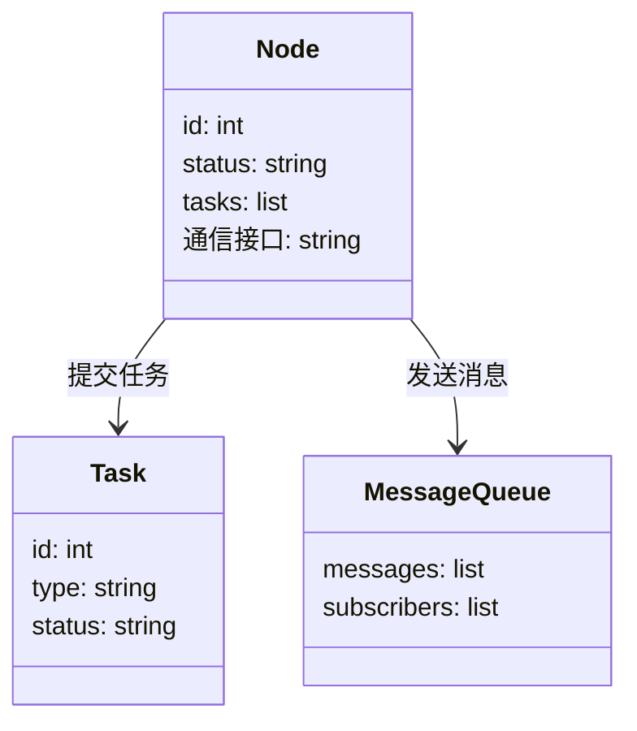
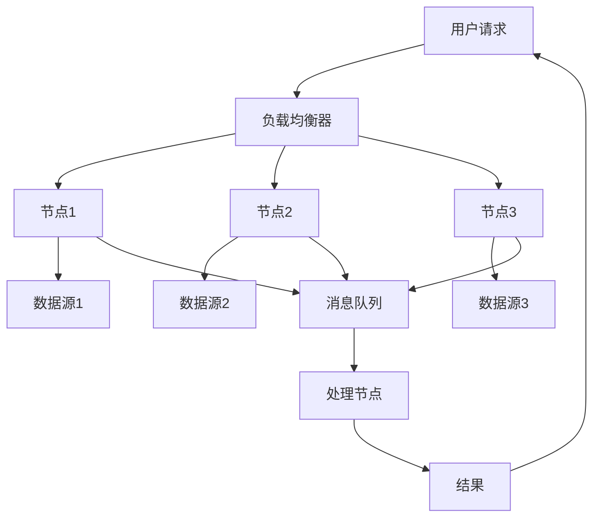

                 


# 《企业AI Agent的分布式计算架构》

---

## 关键词：企业AI Agent、分布式计算架构、系统设计、算法实现、性能优化、数据一致性、负载均衡

---

## 摘要：  
企业AI Agent是将人工智能技术与企业业务深度结合的智能化系统，其分布式计算架构是实现高效、可扩展AI应用的核心。本文从企业AI Agent的基本概念出发，深入分析分布式计算架构的核心原理，探讨其在系统设计中的应用，并结合实际案例，详细讲解分布式计算架构的设计与实现。通过本文，读者将全面理解企业AI Agent的分布式计算架构，并掌握其在实际应用中的关键技术和优化方法。

---

# 第1章: 企业AI Agent概述

## 1.1 什么是企业AI Agent  
企业AI Agent是一种智能化的软件实体，能够感知环境、自主决策并执行任务，以实现企业目标。它通过与企业系统、数据源和用户交互，提供智能化的解决方案。  

### 1.1.1 AI Agent的基本定义  
AI Agent是具有感知、推理、规划和执行能力的智能体，能够根据环境信息做出决策。  

### 1.1.2 企业AI Agent的特征  
- **自主性**：能够在没有人工干预的情况下自主运行。  
- **反应性**：能够实时感知环境变化并做出反应。  
- **智能性**：具备问题解决和决策能力。  
- **可扩展性**：能够适应企业规模和复杂度的变化。  

### 1.1.3 企业AI Agent的分类  
- **任务型AI Agent**：专注于完成特定任务，如订单处理、客户支持等。  
- **监控型AI Agent**：用于实时监控系统状态，如设备监控、异常检测等。  
- **协作型AI Agent**：能够与其他AI Agent或系统协作完成复杂任务。  

---

## 1.2 分布式计算架构的基本概念  

### 1.2.1 分布式计算的定义  
分布式计算是指将计算任务分布在多台计算机或节点上，通过通信和协作完成整体计算目标。  

### 1.2.2 分布式系统的特点  
- **可扩展性**：能够通过增加节点来提升性能。  
- **容错性**：单个节点故障不会导致整个系统崩溃。  
- **高效性**：通过并行计算提高任务处理效率。  

### 1.2.3 企业AI Agent与分布式计算的关系  
企业AI Agent需要处理大量数据和复杂任务，分布式计算架构能够提供高效的计算能力和 scalability，是其实现高性能和可扩展性的关键。  

---

## 1.3 企业AI Agent的应用场景  

### 1.3.1 企业级AI应用的需求  
- **数据处理**：需要处理海量数据，如日志分析、用户行为分析等。  
- **实时响应**：需要快速响应用户请求，如在线客服、实时推荐等。  
- **复杂任务**：需要处理多步骤的任务，如供应链优化、智能调度等。  

### 1.3.2 分布式架构在企业AI中的优势  
- **性能提升**：通过并行计算提高处理速度。  
- **资源利用率**：能够充分利用多节点资源。  
- **容错性**：单点故障的风险降低。  

### 1.3.3 典型应用场景分析  
- **智能客服**：通过分布式架构实现多渠道、多语言的实时客服支持。  
- **供应链优化**：利用分布式计算处理复杂的供应链数据，实现最优调度。  
- **实时推荐系统**：通过分布式架构处理海量用户行为数据，提供个性化推荐。  

---

## 1.4 本章小结  
本章介绍了企业AI Agent的基本概念、特征和分类，并分析了分布式计算架构在企业AI中的重要性及其应用场景。通过这些内容，读者可以理解企业AI Agent的核心价值和分布式计算架构的必要性。

---

# 第2章: 分布式计算架构的核心原理  

## 2.1 分布式系统的核心原理  

### 2.1.1 分布式系统的基本组成  
- **节点**：分布式系统中的计算节点，负责执行特定任务。  
- **通信机制**：节点之间通过网络进行通信和数据交换。  
- **协调机制**：用于节点之间的任务分配和状态同步。  

### 2.1.2 分布式系统的设计原则  
- **松耦合设计**：节点之间应松耦合，避免紧密依赖。  
- **一致性保证**：确保系统中数据的一致性。  
- **容错设计**：能够容忍节点故障，保证系统可用性。  

### 2.1.3 分布式系统中的通信机制  
- **点对点通信**：节点之间直接通信。  
- **消息队列**：通过消息中间件实现异步通信。  
- ** publish-subscribe 模式**：发布者发布消息，订阅者接收消息。  

---

## 2.2 分布式计算中的数据一致性  

### 2.2.1 数据一致性的定义  
数据一致性是指系统中所有副本在更新后保持相同的状态。  

### 2.2.2 分布式系统中的数据一致性问题  
- **写入顺序不一致**：不同节点写入数据的顺序可能不同。  
- **读取冲突**：不同节点读取数据时可能看到不同的状态。  
- **网络分区**：网络故障导致部分节点无法通信。  

### 2.2.3 解决数据一致性问题的常用方法  
- **强一致性**：通过同步复制保证所有副本数据一致，但性能较低。  
- **最终一致性**：允许副本之间存在延迟，通过定期同步保证一致。  
- **因果一致性**：确保操作的因果关系在副本间保持一致。  

---

## 2.3 分布式计算中的任务分配与负载均衡  

### 2.3.1 任务分配的基本原则  
- **均衡负载**：将任务均匀分配到各个节点，避免某些节点过载。  
- **节点能力匹配**：根据节点的计算能力分配任务。  

### 2.3.2 负载均衡的实现方法  
- **静态负载均衡**：根据节点配置静态分配任务。  
- **动态负载均衡**：根据实时负载情况动态调整任务分配。  
- **自适应负载均衡**：根据系统状态自动调整任务分配策略。  

### 2.3.3 常见的负载均衡算法  
- **轮询算法**：按顺序将任务分配到各个节点。  
- **随机算法**：随机选择节点分配任务。  
- **加权算法**：根据节点权重分配任务数量。  

---

## 2.4 本章小结  
本章详细讲解了分布式系统的核心原理，包括系统的组成、设计原则、通信机制、数据一致性问题及解决方案，以及任务分配与负载均衡的实现方法。通过这些内容，读者可以理解分布式计算架构的理论基础。

---

# 第3章: 企业AI Agent的分布式计算架构设计  

## 3.1 企业AI Agent的系统架构  

### 3.1.1 单体架构  
单体架构将所有功能集中在单一节点上，适用于小型项目，但扩展性和维护性较差。  

### 3.1.2 分布式架构  
分布式架构将系统功能分散到多个节点，通过协作完成任务，适用于大规模和高性能需求。  

### 3.1.3 微服务架构  
微服务架构将系统划分为多个小型独立服务，每个服务运行在独立的进程中，通过轻量级通信机制互相通信。  

---

## 3.2 分布式计算架构的设计  

### 3.2.1 系统功能设计  
- **数据采集**：从多种数据源采集数据。  
- **数据处理**：对数据进行清洗、转换和分析。  
- **模型训练**：基于分布式数据训练AI模型。  
- **结果输出**：将处理结果返回给用户或下游系统。  

### 3.2.2 领域模型类图  


---

## 3.3 分布式计算架构的实现  

### 3.3.1 系统架构图  


---

## 3.4 本章小结  
本章详细讲解了企业AI Agent的系统架构设计，包括功能设计、类图设计和系统架构图。通过这些设计，读者可以理解如何将分布式计算架构应用于实际的企业AI Agent系统中。

---

# 第4章: 项目实战与优化  

## 4.1 环境安装与配置  

### 4.1.1 系统需求  
- 操作系统：Linux/Windows/MacOS  
- 网络环境：稳定的互联网连接  
- 开发工具：Python、Jupyter Notebook、Git等  

### 4.1.2 安装依赖  
```bash
pip install distributed pandas numpy matplotlib
```

---

## 4.2 系统核心代码实现  

### 4.2.1 数据采集与处理  
```python
import pandas as pd
from distributed import Client

client = Client('tcp://127.0.0.1:8786')

def process_data(data):
    # 数据清洗和转换
    return data.dropna().convert_objects(convert_numeric=True)

# 提交任务到分布式计算集群
future = client.submit(process_data, pd.read_csv('input.csv'))
result = client.gather(future)
```

---

## 4.3 性能优化与调优  

### 4.3.1 并行计算优化  
- **任务粒度**：将任务分解为更小的粒度以提高并行效率。  
- **资源分配**：根据任务需求动态分配计算资源。  

### 4.3.2 网络优化  
- **减少通信开销**：通过压缩数据或减少通信频率降低网络负载。  
- **负载均衡**：确保数据和任务在节点之间均匀分布。  

---

## 4.4 本章小结  
本章通过实际项目的环境配置、代码实现和性能优化，详细讲解了如何将分布式计算架构应用于企业AI Agent系统中。通过这些实战内容，读者可以掌握分布式计算的实际应用技巧。

---

# 第5章: 最佳实践与注意事项  

## 5.1 最佳实践  

### 5.1.1 系统设计  
- **模块化设计**：将系统划分为多个模块，便于维护和扩展。  
- **日志与监控**：实时监控系统运行状态，及时发现和解决问题。  

### 5.1.2 安全性  
- **数据加密**：对敏感数据进行加密处理。  
- **访问控制**：通过权限控制确保系统安全。  

### 5.1.3 可扩展性  
- **模块化设计**：通过模块化设计实现系统的可扩展性。  
- **动态配置**：支持动态添加或移除节点。  

---

## 5.2 注意事项  

### 5.2.1 数据一致性  
- **设计合理的数据一致性策略**，确保系统在分布式环境下的数据一致性。  
- **避免过度一致性**，在性能和一致性之间找到平衡点。  

### 5.2.2 网络问题  
- **网络分区**：确保系统能够容忍网络故障，避免单点故障。  
- **网络延迟**：通过缓存或本地化处理降低网络延迟影响。  

---

## 5.3 本章小结  
本章总结了企业AI Agent的分布式计算架构的最佳实践和注意事项，帮助读者在实际项目中避免常见问题，提升系统性能和安全性。

---

# 第6章: 总结与展望  

## 6.1 总结  
本文详细讲解了企业AI Agent的分布式计算架构，从基本概念到系统设计，再到实际应用，全面覆盖了分布式计算架构的核心内容。通过本文，读者可以掌握分布式计算在企业AI Agent中的应用技巧，并能够将其应用于实际项目中。  

## 6.2 展望  
随着人工智能和分布式计算技术的不断发展，企业AI Agent的分布式计算架构将变得更加复杂和多样化。未来，我们需要进一步研究和优化分布式计算架构，以应对更复杂的挑战和需求。

---

# 作者：AI天才研究院/AI Genius Institute & 禅与计算机程序设计艺术 /Zen And The Art of Computer Programming

