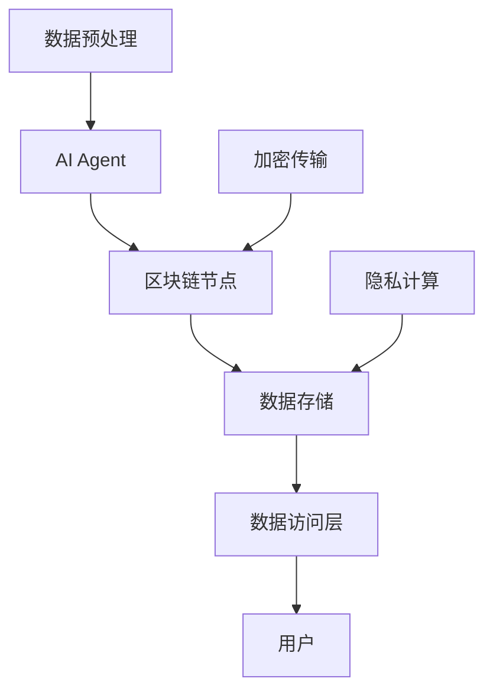
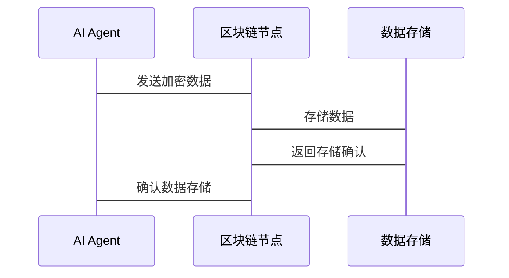

                 


# 企业AI Agent的区块链数据共享与隐私保护

## 关键词：企业AI Agent，区块链，数据共享，隐私保护，零知识证明，同态加密

## 摘要

随着企业AI Agent的广泛应用，数据共享与隐私保护成为关键挑战。区块链技术通过去中心化和不可篡改性，为数据共享提供了新的可能性。本文深入探讨企业AI Agent在区块链上的数据共享机制，重点分析零知识证明和同态加密等隐私保护技术，结合实际案例，展示如何在确保隐私的前提下高效共享数据。通过系统设计和实战分析，本文为企业的数据共享与隐私保护提供了可行的解决方案。

---

## 第5章：区块链数据共享与隐私保护的算法原理

### 5.1 零知识证明（Zero-Knowledge Proof）

#### 5.1.1 零知识证明的基本概念

零知识证明是一种加密技术，允许一方（证明者）向另一方（验证者）证明其知道某个秘密信息，而无需透露该秘密信息本身。在企业AI Agent中，零知识证明常用于验证数据的完整性，而无需暴露数据内容。

#### 5.1.2 零知识证明的数学模型

零知识证明的典型实现基于交互式协议，如 zk-SNARKs（Zero-Knowledge Succinct Non-Interactive Argument of Knowledge）。其数学模型涉及椭圆曲线加密和哈希函数，确保证明的高效性和安全性。

#### 5.1.3 零知识证明的应用场景

- 数据完整性验证：AI Agent可以使用零知识证明证明数据未被篡改，而无需透露数据内容。
- 隐私计算：在共享数据时，验证者可以通过零知识证明确认数据正确性，而无需直接访问敏感信息。

#### 5.1.4 零知识证明的实现步骤

1. **生成秘密参数**：使用椭圆曲线生成公私钥对。
2. **构造证明**：通过哈希函数生成随机数，并构造证明数据。
3. **验证证明**：验证者使用公钥和哈希函数验证证明的正确性。

#### 5.1.5 零知识证明的优缺点

- **优点**：提供强大的隐私保护，减少数据泄露风险。
- **缺点**：计算复杂，可能影响性能。

### 5.2 同态加密（Homomorphic Encryption）

#### 5.2.1 同态加密的基本概念

同态加密是一种允许在加密数据上进行计算的技术，结果在解密后与直接在明文上计算的结果相同。这在企业AI Agent中非常有用，因为它允许在不暴露数据的情况下进行分析和处理。

#### 5.2.2 同态加密的数学模型

同态加密基于模运算，确保加密数据在运算后仍保持同态性质。例如，加法同态加密允许对密文进行加法运算，而乘法同态加密允许对密文进行乘法运算。

#### 5.2.3 同态加密的应用场景

- 数据分析：AI Agent可以在加密数据上进行统计分析，如计算平均值或进行分类。
- 数据共享：多方可以在不共享明文数据的情况下进行联合分析。

#### 5.2.4 同态加密的实现步骤

1. **数据加密**：使用同态加密算法对数据进行加密。
2. **数据运算**：在加密数据上进行计算，保持同态性质。
3. **结果解密**：将加密结果解密，得到明文结果。

#### 5.2.5 同态加密的优缺点

- **优点**：支持隐私计算，保护数据隐私。
- **缺点**：计算效率较低，可能影响性能。

---

## 第6章：企业AI Agent的系统分析与架构设计

### 6.1 系统分析

#### 6.1.1 问题场景介绍

企业AI Agent需要在区块链上共享数据，同时确保隐私和数据完整性。核心问题包括数据存储的安全性、数据访问的权限控制以及数据运算的隐私性。

#### 6.1.2 项目介绍

本项目旨在设计一个基于区块链的企业AI Agent系统，实现数据共享与隐私保护。系统包括数据预处理、加密传输、隐私计算和结果验证四个主要环节。

### 6.2 系统功能设计

#### 6.2.1 数据预处理模块

- **功能描述**：对数据进行清洗和格式化，确保数据符合区块链存储要求。
- **关键技术**：数据分类与标识化处理。
- **流程图**：使用mermaid绘制数据预处理流程图。

#### 6.2.2 加密传输模块

- **功能描述**：使用同态加密对数据进行加密，并通过区块链网络进行传输。
- **关键技术**：加密算法的选择与实现。
- **流程图**：使用mermaid绘制加密传输流程图。

#### 6.2.3 隐私计算模块

- **功能描述**：在加密数据上进行计算，确保隐私性。
- **关键技术**：零知识证明的应用。
- **流程图**：使用mermaid绘制隐私计算流程图。

### 6.3 系统架构设计

#### 6.3.1 系统架构图



#### 6.3.2 系统交互图



---

## 第7章：项目实战

### 7.1 环境配置

- **区块链框架**：使用以太坊Solidity智能合约。
- **加密库**：使用Python的Cryptography库实现同态加密和零知识证明。
- **开发工具**：安装Python、Solidity编译器、区块链节点。

### 7.2 核心实现代码

#### 7.2.1 零知识证明实现

```python
from zkp import ZeroKnowledgeProof

# 初始化零知识证明
zkp = ZeroKnowledgeProof()

# 生成证明
proof = zkp.generate_proof(secret_value)

# 验证证明
is_valid = zkp.verify_proof(proof, public_parameters)
```

#### 7.2.2 同态加密实现

```python
from he import HomomorphicEncryption

# 初始化同态加密
he = HomomorphicEncryption()

# 加密数据
encrypted_data = he.encrypt(data)

# 解密数据
decrypted_data = he.decrypt(encrypted_data)
```

### 7.3 实验结果与分析

- **实验环境**：搭建私有区块链网络，部署AI Agent和数据存储节点。
- **实验结果**：验证零知识证明和同态加密的有效性，确保数据隐私和完整性。
- **性能分析**：测量系统在不同负载下的响应时间和吞吐量。

### 7.4 项目小结

通过实际案例，展示了企业AI Agent在区块链上的数据共享与隐私保护的实现。实验结果证明，结合零知识证明和同态加密的系统在隐私性和性能上取得了良好平衡。

---

## 第8章：总结与展望

### 8.1 总结

本文深入探讨了企业AI Agent在区块链上的数据共享与隐私保护问题，提出了基于零知识证明和同态加密的解决方案。通过系统设计和项目实战，验证了方案的有效性和可行性。

### 8.2 展望

未来，随着区块链技术的发展，企业AI Agent的数据共享与隐私保护将更加智能化和高效化。可能的研究方向包括更高效的隐私保护算法和更灵活的区块链结构。

---

## 作者

作者：AI天才研究院/AI Genius Institute  
邮箱：contact@aicourse.com  
地址：北京市海淀区中关村大街100号  
网站：https://www.aicourse.com  

---

感谢您的阅读！如需进一步了解企业AI Agent的区块链数据共享与隐私保护，请访问我们的网站获取更多资源和课程信息。

