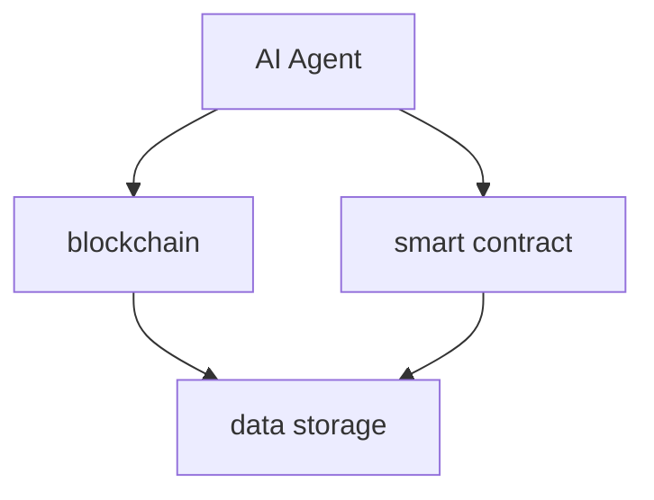

                 


# 企业AI Agent的区块链数据共享机制

> 关键词：AI Agent, 区块链, 数据共享, 分布式系统, 智能合约, 数据隐私

> 摘要：本文深入探讨了企业AI Agent与区块链技术结合的区块链数据共享机制，分析了其核心概念、技术原理、系统架构及实现方案，并通过实际案例展示其应用价值。

---

## 第一部分: 企业AI Agent与区块链数据共享机制概述

### 第1章: 企业AI Agent与区块链数据共享机制的背景与问题背景

#### 1.1 问题背景与挑战
现代企业面临数据共享的诸多挑战，包括数据孤岛、隐私泄露、信任缺失等问题。传统的中心化数据共享方式存在效率低下、数据不一致、难以追溯等问题，而区块链技术的兴起为数据共享提供了新的解决方案。AI Agent作为一种智能实体，能够自主决策和执行任务，结合区块链技术，可以实现高效、安全、可信的数据共享机制。

#### 1.2 问题描述与目标
- **问题描述**：企业数据共享中的信任缺失、数据孤岛、隐私泄露等问题。
- **目标**：构建一种基于区块链和AI Agent的企业数据共享机制，实现数据的安全共享、高效协作和智能决策。

#### 1.3 问题解决思路
- **区块链技术**：通过区块链的去中心化特性，确保数据共享的透明性和不可篡改性。
- **AI Agent**：利用AI Agent的智能决策能力，实现数据共享的自动化和智能化。
- **协同作用**：区块链提供信任机制，AI Agent提供智能决策能力，两者结合实现高效、安全的数据共享。

#### 1.4 边界与外延
- **适用范围**：适用于企业间数据共享场景，尤其需要高信任度和高效协作的领域。
- **限制**：不适用于需要实时高频交易的场景，且需考虑数据隐私保护的法律合规性。

#### 1.5 核心概念结构与组成
- **核心要素**：AI Agent、区块链、数据共享、智能合约、分布式账本。
- **关系**：AI Agent作为数据共享的主体，利用区块链提供的分布式账本和智能合约实现数据的安全共享和智能决策。

---

## 第二部分: 核心概念与联系

### 第2章: 核心概念原理与对比分析

#### 2.1 AI Agent的核心原理
- **定义**：AI Agent是一种能够感知环境、自主决策并执行任务的智能实体。
- **实现机制**：基于机器学习、自然语言处理等技术，AI Agent能够理解和处理数据，执行智能决策。
- **与传统数据处理系统的区别**：AI Agent具有自主性和智能性，能够主动发起数据共享请求并完成任务。

#### 2.2 区块链数据共享机制的原理
- **定义**：区块链是一种去中心化的分布式账本技术，通过共识算法确保数据的一致性和不可篡改性。
- **实现机制**：区块链通过智能合约自动执行数据共享规则，确保数据的安全性和隐私性。
- **与传统数据共享方式的区别**：区块链数据共享具有去中心化、不可篡改、可追溯等特点。

#### 2.3 核心概念对比分析
- **AI Agent与区块链的对比**：
  - AI Agent注重智能性和自主性，区块链注重去中心化和信任机制。
  - 两者结合可以实现高效、安全、智能的数据共享。

#### 2.4 核心概念属性特征对比表格
| 特性         | AI Agent                | 区块链数据共享机制          |
|--------------|-------------------------|-----------------------------|
| 核心功能     | 数据处理与智能决策      | 数据共享与信任机制          |
| 技术基础     | 人工智能、机器学习      | 分布式系统、共识算法        |
| 优势         | 高效性、智能化          | 信任性、安全性              |
| 适用场景     | 智能决策、自动化任务    | 数据共享、协作信任          |

#### 2.5 ER实体关系图架构（Mermaid）
```mermaid
erDiagram
    customer[客户] {
        id : integer
        name : string
    }
    data_share[数据共享] {
        id : integer
        data : blob
        timestamp : datetime
    }
    ai_agent[AI Agent] {
        id : integer
        name : string
    }
    blockchain[blockchain] {
        block_height : integer
        transactions : list of string
    }
    customer --> data_share : 提交数据
    ai_agent --> data_share : 请求数据
    data_share --> blockchain : 存储到区块链
```

---

## 第三部分: 算法原理讲解

### 第3章: 算法原理与实现细节

#### 3.1 区块链共识算法
- **共识算法**：如工作量证明（PoW）、权益证明（PoS）等。
- **实现流程**：
  1. AI Agent生成数据共享请求。
  2. 区块链节点验证请求的合法性。
  3. 节点通过共识算法达成一致，将数据共享记录写入区块链。

#### 3.2 智能合约执行流程
- **智能合约定义**：智能合约是区块链上的自动执行脚本，用于定义数据共享规则。
- **实现流程**：
  1. AI Agent触发智能合约。
  2. 智能合约验证权限和数据合法性。
  3. 数据共享完成，记录在区块链上。

#### 3.3 数据隐私保护机制
- **零知识证明**：通过零知识证明技术，AI Agent可以在不泄露敏感数据的情况下完成数据验证。
- **加密算法**：使用加密算法对数据进行加密，确保数据在传输和存储过程中的安全性。

#### 3.4 算法数学模型
- **哈希函数**：用于生成数据块的唯一标识。
  $$ H(message) = hash \text{ value} $$
- **数字签名**：用于验证数据来源的合法性。
  $$ signature = sign(privateKey, message) $$

---

## 第四部分: 系统分析与架构设计

### 第4章: 系统分析与架构设计

#### 4.1 问题场景介绍
- **场景描述**：企业间需要共享敏感数据，但存在信任缺失和数据隐私问题。
- **目标**：设计一个基于区块链和AI Agent的企业数据共享系统。

#### 4.2 系统功能设计
- **核心功能**：
  1. 数据共享请求发起与验证。
  2. 数据存储与访问控制。
  3. 数据共享记录的可追溯性。

#### 4.3 系统架构设计（Mermaid）


#### 4.4 系统接口设计
- **AI Agent接口**：用于与区块链交互，发起数据共享请求。
- **区块链接口**：用于智能合约的部署和执行。
- **数据存储接口**：用于数据的存储和检索。

#### 4.5 系统交互流程（Mermaid）
```mermaid
sequenceDiagram
    participant AIA as AI Agent
    participant BC as Blockchain
    participant DS as Data Storage
    AIA -> BC: 发起数据共享请求
    BC -> AIA: 返回请求验证结果
    AIA -> BC: 部署智能合约
    BC -> DS: 执行智能合约，存储数据
    AIA <- BC: 数据共享完成通知
```

---

## 第五部分: 项目实战

### 第5章: 项目实战与案例分析

#### 5.1 环境安装与配置
- **区块链环境**：安装以太坊节点（如Geth）。
- **AI Agent开发环境**：安装Python、TensorFlow等工具。

#### 5.2 核心代码实现
```python
# 区块链节点连接
from web3 import Web3

w3 = Web3(Web3.HTTPProvider('http://localhost:8545'))

# AI Agent智能合约交互
contract_address = '0x12345...'
abi = [{'constant': True, ...}]  # 合约ABI

# 数据共享请求
def initiate_share(data):
    contract = w3.eth.contract(contract_address, abi=abi)
    tx_hash = contract.functions.initiateShare(data).transact()
    return tx_hash

# 数据共享完成通知
def notify_completion(tx_hash):
    receipt = w3.eth.waitForTransactionReceipt(tx_hash)
    print("数据共享完成，交易收据：", receipt)
```

#### 5.3 代码应用解读与分析
- **区块链节点连接**：通过以太坊节点实现与区块链的交互。
- **智能合约调用**：AI Agent通过智能合约发起数据共享请求，并完成数据存储和通知。

#### 5.4 案例分析与详细讲解
- **案例场景**：企业间共享销售数据。
- **实现步骤**：
  1. AI Agent发起数据共享请求。
  2. 区块链节点验证请求。
  3. 智能合约执行数据存储。
  4. 数据共享完成，AI Agent接收通知。

#### 5.5 项目小结
- **项目成果**：实现了基于区块链和AI Agent的企业数据共享机制。
- **经验总结**：区块链和AI Agent的结合能够有效解决数据共享的信任和隐私问题。

---

## 第六部分: 总结与展望

### 第6章: 总结与展望

#### 6.1 最佳实践 tips
- 数据隐私保护：采用零知识证明和加密算法。
- 系统性能优化：优化共识算法和智能合约的执行效率。

#### 6.2 小结
企业AI Agent与区块链的结合，为企业数据共享提供了新的解决方案，实现了高效、安全、智能的数据共享机制。

#### 6.3 注意事项
- 数据隐私保护需符合相关法律法规。
- 系统设计需考虑性能和可扩展性。

#### 6.4 拓展阅读
- 区块链技术书籍：《区块链： hype之外的实用主义》。
- AI Agent相关论文：《A survey on artificial intelligence agents》。

---

## 作者：AI天才研究院/AI Genius Institute & 禅与计算机程序设计艺术 /Zen And The Art of Computer Programming

