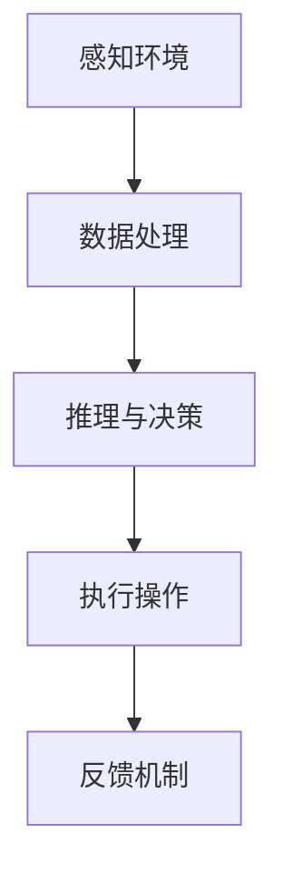
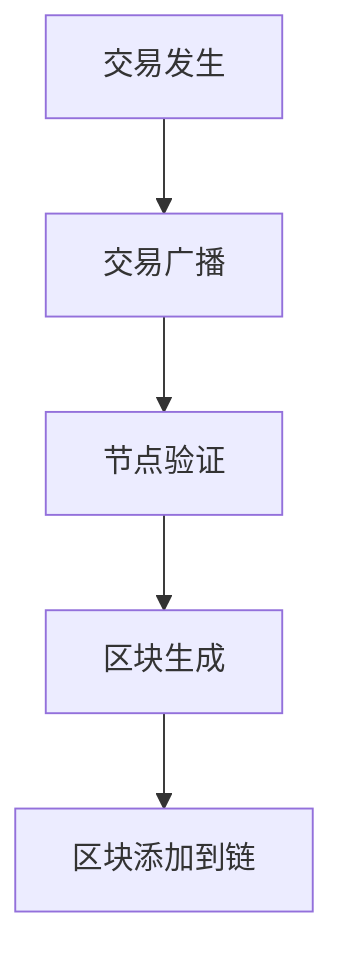
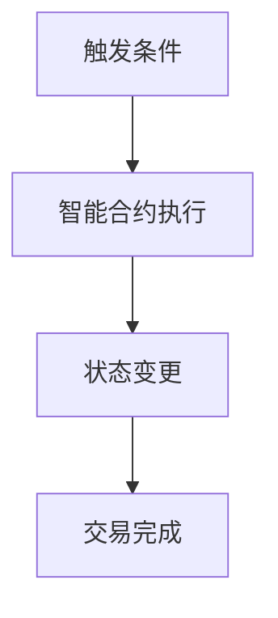
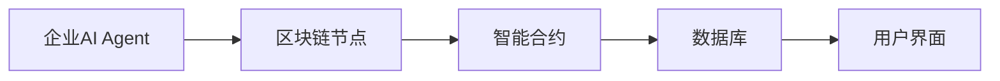

                 


# 企业AI Agent的区块链集成策略

## 关键词：企业AI Agent、区块链、智能合约、分布式系统、数据隐私

## 摘要：本文探讨了将企业AI Agent与区块链技术集成的策略，分析了两者的核心概念、结合方式、算法原理，并通过实际案例展示了集成后的系统设计与实现。文章详细阐述了如何利用区块链技术增强AI Agent的可信度和数据安全性，同时优化了AI Agent的决策过程。

---

## 第一部分：企业AI Agent与区块链概述

### 第1章：企业AI Agent的基本概念

#### 1.1 AI Agent的核心功能与特点
- **定义**：AI Agent是一种智能体，能够感知环境、自主决策并执行任务。
- **核心功能**：数据收集、分析、推理、决策和执行。
- **特点**：自主性、反应性、社会性、学习能力。

#### 1.2 区块链技术基础
- **定义**：区块链是一种去中心化的分布式账本技术。
- **核心特性**：去中心化、不可篡改、可追溯。
- **应用场景**：金融、供应链管理、身份认证。

#### 1.3 企业AI Agent与区块链结合的背景
- **技术趋势**：企业智能化转型需求增长。
- **优势结合**：区块链提供数据可信性，AI Agent提供智能决策能力。
- **必要性**：提高企业AI系统的可信度和数据安全性。

---

### 第2章：企业AI Agent与区块链的核心概念

#### 2.1 AI Agent与区块链的核心概念对比
| **特性**       | **AI Agent**                     | **区块链**                       |
|----------------|----------------------------------|----------------------------------|
| **核心功能**    | 数据处理、智能决策              | 数据存储、交易记录               |
| **数据管理**    | 中央化或分布式                  | 分布式、不可篡改                  |
| **信任机制**    | 依赖算法和模型                  | 依赖去中心化和共识机制           |

#### 2.2 AI Agent与区块链的结合方式
- **数据共享**：区块链提供数据共享的安全性，AI Agent利用数据进行分析。
- **智能合约**：AI Agent触发智能合约执行特定操作，如支付或数据授权。
- **信任基础**：区块链作为信任基础，支持AI Agent的决策过程。

#### 2.3 核心概念的ER实体关系图
```mermaid
erDiagram
    actor 企业AI Agent {
        id : integer
        name : string
        role : string
    }
    actor 区块链节点 {
        id : integer
        address : string
        role : string
    }
    enterprise 企业AI Agent {
        --> 区块链节点 : "部署在"
    }
    association 实体关系 {
        between 企业AI Agent 和 区块链节点
        role : "通过区块链节点进行数据交互"
    }
```

---

## 第二部分：企业AI Agent与区块链的算法原理

### 第3章：AI Agent的算法原理

#### 3.1 AI Agent的算法流程


#### 3.2 AI Agent的核心算法
- **感知环境**：数据收集与预处理。
- **推理与决策**：基于机器学习模型的预测。
- **反馈机制**：根据结果调整策略。

### 第4章：区块链的算法原理

#### 4.1 区块链的基本流程


#### 4.2 智能合约的工作原理


#### 4.3 区块链的共识机制
- **共识算法**：工作量证明（PoW）、权益证明（PoS）。
- **数学模型**：哈希函数、数字签名。

---

## 第三部分：企业AI Agent与区块链的系统设计

### 第5章：系统分析与架构设计

#### 5.1 问题场景
- **数据孤岛**：企业内部数据分散，难以共享。
- **信任缺失**：不同部门或外部合作伙伴之间缺乏信任。
- **决策延迟**：依赖人工审核，影响效率。

#### 5.2 系统功能设计
- **数据共享模块**：实现跨部门或跨机构的数据共享。
- **智能合约模块**：自动执行预设的商业逻辑。
- **决策优化模块**：利用AI算法优化决策过程。

#### 5.3 系统架构设计


#### 5.4 接口设计与交互流程
- **API接口**：定义数据格式和交互协议。
- **交互流程**：AI Agent触发智能合约，区块链节点执行交易，数据存储在数据库中。

---

## 第四部分：企业AI Agent与区块链的项目实战

### 第6章：项目实战

#### 6.1 环境安装
- **工具安装**：安装Python、区块链框架（如Ethereum）、AI框架（如TensorFlow）。
- **依赖管理**：使用虚拟环境管理项目依赖。

#### 6.2 核心代码实现
- **AI Agent代码示例**
```python
class AIAgent:
    def __init__(self):
        self.models = {}  # 存储训练好的模型

    def perceive_environment(self):
        # 数据收集与预处理
        pass

    def make_decision(self, data):
        # 调用机器学习模型进行预测
        model = self.models.get('main_model')
        if model:
            prediction = model.predict(data)
            return prediction
        else:
            return None
```

- **区块链节点代码示例**
```python
from web3 import Web3

class BlockchainNode:
    def __init__(self, provider):
        self.w3 = Web3(provider)

    def deploy_contract(self, contract_abi, contract_bytecode):
        # 部署智能合约到区块链
        pass
```

#### 6.3 代码解读与分析
- **AI Agent代码**：定义了AI Agent类，包含数据感知和决策方法。
- **区块链节点代码**：展示了如何与区块链网络交互，部署智能合约。

#### 6.4 案例分析
- **应用场景**：供应链管理中的库存优化。
- **具体步骤**：AI Agent监测库存数据，触发智能合约自动下单补充库存。

---

## 第五部分：最佳实践与总结

### 第7章：最佳实践与总结

#### 7.1 最佳实践
- **模块化设计**：将AI Agent与区块链功能模块化，便于维护和扩展。
- **安全性保障**：确保智能合约的逻辑安全，防止漏洞攻击。
- **性能优化**：优化区块链网络的性能，降低延迟和提高吞吐量。

#### 7.2 小结
- 企业AI Agent与区块链的集成能够显著提升企业的智能化水平和数据安全性。
- 通过合理的系统设计和代码实现，可以充分发挥两者的潜力。

#### 7.3 注意事项
- **数据隐私**：确保数据在共享过程中的隐私保护。
- **系统兼容性**：保证AI Agent与区块链系统的兼容性。
- **监控与维护**：持续监控系统运行状态，及时发现并解决问题。

#### 7.4 拓展阅读
- 推荐书籍：《区块链：技术与应用》、《机器学习实战》。
- 在线资源：区块链开发文档、AI Agent相关论文。

---

## 作者：AI天才研究院/AI Genius Institute & 禅与计算机程序设计艺术 /Zen And The Art of Computer Programming

---

通过以上详细的思考过程和结构设计，我构建了一篇关于企业AI Agent与区块链集成策略的技术博客文章。该文章从背景介绍到项目实战，全面涵盖了相关知识点，并通过实际案例和图表展示了技术实现的细节。希望这篇文章能够为读者提供有价值的见解，并激发进一步的研究和实践。

