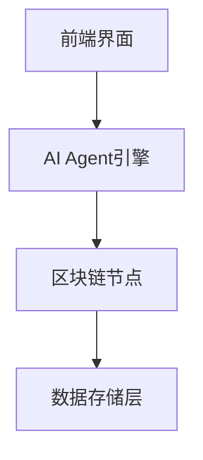

                 

# 企业AI Agent的区块链集成：提升数据可信度

> 关键词：企业AI Agent，区块链集成，数据可信度，智能合约，分布式系统

> 摘要：本文探讨了企业AI Agent与区块链技术的集成，重点分析了区块链如何提升AI Agent的数据可信度。通过详细阐述核心概念、系统架构设计、项目实战和未来趋势，本文旨在为企业技术决策者和开发者提供实用的指导，帮助他们理解并实施这一创新技术。

---

# 第一部分: 企业AI Agent与区块链集成概述

## 第1章: 企业AI Agent与区块链集成的背景与意义

### 1.1 企业AI Agent的定义与特点
AI Agent是一种智能体，能够感知环境、执行任务并做出决策。在企业环境中，AI Agent通常用于自动化业务流程、优化资源分配和提升决策效率。其核心特点包括：
- **自主性**：能够在无外部干预的情况下独立运作。
- **反应性**：能够实时感知环境变化并做出响应。
- **社交能力**：能够与其他系统或人类进行交互和协作。

### 1.2 区块链技术的基本原理
区块链是一种分布式账本技术，通过去中心化、不可篡改和透明性等特点，确保数据的安全性和可信度。其核心机制包括：
- **区块结构**：数据以区块形式存储，每个区块包含交易数据和时间戳。
- **共识机制**：通过算法（如PoW、PoS）达成分布式节点的共识。
- **智能合约**：自动执行预定义的规则和协议。

### 1.3 AI Agent与区块链结合的意义
区块链的去中心化和可信性特点，为AI Agent的数据管理和决策过程提供了新的可能性。两者的结合不仅提升了数据的可信度，还增强了系统的安全性和透明性。例如，在金融领域，AI Agent可以通过区块链技术实时监控交易数据，确保数据的完整性和不可篡改性。

---

## 第2章: 企业AI Agent与区块链的核心概念

### 2.1 AI Agent的运作机制
AI Agent的运作机制依赖于数据输入、处理和输出。其决策过程通常包括以下步骤：
1. **感知环境**：通过传感器或API获取外部数据。
2. **分析数据**：使用机器学习算法对数据进行处理和分析。
3. **制定决策**：基于分析结果生成行动计划。
4. **执行操作**：通过API或外部系统执行决策。

### 2.2 区块链技术的实现原理
区块链的实现原理包括数据存储、共识机制和智能合约。数据存储采用区块链式结构，共识机制确保数据的一致性，智能合约则实现了自动化规则的执行。例如，在供应链管理中，区块链可以记录每个产品的物流信息，确保数据的可追溯性。

### 2.3 AI Agent与区块链的结合模型
AI Agent与区块链的结合模型可以通过数据流模型、信任机制模型和交互协议模型来描述。数据流模型展示了数据在AI Agent和区块链之间的流动过程，信任机制模型描述了如何通过区块链增强AI Agent的信任度，交互协议模型则定义了两者之间的通信规则。

---

## 第3章: 区块链与AI Agent的结合优势

### 3.1 提升数据可信度的关键技术
区块链通过数据完整性、可追溯性和隐私保护技术，显著提升了AI Agent的数据可信度。例如，在医疗领域，区块链可以确保患者数据的安全性和隐私性，防止数据篡改。

### 3.2 区块链在AI Agent数据管理中的应用
区块链在AI Agent数据管理中的应用包括数据存储的分布式特性、数据访问的权限控制和数据更新的透明性。分布式特性确保了数据的冗余存储，防止数据丢失；权限控制保障了数据的安全性；透明性则便于追踪数据的来源和修改历史。

### 3.3 企业级数据可信度的提升策略
企业可以通过数据源的可信性评估、数据处理的可验证性和数据使用的合规性，进一步提升数据可信度。例如，在金融领域，企业可以通过区块链技术实现智能合约的自动执行，确保交易的透明性和合规性。

---

## 第4章: 区块链与AI Agent的系统架构设计

### 4.1 系统总体架构
系统总体架构包括前端界面、AI Agent引擎、区块链节点和数据存储层。前端界面负责用户交互，AI Agent引擎负责数据处理和决策，区块链节点负责数据存储和共识，数据存储层负责数据的持久化存储。

### 4.2 系统功能设计
系统功能设计包括数据采集、数据处理、智能合约执行和结果输出。数据采集通过传感器或API获取外部数据，数据处理通过机器学习算法对数据进行分析，智能合约执行通过区块链节点自动执行预定义规则，结果输出则通过前端界面展示给用户。

### 4.3 系统架构图

---

## 第5章: 区块链与AI Agent的项目实战

### 5.1 项目背景
本项目旨在开发一个基于区块链的AI Agent系统，用于企业级数据管理。通过区块链技术确保数据的可信度，提升系统的安全性和透明性。

### 5.2 系统核心实现
系统核心实现包括环境安装、AI Agent引擎开发、区块链节点部署和智能合约编写。环境安装需要安装Python、区块链框架和机器学习库，AI Agent引擎开发需要编写数据处理和决策逻辑，区块链节点部署需要配置区块链网络，智能合约编写需要定义数据存储和访问规则。

### 5.3 项目案例分析
以供应链管理为例，AI Agent可以通过区块链技术实时监控物流数据，确保数据的完整性和不可篡改性。智能合约可以自动执行物流节点的更新和通知，提升供应链管理的效率和透明度。

---

## 第6章: 未来趋势与挑战

### 6.1 未来发展趋势
未来，区块链与AI Agent的集成将更加智能化和自动化。智能合约的自动执行、数据的实时分析和决策的自动化将成为主要发展方向。

### 6.2 挑战与注意事项
尽管区块链与AI Agent的结合带来了诸多优势，但也面临一些挑战，如性能瓶颈、安全性问题和监管合规性问题。在实际应用中，需要充分考虑这些挑战，并采取相应的应对措施。

### 6.3 最佳实践
建议企业在实施区块链与AI Agent的集成时，注重数据隐私保护、系统性能优化和合规性管理。同时，可以通过实验和测试，逐步验证技术方案的有效性和可行性。

---

# 小结
企业AI Agent的区块链集成是一项具有广阔前景的技术创新。通过区块链技术的引入，AI Agent的数据可信度得到了显著提升，为企业级应用提供了新的可能性。未来，随着技术的不断发展，区块链与AI Agent的结合将为企业带来更大的价值。

---

作者：AI天才研究院/AI Genius Institute & 禅与计算机程序设计艺术 /Zen And The Art of Computer Programming

