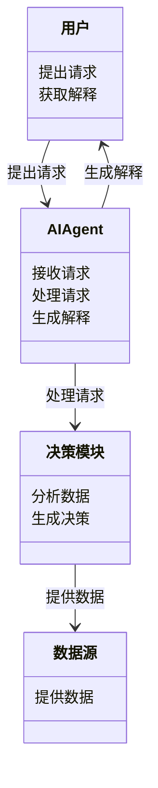
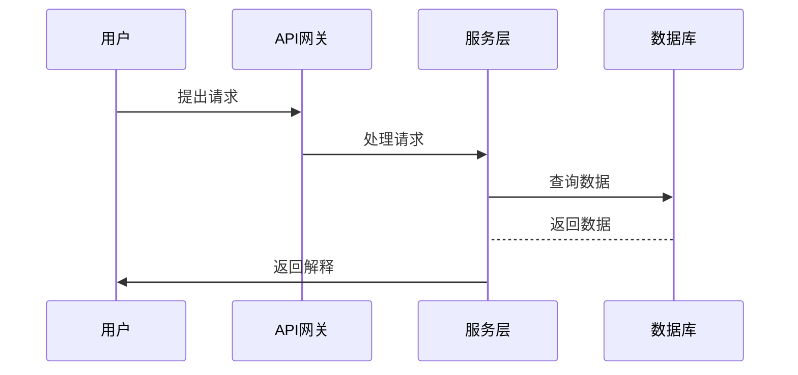

                 


# 企业AI Agent的可解释性设计

> 关键词：企业AI Agent，可解释性设计，算法原理，系统架构，项目实战

> 摘要：本文深入探讨了企业AI Agent的可解释性设计，从背景、核心概念、算法原理、系统架构到项目实战，详细阐述了如何确保AI Agent的决策过程透明、可理解，从而提升企业对AI系统的信任和管理能力。

---

# 第一部分: 企业AI Agent的可解释性设计背景

# 第1章: 企业AI Agent与可解释性概述

## 1.1 企业AI Agent的基本概念
### 1.1.1 AI Agent的定义与分类
AI Agent（智能体）是指能够感知环境并采取行动以实现目标的智能系统。根据应用场景，可以分为简单反射型、基于模型的反应型、目标驱动型和效用驱动型AI Agent。

### 1.1.2 企业AI Agent的应用场景
企业AI Agent广泛应用于智能客服、供应链优化、风险管理等领域，帮助企业在复杂环境中做出高效决策。

### 1.1.3 可解释性在企业AI Agent中的重要性
企业决策需要透明性，以确保合规性和可追溯性。可解释性是信任AI Agent决策的关键因素。

## 1.2 可解释性设计的背景与挑战
### 1.2.1 可解释性在AI系统中的必要性
复杂的AI模型（如深度神经网络）通常缺乏可解释性，导致用户难以理解其决策过程。

### 1.2.2 企业AI Agent的可解释性挑战
企业AI Agent涉及多领域知识，决策过程复杂，如何解释其行为是一个技术难题。

### 1.2.3 当前可解释性设计的解决方案
通过模型agnostic方法（如LIME）和模型specific方法（如SHAP值）实现可解释性。

## 1.3 本章小结
本章介绍了企业AI Agent的基本概念、应用场景以及可解释性设计的重要性，并指出了当前面临的挑战和解决方案。

---

# 第二部分: 可解释性设计的核心概念

# 第2章: 可解释性设计的核心原理

## 2.1 可解释性设计的原理
### 2.1.1 可解释性设计的基本原理
可解释性设计要求AI系统的行为能够被人类理解和验证，确保决策过程的透明性。

### 2.1.2 可解释性设计的关键要素
包括可解释性特征、解释生成机制和解释验证方法。

## 2.2 可解释性设计的核心原则
### 2.2.1 可解释性设计的透明性原则
AI Agent的决策过程需要清晰、透明，便于用户理解。

### 2.2.2 可解释性设计的简洁性原则
解释应简明扼要，避免过于复杂的描述，确保用户能够快速理解。

### 2.2.3 可解释性设计的可验证性原则
解释应能够被验证，确保其准确性和可靠性。

## 2.3 本章小结
本章详细阐述了可解释性设计的核心原理和原则，为后续的技术实现奠定了基础。

---

# 第三部分: 可解释性设计的技术实现

# 第3章: 可解释性设计的算法原理

## 3.1 LIME算法原理
### 3.1.1 LIME算法的基本思想
LIME通过扰动数据点，学习一个局部线性模型来解释复杂模型的预测结果。

### 3.1.2 LIME算法的工作流程
1. 扰动数据点。
2. 对扰动后的数据点进行预测。
3. 使用线性回归模型拟合扰动后的数据。
4. 输出解释结果。

### 3.1.3 LIME算法的优缺点分析
优点：适用于多种模型；缺点：依赖超参数设置，可能引入解释误差。

## 3.2 SHAP值原理
### 3.2.1 SHAP值的基本概念
SHAP（Shapley Additive exPlanations）是一种基于博弈论的解释方法，用于衡量每个特征对预测结果的贡献。

### 3.2.2 SHAP值的计算方法
通过Shapley值公式计算每个特征的SHAP值。

### 3.2.3 SHAP值的应用场景
适用于解释树模型和线性模型的预测结果。

## 3.3 其他可解释性技术
### 3.3.1 特征重要性分析
通过特征排序方法（如随机森林特征重要性）评估特征对预测结果的影响程度。

### 3.3.2 可视化解释方法
使用可视化工具（如Treeinterpreter）解释决策树模型的决策过程。

### 3.3.3 模型agnostic解释方法
针对任意模型的解释方法，如LIME和SHAP。

## 3.4 本章小结
本章介绍了几种主流的可解释性技术，包括LIME、SHAP值和其他方法，并分析了它们的优缺点。

---

# 第四部分: 可解释性设计的数学模型

# 第4章: 可解释性设计的数学基础

## 4.1 线性回归模型
### 4.1.1 线性回归模型的定义
线性回归模型通过最小化预测值与真实值之间的平方差之和来拟合数据。

### 4.1.2 线性回归模型的数学公式
$$y = \beta_0 + \beta_1x_1 + \beta_2x_2 + ... + \beta_nx_n$$
其中，$\beta_i$表示特征$x_i$的系数，$y$是预测目标。

### 4.1.3 线性回归模型的可解释性
线性回归模型的系数可以直接解释特征对预测结果的影响方向和程度。

## 4.2 树模型的可解释性
### 4.2.1 决策树模型的定义
决策树是一种基于树结构的预测模型，每个内部节点表示一个特征，叶子节点表示预测结果。

### 4.2.2 决策树模型的解释方法
通过遍历决策路径解释每个特征对预测结果的贡献。

### 4.2.3 树模型的可解释性优势
决策树模型的结构直观，易于解释。

## 4.3 本章小结
本章通过线性回归和决策树模型，展示了可解释性设计的数学基础及其优势。

---

# 第五部分: 可解释性设计的系统架构

# 第5章: 可解释性设计的系统分析与架构设计方案

## 5.1 问题场景介绍
企业AI Agent需要在复杂环境中做出决策，确保决策过程透明、可理解。

## 5.2 系统功能设计
### 5.2.1 领域模型
使用Mermaid类图展示企业AI Agent的领域模型，包括用户、AI Agent、数据源和决策模块。



### 5.2.2 系统架构设计
使用Mermaid架构图展示系统的分层架构，包括数据层、计算层、解释层和用户层。


### 5.2.3 系统接口设计
使用Mermaid序列图展示系统接口的交互过程。



## 5.3 本章小结
本章通过系统分析和架构设计，展示了企业AI Agent可解释性设计的实现方案。

---

# 第六部分: 可解释性设计的项目实战

# 第6章: 可解释性设计的项目实战

## 6.1 环境安装
安装必要的Python库，如`lime`和`shap`，以及相关数据处理库。

```bash
pip install lime
pip install shap
```

## 6.2 系统核心实现源代码
实现企业AI Agent的可解释性设计核心功能，包括数据预处理、模型训练和解释生成。

```python
import lime
import shap

# 数据预处理
data = preprocess_data()

# 模型训练
model = train_model(data)

# 解释生成
explainer = lime.LimeRegressor(model)
explanation = explainer.explain_instance(x_test)
```

## 6.3 代码应用解读与分析
解释代码的功能和作用，分析每一步骤对可解释性设计的影响。

## 6.4 实际案例分析
通过具体案例分析，展示企业AI Agent可解释性设计的实际应用效果。

## 6.5 本章小结
本章通过项目实战，详细讲解了企业AI Agent可解释性设计的实现过程和实际应用。

---

# 第七部分: 总结与展望

# 第7章: 总结与展望

## 7.1 本章总结
总结全文内容，强调可解释性设计在企业AI Agent中的重要性及其技术实现。

## 7.2 最佳实践 tips
### 7.2.1 可解释性设计的关键技巧
选择合适的可解释性技术，确保解释的准确性和简洁性。

### 7.2.2 注意事项
避免过度依赖复杂的解释方法，确保解释的可验证性。

### 7.2.3 拓展阅读
推荐阅读相关领域的最新研究成果，如《可解释的人工智能：理论、方法与应用》。

## 7.3 本章小结
本章总结了全文内容，并提出了未来的研究方向和实践建议。

---

# 作者：AI天才研究院/AI Genius Institute & 禅与计算机程序设计艺术 /Zen And The Art of Computer Programming

---

通过以上目录大纲，我们可以看到企业AI Agent的可解释性设计涵盖了从理论到实践的各个方面，从背景分析到系统实现，再到项目实战，全面探讨了如何确保AI Agent的决策过程透明、可理解，从而提升企业对AI系统的信任和管理能力。

