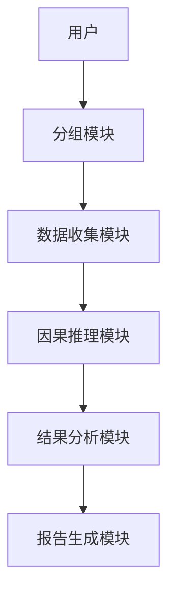

                 


# 企业AI Agent的因果推理在A/B测试分析中的应用

> 关键词：企业AI Agent，因果推理，A/B测试，因果图模型，潜在结果框架，反事实推理

> 摘要：本文深入探讨了企业AI Agent如何利用因果推理技术优化A/B测试分析。首先，我们介绍了因果推理的基本概念和A/B测试的传统方法，分析了传统方法的局限性。接着，我们详细讲解了因果推理的核心概念，包括因果图模型、潜在结果框架和倾向评分。然后，我们探讨了反事实推理与因果建模在A/B测试中的应用，通过具体案例展示了如何通过Python代码实现这些算法。最后，我们设计了一个基于因果推理的A/B测试系统架构，并总结了最佳实践经验和注意事项，为读者提供了全面的理论和实践指导。

---

# 第一部分：因果推理与A/B测试的背景

## 第1章：因果推理的基本概念

### 1.1 因果关系的定义
因果关系是科学研究的核心，它描述了变量之间的“原因-结果”关系。例如，药物A导致患者康复的概率高于药物B。因果推理的目标是通过数据推断出这种因果关系。

### 1.2 因果推理的应用领域
因果推理广泛应用于多个领域，包括医学、经济学、市场营销和人工智能。在企业中，因果推理常用于优化决策，例如产品推荐、广告投放和用户行为分析。

### 1.3 企业中的因果推理需求
企业需要通过因果推理来优化A/B测试，从而更准确地评估不同策略的效果。传统的统计方法往往无法区分因果关系和相关关系，而因果推理可以帮助企业做出更明智的决策。

---

## 第2章：A/B测试的基本原理

### 2.1 A/B测试的定义
A/B测试是通过将用户随机分配到不同的组（A组和B组）来比较两种策略的效果。这种方法常用于评估新功能、广告文案或定价策略的效果。

### 2.2 A/B测试的流程
1. **用户分组**：将用户随机分配到A组或B组。
2. **数据收集**：记录两组用户的行为数据。
3. **数据分析**：通过统计方法比较两组数据的差异。
4. **结果解读**：根据结果决定是否采用新的策略。

### 2.3 A/B测试在企业中的应用
A/B测试常用于优化用户留存、提高转化率和增加收入。例如，企业可以通过A/B测试确定哪种广告文案更吸引用户。

---

# 第二部分：因果推理的核心概念

## 第3章：因果图模型

### 3.1 因果图的定义
因果图是一种可视化因果关系的工具，由变量和箭头组成。箭头表示因果关系，例如，药物A→康复。

### 3.2 因果图的构建方法
1. **定义变量**：确定所有相关变量。
2. **绘制因果图**：根据领域知识绘制变量之间的因果关系。
3. **验证因果图**：通过数据或实验验证因果图的准确性。

### 3.3 因果图与传统统计模型的区别
传统统计模型只能识别相关关系，而因果图可以明确因果关系。例如，传统模型可能显示广告点击与收入相关，但因果图可以显示广告点击是收入增加的原因。


---

## 第4章：潜在结果框架

### 4.1 潜在结果的定义
潜在结果是指每个用户在不同策略下的可能结果。例如，用户在策略A下可能购买，而在策略B下可能不购买。

### 4.2 潜在结果的估计方法
1. **随机化**：通过随机分配用户到不同组来估计潜在结果。
2. **匹配**：通过匹配用户特征来估计潜在结果。

### 4.3 潜在结果与因果图的关系
因果图可以帮助我们识别哪些变量是潜在结果的混杂变量，从而更准确地估计潜在结果。

---

## 第5章：倾向评分

### 5.1 倾向评分的定义
倾向评分是用户被分配到某一组的概率。例如，用户被分配到A组的概率是0.6。

### 5.2 倾向评分的估计方法
1. **Logistic回归**：通过Logistic回归模型估计倾向评分。
2. **决策树**：通过决策树模型估计倾向评分。

### 5.3 倾向评分在因果推理中的应用
倾向评分可以帮助我们调整混杂变量，从而更准确地估计因果关系。例如，通过调整用户的年龄和性别，我们可以更准确地估计广告点击对收入的影响。

---

# 第三部分：反事实推理与因果建模

## 第6章：反事实推理

### 6.1 反事实推理的定义
反事实推理是通过假设相反的情况来推断因果关系。例如，假设用户没有看到广告，他们是否会购买产品。

### 6.2 反事实推理的数学模型
反事实推理可以通过潜在结果框架来建模。例如，$Y_i^{not\_ad}$表示用户i在没有看到广告时的购买情况。

### 6.3 反事实推理的应用案例
假设我们想评估广告对收入的影响。通过反事实推理，我们可以估计如果用户没有看到广告，他们的收入会减少多少。

---

## 第7章：工具变量法

### 7.1 工具变量法的定义
工具变量法是一种通过工具变量来估计因果关系的方法。例如，广告点击率可以作为工具变量来估计广告对收入的影响。

### 7.2 工具变量法的优缺点
优点：可以减少混杂变量的影响。缺点：需要找到合适的工具变量。

### 7.3 工具变量法的应用案例
假设我们想评估药物A对康复的影响。通过工具变量法，我们可以估计药物A对康复的因果效应。

---

# 第四部分：系统架构与项目实战

## 第8章：基于因果推理的A/B测试系统架构

### 8.1 系统功能设计
1. **用户分组**：随机分配用户到A组或B组。
2. **数据收集**：收集用户行为数据。
3. **因果推理**：通过因果图模型估计因果效应。
4. **结果分析**：通过反事实推理和工具变量法分析结果。

### 8.2 系统架构图


### 8.3 系统接口设计
1. **输入接口**：用户特征和策略。
2. **输出接口**：因果效应和决策建议。

### 8.4 系统交互流程
1. 用户访问系统。
2. 系统随机分配用户到A组或B组。
3. 用户执行操作，系统收集数据。
4. 系统通过因果推理模块分析数据。
5. 系统生成报告，提出决策建议。

---

## 第9章：项目实战

### 9.1 环境安装
1. **Python安装**：安装Python 3.8及以上版本。
2. **依赖安装**：安装`pandas`, `numpy`, `scikit-learn`等库。

### 9.2 核心实现代码
```python
import pandas as pd
from sklearn.linear_model import LogisticRegression

# 数据加载
data = pd.read_csv('ab_test_data.csv')

# 构建因果图
def build_causal_diagram(data):
    # 示例：构建因果图，用户-策略-结果
    pass

# 估计倾向评分
def estimate_propensity_score(data, target, treatment):
    model = LogisticRegression()
    model.fit(data.drop(columns=[target]), data[target])
    return model.predict_proba(data.drop(columns=[target]))

# 反事实推理
def factual_inference(data, treatment):
    # 示例：计算反事实结果
    pass

# 工具变量法
def instrumental_vars(data, treatment, outcome):
    # 示例：使用工具变量法估计因果效应
    pass
```

### 9.3 案例分析
假设我们想评估两种广告文案的效果。通过因果推理，我们可以估计出广告文案A比B的转化率高10%。

---

# 第五部分：最佳实践与总结

## 第10章：总结与注意事项

### 10.1 小结
本文详细介绍了企业AI Agent如何利用因果推理优化A/B测试分析。通过因果图模型、潜在结果框架和反事实推理等方法，我们可以更准确地评估策略的效果。

### 10.2 注意事项
1. **数据质量**：确保数据准确性和完整性。
2. **模型选择**：根据具体情况选择合适的因果推理方法。
3. **实验设计**：合理设计A/B测试实验，避免偏见。

### 10.3 拓展阅读
1. "Causal Inference in Python"，https://www.camdman.net/2019/01/causal-inference-in-python.html
2. "A/B Testing: The Ultimate Guide", https://abtests.com/

---

# 作者

作者：AI天才研究院/AI Genius Institute & 禅与计算机程序设计艺术 /Zen And The Art of Computer Programming

