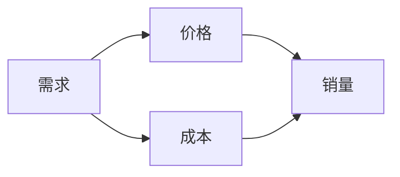
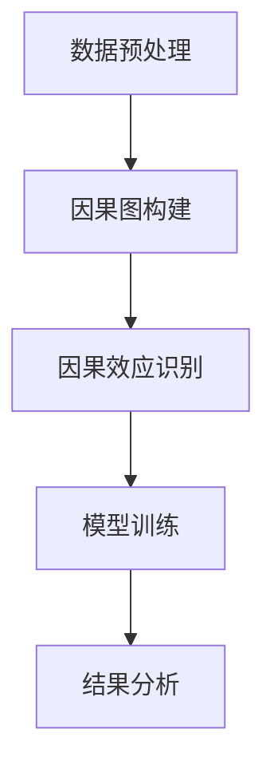
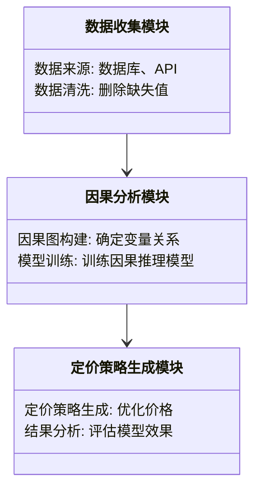
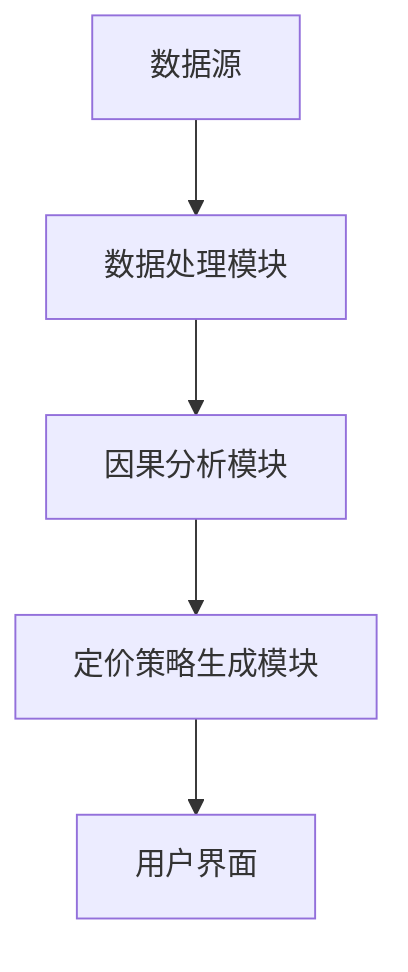

                 


# 企业AI Agent的因果推理在产品定价策略中的精准应用

## 关键词：企业AI Agent，因果推理，产品定价策略，精准应用，机器学习，定价模型

## 摘要：本文探讨了企业AI Agent如何通过因果推理提升产品定价策略的精准性。通过分析因果关系，AI Agent能够识别变量间的真实关系，从而优化定价模型，实现数据驱动的定价决策。文章详细介绍了因果推理的基本原理、算法实现、系统架构设计以及实际案例，帮助读者理解如何在企业中应用这些技术。

---

# 1. 背景介绍

## 1.1 核心概念术语说明

### 1.1.1 AI Agent
AI Agent（人工智能代理）是能够感知环境、自主决策并执行任务的智能实体。企业级AI Agent具备复杂问题解决能力，常用于数据分析、决策支持等领域。

### 1.1.2 因果推理
因果推理研究变量间的因果关系，通过识别因果路径和影响强度，推断因果关系，解释现象发生的原因。

### 1.1.3 产品定价策略
定价策略指企业为产品制定价格的策略，考虑成本、市场需求、竞争环境等因素，确保价格合理且利润最大化。

## 1.2 问题背景

传统定价方法依赖相关分析，无法准确识别因果关系，导致定价决策可能存在偏差。例如，价格变化可能影响销量，但销量变化也可能影响价格调整，相关分析无法区分因果关系，可能导致错误的定价策略。

## 1.3 应用场景

### 1.3.1 电商行业
电商企业通过分析用户行为数据，利用因果推理优化定价策略，提升转化率和利润。

### 1.3.2 金融行业
金融机构使用因果推理分析市场波动，优化金融产品的定价模型，降低风险。

### 1.3.3 制造业
制造商通过因果推理分析生产成本和市场需求，优化产品定价策略，提高市场竞争力。

---

# 2. 核心概念与联系

## 2.1 因果关系与相关关系

| 属性          | 相关关系                     | 因果关系                     |
|---------------|------------------------------|------------------------------|
| 定义          | 变量间的统计关联性           | 变量间的因果影响关系         |
| 方向          | 双向或无向                   | 单向                        |
| 时间顺序      | 无明确顺序                   | 原因发生在结果前             |
| 干扰因素      | 无法排除外部影响             | 可识别并控制外部影响         |

## 2.2 因果图的结构



因果图展示了需求、价格、成本和销量之间的关系，帮助识别变量间的因果路径。

---

# 3. 算法原理

## 3.1 潜在结果框架

潜在结果框架通过定义每个单位在不同处理情况下的可能结果，分析因果效应。例如，公式：

$$ Y_i^{do(t)} $$

表示在处理变量为t时，第i个单位的潜在结果。

## 3.2 反事实推理

反事实推理通过计算在不同假设下结果的变化，推断因果效应。例如，使用反事实推理分析价格调整对销量的影响。

## 3.3 倾向评分法

倾向评分法通过估计每个单位接受处理的可能性，调整数据，减少混杂变量的影响。例如，公式：

$$ e_{i} = P(T=1|X=x_i) $$

表示单位i接受处理的概率。

## 3.4 算法实现

### 3.4.1 算法步骤



### 3.4.2 代码示例

```python
import pandas as pd
from causalnex.structure import DAG
from causalnex.plots import plot_dag

# 数据预处理
data = pd.DataFrame({'需求': [1, 2, 3], '价格': [10, 15, 20], '销量': [5, 3, 2]})

# 构建因果图
dag = DAG()
dag.add_edge('需求', '价格')
dag.add_edge('需求', '销量')
dag.add_edge('价格', '销量')

# 可视化因果图
plot_dag(dag)
```

---

# 4. 系统架构设计

## 4.1 系统功能设计

### 4.1.1 系统模块



## 4.2 系统架构设计



---

# 5. 项目实战

## 5.1 电商定价案例

### 5.1.1 环境搭建

安装必要的库：

```bash
pip install pandas numpy causalnex
```

### 5.1.2 数据收集与预处理

```python
import pandas as pd
data = pd.read_csv('销售数据.csv')
data.head()
```

### 5.1.3 因果模型训练

```python
from causalnex因果推理模块 import 因果模型
model = 因果模型()
model.fit(data)
```

### 5.1.4 定价策略生成

```python
优化价格 = model.optimize_price(产品ID)
print(优化价格)
```

### 5.1.5 结果分析

分析模型输出，评估定价效果，优化模型参数。

---

# 6. 最佳实践

## 6.1 小结

因果推理通过识别变量间的因果关系，提升了定价策略的精准性。企业应结合自身需求，选择合适的算法和工具，构建高效的定价系统。

## 6.2 注意事项

- 确保数据质量，避免偏差。
- 定期更新模型，适应市场变化。
- 重视模型解释性，便于优化和调整。

## 6.3 拓展阅读

- 因果推理的经典文献。
- 最新研究进展和应用案例。

---

# 作者：AI天才研究院 & 禅与计算机程序设计艺术

