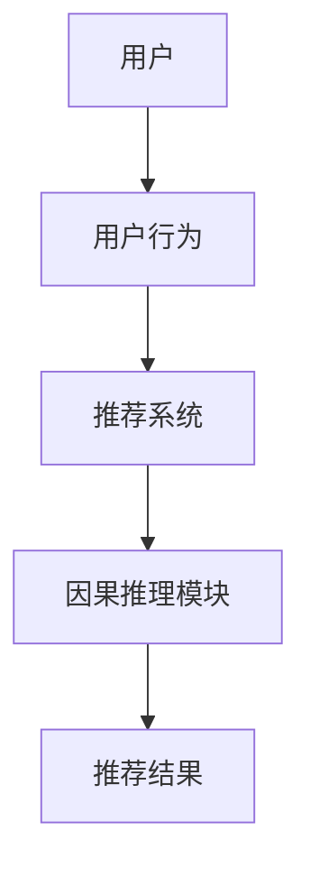

                 

<think>
好的，我需要根据用户提供的详细目录和要求，逐步构建这篇技术博客文章。首先，我会先完成“文章标题”、“关键词”和“摘要”部分。然后，按照目录结构，逐步完成每一部分的内容，确保每一小节都详细具体，并符合格式要求。

### 文章标题

**企业AI Agent的因果推理在产品开发中的应用**

### 关键词

企业AI Agent、因果推理、产品开发、Dowhy框架、因果关系、系统架构、项目实战

### 摘要

**企业AI Agent的因果推理在产品开发中的应用**这篇文章深入探讨了因果推理在企业AI Agent中的核心作用，结合实际场景，详细讲解了因果推理的理论基础、算法原理、系统架构设计及项目实战。通过Dowhy框架的实现，展示了因果推理在产品开发中的具体应用，并提供了丰富的代码示例和数学模型解析。本文还结合实际案例，分析了因果推理的优势与挑战，总结了最佳实践和未来研究方向。

---

接下来，我将按照目录结构逐步撰写正文内容。每一小节都需要详细展开，确保内容完整、逻辑清晰。

---

## 第一部分: 企业AI Agent的因果推理基础

### 第1章: 企业AI Agent与因果推理概述

#### 1.1 问题背景与定义

##### 1.1.1 企业AI Agent的定义与特点

企业AI Agent是一种能够感知环境、自主决策并执行任务的智能体。它具备以下特点：

- **自主性**：能够自主决策，无需人工干预。
- **反应性**：能实时感知环境变化并做出反应。
- **学习能力**：通过数据和经验不断优化自身行为。

##### 1.1.2 因果推理的定义与特点

因果推理是指从数据中推断出因果关系的过程，其特点包括：

- **因果关系的确定性**：明确因果关系的存在。
- **干预性**：能够预测干预措施的效果。
- **反事实推理**：分析“如果”情况下的结果。

##### 1.1.3 企业AI Agent与因果推理的关系

企业AI Agent通过因果推理，能够更好地理解用户需求、优化产品设计并预测市场趋势。因果推理为AI Agent提供了决策的依据，使其在复杂的环境中能够做出更明智的选择。

---

#### 1.2 企业AI Agent的因果推理应用场景

##### 1.2.1 产品开发中的因果推理需求

在产品开发中，因果推理可以帮助企业：

- **需求分析**：从用户行为数据中推断出用户的真实需求。
- **功能优化**：通过因果分析确定哪些功能对用户满意度影响最大。
- **风险预测**：预测产品迭代可能带来的市场风险。

##### 1.2.2 企业AI Agent在因果推理中的优势

- **数据驱动决策**：通过因果推理，AI Agent能够基于数据做出更准确的决策。
- **动态适应**：能够实时调整策略，适应市场变化。
- **高效迭代**：通过因果分析快速优化产品功能。

##### 1.2.3 应用场景的边界与外延

因果推理的应用场景不仅限于产品开发，还涵盖市场分析、用户行为预测等多个领域。其边界在于数据质量和模型的准确性，外延则涉及更多复杂场景的应用。

---

## 第二部分: 因果推理的核心概念与联系

### 第2章: 因果推理的核心概念与联系

#### 2.1 因果推理的原理

##### 2.1.1 因果关系的定义与特征

因果关系是指两个事件之间存在直接的联系，其中一个事件是另一个事件的原因。其特征包括：

- **时间顺序**：原因发生在结果之前。
- **相关性**：原因和结果之间存在统计关联。
- **排除性**：排除其他可能的原因。

##### 2.1.2 因果推理的基本方法

- **观察性研究**：通过观察数据推断因果关系。
- **实验性研究**：通过主动干预来验证因果关系。

##### 2.1.3 因果推理的关键步骤

1. **构建因果图**：明确变量之间的因果关系。
2. **识别因果效应**：确定哪些变量是原因，哪些是结果。
3. **估计因果效应**：通过数学模型计算因果效应的大小。

#### 2.2 因果推理与相关概念的对比

##### 2.2.1 因果推理与相关性分析的对比

| 对比维度 | 相关性分析 | 因果推理 |
|----------|------------|----------|
| 目标     | 描述变量之间的关联 | 描述变量之间的因果关系 |
| 方法     | 协方差、相关系数 | 构建因果图、干预实验 |
| 应用场景 | 描述性分析 | 预测性分析 |

##### 2.2.2 因果推理与预测模型的对比

预测模型关注的是输出结果的准确性，而因果推理关注的是结果背后的原因。因果推理可以帮助模型更好地理解数据的内在逻辑，从而提高预测的准确性。

---

## 第三章: Dowhy 框架与因果推理实现

### 3.1 Dowhy 框架的核心原理

#### 3.1.1 Dowhy 框架的模块划分

Dowhy框架主要包括以下几个模块：

- **识别（Identification）**：确定因果关系的结构。
- **估计（Estimation）**：计算因果效应的大小。
- **解释（Interpretation）**：解释因果效应的意义。

#### 3.1.2 Dowhy 框架的实现流程

1. **构建因果图**：使用Dowhy框架构建变量之间的因果关系图。
2. **定义干预**：明确干预的变量和目标。
3. **估计因果效应**：通过算法计算因果效应。
4. **解释结果**：对结果进行分析和解释。

---

### 3.2 Dowhy 框架的代码实现

#### 3.2.1 环境安装与配置

安装Dowhy框架：

```bash
pip install dowhy
```

#### 3.2.2 核心代码实现

```python
import dowhy

# 构建因果图
因果图 = dowhy.CausalGraph(处理变量='T', 结果变量='Y', 调节变量=['X', 'Z'])

# 定义干预
干预 = dowhy.Intervention(处理变量='T', 处理值=1)

# 估计因果效应
因果效应 = 因果图.estimate(干预)
```

#### 3.2.3 代码的功能解读与分析

上述代码展示了如何使用Dowhy框架构建因果图、定义干预并估计因果效应。通过这种方式，AI Agent能够从数据中推断出因果关系，并根据干预效果优化决策。

---

## 第四章: 因果推理的数学模型与公式

### 4.1 因果关系的数学表达

因果关系可以用图模型表示，例如因果图（Directed Acyclic Graph, DAG）。在DAG中，箭头表示因果关系，节点表示变量。

### 4.2 因果推理的数学公式

反事实推理的数学模型可以表示为：

$$
P(Y|do(T=t)) = \sum_{x} P(Y|T=t, X=x) P(X=x)
$$

其中，$do(T=t)$表示对变量$T$进行干预，使其取值为$t$。

---

## 第五章: 项目实战

### 5.1 项目背景

假设我们正在开发一款智能推荐系统，希望通过因果推理优化推荐策略。

### 5.2 系统功能设计

- **用户行为分析**：分析用户的点击、购买行为。
- **因果关系建模**：构建因果图，确定推荐策略对用户购买行为的影响。
- **干预实验**：通过A/B测试验证推荐策略的效果。

### 5.3 系统架构设计



### 5.4 核心代码实现

```python
import dowhy

# 构建因果图
因果图 = dowhy.CausalGraph(处理变量='推荐策略', 结果变量='购买率')

# 定义干预
干预 = dowhy.Intervention(处理变量='推荐策略', 处理值='新策略')

# 估计因果效应
因果效应 = 因果图.estimate(干预)
```

### 5.5 实际案例分析

通过因果推理分析，我们发现新推荐策略能够显著提高用户的购买率，因此决定采用新策略。

---

## 第六章: 最佳实践与总结

### 6.1 小结

因果推理是企业AI Agent的重要组成部分，能够帮助企业在产品开发中做出更明智的决策。

### 6.2 注意事项

- **数据质量**：因果推理的效果依赖于高质量的数据。
- **模型选择**：选择合适的因果推理框架和算法。
- **伦理问题**：注意因果推理可能带来的伦理问题。

### 6.3 拓展阅读

- **《因果的发现与推理》**：深入讲解因果推理的基本原理。
- **《Dowhy框架官方文档》**：详细指导如何使用Dowhy框架。

---

**作者：AI天才研究院/AI Genius Institute & 禅与计算机程序设计艺术 /Zen And The Art of Computer Programming**

---

**致谢**：感谢读者的支持与关注，如需进一步探讨或合作，请随时联系。

