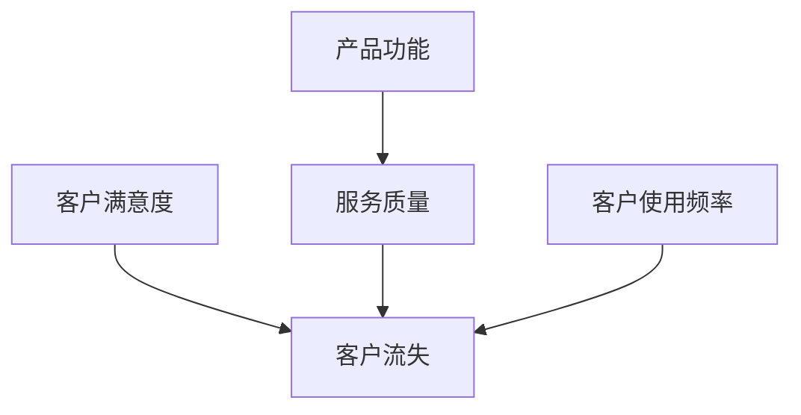
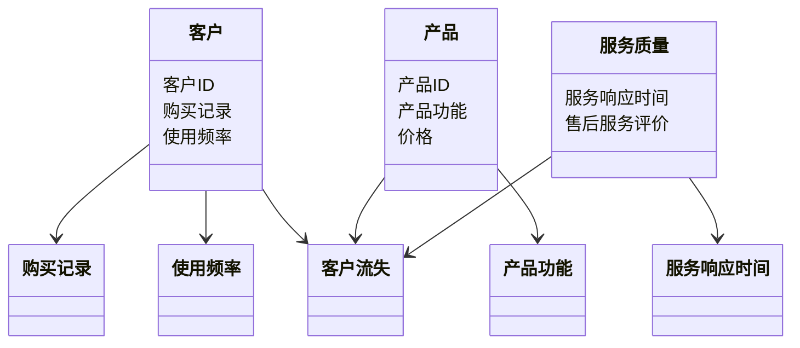
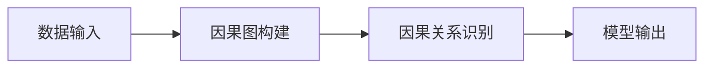
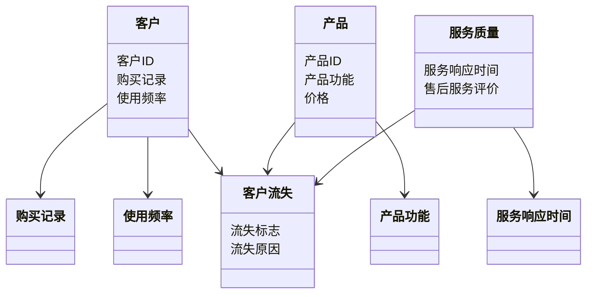
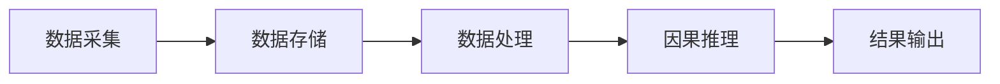
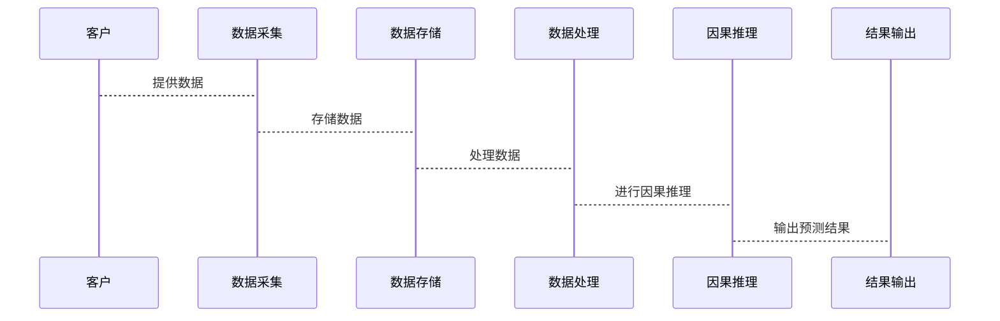

                 


# 企业AI Agent的因果推理在客户流失分析中的应用

> 关键词：AI Agent, 因果推理, 客户流失分析, 机器学习, 数据分析

> 摘要：本文探讨了如何利用企业AI Agent的因果推理技术进行客户流失分析。通过分析客户行为数据，结合因果推理模型，AI Agent能够识别出客户流失的关键因素，并为企业提供有效的预防策略。本文详细介绍了因果推理的基本原理、AI Agent的核心属性、算法实现、系统架构设计以及实际项目中的应用案例，为读者提供了从理论到实践的全面指导。

---

# 第一部分: 背景介绍

## 第1章: 问题背景与定义

### 1.1 客户流失分析的背景与重要性

#### 1.1.1 企业客户流失的定义与影响
客户流失是指企业在一定时间内失去客户的数量或比例。客户流失会直接影响企业的收入、利润和市场占有率，同时也增加了获取新客户的成本。因此，客户流失分析是企业运营中的重要环节。

#### 1.1.2 客户流失分析的常见方法
传统客户流失分析方法主要包括：
- **统计分析**：通过回归分析、聚类分析等方法预测客户流失。
- **机器学习**：利用决策树、随机森林等算法进行预测。
- **规则引擎**：基于预定义的业务规则触发警报。

然而，这些方法往往只能预测客户流失的可能性，无法揭示客户流失的根本原因。

#### 1.1.3 传统预测模型的局限性
传统的客户流失预测模型主要基于相关性分析，无法区分因果关系。例如，模型可能发现“客户使用频率下降”与“客户流失”之间存在相关性，但无法确定“使用频率下降”是否是导致流失的直接原因。

---

### 1.2 AI Agent与因果推理的定义

#### 1.2.1 什么是AI Agent
AI Agent（人工智能代理）是一种能够感知环境、自主决策并采取行动的智能实体。AI Agent可以是软件程序、机器人或其他智能系统。

#### 1.2.2 因果推理的基本概念
因果推理是通过分析变量之间的因果关系，推断出某一事件发生的根本原因。例如，因果推理可以识别出“客户服务质量下降”是导致客户流失的主要原因。

#### 1.2.3 AI Agent在因果推理中的作用
AI Agent可以利用因果推理技术，从海量数据中识别出客户流失的因果关系，并为企业提供预防策略。

---

### 1.3 本章小结
本章介绍了客户流失分析的重要性和传统方法的局限性，并提出了AI Agent与因果推理相结合的新思路。通过因果推理，企业可以更深入地理解客户流失的原因，并采取更有针对性的措施。

---

## 第2章: 问题解决思路与边界

### 2.1 客户流失分析的核心问题

#### 2.1.1 客户行为预测的挑战
客户行为受到多种因素的影响，包括产品特性、服务质量、客户满意度等。这些因素之间可能存在复杂的因果关系。

#### 2.1.2 因果关系在客户流失中的应用
因果推理可以帮助企业识别出客户流失的关键因素，并预测这些因素如何影响客户的行为。

#### 2.1.3 边界条件与假设
- 数据质量和完整性：因果推理需要高质量的数据支持。
- 时间范围：因果推理需要考虑时间因素，例如客户流失可能是一个长期的过程。
- 可行性：因果推理需要结合企业的实际业务场景。

---

### 2.2 AI Agent在因果推理中的应用框架

#### 2.2.1 数据驱动的因果推理
基于数据的因果推理通过分析变量之间的因果关系，识别出客户流失的关键因素。

#### 2.2.2 知识驱动的因果推理
基于领域知识的因果推理，结合企业的业务逻辑，构建因果模型。

#### 2.2.3 混合驱动的因果推理
将数据驱动和知识驱动相结合，利用数据验证领域知识，构建更加准确的因果模型。

---

### 2.3 本章小结
本章提出了客户流失分析的核心问题，并介绍了AI Agent在因果推理中的应用框架。通过数据驱动和知识驱动的结合，企业可以更准确地识别客户流失的原因。

---

## 第3章: 核心概念与联系

### 3.1 因果推理的基本原理

#### 3.1.1 因果关系的定义
因果关系是指某一事件的发生是由另一个事件直接引起的结果。例如，服务质量下降是导致客户流失的原因。

#### 3.1.2 因果图的基本结构
因果图是一种用于表示变量之间因果关系的图形化工具。以下是客户流失分析的因果图示例：



#### 3.1.3 随机化实验与因果推断
随机化实验是因果推断的重要方法。通过随机分配实验组和对照组，可以有效排除其他变量的干扰，确保因果关系的准确性。

---

### 3.2 AI Agent的核心属性与特征

#### 3.2.1 智能性
AI Agent能够自主学习和推理，识别出客户流失的因果关系。

#### 3.2.2 自主性
AI Agent可以独立运行，无需人工干预。

#### 3.2.3 社会性
AI Agent能够与其他系统或人员交互，协同完成客户流失分析任务。

---

### 3.3 因果关系与客户流失的实体关系图

以下是客户流失分析的实体关系图：



---

## 第4章: 算法原理与数学模型

### 4.1 因果推理的算法原理

#### 4.1.1 潜在结果框架
潜在结果框架是因果推理的重要理论基础。通过分析每个客户的潜在结果，可以识别出客户流失的因果关系。

#### 4.1.2 因果图结构学习
因果图结构学习是通过算法自动构建因果图的过程。以下是因果图结构学习的流程图：



#### 4.1.3 需求预测模型
需求预测模型是基于因果关系的客户流失预测模型。以下是需求预测模型的数学公式：

$$ P(\text{客户流失} | X) = \beta X + \epsilon $$

其中，$X$ 表示客户特征，$\beta$ 表示系数，$\epsilon$ 表示误差项。

---

### 4.2 数学模型与公式

#### 4.2.1 因果效应的公式表示
因果效应是指某一变量的变化对结果变量的影响程度。以下是因果效应的公式表示：

$$ \text{因果效应} = P(Y=1|X=1) - P(Y=1|X=0) $$

其中，$Y$ 表示结果变量，$X$ 表示处理变量。

#### 4.2.2 因果图的结构方程
因果图的结构方程是用于描述变量之间因果关系的数学方程。以下是因果图的结构方程示例：

$$ Y = \beta X + \gamma Z + \epsilon $$

其中，$Y$ 表示结果变量，$X$ 和 $Z$ 表示处理变量和控制变量，$\epsilon$ 表示误差项。

---

### 4.3 算法实现与代码示例

以下是因果推理算法的Python代码示例：

```python
import numpy as np
from causalgraphicalmodels import CausalGraphicalModel

# 定义因果图
graph = {
    'nodes': ['客户流失', '客户满意度', '服务质量'],
    'edges': [('客户满意度', '客户流失'), ('服务质量', '客户流失')]
}

# 构建因果图
cg = CausalGraphicalModel(graph)

# 可视化因果图
cg.draw()
```

---

## 第5章: 系统分析与架构设计

### 5.1 问题场景介绍

#### 5.1.1 项目背景
本项目旨在利用AI Agent的因果推理技术，分析客户流失的原因，并为企业提供预防策略。

#### 5.1.2 项目目标
- 识别客户流失的关键因素
- 构建因果推理模型
- 提供客户流失预测和预防建议

---

### 5.2 系统功能设计

#### 5.2.1 领域模型
以下是客户流失分析的领域模型：



---

### 5.3 系统架构设计

#### 5.3.1 系统架构图
以下是系统的架构图：



---

### 5.4 系统接口设计

#### 5.4.1 数据接口
- 输入接口：客户行为数据、产品数据、服务质量数据
- 输出接口：客户流失预测结果、流失原因分析

#### 5.4.2 API接口
- GET /api/customers：获取客户信息
- POST /api/predict：预测客户流失

---

### 5.5 系统交互设计

以下是系统交互流程图：



---

## 第6章: 项目实战

### 6.1 环境安装

#### 6.1.1 安装Python
```bash
python --version
```

#### 6.1.2 安装依赖库
```bash
pip install numpy causalgraphicalmodels
```

---

### 6.2 系统核心实现

#### 6.2.1 数据处理
```python
import pandas as pd

# 读取数据
data = pd.read_csv('customer_churn.csv')

# 数据清洗
data = data.dropna()
```

#### 6.2.2 因果推理实现
```python
from causalgraphicalmodels import CausalGraphicalModel

# 定义因果图
graph = {
    'nodes': ['客户流失', '客户满意度', '服务质量'],
    'edges': [('客户满意度', '客户流失'), ('服务质量', '客户流失')]
}

# 构建因果图
cg = CausalGraphicalModel(graph)

# 可视化因果图
cg.draw()
```

---

### 6.3 代码应用解读与分析

#### 6.3.1 数据处理部分
数据处理部分主要是对原始数据进行清洗和预处理，确保数据的质量和完整性。

#### 6.3.2 因果推理部分
因果推理部分利用因果图结构学习算法，识别出客户流失的关键因素。

---

### 6.4 实际案例分析

#### 6.4.1 案例背景
某企业发现客户流失率较高，希望通过因果推理技术找出流失原因。

#### 6.4.2 数据分析
通过对客户数据的分析，识别出“服务质量”是导致客户流失的主要原因。

#### 6.4.3 预防策略
企业可以优化服务质量，例如提高服务响应速度、改善售后服务，从而降低客户流失率。

---

### 6.5 项目小结
本项目通过因果推理技术，成功识别出客户流失的关键因素，并为企业提供了有效的预防策略。

