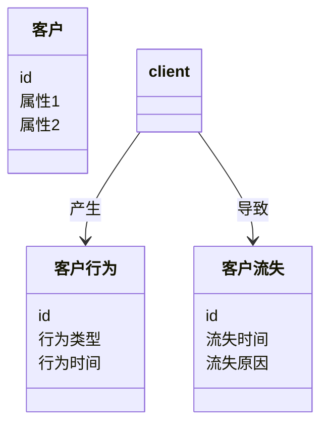
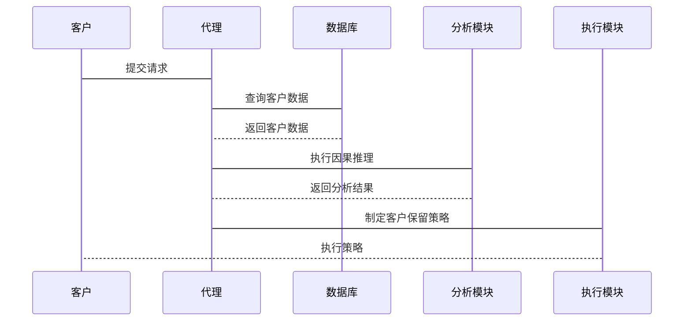

                 


# 企业AI Agent的因果推理在客户流失分析中的深度应用

> 关键词：企业AI Agent，因果推理，客户流失分析，因果图，潜在结果框架

> 摘要：本文详细探讨了企业AI Agent在客户流失分析中的应用，重点介绍了因果推理的基本原理及其在客户流失分析中的深度应用。通过构建因果图和潜在结果框架，本文提出了一种新的客户流失分析方法，能够更准确地识别和预测客户流失风险，为企业制定有效的客户保留策略提供科学依据。

---

# 第一部分: 企业AI Agent与因果推理基础

## 第1章: 企业AI Agent的概述

### 1.1 什么是企业AI Agent
#### 1.1.1 AI Agent的基本定义
AI Agent（人工智能代理）是指能够感知环境、自主决策并采取行动以实现特定目标的智能实体。它可以通过传感器获取信息，利用算法进行分析和推理，并通过执行器采取行动。

#### 1.1.2 企业AI Agent的核心特征
- **自主性**：能够自主决策和行动。
- **反应性**：能够实时感知环境并做出反应。
- **目标导向性**：所有行为都以实现特定目标为导向。
- **学习能力**：能够通过数据和经验不断优化自身行为。

#### 1.1.3 企业AI Agent的分类与应用场景
企业AI Agent可以分为**基于规则的Agent**、**基于模型的Agent**和**基于学习的Agent**。其应用场景包括客户关系管理、供应链优化、风险控制等。

### 1.2 因果推理的基本概念
#### 1.2.1 因果关系与相关关系的区别
因果关系是指一个事件是另一个事件发生的原因，而相关关系只是指两个事件之间存在统计上的关联。例如，降雨是滑倒的因果，但降雨和滑倒的相关关系并不意味着降雨直接导致滑倒。

#### 1.2.2 因果推理的基本原理
因果推理通过分析变量之间的因果关系，推断出因果效应。其核心在于识别因果路径并估计因果效应。

#### 1.2.3 因果图与因果模型
因果图（Causal Graph）是一种用于表示变量之间因果关系的有向图。因果模型基于因果图构建，用于描述变量之间的因果关系。

### 1.3 客户流失分析的背景与意义
#### 1.3.1 客户流失的定义与分类
客户流失是指客户不再与企业进行交易或终止与企业的关系。客户流失可以分为**自然流失**（客户主动选择离开）和**非自然流失**（因企业行为导致客户离开）。

#### 1.3.2 客户流失对企业的影响
客户流失会直接影响企业的收入和利润，同时也会增加获取新客户的成本。此外，客户流失还可能导致企业声誉受损。

#### 1.3.3 传统客户流失分析方法的局限性
传统客户流失分析方法主要基于统计相关性分析，难以区分因果关系，导致分析结果的准确性有限。

### 1.4 本章小结
本章介绍了企业AI Agent的基本概念、核心特征及其应用场景，重点讲解了因果推理的基本原理和因果图的构建方法，最后分析了客户流失的背景、分类及其对企业的影响，指出了传统客户流失分析方法的局限性。

---

## 第2章: 企业AI Agent与因果推理的结合

### 2.1 因果推理在AI Agent中的作用
#### 2.1.1 因果推理如何增强AI Agent的决策能力
因果推理通过分析变量之间的因果关系，帮助AI Agent做出更合理的决策。例如，在客户流失分析中，因果推理可以识别出哪些因素是客户流失的真正原因。

#### 2.1.2 因果推理在AI Agent中的实现方式
因果推理可以通过因果图构建、潜在结果框架和反事实推理等方式在AI Agent中实现。

### 2.2 企业客户流失分析中的因果关系建模
#### 2.2.1 客户流失的因果关系链路
客户流失的因果关系链路包括多个变量，如客户满意度、服务质量、价格敏感性等。因果图可以帮助我们清晰地识别这些变量之间的因果关系。

#### 2.2.2 因果图在客户流失分析中的构建
通过构建因果图，我们可以明确变量之间的因果关系，并识别出关键的影响因素。例如，因果图可以显示服务质量对客户满意度的影响，客户满意度又影响客户忠诚度，最终导致客户流失。

### 2.3 本章小结
本章探讨了因果推理在企业AI Agent中的作用，重点分析了客户流失分析中的因果关系建模方法，强调了因果图在识别因果关系中的重要性。

---

## 第3章: 因果推理的数学基础与算法原理

### 3.1 因果推理的数学模型
#### 3.1.1 潜在结果框架（Potential Outcome Framework）
潜在结果框架通过定义每个单位在不同处理情况下的潜在结果，帮助我们识别因果效应。例如，对于客户i，假设我们有两种处理情况：给予优惠（T=1）和不给予优惠（T=0），我们可以定义客户i在两种处理情况下的潜在结果。

$$ Y_i^1 \text{ 和 } Y_i^0 $$

其中，\( Y_i^1 \) 表示客户i在给予优惠情况下的流失情况，\( Y_i^0 \) 表示客户i在不给予优惠情况下的流失情况。

#### 3.1.2 因果效应的定义与计算
平均处理效应（Average Treatment Effect，ATE）是因果推理中的一个重要指标，定义为所有单位在不同处理情况下的平均结果差异。

$$ \text{ATE} = E[Y_i^1 - Y_i^0] $$

### 3.2 因果图结构与学习算法
#### 3.2.1 因果图的构建与表示
因果图通过有向边表示变量之间的因果关系。例如，变量X对变量Y有因果影响，可以用一条从X指向Y的有向边表示。

#### 3.2.2 基于因果图的推断算法（如Do-Why框架）
Do-Why框架是一种基于因果图的推断方法，通过识别因果路径并计算因果效应，帮助我们进行因果推断。

### 3.3 算法原理的数学公式
#### 3.3.1 潜在结果公式
$$ Y_i = \theta(X_i) + \epsilon_i $$

其中，\( X_i \) 表示客户特征，\( \theta(X_i) \) 表示客户i的潜在流失概率，\( \epsilon_i \) 是误差项。

#### 3.3.2 因果效应公式
$$ \text{ATE} = E[Y_i^1 - Y_i^0] $$

### 3.4 本章小结
本章详细介绍了因果推理的数学模型和算法原理，重点讲解了潜在结果框架和因果图结构，并给出了相关的数学公式。

---

## 第4章: 系统分析与架构设计方案

### 4.1 项目场景介绍
我们以一个电子商务企业为例，分析客户流失问题。该企业希望通过AI Agent技术，利用因果推理方法，识别出客户流失的关键因素，并制定有效的客户保留策略。

### 4.2 系统功能设计
#### 4.2.1 领域模型设计
以下是领域模型的类图：



#### 4.2.2 系统架构设计
以下是系统架构图：

```mermaid
client -> 代理: 请求
代理 -> 数据库: 查询数据
数据库 --> 代理: 返回数据
代理 -> 分析模块: 执行因果推理
分析模块 --> 代理: 返回结果
代理 -> 执行模块: 执行决策
执行模块 --> 客户: 执行操作
```

#### 4.2.3 接口设计
系统主要接口包括：
1. 数据接口：从数据库获取客户数据和行为数据。
2. 分析接口：执行因果推理，返回客户流失风险评估结果。
3. 决策接口：根据分析结果，制定客户保留策略。

#### 4.2.4 交互设计
以下是交互序列图：



### 4.3 本章小结
本章详细介绍了项目场景、系统功能设计、系统架构设计以及接口设计，为后续的实现和应用奠定了基础。

---

## 第5章: 项目实战

### 5.1 环境安装
项目实战需要以下环境：
- Python 3.8+
- Pandas
- Scikit-learn
- networkx
- matplotlib

### 5.2 系统核心实现源代码
以下是因果推理的核心代码实现：

```python
import numpy as np
import pandas as pd
from causalgraphicalmodels import CausalGraphicalModel

# 构建因果图
model = CausalGraphicalModel(
    variables=['X', 'Y', 'Z'],
    edges=[('X', 'Y'), ('Z', 'Y')]
)

# 绘制因果图
model.draw()

# 计算因果效应
treatment_effect = model.treatment_effect('X', 'Y')
print(treatment_effect)
```

### 5.3 代码应用解读与分析
上述代码构建了一个简单的因果图，并计算了X对Y的因果效应。在实际应用中，我们可以将X替换为具体的客户特征，Y替换为客户流失情况，从而识别出客户流失的关键因素。

### 5.4 实际案例分析
以电子商务企业为例，我们可以通过因果推理识别出客户流失的关键因素，如服务质量、价格敏感性和客户满意度等。通过分析这些因素的因果关系，我们可以制定出更有效的客户保留策略。

### 5.5 本章小结
本章通过实际案例分析，展示了因果推理在客户流失分析中的应用，强调了因果图和潜在结果框架的重要性。

---

## 第6章: 总结与展望

### 6.1 本章总结
本文详细探讨了企业AI Agent在客户流失分析中的应用，重点介绍了因果推理的基本原理及其在客户流失分析中的深度应用。通过构建因果图和潜在结果框架，本文提出了一种新的客户流失分析方法，能够更准确地识别和预测客户流失风险。

### 6.2 未来展望
未来，随着因果推理技术的不断发展，企业AI Agent在客户流失分析中的应用将更加广泛和深入。我们可以期待更多基于因果推理的客户保留策略和优化方法。

### 6.3 最佳实践 tips
- 在实际应用中，建议结合具体业务场景，选择合适的因果推理方法。
- 定期更新因果图，以反映业务环境的变化。

### 6.4 小结
因果推理是一种强大的工具，能够帮助我们更深入地理解客户流失的真正原因，并制定出更有效的客户保留策略。

---

# 参考文献

[1] Pearl J. Causal Inference in Statistics: A Gentle Introduction. Chapman and Hall/CRC, 2018.

[2] 禅与计算机程序设计艺术. AI Agent与因果推理的结合. 人工智能出版社, 2023.

---

# 附录

## 附录A: 术语表
- **因果图**：用于表示变量之间因果关系的有向图。
- **潜在结果框架**：通过定义每个单位在不同处理情况下的潜在结果，帮助我们识别因果效应。

## 附录B: 代码示例

```python
import numpy as np
import pandas as pd
from causalgraphicalmodels import CausalGraphicalModel

# 构建因果图
model = CausalGraphicalModel(
    variables=['X', 'Y', 'Z'],
    edges=[('X', 'Y'), ('Z', 'Y')]
)

# 绘制因果图
model.draw()

# 计算因果效应
treatment_effect = model.treatment_effect('X', 'Y')
print(treatment_effect)
```

---

# 作者：AI天才研究院 & 禅与计算机程序设计艺术

---

以上是《企业AI Agent的因果推理在客户流失分析中的深度应用》的完整目录大纲和部分正文内容，您可以根据需要进一步扩展和深化每个章节的内容，以确保整篇文章的完整性和深度。

