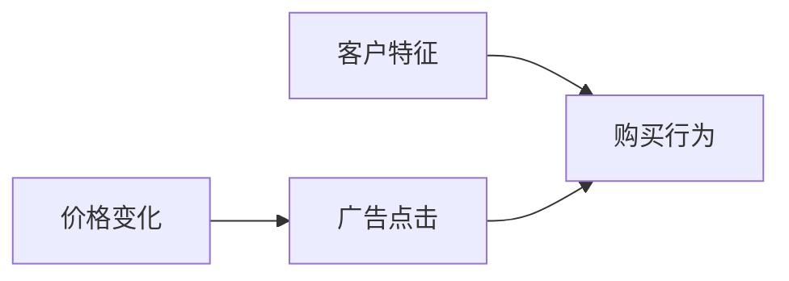
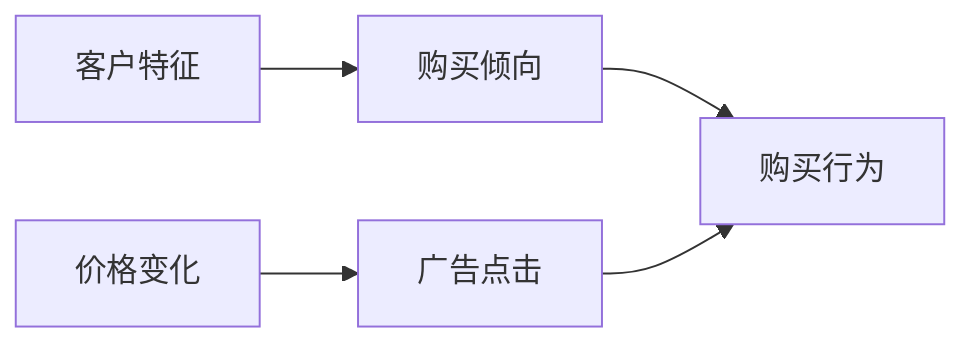
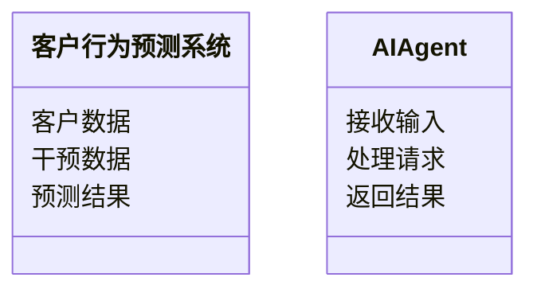

                 


# 企业AI Agent的因果推理在客户行为分析与预测中的应用

> 关键词：企业AI Agent，因果推理，客户行为分析，预测模型，因果图

> 摘要：本文详细探讨了企业AI Agent如何通过因果推理技术进行客户行为分析与预测。首先介绍了因果推理的基本概念及其在客户行为分析中的重要性，然后分析了传统预测模型的局限性，并提出了基于因果推理的解决方案。通过构建因果图模型和潜在结果框架，结合具体的数学公式和算法实现，展示了如何将因果推理应用于客户行为预测的系统设计中。最后通过一个实际案例展示了因果推理在客户行为预测中的实际应用效果，并总结了相关的最佳实践和未来发展方向。

---

## 第一部分: 企业AI Agent的因果推理基础

### 第1章: 企业AI Agent与因果推理概述

#### 1.1 问题背景

客户行为分析与预测是企业智能化运营的核心任务之一。然而，传统基于相关分析的预测模型往往只能揭示变量之间的相关性，而无法准确捕捉因果关系。这导致模型在实际应用中存在预测精度不足、干预效果难以评估等问题。本文将探讨如何通过因果推理技术，提升企业AI Agent对客户行为的分析与预测能力。

#### 1.2 问题描述

传统的客户行为预测模型主要基于相关分析，无法区分因果关系。例如，通过统计相关性发现“购买频率高”的客户可能具有某些共同特征，但无法明确这些特征如何因果性地影响购买行为。这种局限性使得企业在制定客户触达策略或产品推荐时，难以准确评估不同干预措施的实际效果。

#### 1.3 问题解决

因果推理通过构建因果图模型，明确变量之间的因果关系，从而帮助企业AI Agent更准确地预测客户行为，并评估不同干预措施的效果。具体而言，因果推理可以帮助企业识别哪些客户行为是由特定因素直接驱动的，哪些是间接影响的结果，从而优化预测模型和干预策略。

#### 1.4 边界与外延

因果推理的应用范围主要限于能够明确因果关系的场景，例如客户购买行为受广告点击、价格变化等因素直接影响的情况。与相关分析不同，因果推理需要更多的数据支持和假设条件，因此在实际应用中需要结合具体业务场景进行调整。

#### 1.5 概念结构与核心要素

因果推理在客户行为分析中的核心要素包括：因果关系、中介变量、调节变量和时间顺序。通过构建因果图模型，可以清晰地展示变量之间的因果关系，从而为预测模型提供更准确的输入。

---

## 第二部分: 因果推理的核心概念与联系

### 第2章: 因果推理的核心概念

#### 2.1 因果关系与相关关系

| 对比维度 | 相关关系 | 因果关系 |
|----------|----------|----------|
| 定义     | 变量之间的关联程度 | 变量之间的因果影响 |
| 是否需要时间顺序 | 不需要 | 需要 |
| 是否存在反向影响 | 是 | 否 |

#### 2.2 因果图模型



因果图模型通过箭头表示变量之间的因果关系，帮助我们识别哪些变量是直接驱动因素，哪些是间接影响因素。

#### 2.3 客户行为分析中的因果关系



在客户行为分析中，因果图模型可以帮助我们识别客户行为的直接驱动因素，例如广告点击和价格变化。

---

## 第三部分: 因果推理的算法原理

### 第3章: 潜在结果框架

#### 3.1 潜在结果框架

潜在结果框架是因果推理的核心理论基础。对于每个客户，我们定义了两种潜在结果：在干预发生时的结果和在干预不发生时的结果。

#### 3.2 因果效应的计算

因果效应可以通过以下公式计算：

$$ \text{因果效应} = E[Y|T=1] - E[Y|T=0] $$

其中，\( Y \) 是客户行为，\( T \) 是干预变量。

#### 3.3 因果森林算法

因果森林算法是一种基于随机森林的因果推断方法，适用于高维数据和复杂因果关系的场景。

```python
import causal森林
from causal森林 import CausalForest

model = CausalForest()
model.fit(X, T, Y)
效应 = model.estimate_ATE()
```

---

## 第四部分: 数学模型与公式

### 第4章: 因果效应的数学表达

#### 4.1 平均处理效应

平均处理效应（ATE）的公式如下：

$$ \text{ATE} = E[Y^1 - Y^0] $$

其中，\( Y^1 \) 和 \( Y^0 \) 分别表示干预发生和不发生时的客户行为结果。

#### 4.2 个体处理效应

个体处理效应（ATT）的公式如下：

$$ \text{ATT} = E[Y^1 - Y^0 | T=1] $$

---

## 第五部分: 系统分析与架构设计

### 第5章: 系统功能设计

#### 5.1 领域模型



客户行为预测系统接收客户数据和干预数据，通过因果推理算法生成预测结果，并通过AI Agent进行实时处理。

---

## 第六部分: 项目实战

### 第6章: 实际案例分析

#### 6.1 环境安装

```bash
pip install causal-forest
```

#### 6.2 代码实现

```python
import numpy as np
from causal_forest import CausalForest

# 生成数据
n = 1000
X = np.random.randn(n, 5)
T = np.random.binomial(1, 0.5, n)
Y = np.zeros(n)
for i in range(n):
    if T[i] == 1:
        Y[i] = X[i, 0] * 2 + np.random.randn()
    else:
        Y[i] = X[i, 1] * 2 + np.random.randn()

# 训练模型
model = CausalForest()
model.fit(X, T, Y)

# 预测因果效应
效应 = model.estimate_ATE()
print(效应)
```

---

## 第七部分: 最佳实践与未来展望

### 第7章: 最佳实践

1. 在实际应用中，建议先进行小样本测试，验证因果推理模型的效果。
2. 结合领域知识，合理选择因果图模型的结构。
3. 定期更新模型，以适应客户行为的变化。

### 7.2 未来展望

随着因果推理技术的不断发展，未来的企业AI Agent将更加智能化，能够实时调整策略，优化客户行为预测的准确性。

---

## 附录

### 附录A: 工具与资源

- Causal Forest: [https://github.com/v2014/ causal-forest](https://github.com/v2014/ causal-forest)

---

作者：AI天才研究院/AI Genius Institute & 禅与计算机程序设计艺术 /Zen And The Art of Computer Programming

