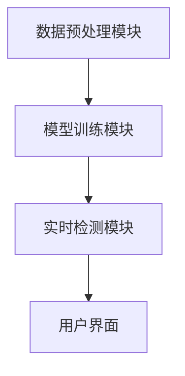
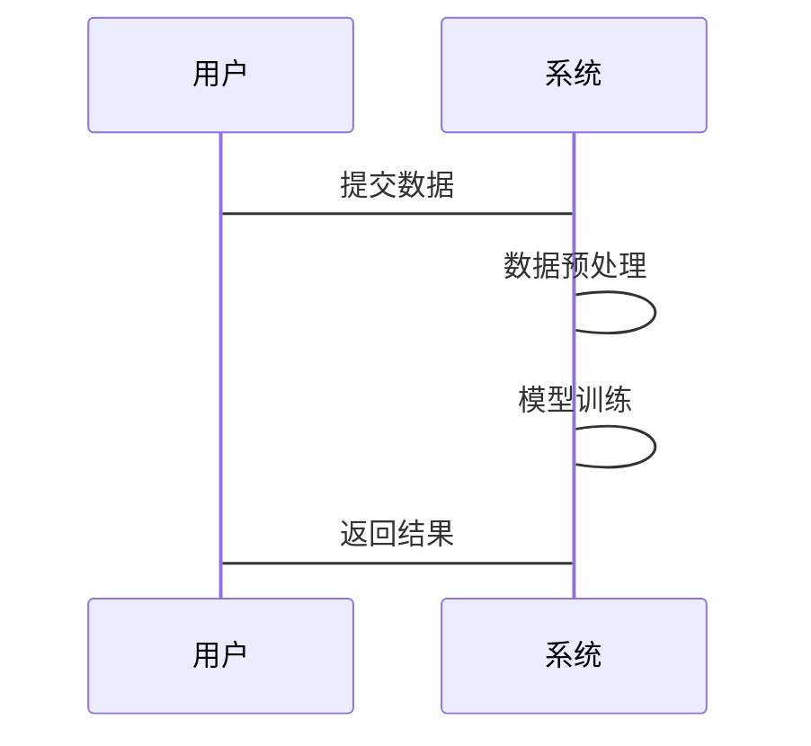

                 


# 企业AI Agent的图神经网络在欺诈检测中的应用

## 关键词：图神经网络, AI Agent, 欺诈检测, 企业安全, 人工智能, 机器学习

## 摘要：本文深入探讨了企业AI Agent在欺诈检测中的应用，重点分析了图神经网络在其中的核心作用。文章从欺诈检测的背景、AI Agent和图神经网络的基本概念入手，详细讲解了图神经网络的算法原理及其在欺诈检测中的具体应用。通过实际案例分析和系统设计，展示了如何利用图神经网络构建高效的AI Agent系统，实现对企业欺诈行为的实时检测和预测。文章还讨论了系统实现的关键步骤、优化方法及未来发展方向，为读者提供了全面的技术视角。

---

# 第1章: 企业AI Agent与图神经网络概述

## 1.1 欺诈检测的背景与挑战

### 1.1.1 欺诈检测的定义与重要性

欺诈检测是企业在金融、零售、电子商务等领域中的重要任务，旨在识别和防止非法行为。随着企业规模的扩大和数据量的增加，传统的基于规则的欺诈检测方法逐渐暴露出效率低下、难以应对复杂场景的局限性。因此，引入人工智能技术，尤其是图神经网络和AI Agent，成为解决这一问题的关键。

### 1.1.2 传统欺诈检测方法的局限性

传统欺诈检测方法主要依赖基于规则的系统或简单的机器学习模型，这些方法在处理复杂关系和大规模数据时表现不佳。例如，基于规则的方法难以捕捉复杂的欺诈模式，而传统机器学习模型缺乏对数据间关系的建模能力。

### 1.1.3 图神经网络的优势与适用性

图神经网络（Graph Neural Network, GNN）能够处理图结构数据，通过建模节点之间的关系，发现潜在的欺诈模式。AI Agent则能够实时处理数据，自主决策并采取行动，进一步提升欺诈检测的效率和准确性。

---

## 1.2 企业AI Agent的概念与特点

### 1.2.1 AI Agent的定义与功能

AI Agent是一种智能体，能够感知环境、执行任务并做出决策。在企业欺诈检测中，AI Agent能够实时监控数据流，识别异常行为，并采取相应的措施。

### 1.2.2 企业AI Agent的核心特征

- **实时性**：能够快速处理数据并做出决策。
- **自主性**：无需人工干预，自动执行任务。
- **智能性**：能够理解和分析复杂的数据关系。
- **可扩展性**：能够适应不同规模和类型的企业需求。

### 1.2.3 图神经网络在AI Agent中的作用

图神经网络通过建模企业内部和外部的关系网络，帮助AI Agent理解数据间的复杂联系，从而更准确地识别欺诈行为。

---

## 1.3 本章小结

本章介绍了欺诈检测的背景和挑战，分析了传统方法的局限性，并提出了图神经网络和AI Agent的解决方案。图神经网络的强大关系建模能力和AI Agent的自主决策能力，使其成为企业欺诈检测的理想选择。

---

# 第2章: 图神经网络的核心概念与原理

## 2.1 图神经网络的基本原理

### 2.1.1 图的表示与节点关系

图由节点（vertex）和边（edge）组成，节点代表实体，边代表实体间的关联。例如，在欺诈检测中，节点可以是用户、交易或设备，边可以表示交易行为或设备登录关系。

### 2.1.2 图神经网络的基本操作

图神经网络通过聚合（aggregation）和传播（propagation）操作，将节点的特征信息传播到相邻节点，从而生成全局的图表示。

### 2.1.3 图嵌入与节点表示

图嵌入是一种将图结构数据转换为低维向量表示的技术。节点表示通过聚合邻居信息，捕获节点的语义和上下文信息。

---

## 2.2 图神经网络的算法分类

### 2.2.1 基于聚合的图神经网络

基于聚合的图神经网络通过聚合邻居节点的信息，生成节点的表示。例如，聚合函数可以是求和、平均或最大值。

### 2.2.2 基于注意力机制的图神经网络

注意力机制通过为邻居节点分配不同的权重，捕捉重要节点的信息。这种方法能够更好地处理复杂的图结构。

### 2.2.3 图卷积网络（GCN）

图卷积网络通过将卷积操作扩展到图结构，捕获局部和全局的特征信息。GCN的数学公式如下：

$$
Z = A X W$$

其中，$A$是邻接矩阵，$X$是输入特征矩阵，$W$是权重矩阵。

---

## 2.3 图神经网络的数学模型

### 2.3.1 节点表示的数学公式

节点表示通过聚合邻居信息生成：

$$
h_i^{(l+1)} = \sigma\left(\sum_{j \in N(i)} W_{ij} h_j^{(l)}\right)$$

其中，$h_i^{(l)}$是节点$i$在第$l$层的表示，$N(i)$是节点$i$的邻居节点集合，$\sigma$是激活函数。

### 2.3.2 边权重的计算公式

边权重通过注意力机制计算：

$$
a_{ij} = \text{softmax}\left(\frac{W_{ij}}{\sqrt{d}}\right)$$

其中，$a_{ij}$是节点$i$和$j$之间的注意力权重，$d$是节点度数。

### 2.3.3 图神经网络的聚合函数

聚合函数用于将邻居节点的信息聚合到中心节点：

$$
h_i^{(l+1)} = \text{AGG}\left(\{h_j^{(l)} | j \in N(i)\}\right)$$

其中，$\text{AGG}$是聚合函数，可以是求和、平均或最大值。

---

## 2.4 本章小结

本章详细介绍了图神经网络的核心概念和算法原理，包括图的表示、节点关系和聚合操作。通过数学公式和算法分类，读者可以理解图神经网络在欺诈检测中的应用潜力。

---

# 第3章: AI Agent在欺诈检测中的应用

## 3.1 欺诈检测的场景与需求

### 3.1.1 金融领域的欺诈检测

在金融领域，欺诈检测主要用于识别异常交易和洗钱行为。图神经网络可以通过建模客户之间的关系，发现潜在的欺诈网络。

### 3.1.2 零售领域的欺诈检测

在零售领域，欺诈检测主要用于识别虚假交易和退货欺诈。AI Agent可以通过实时监控交易数据，快速识别异常行为。

### 3.1.3 企业内部欺诈的检测

企业内部欺诈包括员工贪污、舞弊等行为。图神经网络可以通过建模员工之间的关系，识别潜在的欺诈行为。

---

## 3.2 AI Agent在欺诈检测中的优势

### 3.2.1 实时性与高效性

AI Agent能够实时处理数据，快速做出决策，显著提高欺诈检测的效率。

### 3.2.2 智能性与自适应性

AI Agent能够自主学习和适应新的欺诈模式，无需人工干预。

### 3.2.3 多模态数据的处理能力

AI Agent可以同时处理结构化数据和非结构化数据，全面分析欺诈行为。

---

## 3.3 图神经网络在欺诈检测中的具体应用

### 3.3.1 图结构数据的建模

通过图结构数据建模，可以发现欺诈行为中的关联关系。例如，通过构建交易网络，识别可疑的交易路径。

### 3.3.2 欺诈行为的识别与预测

图神经网络可以通过学习图结构数据，识别潜在的欺诈行为，并预测未来的欺诈风险。

### 3.3.3 实时欺诈检测的实现

AI Agent可以通过实时监控数据流，利用图神经网络快速识别异常行为，并采取相应的措施。

---

## 3.4 本章小结

本章分析了欺诈检测的场景与需求，探讨了AI Agent在欺诈检测中的优势，并详细介绍了图神经网络在欺诈检测中的具体应用。

---

# 第4章: 图神经网络算法的实现与优化

## 4.1 图神经网络的实现步骤

### 4.1.1 数据预处理

数据预处理包括数据清洗、特征提取和图构建。例如，通过清洗数据去除噪声，通过特征提取提取关键特征，通过图构建建立节点和边的关系。

### 4.1.2 模型训练

模型训练包括选择算法、设置超参数和训练模型。例如，选择GCN算法，设置学习率和批量大小，利用训练数据训练模型。

### 4.1.3 模型评估与优化

模型评估包括验证集评估和测试集评估。模型优化包括超参数调整和模型剪枝。例如，通过调整学习率和批量大小，优化模型性能。

---

## 4.2 图神经网络的优化方法

### 4.2.1 参数优化

通过调整模型参数，优化模型性能。例如，通过Adam优化器优化模型参数。

### 4.2.2 结构优化

通过优化图结构，减少计算复杂度。例如，通过稀疏化图结构，减少计算量。

### 4.2.3 并行计算

通过并行计算加速模型训练。例如，利用GPU并行计算加速模型训练。

---

## 4.3 本章小结

本章详细介绍了图神经网络的实现步骤和优化方法，包括数据预处理、模型训练和模型评估。通过优化方法，可以显著提高模型的性能和效率。

---

# 第5章: 系统分析与架构设计

## 5.1 项目介绍

本项目旨在利用图神经网络和AI Agent技术，构建一个企业欺诈检测系统。系统能够实时监控企业数据，识别异常行为，并采取相应的措施。

---

## 5.2 系统功能设计

### 5.2.1 数据预处理模块

数据预处理模块负责清洗数据、提取特征和构建图结构。例如，清洗数据去除噪声，提取特征提取关键特征，构建图结构建立节点和边的关系。

### 5.2.2 模型训练模块

模型训练模块负责训练图神经网络模型。例如，选择GCN算法，设置超参数，利用训练数据训练模型。

### 5.2.3 实时检测模块

实时检测模块负责实时监控数据流，利用训练好的模型识别异常行为。例如，实时监控交易数据，识别可疑交易。

---

## 5.3 系统架构设计

### 5.3.1 系统架构图



### 5.3.2 接口设计

系统接口包括数据接口、模型接口和用户接口。数据接口负责数据的输入和输出，模型接口负责模型的训练和预测，用户接口负责用户交互和结果展示。

### 5.3.3 交互流程图



---

## 5.4 本章小结

本章介绍了系统的功能设计和架构设计，展示了系统的核心模块和交互流程。通过合理的架构设计，可以确保系统的高效性和可扩展性。

---

# 第6章: 项目实战

## 6.1 环境安装

### 6.1.1 安装Python

```bash
python --version
```

### 6.1.2 安装依赖库

```bash
pip install numpy pandas matplotlib networkx
```

---

## 6.2 核心代码实现

### 6.2.1 数据预处理

```python
import numpy as np
import pandas as pd

# 数据加载
data = pd.read_csv('data.csv')

# 数据清洗
data = data.dropna()

# 特征提取
features = data[['amount', 'time']]
```

### 6.2.2 模型训练

```python
import tensorflow as tf
from tensorflow.keras import layers

# 构建GCN模型
class GCN(tf.keras.Model):
    def __init__(self, input_dim, output_dim):
        super(GCN, self).__init__()
        self.gcn_layer = layers.GCN(input_dim, output_dim)

    def call(self, inputs):
        return self.gcn_layer(inputs)

# 训练模型
model = GCN(input_dim=10, output_dim=5)
model.compile(optimizer='adam', loss='mse')
model.fit(x_train, y_train, epochs=10, batch_size=32)
```

---

## 6.3 代码应用解读与分析

通过上述代码，我们可以实现数据预处理和模型训练。数据预处理包括数据清洗和特征提取，模型训练使用GCN算法，能够有效捕捉数据间的关联关系。

---

## 6.4 实际案例分析

通过实际案例分析，我们可以验证系统的有效性。例如，在金融领域，系统能够识别异常交易，帮助银行防范欺诈行为。

---

## 6.5 项目小结

本章通过实际案例分析，展示了如何利用图神经网络和AI Agent技术构建企业欺诈检测系统。通过代码实现和案例分析，读者可以更好地理解系统的实际应用。

---

# 第7章: 最佳实践与未来展望

## 7.1 最佳实践

### 7.1.1 数据质量的重要性

数据质量直接影响模型性能，因此需要重视数据清洗和特征提取。

### 7.1.2 模型调优的技巧

通过合理的超参数调整和模型优化，可以显著提高模型性能。

### 7.1.3 系统安全的注意事项

在实际应用中，需要注意系统的安全性和稳定性，防止数据泄露和系统崩溃。

---

## 7.2 小结

通过本文的介绍，读者可以全面了解企业AI Agent的图神经网络在欺诈检测中的应用。从理论到实践，从算法到系统设计，本文为读者提供了全面的技术视角。

---

## 7.3 未来展望

未来，随着人工智能技术的不断发展，图神经网络和AI Agent在欺诈检测中的应用将更加广泛。例如，结合强化学习和自监督学习，可以进一步提高模型的智能性和自适应性。

---

# 作者：AI天才研究院/AI Genius Institute & 禅与计算机程序设计艺术 /Zen And The Art of Computer Programming

---

希望这篇文章能够为读者提供有价值的技术视角和实践指导！如果需要进一步探讨或补充，请随时联系！

