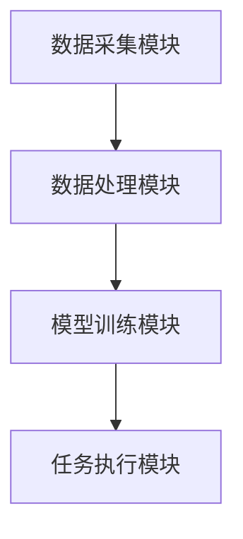

                 


# 企业AI Agent的图神经网络应用：复杂关系分析

---

## 关键词：
- 企业AI Agent
- 图神经网络
- 复杂关系分析
- 智能决策
- 企业系统架构

---

## 摘要：
在现代企业环境中，复杂关系分析是提升效率和竞争力的关键。企业AI Agent通过图神经网络（Graph Neural Networks, GNN）能够有效处理复杂的关联数据，为企业提供智能化的决策支持。本文从AI Agent的基本概念出发，深入探讨图神经网络的核心原理及其在企业复杂关系分析中的应用场景，结合实际案例和系统设计，为企业智能化转型提供理论支持和实践指导。

---

# 第1章: 企业AI Agent与图神经网络概述

## 1.1 AI Agent的基本概念
### 1.1.1 AI Agent的定义与特点
AI Agent（人工智能代理）是一种能够感知环境、自主决策并执行任务的智能实体。它具备以下特点：
- **自主性**：能够在没有外部干预的情况下自主运行。
- **反应性**：能够实时感知环境并做出反应。
- **目标导向性**：基于目标驱动行为。
- **学习能力**：能够通过数据和经验不断优化自身性能。

### 1.1.2 企业AI Agent的核心作用
在企业场景中，AI Agent主要用于：
1. **智能决策支持**：通过分析企业内外部数据，辅助管理层做出最优决策。
2. **自动化任务处理**：例如自动处理客户咨询、优化供应链流程等。
3. **实时监控与预警**：通过实时数据分析，发现潜在风险并发出预警。

### 1.1.3 图神经网络的引入与意义
图神经网络是一种专门处理图结构数据的深度学习模型，能够捕捉数据之间的复杂关联关系。在企业AI Agent中引入图神经网络，可以显著提升复杂关系分析的能力。

---

## 1.2 图神经网络的基本原理
### 1.2.1 图结构数据的表示
图结构数据由节点（Nodes）和边（Edges）组成，可以表示为：
$$ G = (V, E) $$
其中，$V$ 是节点集合，$E$ 是边集合。

### 1.2.2 图神经网络的核心思想
图神经网络的核心思想是通过传播节点的特征信息到其邻居节点，逐步聚合全局信息，最终学习到每个节点的高层次表示。

### 1.2.3 图神经网络与传统神经网络的对比
| 对比维度 | 图神经网络 | 传统神经网络 |
|----------|------------|---------------|
| 数据结构 | 处理图结构数据 | 处理线性或非结构化数据 |
| 关联性处理 | 善于处理节点间的关系 | 不擅长处理复杂关联关系 |
| 应用场景 | 社交网络分析、推荐系统等 | 图像识别、自然语言处理等 |

---

# 第2章: 图神经网络的数学基础与算法原理

## 2.1 图结构的数学表示
### 2.1.1 邻接矩阵与边的权重
邻接矩阵 $A$ 可以表示图中节点之间的关系：
$$ A_{i,j} = 1 \text{ 如果节点 } i \text{ 和 } j \text{ 之间有边相连，否则 } 0 $$

### 2.1.2 节点的特征表示
节点的特征表示可以用向量 $X$ 表示：
$$ X \in \mathbb{R}^{N \times F} $$
其中，$N$ 是节点数，$F$ 是特征维度。

### 2.1.3 图的遍历算法
常用的图遍历算法包括深度优先搜索（DFS）和广度优先搜索（BFS），用于探索图的结构。

## 2.2 图神经网络的核心算法
### 2.2.1 图卷积网络（GCN）的原理
图卷积网络的传播规则可以表示为：
$$ H^{(l+1)} = \sigma(A H^{(l)} H^{(l)}^T) $$
其中，$H^{(l)}$ 是第 $l$ 层的节点表示，$\sigma$ 是激活函数。

### 2.2.2 图注意力网络（GAT）的机制
图注意力网络通过计算节点之间的注意力权重，进行信息聚合：
$$ \alpha_{i,j} = \text{softmax}(e^{f(x_i, x_j)}) $$
其中，$\alpha_{i,j}$ 是节点 $i$ 和 $j$ 之间的注意力权重。

### 2.2.3 图嵌入方法的对比
| 方法 | GCN | GAT | GraphSAGE |
|------|-----|-----|----------|
| 优点 | 全局信息聚合能力强 | 注意力机制更灵活 | 易于并行化 |
| 缺点 | �易受噪声影响 | 计算复杂度高 | 表达能力有限 |

---

# 第3章: 企业复杂关系分析的场景与需求

## 3.1 企业关系的多样性
### 3.1.1 客户关系分析
通过分析客户之间的关系，优化客户服务策略。

### 3.1.2 供应链关系分析
通过分析供应商、制造商、分销商之间的关系，优化供应链效率。

### 3.1.3 内部组织关系分析
通过分析员工之间的协作关系，优化组织结构。

## 3.2 图神经网络在企业关系分析中的应用
### 3.2.1 客户行为预测
利用图神经网络分析客户之间的关联性，预测客户的购买行为。

### 3.2.2 供应链优化
通过分析供应链中的节点关系，优化物流和库存管理。

### 3.2.3 风险评估与预警
通过分析企业之间的关联关系，评估潜在的财务风险。

## 3.3 企业复杂关系分析的挑战
### 3.3.1 数据的稀疏性与噪声
企业数据可能存在缺失或噪声，影响模型性能。

### 3.3.2 模型的可解释性
复杂的图神经网络模型可能难以解释其决策过程。

### 3.3.3 计算资源的需求
处理大规模图数据需要较高的计算资源。

---

# 第4章: 图神经网络的算法实现与数学模型

## 4.1 图卷积网络（GCN）的实现
### 4.1.1 GCN的数学公式
GCN的传播规则可以表示为：
$$ H^{(l+1)} = \sigma(A H^{(l)} H^{(l)}^T) $$

### 4.1.2 GCN的实现步骤
1. **输入数据预处理**：构建邻接矩阵 $A$ 和特征矩阵 $X$。
2. **初始化模型参数**：随机初始化权重矩阵 $W$ 和偏置项 $b$。
3. **前向传播**：通过图卷积操作计算节点表示。
4. **损失计算与反向传播**：使用交叉熵损失函数，通过反向传播更新参数。
5. **模型训练与优化**：使用梯度下降优化器进行训练。

### 4.1.3 GCN的优缺点分析
| 优点 | 缺点 |
|------|------|
| 实现简单 | 易受噪声影响 |
| 计算效率高 | 表达能力有限 |

---

# 第5章: 企业AI Agent的系统设计与实现

## 5.1 系统架构设计
### 5.1.1 系统功能模块
- 数据采集模块：负责采集企业内外部数据。
- 数据处理模块：对数据进行清洗和预处理。
- 模型训练模块：基于图神经网络训练AI Agent模型。
- 任务执行模块：根据模型输出执行具体任务。

### 5.1.2 系统架构图


---

# 第6章: 项目实战：基于图神经网络的企业AI Agent实现

## 6.1 项目背景
某企业希望通过AI Agent优化客户关系管理，提升客户满意度。

## 6.2 环境搭建
- **Python版本**：3.8+
- **依赖库安装**：`numpy`, `tensorflow`, `networkx`

## 6.3 核心代码实现
### 6.3.1 数据预处理
```python
import numpy as np
import networkx as nx

# 构建图结构
G = nx.Graph()
G.add_nodes_from([1, 2, 3])
G.add_edges_from([(1, 2), (2, 3)])
```

### 6.3.2 模型训练
```python
import tensorflow as tf
from tensorflow.keras import layers

# 定义GCN模型
class GCN(tf.keras.Model):
    def __init__(self, input_dim):
        super(GCN, self).__init__()
        self.GCN_layer = layers.Dense(input_dim, activation='relu')

    def call(self, inputs):
        A = tf.convert_to_tensor(inputs[0])
        X = tf.convert_to_tensor(inputs[1])
        return self.GCN_layer(A @ X)

model = GCN(64)
model.compile(optimizer='adam', loss='binary_crossentropy')
model.fit([A, X], y, epochs=10)
```

---

# 第7章: 总结与展望

## 7.1 本章总结
本文详细探讨了企业AI Agent在复杂关系分析中的应用，结合图神经网络的原理和实际案例，为企业智能化转型提供了理论支持和实践指导。

## 7.2 未来展望
随着图神经网络技术的不断发展，企业AI Agent将在更多领域发挥重要作用，例如智能客服、智能供应链管理等。

---

# 作者：AI天才研究院 & 禅与计算机程序设计艺术

