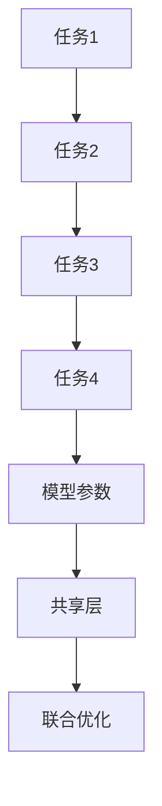
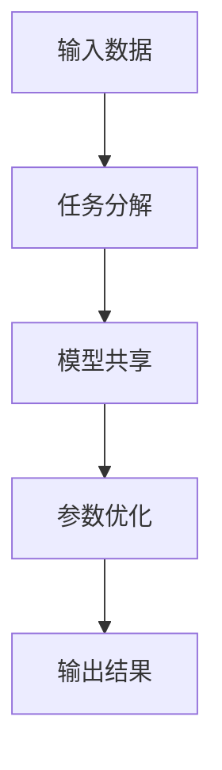
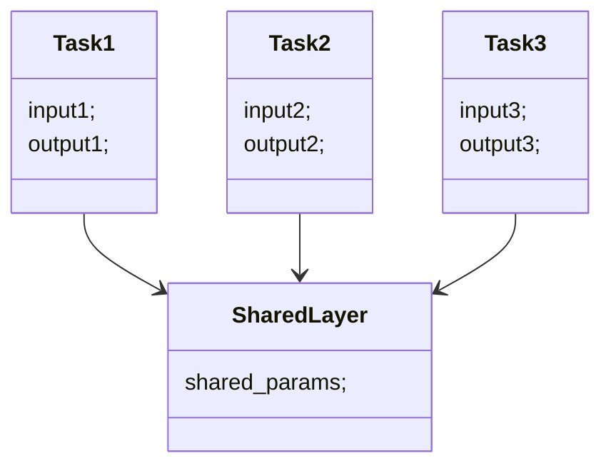
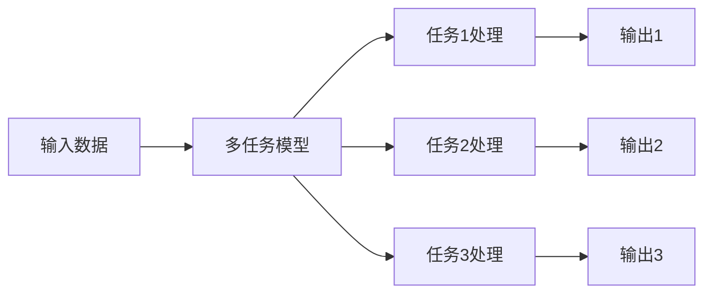
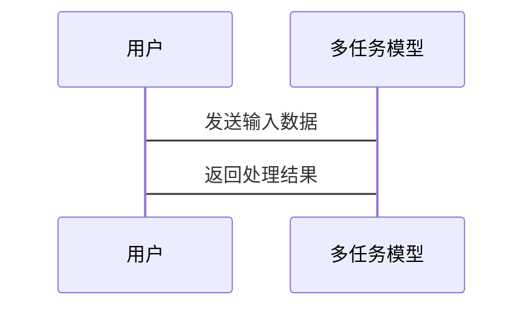

                 


# 企业AI Agent的多任务学习框架：提升模型泛化能力

---

## 关键词：企业AI Agent，多任务学习框架，模型泛化能力，算法原理，系统架构设计，Python代码实现

---

## 摘要：本文系统地介绍企业AI Agent的多任务学习框架，探讨如何通过多任务学习提升模型的泛化能力。从背景分析到算法实现，从系统设计到项目实战，详细讲解多任务学习框架的核心概念、原理、系统架构及实际应用，为读者提供全面的技术指导。

---

# 第一部分: 企业AI Agent的多任务学习框架概述

## 第1章: 问题背景与核心概念

### 1.1 问题背景

#### 1.1.1 企业AI Agent的发展现状
企业AI Agent作为人工智能技术的重要应用，广泛应用于客服、推荐系统、智能助手等领域。然而，随着应用场景的扩展，单一任务模型的泛化能力逐渐成为瓶颈。

#### 1.1.2 当前模型泛化能力的挑战
传统单任务模型难以应对多场景、多任务的复杂需求，导致模型在新任务中的表现不佳。

#### 1.1.3 多任务学习框架的提出动机
通过多任务学习，共享模型参数，提升模型对多种任务的适应能力，降低模型过拟合风险。

---

### 1.2 问题描述

#### 1.2.1 AI Agent在企业中的应用场景
企业AI Agent需处理多种任务，如对话理解、信息检索、任务调度等。

#### 1.2.2 模型泛化能力不足的问题
单任务模型难以同时处理多种任务，导致效率低下，用户体验差。

#### 1.2.3 多任务学习框架的目标
通过共享模型参数，提升模型在多任务中的泛化能力，实现更高效的AI Agent。

---

### 1.3 问题解决

#### 1.3.1 多任务学习框架的核心思想
通过设计多任务学习框架，共享模型参数，实现对多种任务的联合优化。

#### 1.3.2 框架如何提升模型泛化能力
通过任务分解与共享，模型能够更好地捕捉跨任务的共同特征，提升泛化能力。

#### 1.3.3 实际案例分析
以企业客服场景为例，多任务学习框架可同时处理客户咨询、情绪分析、意图识别等多种任务。

---

### 1.4 边界与外延

#### 1.4.1 多任务学习的适用范围
适用于需要处理多种相关任务的场景，如自然语言处理、推荐系统等。

#### 1.4.2 与其他学习框架的区别
多任务学习框架注重任务间的共享与协作，与单任务学习和迁移学习有明确区别。

#### 1.4.3 未来可能的扩展方向
探索更高效的参数共享机制，结合强化学习进一步提升模型性能。

---

### 1.5 概念结构与核心要素

#### 1.5.1 框架的核心组成
- **任务分解模块**：将多任务分解为子任务，明确任务目标。
- **模型共享模块**：设计参数共享机制，实现跨任务特征复用。
- **参数优化模块**：联合优化多任务目标函数，平衡任务间权重。

#### 1.5.2 各要素之间的关系
任务分解模块确定任务结构，模型共享模块实现参数复用，参数优化模块实现联合优化。

#### 1.5.3 核心要素的详细描述
- **任务分解**：根据业务需求，将多任务分解为可管理的子任务。
- **参数共享**：通过共享某些参数或网络层，降低模型复杂度。
- **联合优化**：设计损失函数，平衡多任务目标，防止某一任务主导优化。

---

# 第二部分: 多任务学习框架的核心概念与联系

## 第2章: 多任务学习框架的原理与特点

### 2.1 核心概念原理

#### 2.1.1 多任务学习的基本原理
多任务学习通过共享参数，实现对多个任务的联合优化，提升模型的泛化能力。

#### 2.1.2 任务分解与共享机制
将任务分解为子任务，通过共享某些参数或网络层，实现跨任务特征复用。

#### 2.1.3 参数优化策略
设计联合损失函数，平衡各任务权重，实现多任务目标的最优解。

---

### 2.2 概念属性特征对比

#### 2.2.1 任务独立性与共享性对比
| 任务属性 | 独立学习 | 多任务学习 |
|----------|----------|------------|
| 参数共享 | 无共享   | 参数共享   |
| 计算效率 | 较低      | 较高        |
| 模型容量 | 较大      | 更加高效    |

#### 2.2.2 模型复杂度与性能对比
| 模型复杂度 | 单任务学习 | 多任务学习 |
|------------|------------|------------|
| 参数数量   | 较多        | 较少        |
| 训练时间   | 较长        | 更短        |
| 性能表现   | 单一任务优秀 | 多任务均衡   |

#### 2.2.3 不同任务的权重分配策略
- **固定权重**：根据任务重要性手动分配权重。
- **动态权重**：根据任务数据量或难度动态调整权重。

---

### 2.3 ER实体关系图架构



---

## 第3章: 多任务学习框架的算法原理

### 3.1 任务分解与模型共享

#### 3.1.1 任务分解步骤
1. 将多任务分解为子任务，明确任务目标。
2. 设计任务间的共享机制，如共享某些层或参数。

#### 3.1.2 模型共享机制
- **共享层**：某些网络层对所有任务共享。
- **任务特定层**：每个任务有自己的特定层。

---

### 3.2 参数优化策略

#### 3.2.1 联合优化目标
$$ L = \sum_{i=1}^{n} \lambda_i L_i $$
其中，$ \lambda_i $ 为任务 $i$ 的权重，$ L_i $ 为任务 $i$ 的损失函数。

#### 3.2.2 优化算法选择
推荐使用Adam优化器，结合学习率调整策略。

---

### 3.3 算法实现步骤



#### 3.3.1 代码实现
```python
import torch
import torch.nn as nn

class MultiTaskModel(nn.Module):
    def __init__(self):
        super().__init__()
        self.shared_layer = nn.Linear(10, 5)  # 共享层
        self.task1_layer = nn.Linear(5, 3)    # 任务1特定层
        self.task2_layer = nn.Linear(5, 2)    # 任务2特定层

    def forward(self, x, task):
        x = self.shared_layer(x)
        if task == 1:
            x = self.task1_layer(x)
        elif task == 2:
            x = self.task2_layer(x)
        return x

model = MultiTaskModel()
optimizer = torch.optim.Adam(model.parameters())
```

---

## 第4章: 系统分析与架构设计方案

### 4.1 问题场景介绍

#### 4.1.1 系统目标
构建一个多任务学习框架，支持企业AI Agent的多种任务处理。

#### 4.1.2 项目介绍
设计一个多任务学习框架，应用于企业智能客服系统。

---

### 4.2 系统功能设计

#### 4.2.1 领域模型


---

#### 4.2.2 系统架构设计



---

### 4.3 系统接口设计

#### 4.3.1 接口设计
- **输入接口**：接收多任务输入数据。
- **输出接口**：返回多任务处理结果。

#### 4.3.2 交互流程


---

## 第5章: 项目实战

### 5.1 环境安装

#### 5.1.1 Python安装
```bash
python --version
pip install torch
pip install mermaid
```

---

### 5.2 系统核心实现

#### 5.2.1 核心代码实现
```python
import torch
import torch.nn as nn

class MultiTaskModel(nn.Module):
    def __init__(self):
        super().__init__()
        self.shared_layer = nn.Linear(10, 5)
        self.task_layers = nn.ModuleList([
            nn.Linear(5, 3),  # 任务1
            nn.Linear(5, 2)   # 任务2
        ])

    def forward(self, x, task_idx):
        x = self.shared_layer(x)
        task_layer = self.task_layers[task_idx]
        x = task_layer(x)
        return x

model = MultiTaskModel()
optimizer = torch.optim.Adam(model.parameters())
```

---

### 5.3 代码解读与分析

#### 5.3.1 代码功能解读
- **MultiTaskModel**：定义一个多任务模型，包含共享层和任务特定层。
- **forward**：根据输入任务索引，选择对应的任务层进行处理。

---

### 5.4 应用案例分析

#### 5.4.1 案例分析
在企业智能客服系统中，多任务模型可以同时处理客户咨询、情绪分析、意图识别等多种任务。

---

### 5.5 项目小结

#### 5.5.1 成功的关键点
- 合理的任务分解与共享机制。
- 良好的参数优化策略。

#### 5.5.2 可能的改进方向
- 探索更高效的参数共享机制。
- 结合强化学习进一步提升模型性能。

---

## 第6章: 最佳实践

### 6.1 小结

#### 6.1.1 核心要点总结
- 多任务学习框架通过共享参数，提升模型的泛化能力。
- 合理的任务分解与参数优化是框架成功的关键。

---

### 6.2 注意事项

#### 6.2.1 实际应用中的注意事项
- 确保任务之间的相关性，避免无关任务的干扰。
- 设计合理的任务权重分配策略。

---

### 6.3 拓展阅读

#### 6.3.1 推荐阅读
- 《Deep Learning》
- 《Multi-task Learning》

---

## 作者：AI天才研究院/AI Genius Institute & 禅与计算机程序设计艺术 /Zen And The Art of Computer Programming

