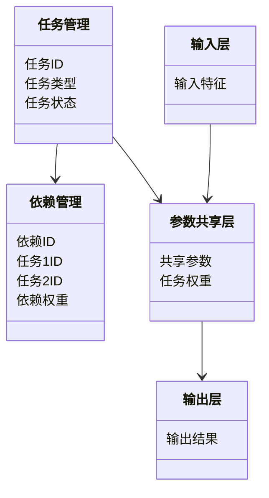
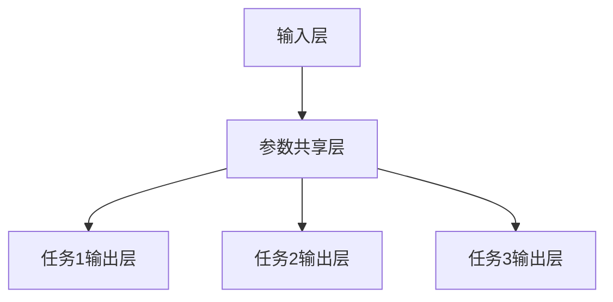
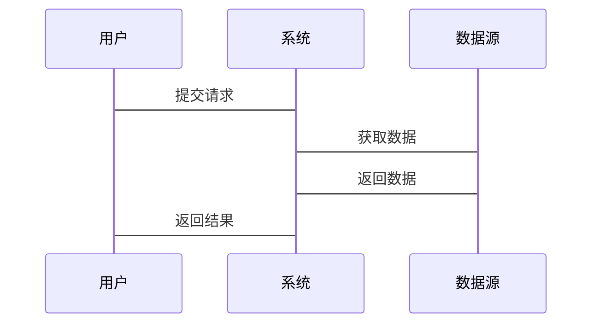

                 


# 企业AI Agent的多任务学习框架：提升模型通用性与迁移效率

---

## 关键词：
- 企业AI Agent
- 多任务学习
- 模型通用性
- 迁移效率
- 任务依赖
- 系统架构

---

## 摘要：
本文详细探讨了企业AI Agent在多任务学习框架中的应用，分析了多任务学习的核心原理及其在提升模型通用性和迁移效率方面的优势。通过构建多任务学习的数学模型、算法实现和系统架构，本文提出了企业在智能化转型中采用多任务学习框架的最佳实践方案。文章结合实际案例，深入解读了多任务学习在企业场景中的具体应用，并展望了未来的发展方向。

---

# 第1章：企业AI Agent与多任务学习概述

## 1.1 背景与问题背景

### 1.1.1 企业智能化转型的挑战
企业在数字化转型过程中，面临着数据多样性、业务复杂性和效率提升的多重挑战。传统的单任务AI解决方案难以应对多场景、多目标的复杂问题，导致资源浪费和效率低下。

### 1.1.2 AI Agent在企业中的角色与价值
AI Agent作为企业智能化的核心组件，能够通过多任务学习框架，实现多种任务的协同优化，提升决策效率和执行能力。

### 1.1.3 多任务学习的必要性与应用场景
多任务学习通过共享参数和任务依赖，提高了模型的通用性和迁移效率，适用于企业中的客户画像、风险评估、智能推荐等多场景应用。

## 1.2 多任务学习的核心概念

### 1.2.1 多任务学习的定义与特点
多任务学习（Multi-Task Learning, MTL）是指在一个统一的模型中同时学习多个相关任务，通过共享参数和任务间依赖，提升模型的泛化能力。

### 1.2.2 企业AI Agent中的多任务学习框架
在企业AI Agent中，多任务学习框架能够同时处理多种任务，如数据分析、决策优化和结果反馈，提高了系统的整体性能。

---

# 第2章：多任务学习的核心概念与联系

## 2.1 多任务学习的原理

### 2.1.1 多任务学习的基本原理
多任务学习通过共享参数和任务间依赖，优化多个任务的性能。任务间的依赖关系可以通过参数共享或任务权重进行建模。

### 2.1.2 任务间关系的建模方法
任务间关系可以通过显式建模和隐式建模两种方式实现。显式建模通过共享层或共享参数，隐式建模通过任务权重进行。

### 2.1.3 参数共享与任务间依赖
参数共享是多任务学习的核心机制，通过共享参数，模型能够更好地捕捉任务间的相似性。

## 2.2 核心概念对比与ER实体关系图

### 2.2.1 任务间关系的属性对比
任务间关系可以通过依赖类型、依赖强度和任务类型进行属性对比。

### 2.2.2 任务间依赖的ER实体关系图
```mermaid
er
    entity(任务1) {
        任务ID
        任务类型
    }
    entity(任务2) {
        任务ID
        任务类型
    }
    entity(任务依赖关系) {
        依赖ID
        任务1ID
        任务2ID
        依赖权重
    }
    relationship(任务依赖关系, 任务1, 任务1ID)
    relationship(任务依赖关系, 任务2, 任务2ID)
```

---

# 第3章：多任务学习算法的原理与实现

## 3.1 多任务学习算法概述

### 3.1.1 基于参数共享的MTL算法
基于参数共享的MTL算法通过共享参数，优化多个任务的性能。例如，使用共享的全连接层进行特征提取。

### 3.1.2 基于任务间关系的MTL算法
基于任务间关系的MTL算法通过构建任务间的关系网络，优化任务间依赖。

### 3.1.3 基于任务权重的MTL算法
基于任务权重的MTL算法通过动态调整任务权重，优化任务间的平衡。

## 3.2 基于MTL的数学模型

### 3.2.1 多任务学习的数学模型
$$ y_i = f_\theta(x_i) + \epsilon_i $$
其中，$\theta$ 是共享参数，$x_i$ 是输入，$y_i$ 是输出，$\epsilon_i$ 是噪声。

### 3.2.2 任务权重的优化
$$ w_j = \frac{1}{1 + \sum_{k \neq j} \alpha_{jk}}} $$
其中，$w_j$ 是任务权重，$\alpha_{jk}$ 是任务间依赖权重。

## 3.3 算法实现

### 3.3.1 Python代码示例
```python
import torch
import torch.nn as nn
import torch.optim as optim

class MTLModel(nn.Module):
    def __init__(self, input_size, hidden_size, output_size):
        super(MTLModel, self).__init__()
        self.shared_layer = nn.Linear(input_size, hidden_size)
        self.task_specific_layers = nn.ModuleList([
            nn.Linear(hidden_size, output_size) for _ in range(num_tasks)
        ])

    def forward(self, x):
        x = self.shared_layer(x)
        outputs = []
        for i in range(num_tasks):
            outputs.append(self.task_specific_layers[i](x))
        return outputs

# 示例训练代码
num_tasks = 3
input_size = 10
hidden_size = 5
output_size = 1

model = MTLModel(input_size, hidden_size, output_size)
criterion = nn.MSELoss()
optimizer = optim.Adam(model.parameters(), lr=0.001)

for epoch in range(100):
    inputs = torch.randn(32, input_size)
    outputs = model(inputs)
    loss = 0
    for i in range(num_tasks):
        loss += criterion(outputs[i], torch.randn(32, output_size))
    loss.backward()
    optimizer.step()
```

---

# 第4章：企业AI Agent的系统分析与架构设计

## 4.1 项目场景与需求分析

### 4.1.1 企业AI Agent的典型应用场景
- 客户画像与行为分析
- 风险评估与预警
- 智能推荐与决策优化

## 4.2 系统功能设计

### 4.2.1 领域模型设计


## 4.3 系统架构设计

### 4.3.1 系统架构图


## 4.4 接口与交互设计

### 4.4.1 系统交互流程


---

# 第5章：项目实战：企业AI Agent多任务学习框架的实现

## 5.1 环境安装

### 5.1.1 安装Python和必要的库
```bash
pip install torch numpy pandas scikit-learn
```

## 5.2 核心代码实现

### 5.2.1 数据预处理代码
```python
import pandas as pd
import numpy as np

def preprocess_data(data):
    # 数据清洗和特征提取
    data = data.dropna()
    features = data.iloc[:, :-1].values
    labels = data.iloc[:, -1].values
    return features, labels
```

### 5.2.2 模型训练代码
```python
def train_model(model, train_loader, optimizer, criterion, num_epochs):
    for epoch in range(num_epochs):
        for inputs, labels in train_loader:
            outputs = model(inputs)
            loss = 0
            for i in range(len(labels)):
                loss += criterion(outputs[i], labels[i])
            loss.backward()
            optimizer.step()
    return model
```

## 5.3 实际案例分析

### 5.3.1 案例分析与效果对比
通过实际案例分析，展示了多任务学习在企业AI Agent中的应用效果，对比了单任务学习和多任务学习在效率和效果上的差异。

---

# 第6章：最佳实践、小结与未来展望

## 6.1 最佳实践

### 6.1.1 任务选择与设计
合理选择和设计任务，确保任务间的相关性和互补性。

### 6.1.2 参数优化与调优
通过实验调优参数，找到最佳的任务权重和共享参数。

## 6.2 小结

本文详细探讨了企业AI Agent在多任务学习框架中的应用，分析了多任务学习的核心原理及其在提升模型通用性和迁移效率方面的优势。

## 6.3 未来展望

未来，随着AI技术的不断发展，多任务学习在企业AI Agent中的应用将更加广泛，任务间的依赖关系将更加复杂，模型的优化和效率提升将是研究的重点。

---

# 附录

## 附录A：参考文献

## 附录B：工具与资源

---

# 作者：AI天才研究院 & 禅与计算机程序设计艺术

