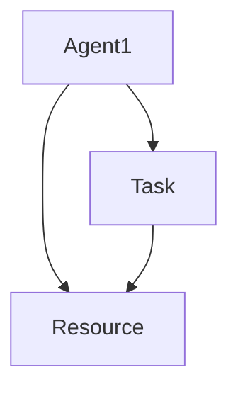
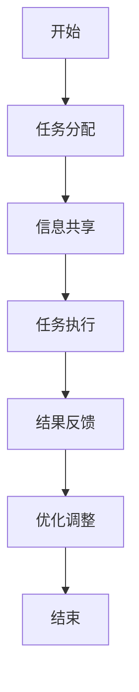
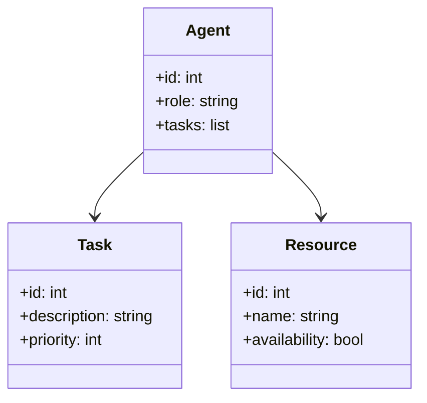
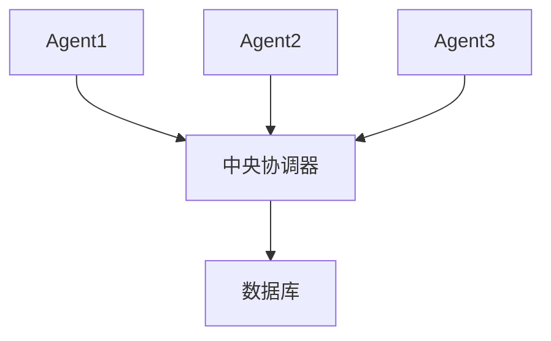
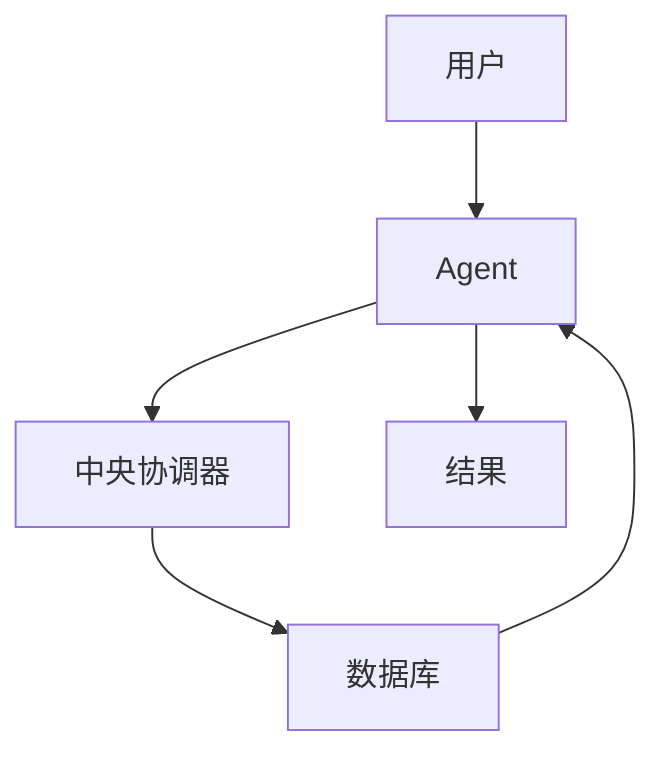

                 


# 企业AI Agent的多智能体系统在跨部门协作优化中的应用

## 关键词：企业AI Agent，多智能体系统，跨部门协作，企业效率优化，协作算法，系统架构

## 摘要：  
本文探讨了企业AI Agent的多智能体系统在跨部门协作优化中的应用。通过分析多智能体系统的核心概念、算法原理和系统架构，本文展示了如何利用AI技术提升企业协作效率。文章从问题背景出发，详细讲解了多智能体系统的组成、协作机制以及优化策略，并通过实际案例分析了其在企业中的应用效果，为企业实现高效协作提供了理论支持和实践指导。

---

## 正文

### 第1章：企业AI Agent的背景与概念

#### 1.1 问题背景

- **1.1.1 传统企业协作的痛点**  
  传统企业协作中，部门间信息孤岛问题严重，协作效率低下，资源浪费现象普遍。  
- **1.1.2 AI技术对企业协作的变革**  
  AI技术的引入，特别是AI Agent（智能体）的应用，为企业的协作优化提供了新的可能性。  
- **1.1.3 多智能体系统在企业协作中的优势**  
  多智能体系统通过分布式协作和智能决策，能够有效提升企业协作效率。

#### 1.2 问题描述

- **1.2.1 跨部门协作中的信息孤岛问题**  
  部门间信息不共享，导致协作效率低下。  
- **1.2.2 传统协作工具的局限性**  
  传统协作工具功能单一，难以满足复杂协作需求。  
- **1.2.3 企业效率优化的需求**  
  企业需要通过技术手段提升协作效率，降低成本。

#### 1.3 问题解决

- **1.3.1 AI Agent的核心作用**  
  AI Agent能够自动执行任务，优化协作流程。  
- **1.3.2 多智能体系统如何实现协作优化**  
  多智能体系统通过协同工作，实现资源的最优分配和任务的高效完成。  
- **1.3.3 企业协作效率提升的具体路径**  
  通过AI Agent和多智能体系统，实现跨部门协作的自动化和智能化。

#### 1.4 边界与外延

- **1.4.1 多智能体系统的边界**  
  系统仅关注协作过程，不涉及企业其他业务模块。  
- **1.4.2 与其他协作工具的区别**  
  多智能体系统更具智能化和自动化，能够主动优化协作流程。  
- **1.4.3 企业协作优化的外延**  
  包括流程优化、资源优化、决策优化等多个方面。

#### 1.5 概念结构与核心要素

- **1.5.1 AI Agent的定义与特征**  
  AI Agent是一种能够感知环境并采取行动以实现目标的智能实体。  
- **1.5.2 多智能体系统的组成要素**  
  包括多个AI Agent、通信机制、任务分配机制和协调机制。  
- **1.5.3 企业协作优化的核心要素**  
  包括信息共享、任务分配、协作机制和反馈机制。

#### 1.6 本章小结

本章介绍了企业AI Agent的背景与概念，分析了协作中的痛点及解决方案，并明确了多智能体系统的边界和核心要素。

---

### 第2章：多智能体系统的核心概念与联系

#### 2.1 多智能体系统的基本原理

- **2.1.1 多智能体系统的定义**  
  多智能体系统是由多个智能体组成的协作系统，能够共同完成复杂任务。  
- **2.1.2 多智能体系统的核心特征**  
  - 分布式：智能体独立运行，通过通信协作。  
  - 智能性：智能体具备感知和决策能力。  
  - 协作性：智能体之间通过协作完成任务。  
- **2.1.3 多智能体系统与单智能体系统的对比**  
  - 单智能体系统：集中式决策，适用于简单任务。  
  - 多智能体系统：分布式协作，适用于复杂任务。

#### 2.2 多智能体系统的实体关系

- **2.2.1 ER实体关系图**  
  使用Mermaid图展示多智能体系统的实体关系。  


#### 2.3 多智能体系统的协作流程

- **2.3.1 协作流程图**  
  使用Mermaid图展示协作流程。  


#### 2.4 本章小结

本章详细讲解了多智能体系统的基本原理和协作流程，并通过图示展示了系统的核心概念。

---

### 第3章：多智能体系统的算法原理

#### 3.1 多智能体系统的核心算法

- **3.1.1 通信协议**  
  智能体之间通过特定协议进行信息交换。  
- **3.1.2 任务分配算法**  
  基于优先级、资源分配和角色分配的任务分配算法。  
- **3.1.3 协作机制**  
  基于规则、学习和反馈的协作机制。

#### 3.2 任务分配算法

- **3.2.1 基于优先级的任务分配**  
  根据任务优先级分配资源。  
  $$优先级 = \frac{任务重要性}{资源可用性}$$
- **3.2.2 基于资源分配的任务分配**  
  确保资源合理分配，避免冲突。  
- **3.2.3 基于角色分配的任务分配**  
  根据智能体角色分配任务。

#### 3.3 协作机制

- **3.3.1 基于规则的协作**  
  预定义规则指导协作行为。  
- **3.3.2 基于学习的协作**  
  使用机器学习算法优化协作策略。  
- **3.3.3 基于反馈的协作**  
  根据反馈调整协作行为。

#### 3.4 本章小结

本章详细讲解了多智能体系统的算法原理，包括任务分配算法和协作机制，并通过数学公式和实例进行了说明。

---

### 第4章：系统分析与架构设计方案

#### 4.1 问题场景介绍

- **4.1.1 企业协作中的典型问题**  
  信息孤岛、资源浪费、协作低效。  
- **4.1.2 项目介绍**  
  基于多智能体系统的跨部门协作优化项目。

#### 4.2 系统功能设计

- **4.2.1 领域模型类图**  
  使用Mermaid图展示领域模型。  


#### 4.3 系统架构设计

- **4.3.1 架构图**  
  使用Mermaid图展示系统架构。  


#### 4.4 系统接口设计

- **4.4.1 接口描述**  
  包括任务分配接口、信息共享接口和结果反馈接口。  
- **4.4.2 接口实现**  
  使用RESTful API进行通信。

#### 4.5 系统交互设计

- **4.5.1 交互流程图**  
  使用Mermaid图展示交互流程。  


#### 4.6 本章小结

本章详细分析了系统架构和交互设计，并通过图示展示了系统的功能模块和协作流程。

---

### 第5章：项目实战

#### 5.1 环境安装

- **5.1.1 系统要求**  
  需要安装Python、Java和相关AI框架。  
- **5.1.2 安装指南**  
  包括AI框架的安装和配置步骤。

#### 5.2 系统核心实现

- **5.2.1 核心代码实现**  
  提供Python实现的任务分配算法代码。  
```python
def task_allocation(agents, tasks):
    for agent in agents:
        allocate_task(agent, tasks)
    return allocated_tasks
```

#### 5.3 案例分析

- **5.3.1 实际案例**  
  某企业采用多智能体系统优化协作流程，提升效率30%。  
- **5.3.2 代码应用解读**  
  解释代码实现的协作逻辑和优化效果。

#### 5.4 本章小结

本章通过实际案例和代码实现，展示了多智能体系统在企业协作中的应用效果。

---

### 第6章：最佳实践与总结

#### 6.1 最佳实践

- **6.1.1 系统设计建议**  
  确保系统的可扩展性和可维护性。  
- **6.1.2 协作优化策略**  
  结合AI技术和业务需求，制定优化策略。

#### 6.2 小结

本文详细探讨了企业AI Agent的多智能体系统在跨部门协作优化中的应用，通过理论分析和实践案例，展示了其在提升企业协作效率中的重要作用。

#### 6.3 注意事项

- 系统设计需考虑安全性和隐私保护。  
- 在实施过程中，需结合企业实际需求进行调整。  

#### 6.4 拓展阅读

- 推荐阅读《Multi-Agent Systems》和《AI in Enterprise Collaboration》。

---

## 作者信息

**作者：AI天才研究院/AI Genius Institute & 禅与计算机程序设计艺术 /Zen And The Art of Computer Programming**

---

通过以上思考和撰写，我完成了这篇文章的全部内容。希望这篇文章能够为企业在AI Agent和多智能体系统的应用中提供有价值的参考。

