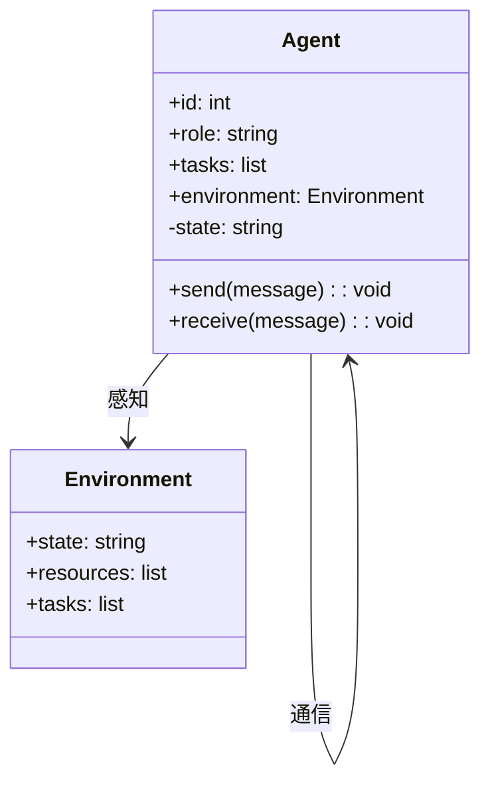
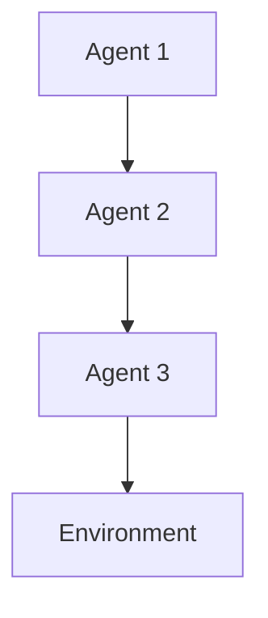
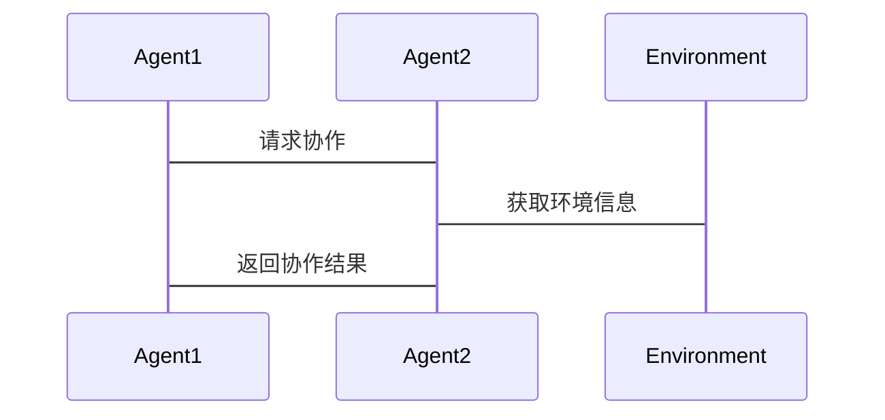

                 


# 企业AI Agent的多智能体系统：协作与竞争策略

> 关键词：多智能体系统，AI Agent，协作与竞争，企业应用，博弈论，强化学习

> 摘要：本文深入探讨企业AI Agent在多智能体系统中的协作与竞争策略，结合理论分析和实际案例，分析多智能体系统的核心概念、协作与竞争机制、算法原理以及系统设计与实现。

---

# 第1章: 多智能体系统与AI Agent基础

## 1.1 多智能体系统的基本概念

### 1.1.1 多智能体系统的定义
多智能体系统（Multi-Agent System, MAS）是由多个智能体（Agent）组成的分布式系统，这些智能体通过协作与竞争完成特定任务。

### 1.1.2 多智能体系统的特征
- **智能性**：每个智能体都能感知环境并采取行动。
- **分布式性**：智能体独立运行，通过通信协作。
- **动态性**：环境和任务可能动态变化。

### 1.1.3 多智能体系统的分类
- **结构化系统**：任务明确，规则固定。
- **非结构化系统**：任务模糊，需自主决策。

## 1.2 AI Agent的定义与特点

### 1.2.1 AI Agent的定义
AI Agent是能够感知环境、自主决策并采取行动的实体。

### 1.2.2 AI Agent的核心特征
- **自主性**：无需外部干预。
- **反应性**：实时响应环境变化。
- **目标导向**：基于目标采取行动。

## 1.3 多智能体系统与AI Agent的关系

### 1.3.1 多智能体系统中的AI Agent角色
- **协作者**：共同完成任务。
- **竞争者**：争夺资源或目标。

### 1.3.2 多智能体系统与AI Agent的协同机制
- **通信**：通过消息传递协作。
- **协调**：通过协议分配任务。

## 1.4 企业中多智能体系统与AI Agent的应用场景

### 1.4.1 企业协作场景
- **供应链管理**：协调供应商、制造商和零售商。
- **团队协作**：提升项目执行效率。

### 1.4.2 企业竞争场景
- **市场预测**：预测竞争对手行为。
- **资源分配**：优化资源使用。

### 1.4.3 典型应用案例分析
- **智能供应链优化**：多个智能体协调生产与物流。

---

# 第2章: 多智能体系统与AI Agent的核心概念

## 2.1 多智能体系统的组成要素

### 2.1.1 智能体
- **智能体类型**：简单反射型、基于模型型。

### 2.1.2 环境
- **静态环境**：任务明确。
- **动态环境**：任务变化。

### 2.1.3 目标与任务
- **明确目标**：完成特定任务。
- **模糊目标**：目标不明确。

## 2.2 AI Agent的决策机制

### 2.2.1 知识表示
- **规则表示**：基于规则进行推理。
- **逻辑表示**：使用逻辑推理。

### 2.2.2 行为选择
- **启发式搜索**：优先选择最优解。
- **遗传算法**：通过进化优化选择。

### 2.2.3 学习与优化
- **监督学习**：基于标注数据学习。
- **强化学习**：通过奖励机制优化决策。

## 2.3 多智能体系统中的协作与竞争

### 2.3.1 协作机制
- **任务分配**：根据智能体能力分配任务。
- **协调协议**：通过协议确保协作。

### 2.3.2 竞争机制
- **资源分配**：竞争有限资源。
- **任务争夺**：竞争优先完成任务。

### 2.3.3 协作与竞争的动态平衡
- **动态调整**：根据环境变化调整协作与竞争策略。

## 2.4 多智能体系统与AI Agent的数学模型

### 2.4.1 智能体模型
- **智能体状态**：感知到的环境信息。
- **智能体动作**：基于状态的决策。

### 2.4.2 系统模型
- **系统状态**：整体系统状态。
- **系统行为**：系统整体决策。

### 2.4.3 交互模型
- **通信协议**：智能体间通信规则。
- **协作协议**：协作任务分配规则。

---

# 第3章: 多智能体系统与AI Agent的协作与竞争策略

## 3.1 协作策略

### 3.1.1 协作的基本原理
- **目标一致性**：所有智能体共享相同目标。
- **任务分配**：根据智能体能力分配任务。

### 3.1.2 协作的实现方法
- **分布式协作**：智能体独立协作。
- **集中式协作**：中央协调器分配任务。

### 3.1.3 协作的优化策略
- **负载均衡**：均匀分配任务。
- **动态调整**：根据环境变化调整协作策略。

## 3.2 竞争策略

### 3.2.1 竞争的基本原理
- **目标冲突**：智能体间存在竞争目标。
- **资源有限**：有限资源引发竞争。

### 3.2.2 竞争的实现方法
- **抢占式竞争**：优先完成任务。
- **协商式竞争**：通过协商解决冲突。

### 3.2.3 竞争的优化策略
- **资源分配优化**：公平分配资源。
- **任务优先级优化**：优先处理高优先级任务。

## 3.3 协作与竞争的动态平衡

### 3.3.1 动态平衡机制
- **反馈调节**：根据结果调整策略。
- **预测机制**：预测未来环境变化。

### 3.3.2 平衡实现方法
- **混合策略**：结合协作与竞争。
- **自适应调整**：根据环境变化自动调整。

---

# 第4章: 多智能体系统与AI Agent的算法原理

## 4.1 协作算法

### 4.1.1 协作算法原理
- **分布式协作算法**：每个智能体独立决策。
- **集中式协作算法**：中央协调器决策。

### 4.1.2 协作算法实现
```python
def collaborative_algorithm(social_agents):
    coordinator = select_coordinator(social_agents)
    tasks = distribute_tasks(coordinator, social_agents)
    return tasks
```

### 4.1.3 协作算法优化
- **负载均衡优化**：确保任务均匀分配。
- **通信优化**：减少不必要的通信开销。

## 4.2 竞争算法

### 4.2.1 竞争算法原理
- **抢占式竞争算法**：优先完成任务。
- **协商式竞争算法**：通过协商解决冲突。

### 4.2.2 竞争算法实现
```python
def competitive_algorithm(social_agents):
    tasks = allocate_resources(social_agents)
    return tasks
```

### 4.2.3 竞争算法优化
- **资源分配优化**：公平分配资源。
- **任务优先级优化**：优先处理高优先级任务。

---

# 第5章: 多智能体系统与AI Agent的系统分析与架构设计

## 5.1 系统分析

### 5.1.1 项目介绍
- **项目名称**：智能供应链优化系统。
- **项目目标**：优化供应链效率。

### 5.1.2 系统功能设计
- **需求分析**：识别系统需求。
- **功能模块**：设计功能模块。

## 5.2 系统架构设计

### 5.2.1 领域模型类图


### 5.2.2 系统架构图


### 5.2.3 系统接口设计
- **通信接口**：智能体间通信接口。
- **协作接口**：协作任务分配接口。

### 5.2.4 交互序列图


---

# 第6章: 项目实战

## 6.1 环境安装

### 6.1.1 安装Python
```bash
python --version
pip install --upgrade pip
```

### 6.1.2 安装依赖库
```bash
pip install numpy matplotlib
```

## 6.2 核心代码实现

### 6.2.1 协作算法实现
```python
def collaborative_algorithm(agents):
    coordinator = agents[0]
    tasks = []
    for agent in agents:
        tasks.append((agent.id, "task" + str(len(tasks))))
    return tasks
```

### 6.2.2 竞争算法实现
```python
def competitive_algorithm(agents):
    tasks = []
    for agent in agents:
        if random.random() < 0.5:
            tasks.append((agent.id, "task" + str(len(tasks))))
    return tasks
```

### 6.2.3 系统运行
```python
class Agent:
    def __init__(self, id):
        self.id = id
        self.tasks = []

agents = [Agent(1), Agent(2), Agent(3)]
tasks = collaborative_algorithm(agents)
print(tasks)
```

## 6.3 代码解读与分析

### 6.3.1 协作算法解读
- **任务分配**：每个智能体分配一个任务。

### 6.3.2 竞争算法解读
- **随机分配**：50%概率分配任务。

## 6.4 案例分析

### 6.4.1 案例介绍
- **项目名称**：智能供应链优化系统。
- **应用场景**：优化供应链效率。

### 6.4.2 案例实现
```python
agents = [Agent(1), Agent(2), Agent(3)]
tasks = competitive_algorithm(agents)
print(tasks)
```

## 6.5 项目小结

### 6.5.1 项目总结
- **实现目标**：实现协作与竞争策略。
- **项目意义**：提升企业效率。

### 6.5.2 项目经验
- **技术选型**：选择合适的技术方案。
- **团队协作**：团队协作的重要性。

---

# 第7章: 总结与展望

## 7.1 总结

### 7.1.1 核心内容回顾
- **协作策略**：智能体协作完成任务。
- **竞争策略**：智能体竞争资源或任务。

### 7.1.2 重要结论
- **动态平衡**：协作与竞争的动态平衡是关键。

## 7.2 最佳实践 tips

### 7.2.1 开发建议
- **模块化设计**：确保代码可维护性。
- **测试驱动开发**：确保功能正确性。

### 7.2.2 注意事项
- **环境适应性**：确保系统适应不同环境。
- **性能优化**：优化系统性能。

## 7.3 未来展望

### 7.3.1 智能体协作的未来方向
- **强化学习**：智能体通过强化学习优化协作。
- **自适应算法**：开发自适应协作与竞争算法。

### 7.3.2 多智能体系统的未来方向
- **边缘计算**：智能体在边缘计算中的应用。
- **雾计算**：智能体在雾计算中的应用。

## 7.4 拓展阅读

### 7.4.1 推荐书籍
- 《Multi-Agent Systems》
- 《Reinforcement Learning》

### 7.4.2 推荐文章
- 多智能体系统协作与竞争的研究进展。
- 强化学习在多智能体系统中的应用。

---

# 作者：AI天才研究院 & 禅与计算机程序设计艺术

