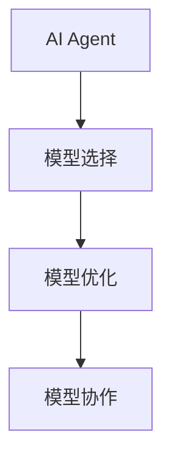
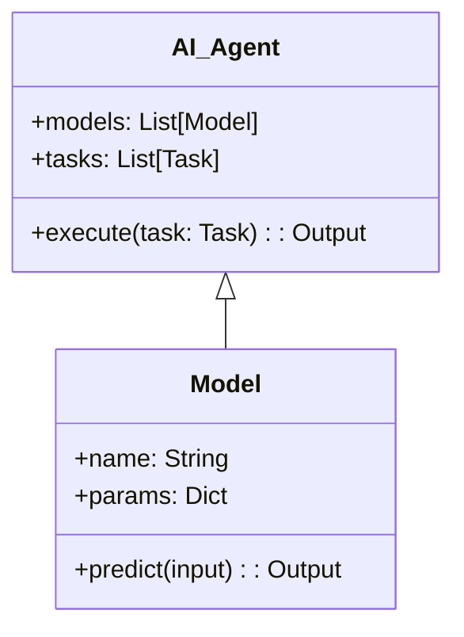
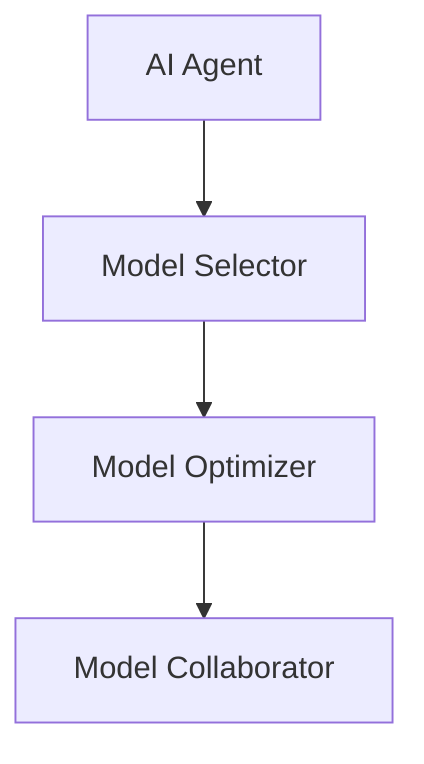
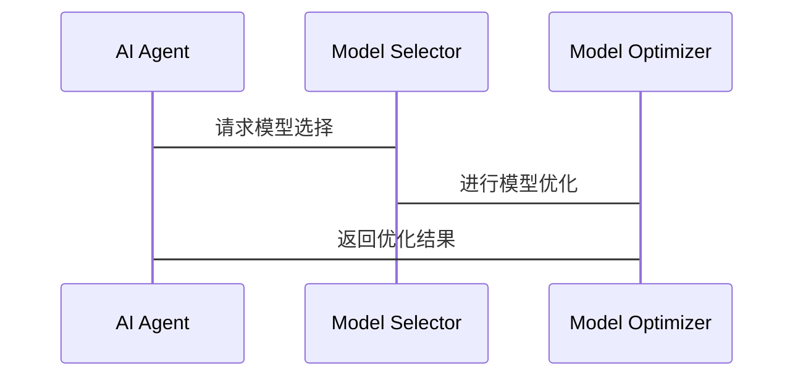

                 


```markdown
# 企业AI Agent的多模型集成策略：优势互补

> 关键词：企业AI Agent，多模型集成，优势互补，AI大模型，模型协作，模型优化

> 摘要：随着AI技术的快速发展，企业AI Agent的应用越来越广泛。为了充分发挥不同AI模型的优势，多模型集成策略成为企业AI Agent设计中的关键。本文将深入探讨多模型集成的原理、方法及其实现，为企业AI Agent的优化提供理论和实践指导。

---

# 第一部分: 背景与概述

## 第1章: AI Agent与多模型集成概述

### 1.1 AI Agent的基本概念

#### 1.1.1 AI Agent的定义与特点
- **定义**：AI Agent是一种智能代理，能够感知环境、自主决策并执行任务。
- **特点**：
  - 智能性：基于AI算法进行决策。
  - 自主性：无需外部干预，自主完成任务。
  - 反应性：能实时感知环境变化并做出反应。

#### 1.1.2 企业AI Agent的应用场景

- **客户支持**：通过自然语言处理提供智能客服。
- **自动化运维**：监控系统状态并自动处理问题。
- **智能推荐**：为企业提供个性化的产品推荐。

#### 1.1.3 多模型集成的必要性

- **单一模型的局限性**：
  - 某些模型在特定领域表现优异，但全局表现不足。
  - 单一模型难以覆盖所有场景的需求。
- **多模型协作的优势**：
  - 提高整体性能和鲁棒性。
  - 更好地适应复杂多变的环境。

### 1.2 多模型集成的技术背景

#### 1.2.1 AI大模型的发展现状

- **大模型的演进历程**：
  - 从早期的小模型到现在的大型预训练模型。
  - 模型规模的不断扩大，性能显著提升。
- **多模型协作的趋势**：
  - 通过集成多个模型，充分利用各自的优势。
  - 提升模型的泛化能力和适应性。

#### 1.2.2 企业AI Agent中的多模型集成策略

- **模型选择**：根据任务需求选择合适的模型。
- **模型优化**：对模型进行调优，提升性能。
- **模型协作**：设计有效的协作机制，最大化集成效果。

---

# 第二部分: 核心概念与联系

## 第2章: 多模型集成的核心概念

### 2.1 多模型集成的原理

#### 2.1.1 模型选择与优化

- **模型选择标准**：
  - 精准度：模型在特定任务上的表现。
  - 灵活性：模型适应不同场景的能力。
  - 计算效率：模型的推理速度和资源消耗。

#### 2.1.2 模型融合与调优

- **模型融合方法**：
  - **投票法**：多个模型共同决策。
  - **加权投票法**：根据模型表现赋予不同权重。
  - **堆叠法**：通过元模型整合多个模型的输出。

#### 2.1.3 模型协作机制

- **协作规则**：
  - 根据任务需求动态调整模型权重。
  - 通过通信机制共享信息，优化决策。

### 2.2 模型特征对比与ER图分析

#### 2.2.1 模型特征对比

| 模型类型 | 精准度 | 灵活性 | 计算效率 |
|---------|--------|--------|----------|
| 分类模型 | 高     | 低     | 中等     |
| 回归模型 | 中等   | 高     | 高       |
| 强化学习模型 | 中等 | 高 | 低 |

#### 2.2.2 实体关系图（ER图）



---

# 第三部分: 算法原理

## 第3章: 多模型集成的算法实现

### 3.1 投票法

#### 3.1.1 原理

$$
\text{投票法} = \argmax_i \sum_{j=1}^{n} w_j^{(i)}
$$

其中，\( w_j^{(i)} \) 是模型 \( j \) 对结果 \( i \) 的支持权重。

#### 3.1.2 实现步骤

1. **初始化**：设定各模型的初始权重。
2. **投票**：每个模型根据任务输出结果及权重。
3. **整合**：根据权重计算最终结果。

#### 3.1.3 代码示例

```python
def voting_system(models, weights):
    results = []
    for model, weight in zip(models, weights):
        result = model.predict()
        results.append((result, weight))
    total = sum(weight * result for result, weight in results)
    return total
```

---

## 第4章: 加权投票法

### 4.1 原理

$$
\text{加权投票法} = \argmax_i \sum_{j=1}^{n} w_j \cdot y_j^{(i)}
$$

其中，\( w_j \) 是模型 \( j \) 的权重，\( y_j^{(i)} \) 是模型 \( j \) 对结果 \( i \) 的预测值。

---

## 第5章: 堆叠法

### 5.1 原理

$$
\text{堆叠法} = \argmax_i \sum_{j=1}^{n} f_j(i)
$$

其中，\( f_j(i) \) 是元模型对结果 \( i \) 的预测值。

---

# 第四部分: 系统分析与架构设计

## 第6章: 企业AI Agent的系统架构

### 6.1 领域模型设计



### 6.2 系统架构图



---

## 第7章: 接口与交互设计

### 7.1 接口设计

- **输入接口**：接收任务请求和模型参数。
- **输出接口**：返回集成结果和性能指标。

### 7.2 交互流程



---

# 第五部分: 项目实战

## 第8章: 项目案例分析

### 8.1 客服系统集成

#### 8.1.1 环境安装

- 安装所需库：`pip install numpy scikit-learn`

#### 8.1.2 核心代码实现

```python
import numpy as np
from sklearn.ensemble import VotingClassifier

class ModelSelector:
    def __init__(self, models):
        self.models = models

    def select(self, X, y):
        # 使用投票法选择最优模型
        voting_clf = VotingClassifier(estimators=self.models, voting='hard')
        voting_clf.fit(X, y)
        return voting_clf

# 示例模型
from sklearn.svm import SVC
from sklearn.tree import DecisionTreeClassifier

models = [
    ('SVM', SVC()),
    ('Tree', DecisionTreeClassifier())
]

selector = ModelSelector(models)
selector.select(X, y)
```

---

## 第9章: 案例分析与优化

### 9.1 案例分析

- **问题分析**：客服系统中，使用单一模型无法覆盖所有场景。
- **解决方案**：通过多模型集成提升准确率和响应速度。

### 9.2 优化策略

- **模型选择**：根据任务需求选择最优模型。
- **动态调整**：实时监控系统状态，动态调整模型权重。

---

# 第六部分: 总结与展望

## 第10章: 总结

### 10.1 核心观点回顾

- **多模型集成的优势**：通过协作提高整体性能。
- **实现的关键点**：模型选择、优化和协作机制。

### 10.2 注意事项

- **模型选择**：根据任务需求选择合适的模型。
- **模型优化**：持续监控和调优模型性能。
- **协作机制**：设计高效的协作规则，确保模型有效配合。

## 第11章: 展望

### 11.1 未来发展方向

- **模型协作的智能化**：通过自适应机制优化协作流程。
- **多模态模型的集成**：结合文本、图像等多种数据源，提升集成效果。

### 11.2 推荐阅读

- 《机器学习实战》
- 《深度学习入门：基于Python》
- 《AI系统设计：从算法到部署》

---

作者：AI天才研究院 & 禅与计算机程序设计艺术

---

**注**：本文为《企业AI Agent的多模型集成策略：优势互补》的目录大纲，具体内容请参考完整文章。

