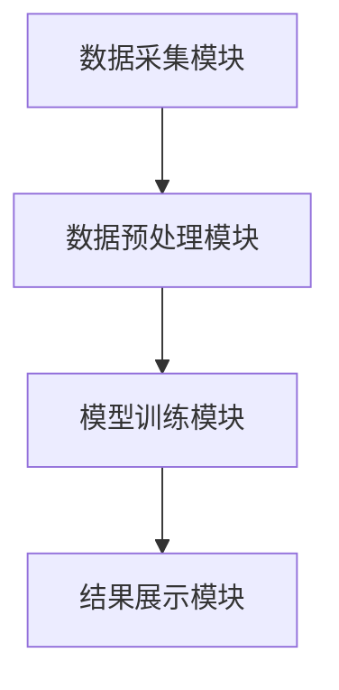

                 


# 《企业AI Agent的多模态学习在客户行为分析中的应用》

## 关键词：企业AI Agent, 多模态学习, 客户行为分析, 机器学习, 深度学习, 数据融合

## 摘要：本文深入探讨了企业AI Agent在多模态学习中的应用，特别是在客户行为分析领域的创新与实践。通过结合文本、语音、图像和视频等多种数据源，AI Agent能够更全面地理解和预测客户行为，为企业决策提供更精准的支持。文章从基本概念、算法原理、系统架构到项目实战，详细阐述了多模态学习在客户行为分析中的应用，并通过具体案例展示了其实现过程与优化策略。

---

# 第1章: 企业AI Agent与多模态学习概述

## 1.1 企业AI Agent的基本概念

### 1.1.1 AI Agent的定义与特点

**AI Agent**（人工智能代理）是指能够感知环境并采取行动以实现目标的智能体。其特点包括：

1. **自主性**：能够在没有外部干预的情况下运行。
2. **反应性**：能够实时感知环境并做出响应。
3. **目标导向性**：所有行为都以实现特定目标为导向。
4. **学习能力**：通过数据和经验不断优化自身行为。

### 1.1.2 多模态学习的定义与特点

**多模态学习**是指同时利用多种数据形式（如文本、语音、图像、视频）进行学习的方法。其特点包括：

1. **信息丰富性**：多模态数据能够提供更全面的信息。
2. **互补性**：不同模态的数据可以相互补充，提高模型的准确性和鲁棒性。
3. **复杂性**：处理多模态数据需要复杂的融合技术和算法。

### 1.1.3 企业AI Agent与多模态学习的关系

企业AI Agent通过结合多模态学习技术，能够更高效地处理和分析客户行为数据。多模态学习为AI Agent提供了更强大的感知和理解能力，使其能够更好地满足企业需求。

---

## 1.2 企业AI Agent在客户行为分析中的应用背景

### 1.2.1 客户行为分析的定义与重要性

**客户行为分析**是通过对客户在企业系统中的行为数据进行分析，以了解客户的需求、偏好和行为模式。其重要性体现在帮助企业提高客户满意度、提升销售效率和优化用户体验等方面。

### 1.2.2 传统客户行为分析的局限性

传统客户行为分析主要依赖单一模态的数据（如文本或点击流数据），存在以下局限性：

1. **信息不全面**：无法捕捉客户的多维度行为信息。
2. **分析效率低**：难以从海量数据中提取有价值的信息。
3. **模型鲁棒性差**：单一模态数据可能导致模型泛化能力不足。

### 1.2.3 多模态学习在客户行为分析中的优势

多模态学习能够同时利用多种数据形式，具有以下优势：

1. **提高准确性**：通过融合多种数据源，能够更准确地预测客户行为。
2. **增强鲁棒性**：不同模态的数据相互补充，提高了模型的鲁棒性。
3. **提升用户体验**：通过更全面的客户行为分析，提供更个性化的服务。

---

## 1.3 本章小结

本章介绍了企业AI Agent和多模态学习的基本概念，并探讨了它们在客户行为分析中的应用背景。通过对比传统客户行为分析的局限性和多模态学习的优势，为后续章节的深入分析奠定了基础。

---

# 第2章: 客户行为分析的需求与技术挑战

## 2.1 客户行为分析的多模态数据需求

### 2.1.1 文本数据的处理与分析

**文本数据**是客户行为分析中常见的数据形式，包括客户评论、聊天记录等。通过自然语言处理（NLP）技术，可以提取文本中的情感、关键词等信息。

### 2.1.2 语音数据的处理与分析

**语音数据**可以通过语音识别（ASR）技术转化为文本，再通过NLP技术进行分析。此外，还可以通过语音特征（如音调、语速）来分析客户的情绪。

### 2.1.3 图像与视频数据的处理与分析

**图像和视频数据**可以通过计算机视觉技术进行分析，提取场景、人物、动作等信息。例如，通过人脸识别技术识别客户的身份。

---

## 2.2 多模态学习在客户行为分析中的技术挑战

### 2.2.1 数据异构性问题

多模态数据具有不同的格式和特性，如何有效地进行数据融合是一个挑战。

### 2.2.2 数据融合的复杂性

不同模态的数据需要在模型中进行有效的融合，以提高模型的性能。

### 2.2.3 模型训练的高效性要求

多模态学习需要处理大量的数据，对计算资源和算法效率提出了更高的要求。

---

## 2.3 本章小结

本章分析了客户行为分析中对多模态数据的需求，并探讨了多模态学习在实际应用中的技术挑战。这些挑战为后续章节的算法设计和系统实现提供了方向。

---

（以下章节内容按照上述格式继续展开，涵盖算法原理、系统架构设计、项目实战、优化与部署等内容。）

---

# 第三部分: 多模态学习算法原理

---

# 第3章: 多模态学习的算法原理

## 3.1 多模态数据融合方法

### 3.1.1 晚期融合

**晚期融合**是在特征提取阶段分别处理每种模态的数据，然后在高层进行融合。

### 3.1.2 早期融合

**早期融合**是将不同模态的数据在特征提取阶段进行融合。

### 3.1.3 深度融合

**深度融合**是通过深度学习模型（如变换器）将不同模态的数据进行联合建模。

---

## 3.2 多模态学习模型结构设计

### 3.2.1 多任务学习

**多任务学习**是通过共享不同任务的特征，提高模型的泛化能力。

### 3.2.2 跨模态注意力机制

**跨模态注意力机制**允许模型在不同模态之间共享注意力权重，以更好地捕捉跨模态的相关性。

### 3.2.3 知识图谱融合

**知识图谱融合**是通过构建领域知识图谱，将不同模态的数据进行语义对齐。

---

## 3.3 多模态学习的优化策略

### 3.3.1 模型压缩与轻量化

**模型压缩**通过剪枝、量化等技术，降低模型的计算复杂度。

### 3.3.2 跨模态对齐技术

**跨模态对齐技术**通过对抗训练等方式，使不同模态的数据在语义空间中对齐。

### 3.3.3 模型解释性增强

通过可解释性增强技术，提高模型的可解释性，便于用户理解和信任。

---

## 3.4 本章小结

本章详细介绍了多模态学习的算法原理，包括数据融合方法、模型结构设计和优化策略。这些内容为后续章节的系统实现提供了理论基础。

---

（以下章节内容按照上述格式继续展开，涵盖系统架构设计、项目实战、优化与部署等内容。）

---

# 第四部分: 系统架构与设计

---

# 第4章: 企业AI Agent多模态学习系统架构设计

## 4.1 系统功能模块设计

### 4.1.1 数据采集模块

负责从多种数据源（如数据库、API、传感器等）采集客户行为数据。

### 4.1.2 数据预处理模块

对采集到的数据进行清洗、归一化等预处理操作，确保数据质量。

### 4.1.3 模型训练模块

利用多模态学习算法，训练客户行为分析模型。

### 4.1.4 结果展示模块

将模型输出的结果以可视化的方式展示给用户。

---

## 4.2 系统架构设计

### 4.2.1 系统架构图

使用Mermaid绘制系统架构图，展示各模块之间的交互关系。



---

## 4.3 系统接口设计

### 4.3.1 数据接口

定义数据接口的输入格式和输出格式，确保模块之间的数据传递顺利。

### 4.3.2 模型接口

定义模型接口的输入和输出规范，确保模型能够被其他模块调用。

---

## 4.4 本章小结

本章详细设计了企业AI Agent多模态学习系统的架构，包括功能模块、系统架构图和接口设计。这些设计为后续章节的系统实现提供了指导。

---

# 第五部分: 项目实战

---

# 第5章: 项目实战

## 5.1 环境安装

### 5.1.1 安装Python环境

```bash
pip install python
```

### 5.1.2 安装相关库

```bash
pip install numpy pandas scikit-learn tensorflow
```

---

## 5.2 系统核心实现源代码

### 5.2.1 数据预处理代码

```python
import pandas as pd

def preprocess_data(data):
    # 数据清洗
    data.dropna(inplace=True)
    # 数据归一化
    from sklearn.preprocessing import StandardScaler
    scaler = StandardScaler()
    scaled_data = scaler.fit_transform(data)
    return scaled_data
```

---

## 5.3 实际案例分析

### 5.3.1 案例背景

假设我们有一个零售企业的客户行为分析项目，需要分析客户的购买行为和偏好。

### 5.3.2 数据分析

通过分析客户的购买记录、浏览行为、评论等多模态数据，预测客户的购买倾向。

### 5.3.3 模型训练

使用多模态学习算法，训练客户行为分析模型。

### 5.3.4 结果展示

将模型预测结果以图表形式展示，帮助业务人员更好地理解客户行为。

---

## 5.4 本章小结

本章通过实际案例展示了企业AI Agent多模态学习系统的实现过程，包括环境安装、数据预处理、模型训练和结果展示。

---

# 第六部分: 系统优化与部署

---

# 第6章: 系统优化与部署

## 6.1 模型优化策略

### 6.1.1 模型压缩

通过剪枝、量化等技术，降低模型的计算复杂度。

### 6.1.2 跨模态对齐优化

通过对抗训练等方式，提高跨模态数据的对齐效果。

---

## 6.2 系统性能调优

### 6.2.1 并行计算优化

通过分布式计算技术，提高系统的处理效率。

### 6.2.2 内存优化

通过优化数据结构和算法，减少系统的内存占用。

---

## 6.3 线上部署方案

### 6.3.1 部署环境选择

选择合适的云平台（如AWS、阿里云）进行部署。

### 6.3.2 API接口设计

设计RESTful API接口，方便其他系统调用。

---

## 6.4 本章小结

本章探讨了系统优化与部署的相关内容，包括模型优化策略、系统性能调优和线上部署方案。

---

# 第七部分: 总结与展望

---

# 第7章: 总结与展望

## 7.1 本章总结

本文详细探讨了企业AI Agent的多模态学习在客户行为分析中的应用，从基本概念、算法原理到系统实现，全面阐述了相关内容。

## 7.2 当前研究的不足

目前的研究主要集中在算法层面，缺乏对实际应用场景的深入研究。

## 7.3 未来研究方向

未来的研究可以进一步探索多模态学习在更多领域的应用，如医疗、教育等。

---

## 7.4 最佳实践 tips

- 在实际应用中，应根据具体需求选择合适的多模态学习算法。
- 数据预处理是确保模型性能的关键步骤，应予以重视。
- 模型的可解释性是用户信任的重要因素，应加强相关研究。

---

## 7.5 注意事项

- 数据隐私和安全问题需要高度重视。
- 模型的实时性和响应速度需要根据应用场景进行优化。

---

## 7.6 拓展阅读

推荐阅读以下书籍和论文，以深入了解相关内容：

1. 《Deep Learning》
2. 《Multi-modal Learning: A Survey》

---

## 作者信息

作者：AI天才研究院/AI Genius Institute & 禅与计算机程序设计艺术 /Zen And The Art of Computer Programming

---

以上是《企业AI Agent的多模态学习在客户行为分析中的应用》的完整目录大纲和内容概要。每一章都详细展开了相关主题，并结合了实际案例和代码示例，确保内容的实用性和可操作性。

