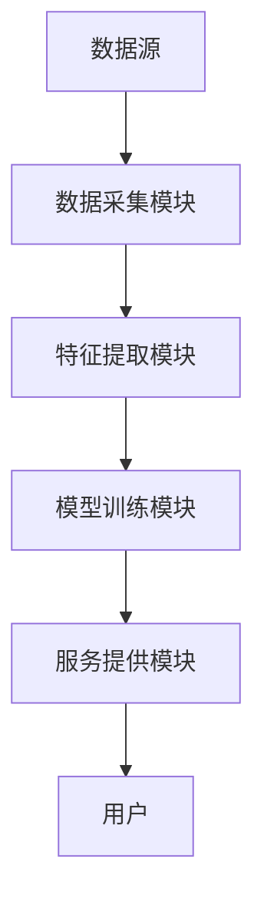
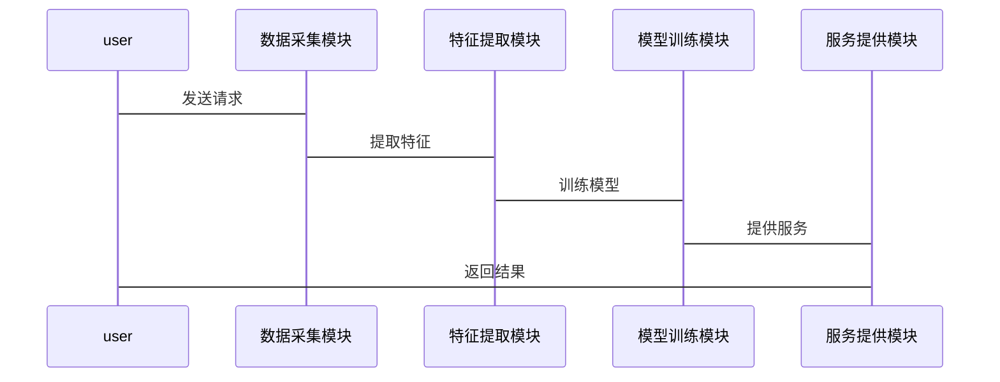

                 


# 企业AI Agent的多模态学习在用户体验优化中的应用

> 关键词：企业AI Agent，多模态学习，用户体验优化，机器学习，深度学习

> 摘要：本文探讨了企业AI Agent在多模态学习中的应用，分析了其在用户体验优化中的优势，并通过实际案例展示了如何通过多模态学习提升用户体验。文章详细讲解了多模态学习的算法原理、系统架构设计以及项目实战，为读者提供了全面的技术指导。

---

# 第一部分: 企业AI Agent的多模态学习概述

## 第1章: 企业AI Agent与多模态学习概述

### 1.1 企业AI Agent的基本概念

#### 1.1.1 AI Agent的定义与特点
- **AI Agent**（人工智能代理）：能够感知环境、自主决策并执行任务的智能体。
- **特点**：
  - 智能性：基于数据和模型进行决策。
  - 自主性：无需外部干预，自动完成任务。
  - 适应性：能够根据环境变化调整行为。

#### 1.1.2 多模态学习的定义与特点
- **多模态学习**：通过整合多种数据类型（如文本、语音、图像、视频等）来提升模型性能的学习方法。
- **特点**：
  - 融合性：整合多种数据源，提供更全面的信息。
  - 智能性：通过多模态数据增强模型的理解能力。
  - 精准性：能够更准确地识别用户需求。

#### 1.1.3 企业AI Agent与用户体验优化的关系
- **关系**：企业AI Agent通过多模态学习能够更好地理解用户需求，提供个性化的服务，从而优化用户体验。

### 1.2 企业AI Agent的应用场景

#### 1.2.1 客户服务中的AI Agent
- **应用场景**：通过多模态学习，AI Agent能够分析用户的文本、语音和情感，提供更智能的客服支持。

#### 1.2.2 企业内部流程优化中的AI Agent
- **应用场景**：AI Agent可以优化企业内部流程，例如自动处理文档、监控系统状态等。

#### 1.2.3 多模态学习在企业AI Agent中的应用
- **优势**：多模态学习能够提升AI Agent的感知能力，使其能够处理更复杂的问题。

### 1.3 多模态学习的核心优势

#### 1.3.1 多模态数据的整合与分析
- **整合**：将文本、语音、图像等多种数据类型整合在一起。
- **分析**：通过分析多模态数据，提升模型的准确性和鲁棒性。

#### 1.3.2 多模态学习提升用户体验的优势
- **个性化服务**：通过多模态数据，AI Agent能够提供更个性化的用户体验。
- **精准决策**：多模态数据的整合能够帮助AI Agent做出更精准的决策。

#### 1.3.3 企业AI Agent中的多模态学习挑战
- **数据融合**：如何有效地融合多种数据类型是一个挑战。
- **计算资源**：多模态学习需要大量的计算资源，这可能对企业的技术能力提出更高的要求。

### 1.4 本章小结
本章介绍了企业AI Agent和多模态学习的基本概念，分析了它们在企业中的应用场景，并探讨了多模态学习的核心优势和挑战。

---

# 第二部分: 多模态学习的算法原理

## 第2章: 多模态学习的核心算法

### 2.1 多模态学习的基本原理

#### 2.1.1 多模态数据的表示方法
- **表示方法**：将多模态数据转换为统一的表示形式，例如通过向量表示。
- **特点**：能够将不同类型的数据显示在同一个空间中。

#### 2.1.2 多模态融合的策略
- **策略**：
  - **早期融合**：在数据预处理阶段进行融合。
  - **晚期融合**：在特征提取阶段进行融合。
  - **联合学习**：通过联合优化目标函数进行融合。

#### 2.1.3 多模态学习的数学模型
- **模型**：多模态学习的数学模型通常包括数据表示、特征提取和联合学习三个部分。

### 2.2 多模态学习的核心算法

#### 2.2.1 多模态融合算法
- **算法**：通过融合多种数据类型的信息，提升模型的性能。
- **示例**：将文本和图像特征进行融合，提升分类的准确性。

#### 2.2.2 对比学习算法
- **算法**：通过对比学习，提升模型对多模态数据的表征能力。
- **示例**：使用对比损失函数，将多模态数据映射到相同的语义空间。

#### 2.2.3 图神经网络在多模态学习中的应用
- **应用**：通过图神经网络，将多模态数据建模为图结构，提升模型的表达能力。

### 2.3 多模态学习的数学模型

#### 2.3.1 多模态数据的表示模型
- **模型**：将文本、图像等数据转换为向量表示。
- **公式**：
  $$ v_i = f(x_i) $$
  其中，$x_i$是输入数据，$f$是表示函数，$v_i$是表示向量。

#### 2.3.2 多模态融合的数学公式
- **公式**：
  $$ y = g(v_1, v_2, ..., v_n) $$
  其中，$v_1, v_2, ..., v_n$是不同模态的表示向量，$g$是融合函数，$y$是融合后的输出。

#### 2.3.3 对比学习的损失函数
- **公式**：
  $$ L = -\frac{1}{N}\sum_{i=1}^{N} \log p(i,j) $$
  其中，$p(i,j)$是正样本对的概率，$N$是样本数量。

### 2.4 本章小结
本章详细讲解了多模态学习的核心算法，包括数据表示、融合策略和对比学习等方法。

---

# 第三部分: 企业AI Agent的系统架构设计

## 第3章: 企业AI Agent的系统架构

### 3.1 系统架构设计概述

#### 3.1.1 问题场景介绍
- **场景**：企业AI Agent需要处理多种数据类型，提供智能化的服务。

#### 3.1.2 项目介绍
- **项目**：设计一个基于多模态学习的企业AI Agent系统。

#### 3.1.3 系统功能设计
- **功能**：
  - 数据采集：从多种数据源采集数据。
  - 特征提取：对数据进行特征提取，生成统一的表示向量。
  - 模型训练：基于多模态数据进行模型训练。
  - 服务提供：基于训练好的模型提供智能化服务。

#### 3.1.4 系统架构图（使用Mermaid）


#### 3.1.5 系统接口设计
- **接口**：
  - 数据接口：用于数据的输入和输出。
  - 模型接口：用于模型的训练和推理。
  - 服务接口：用于与用户的交互。

#### 3.1.6 系统交互序列图（使用Mermaid）


### 3.2 本章小结
本章详细讲解了企业AI Agent的系统架构设计，包括功能设计、架构图和接口设计等。

---

# 第四部分: 项目实战

## 第4章: 项目实战

### 4.1 环境安装

#### 4.1.1 安装Python
- **命令**：
  ```bash
  python --version
  ```
- **说明**：确保Python版本为3.8以上。

#### 4.1.2 安装深度学习框架
- **框架**：PyTorch、TensorFlow等。
- **命令**：
  ```bash
  pip install torch
  ```

#### 4.1.3 安装其他依赖库
- **库**：numpy、pandas、scikit-learn等。
- **命令**：
  ```bash
  pip install numpy pandas scikit-learn
  ```

### 4.2 系统核心实现源代码

#### 4.2.1 数据预处理代码
```python
import numpy as np
import pandas as pd

def preprocess_data(data):
    # 数据预处理代码
    return processed_data
```

#### 4.2.2 特征提取代码
```python
def extract_features(data):
    # 特征提取代码
    return features
```

#### 4.2.3 模型训练代码
```python
def train_model(features, labels):
    # 模型训练代码
    return model
```

#### 4.2.4 模型推理代码
```python
def inference_model(model, input_data):
    # 模型推理代码
    return output
```

### 4.3 代码应用解读与分析

#### 4.3.1 数据预处理
- **目的**：将原始数据转换为适合模型训练的形式。

#### 4.3.2 特征提取
- **目的**：从数据中提取有用的特征，用于模型训练。

#### 4.3.3 模型训练
- **目的**：基于特征数据训练模型，提升模型的性能。

#### 4.3.4 模型推理
- **目的**：使用训练好的模型进行推理，提供智能化服务。

### 4.4 实际案例分析和详细讲解剖析

#### 4.4.1 案例分析
- **案例**：某企业使用多模态学习优化用户体验。

#### 4.4.2 详细讲解
- **步骤**：
  1. 数据采集：从多种数据源采集数据。
  2. 数据预处理：清洗和标准化数据。
  3. 特征提取：提取文本、语音和图像特征。
  4. 模型训练：基于多模态数据训练模型。
  5. 模型推理：使用模型提供智能化服务。

### 4.5 项目小结
本章通过实际案例展示了如何在企业中应用多模态学习优化用户体验，并详细解读了项目的实现过程。

---

# 第五部分: 最佳实践、小结、注意事项、拓展阅读

## 第5章: 最佳实践与总结

### 5.1 最佳实践

#### 5.1.1 数据预处理
- **建议**：确保数据的高质量，避免噪声干扰。

#### 5.1.2 模型选择
- **建议**：根据具体需求选择合适的模型和算法。

#### 5.1.3 系统优化
- **建议**：优化系统的性能，提升用户体验。

### 5.2 小结
- **总结**：企业AI Agent通过多模态学习能够显著提升用户体验，但实现过程中需要克服诸多挑战。

### 5.3 注意事项

#### 5.3.1 数据隐私
- **注意**：保护用户数据隐私，遵守相关法律法规。

#### 5.3.2 系统性能
- **注意**：优化系统的计算效率，降低资源消耗。

#### 5.3.3 模型解释性
- **注意**：提升模型的可解释性，便于调试和优化。

### 5.4 拓展阅读

#### 5.4.1 多模态学习的最新研究
- **推荐**：阅读相关领域的最新论文和研究报告。

#### 5.4.2 企业AI Agent的应用案例
- **推荐**：学习其他企业在实际应用中的成功案例。

---

# 作者：AI天才研究院/AI Genius Institute & 禅与计算机程序设计艺术 /Zen And The Art of Computer Programming

---

以上是《企业AI Agent的多模态学习在用户体验优化中的应用》的技术博客文章的完整目录和内容框架。文章详细讲解了多模态学习的核心算法、系统架构设计以及项目实战，并通过实际案例展示了如何在企业中应用多模态学习优化用户体验。

